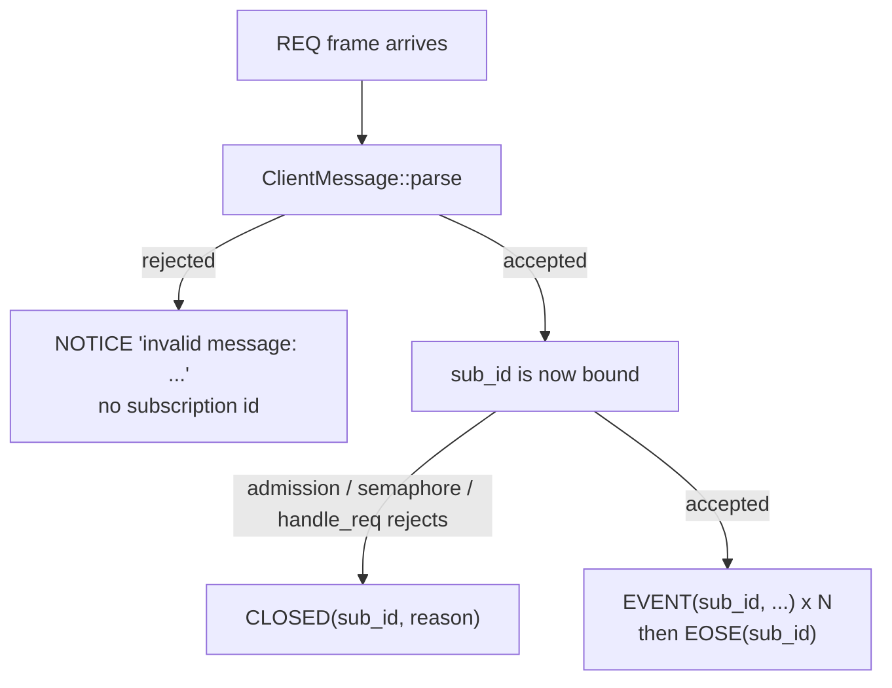

# The REQ message

`REQ` is the client-to-relay WebSocket message that opens a subscription and asks for
stored events. This node covers the message itself — the shape of the frame, every check
the relay applies to it, and every shape the relay answers it with. It does not cover
what the filters inside it *mean*, what the subscription then does, or what `EOSE`
marks; those are separate nodes.

## Definition

A `REQ` frame is a JSON array:

```
["REQ", <subscription_id>, <filter1>, <filter2>, ...]
```

`crates/buzz-relay/src/protocol.rs` parses it in the `"REQ"` arm of
`ClientMessage::parse`, producing `ClientMessage::Req { sub_id: String, filters:
Vec<Filter> }`. Element 0 is the literal type tag. Element 1 is the **subscription id**:
a client-chosen label the relay never interprets, only echoes back on every `EVENT`,
`EOSE` and `CLOSED` belonging to that subscription. Elements 2 onward are the filters.

**What the subscription id is, precisely: an opaque byte string with a length bound and
nothing else.** The REQ arm applies four checks and only four:

| # | Check | Rejection message |
|---|---|---|
| 1 | the array has at least two elements | `REQ requires sub_id` |
| 2 | `arr[1]` is a JSON string | `REQ sub_id must be a string` |
| 3 | the string is not empty | `REQ sub_id must not be empty` |
| 4 | its **byte** length is at most `MAX_SUB_ID_LENGTH` (256) | `REQ sub_id exceeds maximum length of 256 bytes` |

There is no fifth check. Nothing validates the id's characters, charset or escaping, so
a subscription id containing a double quote, a backslash or a control character is
accepted verbatim — a fact with a live consequence, in *The escaping asymmetry* below.
Check 4 counts bytes, not characters, because it is `String::len`; a subscription id of
multi-byte UTF-8 gets correspondingly fewer characters than 256.

**What the filter list is, at this layer: a bounded array of values that must each
deserialize.** `MAX_FILTERS_PER_REQ` is 10, and the count of `arr[2..]` is checked
*before* any element is deserialized, so an over-limit REQ never parses a filter. Each
surviving element must then deserialize into a `nostr::Filter`; the first that cannot
aborts the entire REQ with `invalid filter: {e}`. Zero filters is legal at this layer —
the only arity check is `arr.len() < 2`.

Both bounds are advertised, not merely enforced: `crates/buzz-relay/src/nip11.rs`'s
`relay_limitation` publishes `max_subid_length: Some(256)` and `max_filters: Some(10)`,
so a client can discover them before sending anything.

**What this node does not mean by "REQ".** Not the filters' matching semantics, not the
subscription that results, not the `EOSE` that ends the stored-event phase, and not the
`CLOSE` that ends the subscription. Each is its own node in this layer. And not the HTTP
`POST /query` bridge, which accepts a bare JSON array of filters with no subscription id
and no wire message at all.

## The two answer shapes

The single most useful thing to know about a REQ is **where** it failed, because that
decides whether the client can tell which REQ failed.



**Before the id is bound — uncorrelated `NOTICE`.** Every failure inside
`ClientMessage::parse` collapses into one `RelayError::InvalidMessage` carrying a
human-readable string and nothing else. `handle_text_message` in
`crates/buzz-relay/src/connection.rs` answers it with `NOTICE("invalid message: {e}")`
and returns. Because the subscription-id checks run *before* the filter-count check, a
REQ with a perfectly good subscription id and eleven filters is answered this way: the
id was present and legal on the wire, was parsed into a local, and was then discarded
with the `Err`. A client running several subscriptions on one socket cannot attribute
that `NOTICE` to the REQ that caused it.

**After the id is bound — correlated `CLOSED`.** Once `parse` returns `Ok`, the id
travels with the request and every rejection carries it.
`request_rejection_message(Some(&sub_id), reason)` resolves to `CLOSED(sub_id, reason)`;
the same helper falls back to `NOTICE` only when no id exists, which is the EVENT and
COUNT case, not REQ. `handle_req` in `crates/buzz-relay/src/handlers/req.rs` rejects
with `CLOSED` throughout — insufficient scope, unauthenticated, too many subscriptions,
too many explicit channels, database error, not a channel member, the three
sensitive-kind gates, and mixed search/non-search filters. Two of those, the
insufficient-scope and unauthenticated paths, send a bare `NOTICE` *first* and the
`CLOSED` second.

**One rejection that does not look like one.** If a historical query fails mid-delivery,
`handle_req` logs a warning and sends `EOSE(sub_id)` — not `CLOSED`. On the wire a
truncated result set is then indistinguishable from a complete one. See *Under-returning*
below for the second, quieter route to the same appearance.

## Why the id must survive round-trip unchanged

The subscription id is the only correlation key the protocol has. Two consequences of
treating it as opaque bytes show up in the code as it stands.

### The escaping asymmetry

The two paths that deliver an `EVENT` on a subscription do not build the frame the same
way.

| Path | Builder | Subscription id is |
|---|---|---|
| Historical delivery, inside `handle_req` | `RelayMessage::event` (`protocol.rs`) — composes via `serde_json::json!` | JSON-escaped |
| Live fan-out, `handlers/event.rs` | `event_frame_for_sub` — `format!(r#"["EVENT","{}",{}]"#, sub_id, event_json)` | interpolated raw |

Since `parse` accepts a quote inside the id, the same subscription can be echoed
correctly during its stored-event phase and then emitted as malformed JSON the moment a
live event fans out to it. Nothing in the current tests would catch that: the two unit
tests covering `event_frame_for_sub` assert its output against the same `format!`
expression the function itself uses, and no test anywhere in the workspace builds a
subscription id containing a JSON metacharacter.

### Under-returning

`filter_fully_pushable` exists to decide whether a filter's constraints can be fully
expressed in SQL. It is **never called on the REQ delivery path** — its only call sites
are the counting branches of `handlers/count.rs` and `api/bridge.rs`. `handle_req`
therefore always takes the query-then-post-filter route: it issues the SQL query, and
then re-applies `filters_match` in Rust to every returned row. Rows discarded by that
post-filter are not refetched, and the SQL `LIMIT` was already spent on them. A filter
carrying a clause the doc comment lists as non-pushable — multi-`#p`, `#t`, `#a`, `#d`
on non-NIP-33 kinds — can therefore return fewer events than its limit, with a perfectly
normal `EOSE` behind them.

The filter semantics themselves belong to the filter node; what belongs here is the
message-level shape of the outcome, which is that a REQ can be answered *short* without
being answered *badly*.

## Use cases

- **Writing a client.** Choose a subscription id that is short, unique per socket, and
  restricted to characters that cannot break a JSON string — the relay will not do that
  for you, and one of its two delivery paths will not escape it for you either.
- **Debugging a subscription that never delivers.** A `NOTICE` with no id means the frame
  never parsed; look at arity, the id, and the filter count. A `CLOSED` with your id
  means the frame parsed and the handler refused it; the reason string names which gate.
- **Reading a relay trace.** `NOTICE` and `CLOSED` are the two rejection shapes, and only
  one of them can be tied back to a request.
- **Reviewing a change to `protocol.rs`.** Any new validation added to the REQ arm changes
  which failures are correlated, because everything in that function is uncorrelated by
  construction.

## Comparison with the sibling arms of the same parser

| Message | Sub-id present | Sub-id non-empty | Sub-id ≤ 256 bytes | Filter count ≤ 10 |
|---|---|---|---|---|
| `REQ` | checked | checked | checked | checked |
| `COUNT` | checked | checked | checked | checked |
| `CLOSE` | checked | **not** checked | **not** checked | n/a |

`COUNT` is REQ's validation twin — the same four checks in the same order, in the same
file. `CLOSE` is not: it takes whatever string it is given, including an empty one.

## Scope and omissions

**This node covers** the REQ frame's array shape, the four subscription-id checks and the
filter-count check the parser applies, the two answer shapes (uncorrelated `NOTICE` before
the id is bound, correlated `CLOSED` after), the full set of rejection messages a REQ can
draw, and the two consequences of the subscription id being treated as opaque bytes.

**It does not cover, and these are gaps rather than silence:**

| Not covered here | Owned by |
|---|---|
| What a filter means, and how a filter's clauses match an event | the filter node in this layer |
| What `EOSE` marks and when a client may rely on it | the EOSE node in this layer |
| Subscription registration, replacement, fan-out and the 1024-subscription ceiling | the subscriptions node in this layer |
| The `CLOSE` message and subscription teardown | the CLOSE node in this layer |
| `NOTICE` as a message in its own right | the NOTICE node in this layer |
| The ordered end-to-end flow a REQ triggers, including authorization and per-filter query construction | `architecture-flows-historical-query` |
| The crate that hosts all of this and its module map | `implementation-crates-buzz-relay` |
| Which integration tests exercise the REQ/EVENT/EOSE lifecycle | `verification-contracts-websocket` |

Those first five are being authored as siblings in the same batch and are not yet merged,
so they are named in prose rather than as typed relationships — a `relationships[].target`
naming an id that is not on `origin/launchpad` is a hard validation error.

**Expected but not verified when this node was written:**

- **The escaping asymmetry was not executed.** It is read from the two builders and from
  the absence of any character check in `parse`; no relay was started and no REQ with a
  quoted subscription id was sent. The claim that a live fan-out frame is malformed for
  such an id is classified `INFERENCE` at 0.9 for exactly that reason.
- **The under-returning claim was not measured.** No query was run that demonstrates a
  short result set behind a normal `EOSE`; it is reasoned from `filter_fully_pushable`
  having no caller on the REQ path plus the unconditional `filters_match` post-filter.
- **Upstream NIP-01's own wording could not be cited to a file.** `docs/nips/` contains
  only Buzz's own two-letter NIPs; there is no `NIP-01.md` anywhere in this repository, so
  the one claim about what NIP-01 defines is `TEAM_KNOWLEDGE` attributed to the upstream
  spec rather than a `FACT`.
- **Three parse paths have no test.** A non-string subscription id, a malformed filter
  value, and a zero-filter REQ are all reachable branches of the REQ arm with no unit test
  covering them. The zero-filter case in particular parses cleanly, and what the resulting
  filterless subscription then matches was not established here — that is the subscription
  node's question.
