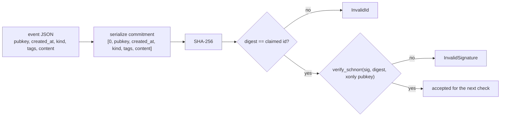

# The event signature

## Definition

An event's **signature** is the value of its `sig` field: a BIP-340 Schnorr signature,
over the secp256k1 curve, whose signed message is the event's own 32-byte id digest and
whose verifying key is the x-only public key in the event's own `pubkey` field. It is
128 lowercase hex characters — 64 bytes — and it is what turns a JSON object claiming to
come from a key into an object that provably does.

**The single most important thing about it: the event id *is* the message that was
signed.** Verification does not re-serialize the event and sign over that text. It takes
the 32-byte SHA-256 digest — the same digest the `id` field claims to be — and passes
that digest directly to `verify_schnorr` as the message. `buzz-pair-relay`'s
`verify_event_sig` shows this explicitly: it computes `hash`, compares `hash` against the
decoded `id`, and then calls `secp.verify_schnorr(&schnorr_sig, &hash, &xonly_pk)` with
that identical `hash`. `buzz-core`'s error type says the same thing in prose — its
`InvalidSignature` variant is documented as "The Schnorr signature over the event ID is
invalid."

**Two checks, in a fixed order.** `buzz_core::verify_event` verifies the id first and
only then the signature. That order is not cosmetic; it is the reason the two failure
modes are distinct and the reason a mismatch is rejected rather than repaired:

- If any field the id commits to has changed, the recomputed digest no longer equals the
  claimed `id`, and the event is rejected as `InvalidId` **before the signature is looked
  at**. The reported error carries both the computed and the claimed id.
- If the id is correct but the signature does not verify under `pubkey`, the event is
  rejected as `InvalidSignature`.

There is no third branch that recomputes the id and keeps the signature, because the
signature is bound to the *old* digest. Changing a byte of `content` changes the id;
changing the id changes the message; the old signature no longer verifies. Correcting the
mismatch means signing the new digest, which produces a different event with a different
id — not a repaired copy of the original.

**What the signature does not mean.** It is a narrow guarantee and reading more into it
is the usual mistake:

| The signature proves | The signature does **not** prove |
|---|---|
| The holder of `pubkey`'s private key committed to exactly these six serialized fields | That `pubkey` belongs to the party you expect |
| The event has not been altered since signing | That the event is fresh — the relay applies a separate ±900-second timestamp-drift limit afterwards |
| Authorship, in the cryptographic sense | Authorization — membership, channel scope and relay-only kinds are separate checks |
| Integrity of `content` as a signed field | Confidentiality of `content` — this mechanism signs it, it does not encrypt it |

In the relay's own ingest path the ordering makes this concrete: verification runs, and
only then does the code apply the timestamp-drift limit and compare `event.pubkey`
against the authenticated session's key (with a gift-wrap exception). A correctly signed
event is routinely rejected by one of those later checks.

## How it is verified

`verify_event_sig`'s own doc comment states those four steps in exactly that order. Note
that the digest flows into *both* the id comparison and the signature check — it is one
value used twice, which is the mechanical form of "the id is the message."

## Two implementations, one rule

Buzz verifies this property in two independent places, and it is worth knowing which one
you are reading.

| | `buzz-core` | `buzz-pair-relay` |
|---|---|---|
| Function | `verify_event` | `verify_event_sig` |
| Who does the crypto | Delegated to the `nostr` crate's `Event::verify_id` and `Event::verify_signature` | Written out in the crate: `serde_json` serialization, `Sha256::digest`, `secp256k1::verify_schnorr` |
| Source readable in this repo | **No** — `nostr` is a pinned external dependency (0.44), not vendored | Yes |
| Input | A parsed `nostr::Event` | A raw `serde_json::Value` |
| Tests in this repo | Two unit tests: `rejects_tampered_id`, `rejects_tampered_signature` | **None** |
| Called from (paths opened for this node) | `crates/buzz-relay/src/handlers/ingest.rs` and `buzz-auth`'s `verify_nip42_event` | One call site, in the same file as the definition |

The consequence is worth stating plainly: `buzz-core`'s route is an *interface* claim —
what the code in this repository establishes is that Buzz asks `nostr` 0.44 to verify the
id and the signature, not how that library does it. The pair relay's route is the only
place in this tree where the whole computation is visible end to end, which is why this
node's mechanical claims are cited to it. The pair relay's copy is also the untested one,
so a future change to the rule can land in `buzz-core` and silently diverge there.

## Why verification runs on a blocking thread

Schnorr verification is CPU-bound. `verify_event`'s module doc and its function doc both
say so and both instruct callers to use `tokio::task::spawn_blocking` rather than calling
it inline. The reason is the shape of an async runtime rather than anything about
cryptography: a Tokio worker thread runs many connections cooperatively, and a task that
occupies it with unyielding computation stalls every other task on that thread. One
elliptic-curve verification per inbound event, on a relay fanning out to many sockets, is
exactly the workload that turns into head-of-line latency.

The relay's persistent ingest path also shows the cost the pattern imposes and how it is
paid down: `spawn_blocking` needs a `'static` closure, and the naive way to satisfy that
is to clone the event — tags plus up to 256 KB of `content`. Instead the path wraps the
event in an `Arc`, hands a clone of the `Arc` to the blocking task, and unwraps it
afterwards, so nothing is copied. A panic inside that task is treated as an internal
error and is deliberately not reported as a rejection.

`buzz-auth`'s `verify_nip42_event` carries the same warning in its doc comment and calls
the same `buzz_core::verify_event`, mapping any failure to `AuthError::InvalidSignature`
— so the AUTH handshake's kind:22242 event is signature-checked by the same code as
everything else, just reached through a different door.

## Use cases

You need this concept when:

- **You are reading a rejection.** `invalid: invalid event id: computed …, got …` and
  `invalid: invalid schnorr signature` are different faults. The first means the digest
  recomputed from the event's own fields does not equal the id it claims, so the
  signature was never examined. The second means the digest did match and the signature
  still failed under `pubkey`. `architecture-principles-signed-events` owns the full
  table of rejection behaviour; this is only the distinction between the two faults.
- **You are writing a client or a test fixture.** Hand-editing a signed event's JSON
  always breaks it. The id must be recomputed and the event re-signed; there is no field
  you can adjust in isolation.
- **You are changing anything about how events are serialized.** Any change to what the
  commitment array contains or how it is rendered changes every id and invalidates every
  signature, and must land in both implementations above.
- **You are reasoning about trust.** The signature is the only thing in the protocol that
  ties an event to a key. Everything else — who may post where, whether a key is a member,
  whether the timestamp is plausible — is policy layered on top of it.

## Related nodes

Prefer the typed edges in this node's front matter over prose links. In particular:

- `architecture-principles-signed-events` owns the **invariant** — that the relay must
  never accept, store or fan out an event failing either check — together with the full
  table of enforcement points and the observable rejection behaviour. This node explains
  what the signature *is*; that node states what the system *must* do about it.
- `verification-security-authentication` owns how the authentication path, including the
  NIP-42 signature check, is tested.
- `implementation-crates-git-sign-nostr` owns `git-sign-nostr`, which reuses the same
  BIP-340 primitive to sign git objects. That is a boundary, not a subject of this node —
  see below.

## Scope and omissions

**This node covers** what an event signature is, what message it commits to, what a valid
signature does and does not prove, the two implementations that verify it, and why
verification is dispatched to a blocking thread.

**It does not cover, and these are boundaries rather than silence:**

| Not covered here | Owned by |
|---|---|
| The accept/reject invariant, its enforcement points and its rejection messages | `architecture-principles-signed-events` |
| How the auth path's signature check is tested | `verification-security-authentication` |
| Signing git objects with a Nostr key — same primitive, different message | `implementation-crates-git-sign-nostr` |
| The event id digest itself: what the commitment array contains and how it is serialized | A sibling task in Feature #609, not merged at this revision, so no edge to it exists here |
| The event as a whole, and its other fields | A sibling task in Feature #609, not merged at this revision |
| Key management, NIP-06 derivation, and where private keys live | Not covered by any node this author located |

**A boundary worth naming explicitly.** `git-sign-nostr` calls
`SECP256K1.sign_schnorr` over a `Message` built from a SHA-256 digest, exactly as event
signing does. But that digest is computed over a git payload together with a timestamp
and an optional authorization tag — it is not a Nostr event id, and the resulting
signature is wrapped in an armored envelope rather than an event's `sig` field. Same
primitive, different message, different container. Do not read this node as describing
it.

**Expected but not verified when this node was written:**

- **The `nostr` crate's verification code was not read**, because it is not in this
  repository: no `crates/nostr*` path is tracked and no `pub fn verify_signature`
  definition exists in the tree. Every claim here about `Event::verify_id` and
  `Event::verify_signature` is a claim about what `buzz-core` *calls*, not about what
  that library does internally. The end-to-end mechanical description is cited to
  `buzz-pair-relay`'s independent implementation, which is readable here.
- **No upstream NIP text is in this repository.** `docs/nips/` holds only Buzz's own
  letter-coded NIPs; there is no `NIP-01.md` and no `NIP-42.md`. Where this node says
  "NIP-01 commitment array" it is reporting what `verify_event_sig`'s doc comment records
  about NIP-01, not quoting the specification.
- **No test covers `verify_event_sig`.** It appears exactly twice in the tracked Rust
  sources — its definition and one call site in the same file — and nothing under
  `crates/buzz-pair-relay/tests/` names it. Whether the two implementations agree on any
  edge case (tag serialization, non-UTF-8 content, malformed numbers) is therefore
  untested in this repository, and this node asserts only that they follow the same
  four-step description, not that they are byte-for-byte equivalent.
- **No signature verification was executed** while writing this node. The claims rest on
  reading the sources named above, not on running the relay or the test suites.
