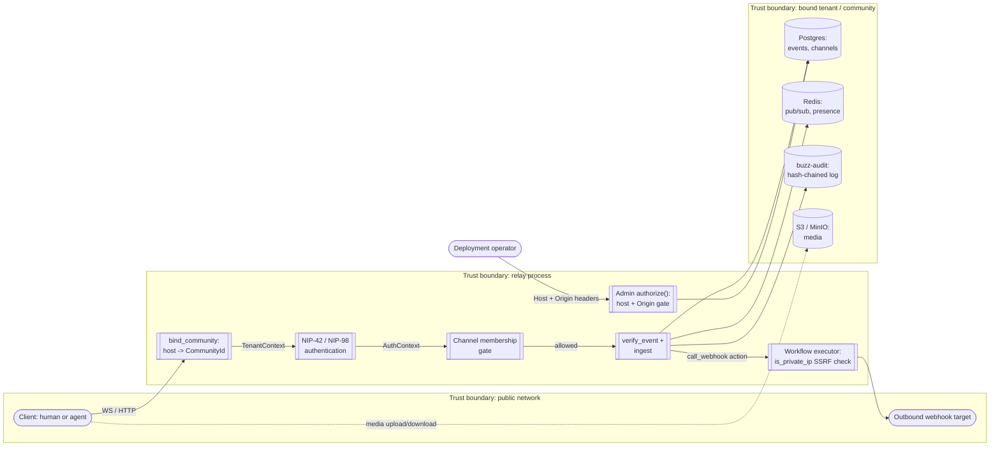

# Buzz security model: composition and orientation

This node composes and orients a reader across Buzz's security posture -- naming the
areas that make it up and where each one's canonical detail lives -- without asserting
any one area's own claims itself.

## Purpose

A reader arriving here is usually asking one of two questions: "what security
mechanisms does Buzz have, roughly, and how do they fit together?" or "which corpus
node do I open for the authoritative detail on X?" This node answers both without
duplicating the answer any atomic sibling node already owns or will own -- per parent
Feature #607's own acceptance criterion that "no broad overview page duplicates
canonical claims owned by atomic child nodes; navigation links instead" (see evidence
ledger). Where a sibling node exists and is merged, this node `references` it. Where a
sibling task is filed but its node is not yet merged, this node names the future path
so a reader knows where to look once it lands, and does not summarize its expected
content in the meantime -- summarizing a split-off subject "for context" is exactly the
duplication the corpus's atomicity standard warns against.

## Assumptions and assets

**What this model assumes about a deployment**, drawn from SECURITY.md and
ARCHITECTURE.md (see evidence ledger):

- TLS is terminated externally (at the relay itself, a reverse proxy, or an ingress
  controller) -- the relay process does not enforce it. A deployment that skips this
  runs the WebSocket and REST surfaces in cleartext.
- The operator correctly configures the host-to-community mapping and, where an admin
  surface is exposed, the separate `admin.host` value the admin boundary gates on.
- A principal's private key material is theirs to protect; the desktop app's OS-keyring
  storage (or its owner-only-file fallback) is what Buzz controls, not what happens to
  a key once it leaves that boundary (e.g. a compromised operating-system user account).

**What the model treats as an asset worth protecting**, inferred from what the cited
mechanisms actually gate, not asserted independently:

| Asset | Why it matters |
|---|---|
| Tenant/community data isolation | One relay deployment can host several communities; a client of one must not observe or affect another's data or side effects. |
| Signed-event authenticity and integrity | Every stored or fanned-out event's id and signature are what let any reader trust who wrote it and that it was not altered. |
| Channel-membership confidentiality | Private channels and their contents must be invisible to non-members, not merely access-controlled after being revealed. |
| Audit-log integrity | The hash-chained log is the record a SOX-grade or eDiscovery process depends on; a silently alterable log defeats that purpose. |
| Private key material (human and agent) | Desktop nsec keys and harnessed-agent keys are the root of every signature the rest of this model depends on. |
| The admin surface | A read-only moderation API, but one that is host- and Origin-gated separately from ordinary tenant traffic because of what it can observe. |

## Trust boundaries and data flow (composition level)

This diagram is a composition-level sketch, not a per-system Data Flow Diagram in the
sense `templates/threat-model.md` defines for an atomic threat-model node -- it exists
to orient a reader among the trust boundaries this node's sibling documents will each
analyze in full, not to enumerate every element or flow those siblings will cover.

### Notation legend

| Shape | Meaning |
|---|---|
| `([...])` (stadium) | External entity -- a human, agent, or external system outside Buzz's own trust boundaries |
| `[[...]]` (subroutine) | A process inside the relay that makes a security-relevant decision |
| `[(...)]` (cylinder) | A data store |
| `subgraph ... end` | A labeled trust boundary, per the DFD convention `templates/threat-model.md` documents |
| solid arrow | A data flow that has passed the trust boundary it crosses |
| dashed arrow | A data flow the diagram calls out as narrower or conditional (e.g. media only) |

### Diagram

## Composition: where each area's canonical detail lives

Every row below is a security-relevant area of the codebase. Where the "Node" column
names an id, that node is merged and this document `references` it rather than
restating its claims. Where it names a path, the sibling task is filed under Feature
#607 but not yet merged (see evidence ledger) -- the path is where to look once it
lands, not a summary of what it will say.

| Area | Node (merged) or future path | What it covers |
|---|---|---|
| Community / tenant boundary | `architecture-principles-community-is-security-boundary` | Host-derived community binding as the sole tenant authority |
| Fail-closed authorization | `architecture-principles-fail-closed-boundaries` | Lookup/auth failures denying rather than defaulting to an implicit allow |
| Signed-event integrity | `architecture-principles-signed-events` | `verify_event`'s id-hash and Schnorr-signature checks and their enforcement points |
| Trust boundaries (detailed) | `layers/security/trust-boundaries.md` | The full set of trust-boundary crossings this node's diagram only sketches |
| Trust model | `layers/security/trust-model.md` | Who and what Buzz trusts, and on what basis, at each boundary |
| Tenancy boundary | `layers/security/tenancy-boundary.md` | The tenant/community boundary from the security-surface angle, alongside `layers/tenancy/`'s own node set |
| Threat model (STRIDE) | `layers/security/threat-model.md` (issue #1180) | The atomic, per-system STRIDE analysis this node's composition table only orients toward |
| Cryptographic boundary | `layers/security/cryptographic-boundary.md` | Schnorr signatures, hashing, and what is treated as a trusted external dependency |
| Secret management | `layers/security/secret-management.md` | OS-keyring storage, `BUZZ_PRIVATE_KEY` precedence, S3/Typesense credentials |
| Input validation | `layers/security/input-validation.md` | UUID/id validation, frame-size limits, partition-name allowlisting, and related checks |
| SSRF protection | `layers/security/ssrf-protection.md` | `is_private_ip` and its call sites in full |
| Replay protection | `layers/security/replay-protection.md` | `nip98_replay`'s community-scoped seen-set and the NIP-42 timestamp tolerance |
| Admin boundary | `layers/security/admin-boundary.md` | The admin API's separate host+Origin gate in full |
| Provider boundary | `layers/security/provider-boundary.md` | Boundaries around agent/model providers and the ACP harness |
| Relay boundary | `layers/security/relay-boundary.md` | The relay process's own boundary as a deployable unit |
| Security invariants | `layers/security/security-invariants.md` | The MUST/MUST-NOT properties this composition only names by example |
| Residual risks | `layers/security/residual-risks.md` | The full, curated catalogue this node's own residual-risks section only samples |

## Threats, by STRIDE category (composition level)

This table names, per STRIDE category, which composition area is most directly
relevant and where its atomic analysis will live. It is not itself a threat-table row
in the sense `templates/threat-model.md` requires (element/interaction, category,
threat description, evidence) -- that enumeration is `threat-model.md`'s job. This
table exists so a reader who already knows STRIDE has a way in.

| STRIDE category | Composition-level mechanism | Atomic analysis |
|---|---|---|
| Spoofing | NIP-42/NIP-98 signature-based authentication (`buzz-auth`) | `threat-model.md`, `cryptographic-boundary.md` |
| Tampering | `verify_event`'s id/signature checks; the audit hash chain | `architecture-principles-signed-events` (merged); `threat-model.md` |
| Repudiation | The append-only, hash-chained audit log | `threat-model.md`, `security-invariants.md` |
| Information disclosure | Host-derived community boundary; channel-membership gate | `architecture-principles-community-is-security-boundary` (merged); `trust-boundaries.md` |
| Denial of service | Frame-size ceiling; rate limiting (see *Residual risks* -- not currently enforced) | `threat-model.md`, `residual-risks.md` |
| Elevation of privilege | Admin host+Origin gate; `buzz-auth::scope` enforcement | `admin-boundary.md`, `provider-boundary.md` |

## Mitigations, controls, and verification evidence

This section links what already exists rather than restating it:

- **Host-derived community binding, fail-closed authorization shape, and signed-event
  verification** each have a merged corpus node (see *Composition* above) that names
  its own enforcement points and verification mechanisms in full -- including, for the
  fail-closed shape, a formal TLA+ model (`docs/spec/MultiTenantRelay.tla`) and a
  runtime conformance harness, per `architecture-principles-fail-closed-boundaries`'s
  own evidence ledger.
- **SSRF protection** on outbound webhooks is a concrete, verified call site:
  `buzz-workflow`'s `executor.rs` calls `buzz_core::network::is_private_ip` before
  making the request (see evidence ledger). Its full IP-range coverage and any other
  call sites are `ssrf-protection.md`'s to enumerate.
- **The admin boundary** is a verified, separate gate (`authorize()` in
  `crates/buzz-relay/src/api/admin/auth.rs`), distinct from tenant host binding; its
  full behavior (including the moderation actions it exposes) is `admin-boundary.md`'s
  to document.
- **Rate limiting and replay protection** exist as named modules in `buzz-auth`
  (`rate_limit`, `nip98_replay`) -- see *Residual risks* below for what is and is not
  currently wired up for the former.

## Residual risks and open issues

Stated as observations from this revision, not as proposals to be read as implemented
controls:

- **Rate limiting is defined but not enforced.** `buzz-auth::RateLimiter` and
  `RateLimitConfig`'s four tiers exist; the only compiled-in-production behavior is no
  limiting at all, because `AlwaysAllowRateLimiter` is gated behind
  `#[cfg(any(test, feature = "test-utils"))]` and is not wired into any request path
  (see evidence ledger). A reader should not treat the tier configuration as evidence
  that limiting is active.
- **The audit log is tamper-evident, not tamper-resistant**, per SECURITY.md's own
  words: an attacker with database write access can recompute the chain after editing
  an entry. The hash chain detects accidental corruption or an isolated row edit; it
  does not defend against a privileged, deliberate rewrite.
- **The relay does not enforce TLS itself**, by design, to allow flexible deployment
  behind a load balancer or ingress controller. This shifts transport-security
  enforcement to the operator's deployment topology; a deployment that omits it runs
  cleartext.
- **The workflow-webhook shared secret is compared directly, not as an HMAC over the
  request body.** ARCHITECTURE.md's own words: "constant-time XOR comparison of stored
  UUID secret (not HMAC -- compares the secret directly, not a body MAC)." This is a
  narrower guarantee than a body-integrity MAC would provide.
- **A documentation-drift gap, found while authoring this node**: ARCHITECTURE.md's
  Security Model table states the frame-size ceiling as 65,536 bytes; the code's actual
  default is 524,288 bytes (`DEFAULT_MAX_FRAME_BYTES`, see evidence ledger). This node
  states the code value as current and flags the mismatch rather than silently
  repeating the stale figure; correcting ARCHITECTURE.md itself is out of scope for
  this task.
- **Open issue, not resolved here**: none of this node's fourteen `layers/security/`
  siblings are merged yet (see evidence ledger), so every "future path" cited in
  *Composition* above is unverifiable against a real node today -- this is a gap in
  what currently exists in the corpus, not a claim this node makes about those areas'
  eventual content.

## Boundary: what this node is not

- **Not the atomic STRIDE threat-model analysis.** That is `threat-model.md` (issue
  #1180), built from `templates/threat-model.md`'s required sections (system model,
  full threat table, mitigations-and-status table, review/validation). This node's
  *Threats, by STRIDE category* table is an index into that analysis, not a substitute
  for it.
- **Not a security-control catalog or org-wide policy.** This node names mechanisms
  that exist; it does not enumerate MUST/SHOULD requirements over them. That shape, if
  the corpus wants one, is `security-invariants.md`'s.
- **Not a vulnerability-disclosure policy.** SECURITY.md already is one, cited above as
  a source, not restated as content here.
- **Not a penetration-test or audit report.** Nothing here was tested by attempting to
  break it; every claim is read directly from source or from ARCHITECTURE.md/
  SECURITY.md's own prose, cited as such.
- **Not the architecture of the containers that implement these mechanisms.** The
  `architecture/` subtree's container and context nodes describe the relay, desktop,
  CLI, and other deployable units as designed; this node describes the same system from
  a security-composition angle and links rather than re-derives their content.

## Scope and omissions

**This node covers** the shape of Buzz's security posture at a composition level: the
areas that make it up, which already-merged corpus nodes own which area in detail,
which not-yet-merged sibling tasks will own the rest, a composition-level trust-
boundary diagram, a STRIDE-category orientation table, and a residual-risks section
grounded in what was directly verified while authoring this node.

**It does not cover, and these are gaps rather than silence:**

| Not covered here | Owned by |
|---|---|
| The atomic STRIDE threat-model analysis (system model, full threat table, mitigations/status) | `layers/security/threat-model.md`, issue #1180 |
| The full trust-boundary enumeration this node's diagram only sketches | `layers/security/trust-boundaries.md`, issue #1181 |
| Who/what is trusted and on what basis, at each boundary | `layers/security/trust-model.md`, issue #1182 |
| The tenancy boundary from the security angle | `layers/security/tenancy-boundary.md`, issue #1179 |
| Cryptographic primitives and trusted-dependency boundary | `layers/security/cryptographic-boundary.md`, issue #1169 |
| Secret storage and precedence in full | `layers/security/secret-management.md`, issue #1175 |
| Input validation in full | `layers/security/input-validation.md`, issue #1170 |
| SSRF protection's full IP-range coverage and call sites | `layers/security/ssrf-protection.md`, issue #1178 |
| Replay protection in full | `layers/security/replay-protection.md`, issue #1173 |
| The admin API's full behavior | `layers/security/admin-boundary.md`, issue #1168 |
| Agent/model provider boundary | `layers/security/provider-boundary.md`, issue #1171 |
| The relay process boundary as a deployable unit | `layers/security/relay-boundary.md`, issue #1172 |
| Security invariants stated as MUST/MUST-NOT properties | `layers/security/security-invariants.md`, issue #1176 |
| The full, curated residual-risk catalogue | `layers/security/residual-risks.md`, issue #1174 |
| The `layers/tenancy/` node set (community id, membership, host resolution, and related subjects) | Nine separate tasks, #1183-#1192, a sibling subtree rather than this Feature's `layers/security/` scope |
| Correcting ARCHITECTURE.md's stale frame-size figure | Not filed as a task at time of writing; named as a residual observation above instead |

**`type: layers` is the fit chosen over `architecture`, not an exact one.** The 13-member
`type` enum has no member named `security`; of the two closer candidates, `layers` fits
this node's subject better than `architecture` because parent Feature #607's own title
frames this whole subtree as domain-layer content -- identity, tenancy,
authentication/authorization, and security -- distinct from the `architecture/`
subtree's existing content (system containers, deployment topologies, cross-cutting
design principles) under `launchpad/docs/corpus/architecture/` (see evidence ledger).
Precedent could not be checked against another `layers`-typed node because this is the
first one in the corpus. If a later standard or sibling node makes a better-fitting
choice apparent, this node's `type` is a candidate for revision; its `id` is not.

**Expected but not verified when this node was written:**

- **Whether ARCHITECTURE.md §7's other rows (beyond the frame-size figure checked
  above) still match current code was not individually re-verified line by line.** This
  node cites that section as a description of the codebase's own stated security
  design, not as independently re-derived fact for every row; the one discrepancy found
  was found by checking a claim this node needed for its own residual-risks section,
  not by an exhaustive audit.
- **Whether any of the fourteen `layers/security/` sibling tasks will land with a
  filename, scope, or `id` different from what is named here was not and could not be
  verified**, since none is merged. If a sibling's actual path or id differs once
  merged, this node's *Composition* table needs an update to match, and its declared
  `relationships[]` should gain the corresponding `references` edges at that point.
- **Whether the `admin-boundary.md`, `provider-boundary.md`, and `relay-boundary.md`
  tasks intend the same reading of "boundary" this node assumes (a request-time
  authorization/trust gate, matching how `admin-boundary.md`'s own name and this node's
  verified `authorize()` reading align) was not confirmed against those tasks' own
  issue bodies** -- only their titles were read (see evidence ledger).
