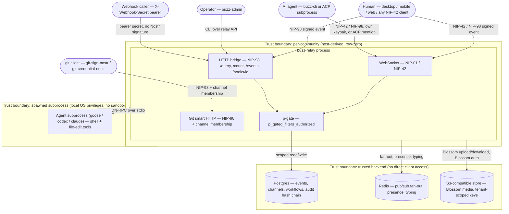

# Buzz Platform: threat model

This node decomposes `architecture-context-buzz-platform` — the whole Buzz
platform, at system-context scope — from an attacker's perspective, using
STRIDE against a Data Flow Diagram of its actors, the relay, and its backing
stores. It answers: for each element of the platform and each place a trust
boundary is crossed, what could go wrong, and what (if anything) currently
stops it. It is the single canonical, system-wide threat catalogue for Buzz;
it is distinct from a residual/accepted-risk register (`layers/security/
residual-risks.md`, issue #1174, not yet drafted at this revision), which
records what remains *after* the mitigations catalogued here.

## Notation legend

| Shape | DFD meaning |
|---|---|
| Rounded rectangle | External entity (an actor outside Buzz's own trust) |
| Rectangle | Process (code that transforms or routes data) |
| Cylinder `[( )]` | Data store |
| Labeled `subgraph` box | Trust boundary |
| Solid arrow | Data flow |
| Dashed arrow | A relationship that is provisioned/referenced but not confirmed live traffic |

## System model

## Threats (STRIDE)

| Element / interaction | Category | Threat | Evidence |
|---|---|---|---|
| WebSocket/HTTP client → relay | S | A caller submits an event or auth challenge claiming another user's pubkey without holding that key. | `crates/buzz-core/src/verification.rs`, `crates/buzz-auth/src/nip98.rs` |
| git client → git smart-HTTP | S | A caller pushes/clones a repo claiming a Nostr identity it does not control. | `crates/buzz-relay/src/api/git/transport.rs` |
| Webhook caller → `/hooks/{id}` | S | A caller triggers a workflow without knowing its per-workflow secret. | `crates/buzz-relay/src/api/bridge.rs`, `crates/buzz-relay/src/webhook_secret.rs` |
| Any signed event → relay | T | A caller submits an event whose content/tags were altered after signing (signature/id mismatch). | `crates/buzz-core/src/verification.rs` |
| Postgres `audit_log` table (out-of-band write) | T | A process or operator with direct DB access edits an audit row without going through the relay. | `crates/buzz-audit/src/hash.rs`, `crates/buzz-audit/src/service.rs` |
| Channel membership → git repo read | T/E | A caller who has lost channel membership continues reading a bound repo on a stale grant. | `crates/buzz-relay/src/api/git/transport.rs` |
| Signed event / audit entry | R | A user denies having performed a chat, admin, or workflow action attributed to their pubkey. | `crates/buzz-core/src/verification.rs`, `crates/buzz-audit/src/hash.rs` |
| Request against an unmapped/wrong host | I | A caller reaches another community's data by targeting the wrong host, or a misrouted request silently binds to a default tenant. | `crates/buzz-relay/src/tenant.rs`, `crates/buzz-core/src/tenant.rs` |
| REQ / `/query` / `/count` on p-gated kinds | I | An authenticated user reads gift wraps, member notifications, or observer frames addressed to a different pubkey. | `crates/buzz-relay/src/handlers/req.rs`, `crates/buzz-relay/src/api/bridge.rs` |
| Blossom media GET by sha256 URL | I | A caller fetches another community's media blob by guessing or reusing its content-addressed URL. | `crates/buzz-media/src/auth.rs`, `crates/buzz-relay/src/api/media.rs` |
| WebSocket admission / event submission | D | An authenticated principal floods the relay with connections or events faster than the fixed-window limiter's own documented 2x-burst tolerance permits. | `crates/buzz-auth/src/rate_limit.rs`, `crates/buzz-relay/src/admission.rs` |
| Pre-authentication connection surface | D | An unauthenticated caller opens many connections or sends oversized payloads; no IP-level or connection-count throttle was found in this codebase. | `crates/buzz-auth/src/rate_limit.rs` (scoped to authenticated principals only — see evidence ledger) |
| `buzz-dev-mcp` shell tool | E | An AI agent (or an instruction that reaches it, e.g. via prompt injection in message content) runs an arbitrary shell command with the full OS privileges of the `buzz-dev-mcp` host process — no seccomp/namespace/chroot/container confinement exists in the tool itself. | `crates/buzz-dev-mcp/src/shell.rs` |
| Desktop → remote agent `launch.env` | I | A secret carried in a definition/persona-layer `launch.env` block reaches a remote agent without passing through desktop redaction, which today scrubs only `agent.env_vars`. | `docs/remote-agents.md` (Known Defect 3) |

## Mitigations

| Threat | Mitigation | Status | Owner | Evidence |
|---|---|---|---|---|
| Pubkey spoofing over WS/HTTP | NIP-42/NIP-98 Schnorr signature verification via `verify_event`, plus a +/-60s timestamp window and URL/method binding for NIP-98 | Mitigated | buzz-auth / buzz-core | `crates/buzz-core/src/verification.rs`, `crates/buzz-auth/src/nip98.rs` |
| Identity spoofing over git | NIP-98 required on every git smart-HTTP route ("no public repos for v1") | Mitigated | buzz-relay | `crates/buzz-relay/src/api/git/transport.rs` |
| Unauthorized webhook trigger | Per-workflow bearer secret (UUIDv4, 122 bits) checked with a length-gated, constant-time XOR-fold comparison; 401 if unconfigured | Mitigated | buzz-relay | `crates/buzz-relay/src/webhook_secret.rs` |
| Post-signature tampering | `verify_event` recomputes the event id from the signed fields and checks the Schnorr signature before acceptance | Mitigated | buzz-core | `crates/buzz-core/src/verification.rs` |
| Out-of-band audit-log tampering | SHA-256 hash chain (`compute_hash`, chained via `prev_hash`, tenant-bound by hashing `community_id` first) with `verify_chain` detection | Needs Investigation | buzz-audit | `crates/buzz-audit/src/hash.rs`, `crates/buzz-audit/src/service.rs` — no call site of `verify_chain` found in `buzz-cli`/`buzz-admin`, so detection exists but no evidence of an automated/scheduled check was found |
| Stale channel membership on git read | `authorize_git_read` re-checks current active membership per request; no repo-owner bypass | Mitigated | buzz-relay | `crates/buzz-relay/src/api/git/transport.rs` |
| Action repudiation | Every event is individually signed and pubkey-bound; audit entries record `actor_pubkey` inside the tamper-evident chain | Mitigated | buzz-core / buzz-audit | `crates/buzz-core/src/verification.rs`, `crates/buzz-audit/src/hash.rs` |
| Cross-tenant data leak via wrong/unmapped host | Row-zero `bind_community`: normalizes host, fails closed with an identical generic error on unmapped host, empty host, and lookup error alike; no default-tenant fallback exists | Mitigated | buzz-relay / buzz-core | `crates/buzz-relay/src/tenant.rs`, `crates/buzz-core/src/tenant.rs` |
| Reading another pubkey's p-gated events | `p_gated_filters_authorized`, identical enforcement on WS REQ, HTTP `/query`, and `/count`, rejecting (WS CLOSED / HTTP 403) unless the filter's `#p` matches the caller | Mitigated | buzz-relay | `crates/buzz-relay/src/handlers/req.rs`, `crates/buzz-relay/src/api/bridge.rs` |
| Cross-tenant media blob access | `authenticate_media_read` requires a Blossom kind:24242 auth event AND a relay-membership check scoped to the row-zero-resolved tenant before any storage lookup | Mitigated | buzz-media / buzz-relay | `crates/buzz-media/src/auth.rs`, `crates/buzz-relay/src/api/media.rs` |
| Authenticated-principal flooding | Fixed-window rate limiter per `(tenant, pubkey, LimitType)`, applied at WS admission, media upload, invites | Needs Investigation | buzz-auth | `crates/buzz-auth/src/rate_limit.rs` — the module's own doc comment concedes fixed windows allow up to 2x burst at boundaries |
| Pre-authentication / anonymous flooding | None found in this codebase's own rate-limit call sites (all keyed by authenticated principal) | Not Started | Unassigned | `crates/buzz-auth/src/rate_limit.rs`, `crates/buzz-relay/src/admission.rs` — absence within this repo's code only; a deployment-level reverse proxy/load balancer was not in scope of this review (see *Scope and omissions*) |
| Shell tool privilege scope | Timeout, byte/line output caps, and process-group kill bound duration and blast size, but do not confine what a running command can do | Needs Investigation | buzz-dev-mcp | `crates/buzz-dev-mcp/src/shell.rs` — no OS-level sandbox primitive found in this crate |
| `launch.env` secret redaction gap | Documented, not yet fixed at the cited commit | Needs Investigation | Desktop (`backend.rs`) | `docs/remote-agents.md` (Known Defect 3) |

## Review and validation

- Reviewed by: this authoring pass (self-review only — no `review-code`/cross-model pass invoked), on the date of the recorded revision.
- Re-review triggers: any change to `crates/buzz-core/src/tenant.rs`'s host-resolution invariant or `TenantContext` construction; any change to `crates/buzz-relay/src/handlers/req.rs`'s p-gated-kind list or `p_gated_filters_authorized`; any change to `crates/buzz-auth/src/nip98.rs` or `crates/buzz-core/src/verification.rs`'s signature/id checks; any change that adds sandboxing (or further removes confinement) to `crates/buzz-dev-mcp/src/shell.rs`; landing of the `launch.env` redaction fix `docs/remote-agents.md` names as outstanding; and any structural change to `architecture-context-buzz-platform`'s own system boundary, since this node's DFD is derived from it.

## Boundary

This node does not describe:

- A `SECURITY.md` vulnerability-disclosure process for external reporters — no such file was found in this repository at the recorded revision; if one is added later, it should be cited here as a `references` relationship rather than restated.
- An org-wide security-control catalog or policy (e.g. a MUST/SHOULD standard for encryption-at-rest, MFA, or WAF rules across all Buzz deployments) — that is a `governance`-type policy node's shape, not this one's.
- Penetration-test or audit findings — none were available as evidence at this revision; a future finding would be cited here as evidence for a threat/mitigation row, not restated as its own section.
- `architecture-context-buzz-platform`'s own system design — see that node for what each actor and external system *is*; this node only adds the adversarial view of the same boundary.
- Residual or accepted risk after mitigation — that is `layers/security/residual-risks.md`'s scope (issue #1174, not yet drafted), which this node's Mitigations table feeds rather than duplicates.
- Client-side (desktop/mobile/web) application-layer threats such as XSS, local storage exposure, or Tauri IPC surface — none were evidenced in this pass; a future container-level threat-model node for those clients is the more atomic home for them once `depends-on` targets exist for them individually.

## Relationships

- `implements` → `corpus-template-threat-model`: this node is an instance of that template.
- `depends-on` → `architecture-context-buzz-platform`: this analysis's trust boundaries and actor set are drawn directly from that node's context diagram, and stop holding the moment that design changes.
- `references` → `architecture-principles-community-is-security-boundary`: the community/tenant trust boundary this node's DFD draws is the same principle that node states architecturally.
- `references` → `architecture-principles-fail-closed-boundaries`: several mitigations above (row-zero host binding, p-gate rejection) are concrete instances of that principle's fail-closed pattern.

## Scope and omissions

**This node covers** a system-wide STRIDE threat catalogue for the Buzz platform as a whole (the system this repository builds and the `launchpad-26` fork operates): its Nostr-facing WebSocket/HTTP surface, the git smart-HTTP surface, workflow webhooks, Blossom media, the audit hash chain, the community/tenant trust boundary, and the AI-agent shell-tool surface, each threat traced to real code and each mitigation's status reported honestly rather than assumed.

**It does not cover, and these are gaps rather than silence:**

| Not covered here | Owned by |
|---|---|
| Residual/accepted risk after these mitigations | `layers/security/residual-risks.md` (issue #1174, not yet drafted) |
| `architecture-context-buzz-platform`'s own system design (what each actor/system *is*) | `architecture-context-buzz-platform` |
| Client-side application-layer threats (desktop/mobile/web) | Future container-level threat-model nodes, once those `depends-on` targets exist |
| Supply-chain / dependency-vulnerability threats (crates.io, npm, pub.dev advisories) | Not yet filed as a task at time of writing |
| Deployment/infrastructure-level threats (Kubernetes RBAC, ArgoCD, Terraform state) | `squareup/block-coder-tf-stacks`'s own operational documentation, outside this repository's boundary per `architecture-context-buzz-platform` |
| A `SECURITY.md` vulnerability-disclosure policy | Not yet filed as a task at time of writing |
| An org-wide security-control catalog or policy | Not yet filed as a task at time of writing |

**Expected but not verified when this node was written:**

- **Whether any reverse proxy, load balancer, or edge layer in front of `buzz-relay` provides connection-count or IP-level DoS protection.** This node's own review found no such mechanism inside this repository's code, and reports that absence explicitly in the Mitigations table above (status `Not Started`, owner `Unassigned`) — but a deployment-level layer outside this repository's boundary was not inspected and could exist without appearing here.
- **Whether the git push path (`git-receive-pack`) enforces the same current-membership check this node verified for the read path (`authorize_git_read`).** The internal git policy hook `POST /internal/git/policy` is named in `architecture-context-buzz-platform`'s own evidence, but its authorization logic was not independently opened for this node.
- **Whether the audit hash chain's `verify_chain` is invoked by any process outside `buzz-cli`/`buzz-admin`** — e.g. a CI job, a cron task, or manual operator practice not expressed in this repository's own source. Only the absence of a call site inside this repository was checked.
- **Whether `crates/buzz-acp`'s own process-spawn configuration applies any host-side confinement to the agent subprocess itself**, distinct from `buzz-dev-mcp`'s shell tool reviewed here; only the Codex CLI's own macOS Seatbelt sandbox (configured, not enforced, by `buzz-acp`) was observed in passing, not independently verified.
