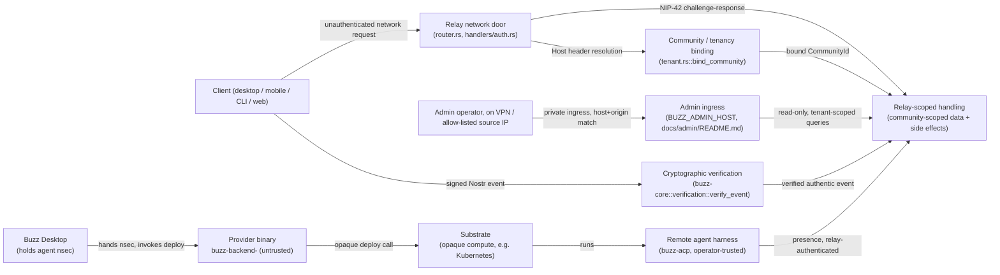

# Security trust boundaries: index

An enumeration and map of every point in Buzz where a request, event, or process
crosses from one trust level to another. This node answers "where are the seams,
and what changes at each one" for a reader who needs the whole picture before
opening any one boundary's own document. It does not itself decide who is trusted
at each level (`layers-security-trust-model`, issue #1182) and it does not run a
structured attacker-perspective analysis of any one boundary (`layers-security-threat-model`,
issue #1180, built from the corpus's `threat-model` template). Both of those, and
the five specific boundary documents this index ties together, are separate tasks
under the same parent PRD (#607) and none had merged at the revision this node was
checked against — see *Scope and omissions* for what that means for this node's
`relationships`.

## Purpose and scope

**This node covers:** every process boundary in the current architecture where the
trust level of the data or the authority of the acting principal changes, named and
briefly described, with a pointer to its expected canonical corpus node and to the
primary source this index verified it against.

**It does not cover:**

- **Who or what is trusted at each level**, and why — that is `layers-security-trust-model`
  (issue #1182)'s subject.
- **A systematic, STRIDE-structured threat enumeration** for any one boundary — that
  is `layers-security-threat-model` (issue #1180)'s subject, built against the
  corpus's `corpus-template-threat-model` template.
- **The full internal detail of any one boundary** — the specific mitigations,
  failure modes, and verification evidence for, say, the admin ingress or the
  provider protocol belong in that boundary's own node (`layers-security-admin-boundary`,
  `layers-security-cryptographic-boundary`, `layers-security-provider-boundary`,
  `layers-security-relay-boundary`, `layers-security-tenancy-boundary`). This index
  names each boundary's controls only at the depth needed to justify that a real,
  evidenced boundary exists there — deep coverage belongs in the boundary's own node.

## Assumptions and protected assets

The boundaries below exist to protect four kinds of asset, stated once here so each
row in *Boundary enumeration* can name which it primarily protects rather than
repeating the reasoning:

| Asset | What crossing the wrong boundary would expose or corrupt |
|---|---|
| **Tenant data and side effects** | One community's messages, channel membership, workflow state, and audit trail becoming observable or actionable from another community. |
| **Agent and operator private keys** | An `nsec` (a remote agent's signing key, handed to a provider binary by design) or an admin operator's session being exposed to, or exercised by, a party that should not hold it. |
| **Event authenticity** | The relay or a client treating unsigned or tampered content as if it had been produced by the pubkey it claims. |
| **Deployment-operational state** | Moderation reports, feedback, and configuration reachable only through the admin surface, and the substrate a remote agent actually runs on. |

**Assumption this index makes and states rather than silently relies on:** every
boundary below is a *documented* seam with at least one enforcement point this node
verified in code or in a primary-source specification document at the checked
revision. This index does not assert that no other, undocumented trust boundary
exists in the system — see *Scope and omissions* for what was and was not checked
to arrive at the list below.

## Data-flow view

Every edge below is a boundary crossing this node names in *Boundary enumeration*,
with the same primary-source citation backing it there.

## Notation legend

| Shape | Meaning |
|---|---|
| Rectangle | A principal or process — a person, a client, a relay subsystem, a provider binary, or a substrate. |
| Labeled arrow | A trust-boundary crossing: the label names what travels across it and, where relevant, what changes (unauthenticated → authenticated, claimed → verified, desktop-trusted → provider-untrusted). |

Mermaid has no dedicated data-flow-diagram or trust-boundary notation (confirmed
against Mermaid's current syntax-reference page while a sibling template task
researched this same gap); this diagram approximates one with plain flowchart
nodes and edges rather than inventing new syntax.

## Boundary enumeration

| Boundary | Expected corpus id | What changes crossing it | Primary source verified | On disk at this revision |
|---|---|---|---|---|
| **Relay network door** — unauthenticated network request → NIP-42-authenticated connection | `layers-security-relay-boundary` (#1172) | Trust: an anonymous TCP/TLS peer becomes a connection bound to a verified pubkey (or remains unauthenticated for the surfaces that permit it). | `crates/buzz-relay/src/router.rs` (WebSocket upgrade gate), `crates/buzz-relay/src/handlers/auth.rs` (`handle_auth`, NIP-42) | No |
| **Cryptographic verification** — claimed event → verified event | `layers-security-cryptographic-boundary` (#1169) | Authenticity: content asserted to come from a pubkey becomes content whose id hash and Schnorr signature were checked. | `crates/buzz-core/src/verification.rs` (`verify_event`), called from `handlers/ingest.rs` and `handlers/event.rs` | No |
| **Community / tenancy binding** — connection → tenant-scoped context | `layers-security-tenancy-boundary` (#1179) | Scope: a bare connection becomes a `TenantContext` that is the sole authority for every downstream tenant-scoped read or write. | `crates/buzz-relay/src/tenant.rs` (`bind_community`); `docs/multi-tenant-relay.md`; merged node `architecture-principles-community-is-security-boundary` | No |
| **Admin ingress** — deployment operator → moderation/feedback read access | `layers-security-admin-boundary` (#1168) | Privilege: network admission (VPN / source-IP allow-list) becomes access to deployment-wide, cross-tenant moderation and feedback data — without per-operator identity. | `docs/admin/README.md` | No |
| **Provider / substrate** — Desktop-held agent key → remote compute environment | `layers-security-provider-boundary` (#1171) | Custody: an agent's private key, held only by the trusted Desktop, is handed to an explicitly untrusted provider binary that deploys it onto an opaque substrate. | `docs/remote-agents.md` (`§Provider Protocol`, `§System Model`) | No |

Two further trust-relevant boundaries were found in the codebase during this
survey and are **not** assigned to any of PRD #607's five currently filed child
tasks (see the INFERENCE entry in this node's evidence ledger):

| Boundary | Expected corpus id | What changes crossing it | Primary source verified | On disk at this revision |
|---|---|---|---|---|
| **Agent-harness operator boundary** — the operator who launched an agent → the model/tool-call loop that operator's agent runs | Not yet assigned a task | Privilege: the harness, MCP server binaries, and API keys are trusted; model output, tool results, and prompts are treated as untrusted input and bounded. | `crates/buzz-agent/README.md` (`§Security Model`) | No — no corpus task found |
| **Object-storage conformance gate** — git ref/pack data → an S3-compatible backend | Not yet assigned a task | Durability/consistency: the protocol's safety proof holds only relative to three stated object-store axioms, each admitted per-backend by an empirical conformance probe rather than proven universally. | `docs/git-on-object-storage.md` | No — no corpus task found |

**Not a trust boundary in this node's sense:** the boundary between `buzz-relay`
and the six in-process subsystem crates it orchestrates (`buzz-db`, `buzz-auth`,
`buzz-pubsub`, `buzz-search`, `buzz-audit`, `buzz-workflow`), documented in the
merged node `architecture-principles-subsystem-isolation`. Every crate on both
sides of that boundary runs inside the same relay process at the same trust
level — nothing crossing it becomes more or less authenticated, authorized, or
privileged. It is a real architectural boundary and is cited here because a
reader assembling "every boundary in the system" from `ARCHITECTURE.md` alone
would reasonably expect to find it; it is excluded from the enumeration table
above because its crossing changes no principal's trust level. See the
INFERENCE entry in this node's evidence ledger for the reasoning.

## Threat categories (survey level)

A STRIDE-labelled summary of the threat category each boundary is most exposed
to, at survey depth — enough to show every boundary has been considered, not a
row-by-row attack enumeration. `layers-security-threat-model` (#1180) is where a
full STRIDE table with per-row evidence belongs, per the corpus's own
`threat-model` template requirement that a diagram element have a matching
threat-table row.

| Boundary | Primary STRIDE exposure | Why |
|---|---|---|
| Relay network door | Spoofing, Denial of Service | Pre-authentication surface; anyone can attempt a connection or a NIP-42 challenge response. |
| Cryptographic verification | Spoofing, Tampering | Its entire purpose is rejecting exactly these two categories before content is trusted. |
| Community / tenancy binding | Information Disclosure, Elevation of Privilege | A defeated binding would let one community observe or act on another's data. |
| Admin ingress | Information Disclosure, Repudiation | Network-level admission with no per-operator identity means an admitted read cannot be attributed to a specific person. |
| Provider / substrate | Tampering, Information Disclosure, Elevation of Privilege | The provider is handed a private key by design; a hostile or compromised provider can act as the agent it was given custody of. |

## Mitigations and verification evidence

Each row names the strongest verification mechanism this node found for that
boundary at the checked revision, not an exhaustive catalogue of every control —
the boundary's own future node owns the full list.

| Boundary | Control | Verification evidence |
|---|---|---|
| Community / tenancy binding | `bind_community` fails closed on unmapped host, empty host, and lookup error alike; called before any tenant-scoped work at every request surface. | `docs/spec/MultiTenantRelay.tla`'s `Inv_HostBindingFence` and `Inv_ResolutionFence`; the runtime conformance harness `crates/buzz-relay/src/conformance/mod.rs`; the `#[ignore]`-gated A/B suite `crates/buzz-test-client/tests/conformance_multitenant.rs` (per the merged `architecture-principles-fail-closed-boundaries` and `architecture-principles-community-is-security-boundary` nodes — neither mechanism was re-run while authoring this index). |
| Relay network door | `bind_community` runs before `WebSocketUpgrade::from_request`; NIP-42 signature verification runs before any database lookup. | Unit tests in `crates/buzz-relay/src/tenant.rs`'s own `tests` module (cited by the merged `architecture-principles-fail-closed-boundaries` node as 10 passed, 0 failed at a prior revision — not re-run here). |
| Cryptographic verification | `verify_event` checks the event-id hash and Schnorr signature independently, with a distinct error per failure mode. | `crates/buzz-core/src/verification.rs`'s own `#[cfg(test)]` module, including `rejects_tampered_id` (read directly; not executed while authoring this index). |
| Admin ingress | Private-ingress binding on exact `Host` + browser origin; feedback-attachment reads re-derive the community from server-owned provenance and re-check host resolution before serving bytes. | `docs/admin/README.md`'s own stated behavior; no automated conformance suite for the admin surface was found during this survey. |
| Provider / substrate | Discovery-only resolution, output size caps, secret redaction, anti-secret config validation, and an explicit UI trust warning bound (not eliminate) the desktop's exposure to a provider it does not otherwise trust. | `docs/remote-agents.md`'s stated invariants (`§Invariants`) and its own `§Conformance` and `§Known Defects` sections — not independently re-verified for this index. |

**This table does not claim any of the cited verification mechanisms were run
while authoring this node.** Every row states explicitly what was read versus
executed. A `FACT` in this node's own ledger established that the cited source
exists and says what is quoted; it did not re-run a test suite, TLA+ model
checker, or conformance harness.

## Residual and accepted risks, and open issues

Stated as what they are — proposed, planned, or explicitly accepted — never as
implemented controls this node has verified:

- **The provider boundary is fundamentally, not incidentally, untrusted.**
  `docs/remote-agents.md` states directly that "Malicious-provider containment"
  is out of scope for its own specification: a provider binary is handed the
  agent's private key by design, and the protocol bounds the desktop's
  exposure without claiming to make a hostile provider safe. This is a stated,
  accepted risk in the primary source, not a gap this index is raising for the
  first time.
- **The admin ingress has no per-operator attribution or revocation today.**
  `docs/admin/README.md` states this as a property of the current design
  ("Anyone admitted to the dashboard can read attachments for feedback records
  they can access"), not a defect being tracked for a fix in this node's
  evidence.
- **Physical-resource isolation between communities is a named, unclosed
  carve-out**, not a proven property: `docs/multi-tenant-relay.md`'s own scope
  states its isolation proof covers the logical interface only, and that
  communities sharing a connection pool and CPU is bandwidth-limited physical
  channel exposure the proof does not close.
- **The subsystem-isolation boundary (excluded from this index's enumeration
  as not a trust boundary) is not fully honored by current code.** The merged
  `architecture-principles-subsystem-isolation` node reports `buzz-pubsub` →
  `buzz-auth` and `buzz-workflow` → `buzz-db` as real, functioning violations
  of the stated no-cross-call rule. Recorded here because a reader building a
  complete picture of the relay's internal seams should know it, even though
  the boundary itself sits outside this node's trust-boundary definition.
- **Two observed trust-relevant boundaries have no assigned corpus task**: the
  agent-harness operator boundary (`crates/buzz-agent/README.md`) and the
  object-storage conformance-gate boundary (`docs/git-on-object-storage.md`).
  Filing tasks for either is not something this documentation task does —
  noted here as an open gap in PRD #607's current child-task set, per the
  INFERENCE entry in this node's ledger.
- **None of the five sibling boundary documents, the trust-model document, or
  the threat-model document exist yet.** This index names their expected
  corpus ids and primary sources; it does not substitute for their content,
  and every "On disk at this revision: No" row in *Boundary enumeration* is a
  currently-open gap in PRD #607's document set, not a claim that the boundary
  itself is unenforced in the running system — the code and specification
  citations in *Mitigations and verification evidence* are this node's
  evidence that each boundary is real regardless of whether its own corpus
  node has been written yet.

## Scope and omissions

**This node covers** the enumeration and a data-flow map of every process
boundary in the current architecture where trust level or acting authority
changes, at a depth sufficient to justify that each is real and evidenced; a
survey-level STRIDE label per boundary; the strongest verification mechanism
found for each; and the residual risks and open documentation gaps this survey
surfaced.

**It does not cover, and these are gaps rather than silence:**

| Not covered here | Owned by |
|---|---|
| Who/what is trusted at each boundary and why | `layers-security-trust-model` (issue #1182), not yet written |
| A full STRIDE threat table per boundary, with mitigation status and review cadence | `layers-security-threat-model` (issue #1180), not yet written, built against `corpus-template-threat-model` |
| The full internal detail (all controls, all failure modes, full verification) of any one boundary | That boundary's own node — `layers-security-admin-boundary` (#1168), `layers-security-cryptographic-boundary` (#1169), `layers-security-provider-boundary` (#1171), `layers-security-relay-boundary` (#1172), `layers-security-tenancy-boundary` (#1179) — none written yet |
| Whether a corpus task should be filed for the agent-harness operator boundary or the object-storage conformance-gate boundary | Not yet filed as a task at time of writing; a decision for PRD #607's owner |
| The `docs/multi-tenant-relay.md` and `docs/git-on-object-storage.md` formal proofs themselves (axioms, theorems, TLA+/Tamarin models) | Those documents directly; this node cites their scope-and-boundary statements only |
| Fixing the `buzz-pubsub` → `buzz-auth` or `buzz-workflow` → `buzz-db` subsystem-isolation violations | Implementation work, not corpus authorship — see the merged `architecture-principles-subsystem-isolation` node |

**No `relationships` to the five sibling boundary documents, the trust-model
document, or the threat-model document.** `AGENTS.md`'s node-creation step 9
requires a `relationships[].target` to name an id that exists on the branch
being merged into; none of those six ids exist on `origin/launchpad` at the
checked revision (confirmed by directory listing, not assumed), and declaring
one would be a hard validation error on the merge target even though it might
resolve inside this task's own worktree. The three `references` edges this
node does declare — to `architecture-principles-community-is-security-boundary`,
`architecture-principles-fail-closed-boundaries`, and
`architecture-principles-subsystem-isolation` — target nodes confirmed present
on `origin/launchpad` at the checked revision.

**Expected but not verified when this node was written:**

- **None of the verification mechanisms cited in *Mitigations and verification
  evidence* were re-run.** Every row states this explicitly; what this node
  establishes is that the cited source exists and currently says what is
  quoted, read directly, not that the referenced test suite or model checker
  currently passes.
- **This node's survey of "every trust boundary in the system" is not
  exhaustive by construction.** It is bounded by what a targeted search of
  primary-source specification documents (`docs/*.md`), the corpus's own
  merged architecture nodes, and the five already-commissioned sibling issues
  surfaced. A boundary with no corresponding primary-source document and no
  filed issue would not have been found by this method, and this node makes
  no claim that none exists.
- **Whether the two boundaries flagged as unassigned (agent-harness operator,
  object-storage conformance gate) genuinely warrant their own PRD #607 child
  task, versus folding into an existing one once written, was not decided
  here** — it is recorded as an open question for the batch owner.
