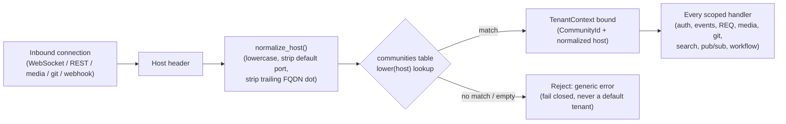

# Community (tenancy)

A **community** is Buzz's unit of tenancy: the workspace a client is talking to,
selected entirely by which host it connected to. This node explains what a
community is, how it is bound to a request, and where it sits relative to the
concepts most likely to be confused with it — a **channel**, and the
still-unwritten `community-id` and `tenant-context` nodes that describe its
mechanics in more depth. Those depth topics, and Buzz's `single-community-mode`
and `multi-community-mode` deployment modes, are named here and deliberately
left to their own future corpus nodes; see *Scope and omissions* below.

## Definition

A Buzz community is the tenant-visible workspace selected by the request host.
Concretely: `req.community = resolve_host(connection.host)`, resolved by the
server **before** any WebSocket `AUTH`/`EVENT`/`REQ`, REST handler, media
handler, git transport handler, webhook handler, workflow side effect, search
query, or pub/sub fan-out path can observe tenant data. Nothing about a
community is client-supplied: it is derived purely from which host the client
connected to, never from a request body, a signed event, or a tag.

The self-hosted default — and still the common case today — is one host, one
relay process, one implicit community. A hosted, multi-tenant deployment moves
the same semantic boundary up one level: many communities behind many hosts,
served by one relay deployment. Either way, the client-facing rule never
changes: the URL is authoritative for the workspace.

**What a community is not.** It is not a channel. A channel (`h` tag; Buzz's
implementation of a NIP-29 group, advertised via kind `39000` metadata, `39001`
admins, and `39002` members) is a locality boundary *inside* one community — a
client-supplied `h` tag must resolve to a channel inside the host-derived
community, and can never reach another community's channel. A community itself
has no NIP-29-shaped event and is never advertised to clients as a signed event
kind at all: it is a purely server-side row in the `communities` table, keyed
by its own UUID (`communities.id`), looked up by normalized host.

It is also not the same thing as `TenantContext` or `CommunityId` — those are
the typed, code-level representations of "the community currently bound to
this request" and "a community's UUID" respectively, and are documented in
depth by the (not yet written) `tenant-context` and `community-id` corpus
nodes. This node is the conceptual one level up: what the tenant unit *is* and
why it exists, not how the type system enforces it.

## How a community is resolved

The `communities` table is deliberately **operator-global**, not itself
tenant-scoped — it carries no `community_id` of its own because its own `id`
*is* the community key, and it is the one table the migration-lint harness
allowlists as an exception to "every scoped table carries `community_id`."
Every other tenant-scoped table (channels, events, workflows, audit entries,
and the rest) instead carries `community_id NOT NULL`, and the schema's own
migration-lint obligations forbid any `UNIQUE`/`PRIMARY KEY`/foreign key on
such a table that is observable across communities — each key leads with
`community_id` (or a joined parent already pins it). `channels`, for example,
has a compound primary key `(community_id, id)`, so the very same channel UUID
may legitimately exist in two different communities without colliding — an
isolation property `crates/buzz-test-client/tests/conformance_multitenant.rs`
exercises directly as a named obligation, not merely a schema-level
assertion.

Server-internal code paths that have no inbound request `Host` header at all
(the git Smart-HTTP transport, the localhost pre-receive hook callback, the
workflow execution sink, startup tasks) still go through the same fail-closed
binding path: they resolve the relay's own configured `relay_url` host through
the identical lookup, rather than taking a separate "internal" shortcut that
bypasses host resolution.

## Use cases

Understanding "community" matters before touching almost any server-side code
in this repository, because it is the axis every tenant-scoped table, cache
key, and Redis channel is partitioned on:

- **Writing or reviewing a new handler.** Any new WebSocket, REST, media, git,
  webhook, search, or pub/sub code path must obtain its `TenantContext` from
  host binding before reading anything from the request that could cause a
  tenant-visible effect — not derive a community from a client-supplied field.
- **Adding a new tenant-scoped table or index.** It needs a `community_id`
  column, and any uniqueness constraint on it must lead with `community_id`
  (or be scoped through an already-pinned parent) so two communities can never
  collide on the same key.
- **Operating a deployment.** An operator provisioning a new tenant calls the
  `POST /operator/communities` endpoint (`provision_community`), which
  ensures/creates a community by host and, given `create_only: true`, rejects
  an already-existing host rather than silently converging into it — the same
  fail-closed discipline as request-time resolution, applied to provisioning.
- **Debugging cross-tenant leakage.** Because the community is resolved once,
  at connection establishment, from the host alone, the first question for any
  suspected cross-community bug is always "where did this code path get its
  `community_id` from, and did it come from `TenantContext` or from something
  client-supplied?"

## Scope and omissions

**This document covers** what a community is, how it is bound to a request
(row zero / host resolution, conceptually), why the `communities` table sits
outside the tenant-scoping pattern every other table follows, and the boundary
between a community and a channel.

**It does not cover, and these are gaps rather than silence — each is a named
sibling node from this task's parent PRD (#607), none of which exist on
`origin/launchpad` at this revision, so no `relationships` entry can target
them yet:**

| Not covered here | Owned by (future node) |
|---|---|
| `CommunityId`'s type-level design in depth | `community-id` |
| `TenantContext`'s full lifecycle and the "lint-and-review fence, not a compiler fence" argument | `tenant-context` |
| How host resolution itself works end-to-end (`HostResolver`, `bind_community`, `bind_deployment_community`, the exact normalization rules) | `host-resolution` |
| Who belongs to a community and how membership is granted/checked | `community-membership` |
| How caches (Redis pub/sub, presence, typing) are partitioned by community | `community-scoped-cache` |
| How persisted data more broadly (beyond the schema-level pattern named here) is community-scoped | `community-scoped-data` |
| The isolation guarantees and tests that prove one community cannot observe another's data | `cross-community-isolation` |
| The single-host, single-implicit-community deployment shape named throughout `ARCHITECTURE.md` as "single-community mode" | `single-community-mode` |
| The many-communities-behind-many-hosts deployment shape named as "multi-community mode" | `multi-community-mode` |

**Verified gap, not resolved here:** `migrations/0001_initial_schema.sql`'s
own header comment states that pre-existing single-community deployments
migrate via "the documented backfill migration (0002), which assigns all
pre-existing rows to one default community." At this revision, the migration
actually numbered `0002` (`migrations/0002_git_repo_names.sql`) is the NIP-34
git-repo-name registry and has nothing to do with a default-community
backfill, and no other migration filename matches "default community" or
"backfill" either. Whether the backfill migration was renumbered, folded into
`0001` itself, or genuinely never landed under that number is not established
by anything read for this node.

**Expected but not verified when this node was written:**

- **Whether a `default_community` id/name convention exists anywhere in code
  or configuration** for the self-hosted, single-community case, beyond "the
  one row `communities` happens to contain." No config file or startup-seeding
  code path was read for this node.
- **The full list of "operator-global" tables** beyond `communities` itself —
  `migrations/0001_initial_schema.sql`'s header names an "explicit allowlist"
  of such tables but this node did not enumerate it.
