# buzz-cli / buzz-acp: environment injection component view

This node decomposes one facet of the `architecture-containers-cli` container
(`buzz-cli`): how `BUZZ_RELAY_URL`, `BUZZ_PRIVATE_KEY`, `BUZZ_AUTH_TAG`, and
the smaller related variables actually reach a `buzz-cli`/`buzz-dev-mcp`
process running inside an ACP-managed agent session. The container node
summarizes this in one paragraph plus one `INFERENCE`; this node answers the
question that summary leaves open: which concrete code paths set which
variables, in what order, and with what precedence, when `buzz-acp` (the ACP
harness, `crates/buzz-acp`) starts a managed agent.

## Notation legend

| Shape | Meaning |
|---|---|
| Rectangle inside "buzz-acp process" | A function/struct living inside `buzz-acp`'s own process |
| Rectangle outside that boundary | A different OS process (parent shell, spawned agent, spawned MCP server) |
| Solid arrow | An explicit environment assignment (`Command::env`, or a field written into a declarative `McpServer.env` payload) |
| Dashed arrow | Passive inheritance — no `env_clear` call removes it |

## Component diagram

```mermaid
flowchart LR
    subgraph ACP["buzz-acp process"]
        CliArgs["CliArgs (clap)\nBUZZ_RELAY_URL / BUZZ_PRIVATE_KEY"]
        Config["Config\nrelay_url, keys, persona_env_vars"]
        BuildMcp["build_mcp_servers()"]
        GitOrigin["mcp_servers_with_git_origin()"]
        SessionNew["session_new_full()\n(sends session/new)"]
        Spawn["AcpClient::spawn()\n(launches agent binary)"]
    end

    ParentEnv["Parent process environment\n(shell / launcher of buzz-acp)"]
    AgentProc["Agent subprocess\n(claude / codex / goose / hermes ...)"]
    McpProc["MCP server subprocess\n(buzz-dev-mcp, spawned by the agent/adapter)"]

    ParentEnv -->|"clap env= reads BUZZ_RELAY_URL, BUZZ_PRIVATE_KEY"| CliArgs
    ParentEnv -->|"std::env::var(BUZZ_AUTH_TAG), read ambiently"| BuildMcp
    CliArgs --> Config
    Config --> BuildMcp
    BuildMcp -->|"McpServer.env: BUZZ_RELAY_URL, BUZZ_PRIVATE_KEY, +BUZZ_AUTH_TAG?, +BUZZ_ACP_DISPLAY_NAME?"| GitOrigin
    GitOrigin -->|"+ BUZZ_GIT_ORIGIN_CHANNEL_ID or _AGENT_NAME"| SessionNew
    SessionNew -->|"declares MCP servers over ACP session/new"| AgentProc
    AgentProc -->|"agent/adapter spawns using declared command/args/env"| McpProc
    Config -->|"persona_env_vars (CODEX_CONFIG, ...)"| Spawn
    Spawn -->|"Command::env: default_agent_env then extra_env, operator-wins"| AgentProc
    ParentEnv -.->|"no env_clear: full inheritance"| AgentProc
```

## Building blocks

| Component | Responsibility | Interface | Evidence |
|---|---|---|---|
| `CliArgs` env bindings | Read `BUZZ_RELAY_URL`/`BUZZ_PRIVATE_KEY` from the process environment via clap's `env =` attribute into `buzz-acp`'s own `Config`. `BUZZ_AUTH_TAG` has no field here. | `clap::Parser` derive | `crates/buzz-acp/src/config.rs:240-267` |
| `build_mcp_servers` | Builds the one declarative `McpServer` entry (when `mcp_command` is configured): unconditional `BUZZ_RELAY_URL`/`BUZZ_PRIVATE_KEY`, conditional `BUZZ_AUTH_TAG`/`BUZZ_ACP_DISPLAY_NAME` pass-through from `buzz-acp`'s own process env. | `fn(&Config) -> Vec<McpServer>` | `crates/buzz-acp/src/lib.rs:5069-5124`; tests `crates/buzz-acp/src/lib.rs:6785-6890` |
| `McpServer` / `EnvVar` | Typed, serializable payload shape carried in the ACP `session/new` request; documented as corresponding to the ACP schema's `McpServerStdio` variant. | `#[derive(serde::Serialize)]` structs | `crates/buzz-acp/src/acp.rs:25-42` |
| `mcp_servers_with_git_origin` | Per-session enrichment: appends a channel/agent-identifying env var to every declared MCP server immediately before each `session/new` call. | `fn(&[McpServer], Option<Uuid>, Option<&str>, Option<&str>) -> Vec<McpServer>` | `crates/buzz-acp/src/pool.rs:1367-1393` |
| `session_new_full` (`AcpClient`) | Sends the enriched MCP server list to the just-spawned agent process as part of the ACP `session/new` JSON-RPC request. | ACP JSON-RPC over the agent's stdio pipes | `crates/buzz-acp/src/pool.rs:1138-1158`; `crates/buzz-acp/src/acp.rs:692` |
| `AcpClient::spawn` | Launches the agent binary itself via `tokio::process::Command`, applying `default_agent_env` then `extra_env` with operator-wins precedence (skip if already set in `buzz-acp`'s own env); no `env_clear` call. | `tokio::process::Command` | `crates/buzz-acp/src/acp.rs:454-537` |
| `default_agent_env` / `codex_network_env` (`persona_env_vars`) | Per-runtime env defaults applied at spawn time: `HERMES_ACP_SKIP_CONFIGURED_MCP=1` for Hermes-family agents; `CODEX_CONFIG` (forces sandbox `network_access:true`) for Codex-family agents, derived from the configured relay URL. Neither sets any `BUZZ_*` credential. | `fn(&str) -> &'static [(&'static str, &'static str)]` / `fn(&str, &str) -> Option<(String, String)>` | `crates/buzz-acp/src/config.rs:740-809`, `:1076-1148` |

## Boundary

This node does not describe:

- `buzz-cli`'s own command surface, HTTP/WS transport, retry policy, or exit
  codes — see `architecture-containers-cli` for the container-level view, and
  the sibling `platforms/cli/*` tasks (command model, exit codes, output
  contract, authentication) for those facets specifically.
- External actors talking to the CLI, the relay, or the ACP harness — see the
  architecture-context nodes.
- Class/function-level design inside `buzz-acp` beyond what is needed to cite
  each building block's existence — an implementation-reference node's
  concern, if one is ever written for `buzz-acp`.
- Relay-side or `buzz-auth` handling of these credentials once they arrive at
  the relay (NIP-98 signing, NIP-OA attestation verification) — that is
  `buzz-cli`'s and the relay's own concern, only summarized (not decomposed)
  in `architecture-containers-cli`.
- Manual, non-ACP-managed developer setup of these same variables (`CLAUDE.md`
  documents that path separately as "in development, set... manually") — this
  node covers only the ACP-managed injection mechanism.

## Relationships

- part-of: architecture-containers-cli

## Scope and omissions

**This node covers** the concrete mechanism by which `buzz-acp` gets
`BUZZ_RELAY_URL`, `BUZZ_PRIVATE_KEY`, `BUZZ_AUTH_TAG`, and the smaller related
variables (`BUZZ_ACP_DISPLAY_NAME`, `BUZZ_GIT_ORIGIN_CHANNEL_ID` /
`BUZZ_GIT_ORIGIN_AGENT_NAME`, `CODEX_CONFIG`, `HERMES_ACP_SKIP_CONFIGURED_MCP`)
into a managed agent session: the declarative `McpServer.env` payload sent
over ACP `session/new`, the direct `Command::env` calls made on the spawned
agent binary itself, and the passive environment-inheritance path created by
never calling `env_clear`.

**It does not cover, and these are gaps rather than silence:**

| Not covered here | Owned by |
|---|---|
| `buzz-cli`'s own container-level responsibility, technology, and interfaces | `architecture-containers-cli` |
| `buzz-cli`'s command model, exit codes, output contract, authentication | Sibling `platforms/cli/*` tasks (#1236, #1238, #1239, #1235) |
| Whether the agent/adapter that receives `session/new` actually honors the declared `McpServer.env` and spawns `buzz-dev-mcp` with it | Not verified here — ACP-protocol behavior outside this repository (see below) |
| Relay-side authentication/authorization these credentials enable once used | `buzz-auth`, `buzz-relay` container nodes (not yet written) |
| `buzz-dev-mcp`'s own non-`buzz` personalities and their env needs | `buzz-dev-mcp`'s own container node (not yet written) |

**Expected but not verified when this node was written:**

- **Whether an ACP-managed agent subprocess actually receives
  `BUZZ_RELAY_URL`/`BUZZ_PRIVATE_KEY` via environment inheritance from
  `buzz-acp`**, as opposed to only the explicit `McpServer.env` declaration
  this node confirmed as `FACT`. Confirmed only that no `env_clear` call
  removes that possibility (this node's `INFERENCE` entry); no live ACP
  session was run to observe the spawned child's actual environment. This
  mirrors the identical, still-open caveat already recorded on
  `architecture-containers-cli`.
- **Whether every ACP adapter (Claude, Codex, Goose, Hermes, ...) spawns its
  declared MCP servers using exactly the `command`/`args`/`env` given in
  `session/new`.** This node relies on `buzz-acp`'s own doc comment naming the
  ACP schema's `McpServerStdio` variant as the contract; no adapter's own
  source was read to confirm it honors that contract.
- **Whether `CLAUDE.md`'s summary wording is imprecise or describes a
  different code path than either mechanism found here.** Its single sentence
  ("auto-injected... into managed agent subprocesses") does not distinguish
  the two mechanisms this node separates; this was flagged rather than
  resolved with whoever last edited that document.
