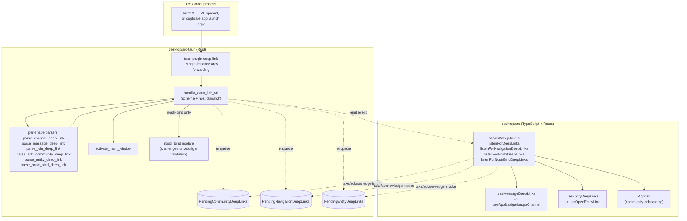

# Desktop deep links: component view

This node decomposes one component inside the `architecture-containers-desktop`
container: the OS-level `buzz://` deep-link mechanism -- how a link opened outside
the app (from a browser, another app, or a duplicate app launch) reaches the running
Tauri app, gets parsed and validated, and is routed to the right piece of frontend
state. It answers "what actually happens between a user clicking a `buzz://` link and
the desktop app reacting to it," which `architecture-containers-desktop`'s own single
summary paragraph on the subject does not detail.

## Notation legend

| Shape | Meaning |
|---|---|
| Rectangle | A Rust module, function, or TypeScript module inside the desktop app |
| Cylinder | A stateful queue (Tauri-managed `Mutex<VecDeque<...>>`) |
| Dashed arrow | Emits/invokes across the Tauri IPC boundary (Rust <-> TypeScript) |
| Solid arrow | A direct in-process call |

## Component diagram

## Building blocks

| Component | Responsibility | Interface | Evidence |
|---|---|---|---|
| Scheme registration | Registers `buzz` as the OS-level scheme the desktop app can be launched or focused from | `tauri.conf.json` `deep-link.desktop.schemes` config, read by the Tauri deep-link plugin at build/install time | `desktop/src-tauri/tauri.conf.json:46-50` |
| Plugin + single-instance wiring | Installs the deep-link plugin's open-URL callback; on a duplicate launch, forwards any `buzz://` argv into the same handler instead of spawning a second window | `tauri_plugin_deep_link::init()`, `tauri_plugin_single_instance::init(...)` registered on the `tauri::Builder` | `desktop/src-tauri/src/lib.rs:122-135` |
| `install_deep_link_handlers` | Registers the plugin's `on_open_url` callback; on Windows/Linux only, also replays a launch-time URL via `get_current()` for a cold start | Called once from app setup; takes `&mut tauri::App` | `desktop/src-tauri/src/deep_link.rs:285-306` |
| `handle_deep_link_url` | Parses the URL, enforces `buzz` scheme, dispatches by host to one of seven arms | `pub(crate) fn handle_deep_link_url(app: &AppHandle, url_str: &str)` | `desktop/src-tauri/src/deep_link.rs:594-710` |
| Per-shape parsers | Validate and normalize one URL shape each (`connect`/`join`/`add-community` relay params, path-segment `channel`, query-string `message`, allow-listed `repo/project/pr/issue`, and `nostr-bind`'s protocol fields) before anything is queued or emitted | One `parse_*(&Url) -> Option<...>` / `Result<...>` function per shape | `desktop/src-tauri/src/deep_link.rs:256-283,316-365,412-459,468-486,519-587` |
| `activate_main_window` | Best-effort unminimize/show/focus of the `"main"` webview window before a link is surfaced to the frontend | `fn activate_main_window(app: &AppHandle)`, called from six of the seven dispatch arms | `desktop/src-tauri/src/deep_link.rs:240-254` |
| `PendingCommunityDeepLinks` / `PendingNavigationDeepLinks` / `PendingEntityDeepLinks` | Managed Tauri state holding a de-duplicated FIFO queue per link category, drained via take/acknowledge commands so a torn-down listener leaves the head intact for the next one | `Mutex<VecDeque<...>>` behind `#[tauri::command]` take/acknowledge (and, for navigation, clear) functions | `desktop/src-tauri/src/deep_link.rs:20-238` |
| `nostr_bind` module (collaborator) | Validates `nostr-bind` deep-link fields (challenge id, nonce, verification code, protocol tuple, origin, expiry, callback URL) -- owned by the Nostr identity-binding flow, not this component | `nostr_bind::validate_*` functions called from `parse_nostr_bind_deep_link` | `desktop/src-tauri/src/nostr_bind.rs` |
| `shared/deep-link.ts` | Frontend bridge: drains each Rust-side queue via `invoke`, exposes `listenForDeepLinks`, `listenForNavigationDeepLinks`, `listenForEntityDeepLinks`, `listenForNostrBindDeepLinks` | Exported async functions returning a Tauri `UnlistenFn` | `desktop/src/shared/deep-link.ts:1-231,279-338` |
| `useMessageDeepLinks` / `useEntityDeepLinks` (collaborators) | React hooks that accept drained payloads and route them into the app's router (`useAppNavigation.goChannel`) or entity-link opener (`useOpenEntityLink`) | React hooks, combined by `useAppDeepLinks` and mounted in `AppShell.tsx` | `desktop/src/shared/useMessageDeepLinks.ts`, `desktop/src/shared/useEntityDeepLinks.ts`, `desktop/src/shared/useAppDeepLinks.ts`, `desktop/src/app/AppShell.tsx:669` |
| Community-link wiring in `App.tsx` (collaborator) | Consumes `listenForDeepLinks` directly (not through `useAppDeepLinks`) because community onboarding must run above the router, before any community is necessarily selected | `App.tsx`'s own effect calling `listenForDeepLinks` | `desktop/src/app/App.tsx:751` |

## Boundary

This node does not describe:
- **The desktop container's own deployment topology, bundle identity or other
  container-level concerns** -- see `architecture-containers-desktop` for those; this
  node only decomposes its deep-link mechanism.
- **External actors that open a `buzz://` link** (a browser, the relay's invite
  landing page, another instance of the app) -- that is the architecture-context
  layer, not this component-level node.
- **Class/function-internal design of any single parser or queue** -- building-block
  rows above name functions and modules only as existence/responsibility evidence,
  not as a walkthrough of their internal logic.
- **The CLI's own `buzz://message?...` consumption** (`crates/buzz-cli`) -- a
  different container's deep-link handling entirely, unrelated to this desktop
  component beyond sharing the same URL vocabulary for message links.
- **In-app rendering of `buzz://` links inside message content** (e.g. Markdown
  link rendering) -- a message-content concern, not the OS-level deep-link entry
  path this node documents.

## Relationships

- part-of: architecture-containers-desktop

## Scope and omissions

**This node covers** the desktop app's OS-level `buzz://` deep-link mechanism end to
end: scheme registration, plugin wiring (including single-instance argv forwarding
and the Windows/Linux cold-launch replay), the seven-way dispatch in
`handle_deep_link_url`, each per-shape parser, the three pending-link queues and
their take/acknowledge/clear Tauri commands, the TypeScript bridge that drains them,
and the two React hooks (plus `App.tsx`'s own listener) that route the results into
the app.

**It does not cover, and these are gaps rather than silence:**

| Not covered here | Owned by |
|---|---|
| The desktop container's deployment topology and bundle identity | `architecture-containers-desktop` |
| External actors that open a deep link (browser, relay invite page, OS shell) | A future architecture-context node, if one is written for this flow |
| The CLI's own `buzz://message` handling | `crates/buzz-cli` (a different container; not covered by any corpus node checked here) |
| The `nostr_bind` module's own validation rules in full | Out of scope; only its role as a collaborator called from `parse_nostr_bind_deep_link` is named here |
| Code/class-internal design of any parser or queue | Not attempted; C4's Code level is explicitly optional per the template this node follows |

**Expected but not verified when this node was written:**

- **Whether any corpus node yet documents the `crates/buzz-cli` deep-link consumer
  named in root `CLAUDE.md`.** `git ls-tree` of `origin/launchpad`'s corpus tree at
  the recorded revision shows no `platforms/cli` or equivalent node; this is named as
  a gap rather than linked, since no such node currently exists to point at.
- **Whether the Mermaid flowchart notation above faithfully reproduces C4's own
  component-diagram visual conventions** was not checked against a rendered
  reference -- the architecture-component template itself flags this as an open
  question for any node built from it.
