# Desktop: frontend/backend bridge (component view)

This node decomposes one internal mechanism of the **desktop container**
(`architecture-containers-desktop`): the Tauri IPC boundary that lets the
React 19 frontend and the Rust backend crate (`buzz_lib`) call into and
signal each other, both compiled into the same process and shipped as one
binary. It answers: *what actually crosses the frontend/backend boundary,
in which direction, through which mechanism, and what gate keeps something
from crossing it uninvited?*

This node was written from `launchpad/docs/corpus/templates/architecture-component.md`.
No prior node has yet been authored from that template (confirmed against
`origin/launchpad`'s corpus tree at the recorded revision), so this is the
first real-world test of its required-sections shape; see *Scope and
omissions* for where that shape ran into this bridge's actual complexity.

## Notation legend

| Shape | Meaning |
|---|---|
| Rounded box | A building block documented in this node |
| Solid arrow | Frontend → backend command call (request/response) |
| Dashed arrow | Backend → frontend event push (fire-and-forget) |
| Dotted box | Boundary enforced independently of application code (CSP, capability allowlist) |

## Component diagram

```mermaid
flowchart LR
    subgraph Frontend["Frontend (desktop/src)"]
        UI["React components / hooks"]
        DomainAPI["Domain API modules\n(shared/api/tauri*.ts)"]
        InvokeWrap["invokeTauri()\n(shared/api/tauri.ts)"]
        Listeners["listen() callbacks\n(@tauri-apps/api/event)"]
        MockBridge["E2E mock bridge\n(testing/e2eBridge.ts)"]
    end

    subgraph Transport["Transport (webview-enforced)"]
        CSP[["CSP connect-src: ipc:"]]
        Caps[["capabilities/default.json\npermission allowlist"]]
    end

    subgraph Backend["Backend (desktop/src-tauri/src)"]
        Handler["invoke_handler!\ncommand dispatch (lib.rs)"]
        Cmd["#[tauri::command] fn\n-> Result<T, String>"]
        State["AppState\n(app_state.rs)"]
        Emit["AppHandle::emit(event, payload)"]
    end

    UI --> DomainAPI --> InvokeWrap
    InvokeWrap -. real build .-> CSP --> Caps --> Handler
    MockBridge -. e2e build only .-> UI
    Handler --> Cmd
    Cmd <--> State
    Cmd -- "Result<T, String>" --> InvokeWrap
    Emit -. dashed: event push .-> Listeners
    State -.-> Emit
```

## Building blocks

| Component | Responsibility | Interface | Evidence |
|---|---|---|---|
| `invoke_handler!` registration | Backend-side allowlist of every callable command; maps a command-name string to its Rust function | `tauri::generate_handler![...]`, one macro invocation | `desktop/src-tauri/src/lib.rs:519-863` |
| `#[tauri::command]` handler functions | One request/response operation each; reads/mutates `AppState`, returns `Result<T, String>` | Plain async fn per command, snake_case top-level params (auto camelCase-converted from the frontend call) | `desktop/src-tauri/src/commands/profile.rs:337-341`, `desktop/src-tauri/src/commands/channels.rs:510` |
| `AppState` | Process-lifetime shared state (identity keys, HTTP clients, managed-agent process table, huddle state, `AppHandle`) injected into every command via `State<'_, AppState>` | Struct of `Mutex`/`Atomic*`/`Arc` fields | `desktop/src-tauri/src/app_state.rs:19-133` |
| `invokeTauri<T>()` wrapper | Sole frontend call site of `@tauri-apps/api/core`'s `invoke`; normalizes rejections to `TauriInvokeError` and triggers the shared rate-limit gate on relay 429s | `invokeTauri(command: string, args?: Record<string, unknown>): Promise<T>` | `desktop/src/shared/api/tauri.ts:296-309`, `:249-282` |
| Domain API modules (`shared/api/tauri*.ts`) | Per-feature-area façade over `invokeTauri`; owns Raw*↔domain-type field mapping (snake_case wire ↔ camelCase domain) | One exported async function per command, one module per feature area | `desktop/src/shared/api/tauriEvents.ts:1-14` |
| Backend→frontend event channel | Fire-and-forget state push independent of any command's return value | `AppHandle::emit(name, payload)` (Rust) ↔ `listen(name, cb)` / `emit(name, payload)` (`@tauri-apps/api/event`, frontend) | `desktop/src-tauri/src/huddle/state.rs:540-544`, `desktop/src/features/huddle/components/HuddleIndicator.tsx:204` |
| Capability allowlist | Restricts which Tauri core/plugin permissions (not commands — see *Boundary*) the `main`/`huddle-*` webviews may invoke at all | `desktop/src-tauri/capabilities/default.json` | `desktop/src-tauri/capabilities/default.json:1-31` |
| CSP `connect-src: ipc:` grant | Transport-level permission for the IPC channel itself, enforced by the webview independently of the capability allowlist | `tauri.conf.json`'s `security.csp` | `desktop/src-tauri/tauri.conf.json:39` |
| E2E mock bridge | Replaces `window.__TAURI_INTERNALS__` (including `invoke`) in E2E builds so specs exercise the same command/event contract without a real backend process | `desktop/src/testing/e2eBridge.ts`, installed by `main.tsx`'s `installE2eBridgeIfConfigured` | `desktop/src/testing/e2eBridge.ts:14604-14611`, `desktop/src/main.tsx:111-132` |

## Boundary

This node does not describe:
- The desktop container's own deployment topology, release lane, or its
  outbound interfaces to the relay and managed-agent subprocesses — see
  `architecture-containers-desktop` for those.
- External actors (human owner, relay operator) — see the architecture-context
  layer, not yet instantiated in this corpus.
- Any individual command's business logic (channels, messages, identity,
  agents, media, etc.) — each is its own future corpus node; this node
  documents the mechanism they are all built on, not what any one of them
  does.
- Whether the `capabilities/default.json` allowlist or the `invoke_handler!`
  registration is the "real" gate: they are **both** enforced, independently
  — a command absent from `invoke_handler!` cannot be dispatched at all, and
  a plugin/core API absent from the capability file is refused by Tauri's
  permission layer even if a command tried to use it internally. This node
  treats them as two separate boundary components (see the building-block
  table) rather than collapsing them into one.

## Relationships

- part-of: architecture-containers-desktop

## Scope and omissions

**This node covers** the mechanism by which the desktop frontend and backend
processes call into and signal each other: the command registration and
dispatch path, the shared `AppState` every command reaches through, the
frontend-side `invokeTauri` wrapper and its per-feature domain modules, the
wire-format case-conversion behavior (and its one identified inconsistency),
the backend→frontend event-push channel, the two independently-enforced
access boundaries (capability allowlist, CSP transport grant), and the E2E
mock substitute for the whole bridge.

**It does not cover, and these are gaps rather than silence:**

| Not covered here | Owned by |
|---|---|
| Any individual command's business logic or domain data model | A future per-feature corpus node (channels, messages, identity, agents, media, etc. — none yet exist in the merged corpus) |
| The desktop container's deployment, release lane, and outbound relay/subprocess interfaces | `architecture-containers-desktop` |
| The mesh-llm feature-gated commands' own coordination protocol | Out of scope per `architecture-containers-desktop`'s own stated boundary; this node only counted them among the 336 registered commands, did not inspect their internals |
| The React frontend's component/feature architecture beyond its API-layer call sites | Not yet owned by any merged corpus node |
| Whether `#[serde(rename_all = "camelCase")]`'s inconsistent use across command-argument structs should be standardized | An implementation decision, not a documentation task; out of scope per issue #1241's own "Out of scope" section |

**Expected but not verified when this node was written:**

- **Not every one of the 336 registered commands was individually read.** The
  building-block table's claims rest on a representative sample
  (`get_presence`, `archive_channel`, `get_thread_replies`) plus the
  mechanical count of registered entries; a command whose signature departs
  from the `State<'_, AppState>` / `Result<T, String>` pattern observed in
  the sample would not have been caught.
- **The full population of `AppHandle::emit` call sites was counted by a
  structural grep, not read individually.** The `huddle-state-changed`
  pairing was verified end-to-end (backend emit, two independent frontend
  listeners); the other 48 emit sites were not each traced to a confirmed
  frontend listener.
- **Whether `type: platforms` is this corpus's eventual settled convention**
  for the `platforms/desktop/*` batch (as opposed to `type: architecture`,
  which the template this node borrows its shape from directs toward) is
  recorded here as an `INFERENCE`, not resolved — see this node's own
  evidence ledger.
- **The capability allowlist's completeness was not cross-checked against
  every command's own internal use of Tauri plugin APIs** — this node
  confirms the allowlist exists and is scoped to specific windows and
  permissions, not that every command's actual runtime behavior stays
  within it.
