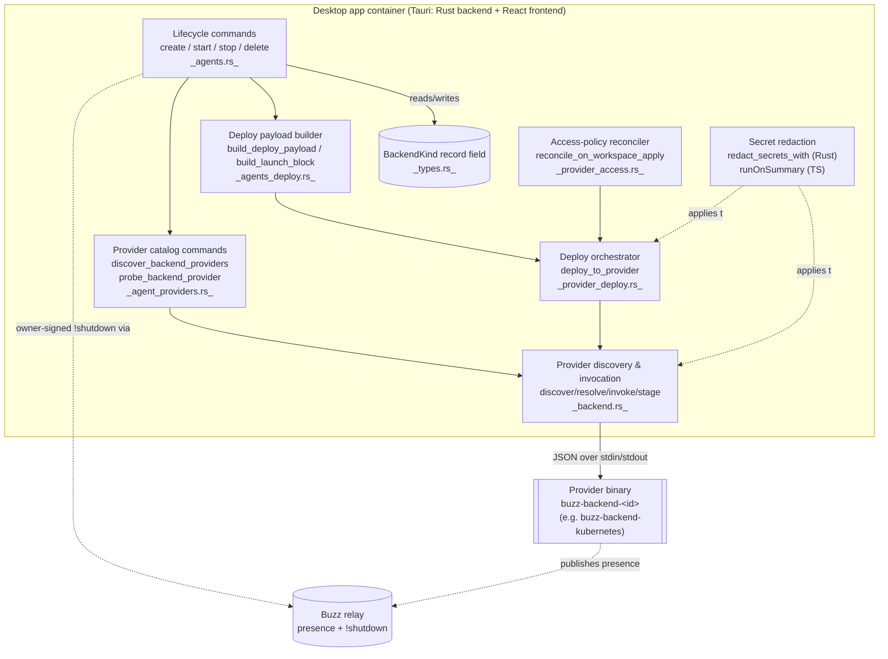

# Desktop: remote agent management (component view)

This node decomposes the `architecture-containers-desktop` container's
**remote** managed-agent surface: the code path exercised when a managed
agent's `backend` is `BackendKind::Provider { id, config }` rather than
`BackendKind::Local`. It answers "what inside the desktop app turns a saved
provider-backed agent definition into a running remote deployment, and back
into a stopped/deleted one?" Local spawn (`BackendKind::Local`) is sibling
issue #1242's subject and is named here only where a code path branches on
`BackendKind` and both arms live in the same function.

## Notation legend

| Shape | Meaning |
|---|---|
| Rounded rectangle | A component inside the desktop container (Rust unless marked TS) |
| Cylinder | A persisted or external data boundary the component reads/writes |
| Double-bordered rectangle | An external process/container outside this component diagram's boundary |
| Solid arrow | A direct call or data flow |
| Dashed arrow | A cross-cutting concern applied by the source to the target (e.g. redaction) |

## Component diagram

## Building blocks

| Component | Responsibility | Interface | Evidence |
|---|---|---|---|
| Backend discriminator (`BackendKind`) | Records whether an agent is spawned locally or deployed to a named provider with an opaque config blob | `enum BackendKind { Local, Provider { id, config } }` field on `ManagedAgentRecord.backend` | `desktop/src-tauri/src/managed_agents/types.rs:6-13` |
| Provider discovery & invocation | Finds `buzz-backend-*` binaries on PATH without executing them, re-validates an id before resolving it to a path, stages a hashed read-only copy, and runs the JSON-over-stdio provider protocol (`info`, `deploy`) with output caps and a timeout | `discover_provider_candidates`, `resolve_provider_binary`, `invoke_provider`, `provider_deploy`, `validate_provider_config` | `desktop/src-tauri/src/managed_agents/backend.rs:593-638,650-677,75-288,436-533,536-566` |
| Provider catalog commands | Tauri-command surface the frontend uses to list discovered providers and probe one's self-reported `info` before the user configures it | `discover_backend_providers`, `probe_backend_provider` | `desktop/src-tauri/src/commands/agent_providers.rs:4-46` |
| Deploy payload builder | Resolves the same effective config local spawn uses (model/provider/prompt/harness/parallelism), refuses relay-mesh agents, and serializes the portable `launch` block (command, args, layered env, policy_env, owner_pubkey) | `build_deploy_payload`, `build_launch_block`, `ensure_remote_provider_supported`, `deploy_payload_json` | `desktop/src-tauri/src/commands/agents_deploy.rs:49-266` |
| Deploy orchestrator | Serializes concurrent deploys per agent, rebuilds the payload from the live record after acquiring the lock, and asserts any caller-captured tenant scope against that rebuilt payload before invoking the provider | `deploy_to_provider`, `assert_payload_scope`, `apply_deploy_result` | `desktop/src-tauri/src/commands/agents/provider_deploy.rs:35-196` |
| Access-policy reconciler | Selects provider-backed, already-deployed agents needing an access-policy redeploy (owner-only build or pending policy) and redeploys them on every workspace apply, failing the apply closed on rejection | `needs_reconciliation_with_policy`, `reconcile_on_workspace_apply` | `desktop/src-tauri/src/commands/agents/provider_access.rs:14-113`; call site `desktop/src-tauri/src/commands/workspace.rs:264` |
| Lifecycle command branching | Branches every create/start/stop/delete on `BackendKind`: caches the provider binary path and optionally deploys inline at create, routes start through the provider path, refuses local `stop` for remote agents (stopped via signed `!shutdown` instead), and refuses `delete` of a deployed remote agent without explicit confirmation | `create_managed_agent`, `start_managed_agent`, `stop_managed_agent`, `delete_managed_agent` | `desktop/src-tauri/src/commands/agents.rs:380,515,801-802,860,1039,1069,1092,1128` |
| Secret redaction | One word-split/secret-word definition shared (by convention, not by shared code) between the Rust diagnostic path and the frontend's saved-config display, so a provider's stderr/error text and a screenshot of a saved config redact the same shapes | `redact_secrets_with` (Rust), `runOnSummary.ts`'s `SECRET_WORDS`/`splitConfigKey` (TS) | `desktop/src-tauri/src/managed_agents/backend.rs:345-390`; `desktop/src/features/agents/ui/runOnSummary.ts:36-45,59-66` |

## Boundary

This node does not describe:

- **Local agent management** (`BackendKind::Local`'s own spawn, readiness and
  process-lifecycle machinery) — sibling issue #1242's subject. It is named
  above only where a single function branches on both `BackendKind` arms.
- **The desktop container's own deployment topology or bundling** (Tauri
  bundle config, externalBin list as a whole, the app's other features) —
  see the `architecture-containers-desktop` node for that.
- **External actors talking to the system from outside** (the human owner,
  the relay operator) — no architecture-context node exists yet for this
  container; when one does, it — not this node — names those actors.
- **The buzz-acp harness's own internals** (ACP wire protocol, session pool,
  shutdown/reap timing) — `architecture-containers-agent-runtime` and
  `crates/buzz-acp`'s own documentation own that, including the shutdown-
  timing gap `docs/remote-agents.md`'s Stop-and-Delete section documents as a
  Known Defect against the harness, not against anything in this component
  diagram.
- **The provider protocol's wire schema and stated invariants in full** —
  `docs/remote-agents.md` is authoritative; this node cites the sections that
  place its own building blocks rather than restating the spec.
- **`buzz-backend-kubernetes`'s own internals** (cluster auth, pod shape,
  image resolution, garbage collection) — a separate binary/crate this
  component invokes as an opaque subprocess over the provider protocol, not
  a building block of the desktop container. No corpus node documents that
  crate yet; see *Scope and omissions*.

## Relationships

- `part-of`: `architecture-containers-desktop` — this node decomposes that
  container's remote managed-agent surface.
- `depends-on`: `architecture-containers-agent-runtime` — the `launch` block
  this component's deploy payload builder emits is only meaningful because
  that container's harness (`buzz-acp`) reads it the way `docs/remote-
  agents.md`'s Implementation Correspondence table assumes; a drift in that
  harness contract would invalidate claims in this node's building-block
  table without any code in this node itself changing.

## Scope and omissions

**This node covers** the desktop-side components that turn a `BackendKind::
Provider`-backed managed-agent record into a deployed, access-policy-
enforced, stoppable/deletable remote agent: the backend discriminator,
provider discovery/invocation/redaction, deploy-payload construction, deploy
orchestration under a tenant-scope guard, access-policy reconciliation on
workspace apply, and the lifecycle-command branching that ties them together.

**It does not cover, and these are gaps rather than silence:**

| Not covered here | Owned by |
|---|---|
| `BackendKind::Local` spawn/readiness/process-lifecycle | Issue #1242 (local agent management), not filed as a corpus node at time of writing |
| The desktop container's full deployment/bundling picture | `architecture-containers-desktop` |
| The ACP harness's internal protocol, pool and shutdown mechanics | `architecture-containers-agent-runtime`, `crates/buzz-acp` |
| The provider protocol's wire schema, five invariants, and conformance levels in full | `docs/remote-agents.md` |
| `buzz-backend-kubernetes`'s own internals (cluster auth, pod shape, image, GC) | No corpus node yet; a candidate for a future component- or container-level task, not folded in here |
| An architecture-context node naming the human owner / relay operator as external actors | Not yet drafted for this container |

**Expected but not verified when this node was written:**

- **Whether the pre-secret negotiation gate (`info` before `deploy` on one
  staged, hashed copy) matches `docs/remote-agents.md`'s own description of
  itself.** The spec's Implementation Correspondence table marks that row
  "*to be added*" (citing its own Known Defect 5), while the `backend.rs`
  source read for this node already implements exactly that sequence
  (`provider_deploy` at `backend.rs:509-533` calls `stage_provider`, then
  `info`, then `deploy` on the staged path). This node treats the code as
  ground truth for its own FACT claims and flags the discrepancy rather than
  resolving it — it may mean the spec table is stale, or that "to be added"
  refers to a narrower sub-requirement (an explicit protocol-version pinning
  test, say) than the sequencing itself.
- **Whether any provider binary besides `buzz-backend-kubernetes` exists or
  is planned.** Only one `buzz-backend-*` binary was found in this repository
  at the recorded revision; the protocol and this node's components are
  written to be provider-agnostic, but that genericity is untested against a
  second implementation.
- **The exact runtime behavior of `reconcile_on_workspace_apply` failing a
  workspace apply closed** (what the user sees, whether the workspace remains
  usable) was read from source, not exercised end-to-end in a running app.
