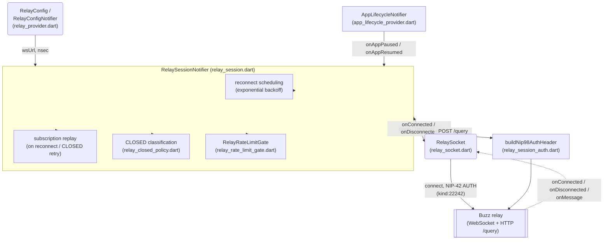

# Mobile relay connection: component view

This node decomposes one part of the `architecture-containers-mobile`
container: the WebSocket connection the mobile app maintains to its active
community's Buzz relay -- how it connects, authenticates, reconnects, and
recovers from back-pressure and subscription failures. It answers the
question "how does the mobile app actually stay connected to its relay, and
what happens when that connection breaks?" It does not describe the app's
lifecycle-transition policy (when to pause/resume the connection based on
foreground/background state) -- see *Boundary* below.

No `platforms`-specific corpus template exists yet at the recorded revision
(see the `TEAM_KNOWLEDGE` evidence entry above). This node's shape borrows
the *required sections* of the merged `architecture-component.md` template
(C4 Component diagram + arc42 §5 Building Block View), substituting
`type: platforms` for that template's own `type: architecture`, per this
Feature's settled convention for documents under `platforms/**`.

## Notation legend

| Shape | Meaning |
|---|---|
| Rounded box | A building block documented in this node |
| Rectangle | An external system or a collaborator outside this node's scope |
| Solid arrow | Direct call / data flow |
| Dashed arrow | Callback / event notification |

## Component diagram

## Building blocks

| Component | Responsibility | Interface | Evidence |
|---|---|---|---|
| `RelaySocket` | Owns the raw WebSocket lifecycle: connect, NIP-42 (kind:22242) challenge/response auth, send/receive JSON frames, disconnect. Explicitly does not reconnect. | `connect()`, `send(payload)`, `disconnect()`, `dispose()`, plus `onMessage`/`onConnected`/`onDisconnected` callbacks supplied by its owner | `mobile/lib/shared/relay/relay_socket.dart` |
| `RelaySessionNotifier` | Orchestrates the session: owns the current `RelaySocket`, decides when to (re)connect, replays live subscriptions after an outage, tracks pending publishes/history requests, and exposes the app-facing `SessionState`. | `queryRelay`, `fetchHistory`, `subscribe`/`subscribeWithStatus`, `publish`, `reconnect()`, `onAppPaused()`/`onAppResumed()`; state via `relaySessionProvider` | `mobile/lib/shared/relay/relay_session.dart` |
| `RelayConfig` / `RelayConfigNotifier` | Derives the WebSocket URL and HTTP base URL the session connects to, from the active `Community` (or a compile-time `Env.relayUrl` fallback), canonicalizing `ws(s)`/`http(s)` schemes. | `relayConfigProvider` (Riverpod), `RelayConfig.wsUrl`/`baseUrl` | `mobile/lib/shared/relay/relay_provider.dart` |
| CLOSED classification (`classifyRelayClosed`, `parseRateLimitRetrySeconds`) | Classifies a relay `CLOSED` message as retryable, rate-limited, or terminal, and extracts a `retry in Ns` hint when present, so `RelaySessionNotifier` knows whether and how long to back off a given subscription. | `classifyRelayClosed(message)`, `parseRateLimitRetrySeconds(message)` | `mobile/lib/shared/relay/relay_closed_policy.dart` |
| `RelayRateLimitGate` | Session-owned back-pressure gate: activates a window when the relay signals rate-limiting, never shrinks an active window, and lets callers `await wait()` before sending further REQ/query traffic. | `activate(retryInSeconds)`, `wait()`, `isActive`, `remainingMs()`, `reset()` | `mobile/lib/shared/relay/relay_rate_limit_gate.dart` |
| `buildNip98AuthHeader` | Builds the NIP-98-style (kind:27235) `Authorization` header for the one-shot HTTP `/query` bridge -- a separate auth mechanism from the WebSocket's NIP-42 AUTH. | `buildNip98AuthHeader({method, url, bodyBytes, nsec})` | `mobile/lib/shared/relay/relay_session_auth.dart` |

## Boundary

This node does not describe:
- The mobile container's own deployment topology, ownership boundary, or its
  other subsystems (media upload/download, deep links, crypto, community
  storage) -- see the `architecture-containers-mobile` node for the
  container as a whole.
- App-lifecycle-transition behavior itself: which `AppLifecycleState`
  transitions map to which of `RelaySessionNotifier`'s public calls, and any
  policy around when the app chooses to pause or resume the connection. That
  is `AppLifecycleNotifier`'s own logic and is sibling task
  `launchpad-26/buzz#1253`'s scope (`platforms/mobile/application-lifecycle.md`),
  not this node's.
- Class/function-level design beyond the public interface named in the table
  above -- e.g. `RelaySessionNotifier`'s internal buffering/dedup fields are
  implementation detail, not a claim this node makes about the component's
  responsibility or interface.
- The wire-level Nostr event/filter model (`NostrEvent`, `NostrFilter`,
  `EventKind`) beyond the two kind numbers (`22242`, `27235`) this node's
  claims depend on directly.
- The relay-side implementation of NIP-42 auth, rate limiting, or the
  `/query` HTTP bridge -- owned by `buzz-relay`/`buzz-core` in this
  repository, not this container.

## Relationships

- part-of: architecture-containers-mobile

## Scope and omissions

**This node covers** the mobile app's own relay WebSocket connection
component: how `RelaySocket` connects and performs NIP-42 authentication, how
`RelaySessionNotifier` owns reconnection (exponential backoff, subscription
replay), how a relay `CLOSED` message is classified and retried per
subscription, how `RelayRateLimitGate` gates outbound traffic during
back-pressure, how `RelayConfig` derives the connection target, and how the
one-shot HTTP query bridge authenticates separately via NIP-98.

**It does not cover, and these are gaps rather than silence:**

| Not covered here | Owned by |
|---|---|
| App-lifecycle-transition policy (foreground/background → connect/disconnect decisions) | `launchpad-26/buzz#1253` (`platforms/mobile/application-lifecycle.md`, not yet authored at this revision) |
| The mobile container as a whole (technology, deployment, other subsystems) | `architecture-containers-mobile` (this node's `part-of` target) |
| Media upload/download, deep links, crypto, community storage | Other `platforms/mobile/*` sibling tasks under Feature `#614`, not yet all filed/authored at this revision |
| The front-matter contract itself | `launchpad/docs/corpus/schema/node.schema.json` |
| Creating, updating and retiring any corpus node procedurally | `launchpad/docs/corpus/AGENTS.md` |
| The relay-side (server) implementation of NIP-42 auth and rate limiting | `buzz-relay`/`buzz-core` (not a `platforms/mobile` concern) |

**Expected but not verified when this node was written:**

- The five test files cited above were confirmed to exist by directory
  listing but not read in full; this node describes what the production code
  does, not how completely the test suite exercises it.
- `buzz-relay`'s own NIP-42/rate-limit implementation was not opened -- the
  claims here describe only the mobile client's side of the protocol, which
  is this node's stated scope, not a verification that the two sides agree
  on every edge case (e.g. the exact set of `CLOSED` message prefixes the
  relay actually sends).
- Whether Mermaid's flowchart notation faithfully reproduces C4's own
  component-diagram visual conventions was not checked against a rendered
  C4 reference example; this is the same open item the
  `architecture-component.md` template itself flags for any node built from
  its shape.
