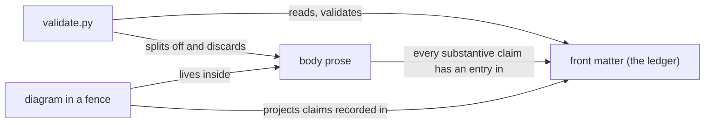

# Diagrams in corpus nodes

## 1. What this standard governs

Whether a corpus node carries a diagram, what form that diagram may take, what
evidence it owes, and how it stays honest as the thing it depicts changes.

It governs diagrams **inside a hand-authored corpus node** — that is, inside a
Markdown file under `launchpad/docs/corpus/`. Diagrams elsewhere in this repository
are not its business.

Look up the section you need. This is reference material for whoever authors a node
and for the reviewer who, as section 7 explains, is the only enforcement a diagram has.

## 2. Authority and scope

**This standard duplicates none of the following. Where it and one of them disagree,
they win and this document has drifted.**

| For | Read |
|---|---|
| Why Markdown with front matter is the one canonical authored form | `launchpad/decisions/ADR-0028-corpus-canonical-representation.md` |
| The front-matter contract, including the `evidence` ledger's shape | `launchpad/docs/corpus/schema/node.schema.json` |
| Prose explanation of those fields | `launchpad/docs/corpus/schema/README.md` |
| Relationship types and their directionality | `launchpad/docs/corpus/schema/relationships.schema.json` |
| How to rank conflicting evidence, and when to stop | `launchpad/decisions/ADR-0029-corpus-evidence-precedence.md` |
| The citation shapes | `launchpad/project-intelligence/CONTRACT.md` §3 |
| What the checker actually enforces | `launchpad/project-intelligence/corpus/validate.py` |

Where this document states a rule that none of those establish, it says so in place and
names its own authority, which is issue #1312's definition of done. A standard is
allowed to decide things; it is not allowed to attribute its decisions to a source that
did not make them.

**Not covered here, and these are gaps rather than silence:**

| Not covered | Owned by |
|---|---|
| How a generated artifact proves its provenance, and the exception process for one | #1316 |
| The evidence standard as a whole — classes, citation shapes, ledger composition | #1314 |
| What a recorded revision means, and when it moves | #1321 |
| Node classification and taxonomy — which kinds of node exist | #1324 |
| Linking between nodes as a general subject | #1318 |
| Automated staleness detection for corpus nodes | #556 |

## 3. What form a diagram takes

**MUST** — a diagram in a corpus node is **diagram-as-text inside a fenced code block
in the Markdown body**. There is no other legal form today.

**MUST NOT** — do not add an image file under the corpus root. Not a `.png`, not an
`.svg`, not any non-`.md` file, and **not one placed under a `generated/`
directory either**. This is not a style preference; the check fails closed, in both
positions:

```
$ python3 launchpad/project-intelligence/corpus/validate.py --root <a corpus with images>
FAIL  generated/arch.png: generated artifact whose provenance and reproducibility
      cannot be established -- no corpus generator exists yet to reproduce it from
      canonical Markdown (ADR-0028); see #1316
FAIL  topology.svg: non-.md file outside generated/ -- misplaced generated
      artifact, or hand-authored content in the wrong format
FAIL  2 corpus validation error(s)
```

The `generated/` case is the surprising one and worth understanding rather than
memorising. ADR-0028 asks two things of a derived view: that it be segregated, and that
it be reproducible from canonical Markdown. A directory name can prove the first. Nothing
can prove the second until a generator exists to regenerate from, so a file hand-written
straight into `generated/` is indistinguishable from a real projection, and the validator
refuses what it cannot establish. Making that possible is #1316's work, not this
standard's, and not something to route around locally.

**SHOULD** — prefer Mermaid for a diagram with typed nodes and labelled edges; prefer
box-drawing characters for a containment or layering picture, where the boxes *are* the
point. Both already exist in this repository — `ARCHITECTURE.md` and `README.md` carry
box-drawn component topologies, and `launchpad/Research/hardening-linux-servers.md`
carries a Mermaid flowchart — so neither is a new convention this standard is
introducing. At the recorded revision the counts are one Mermaid fence and twenty
files containing box-drawing characters, across all tracked Markdown.

**SHOULD NOT** — do not reach for a body image link (``) to an image hosted
elsewhere as a way around the rule above. **Authority: this standard.** Nothing checks a
body image link, in this repository or outside it, so an external one is content that can
change underneath a green validation run — the precise staleness that provenance exists
to catch. If the picture matters, it belongs in the node as text; if it cannot be, see
section 8.

## 4. When a node carries a diagram

A diagram is not free. Section 7 establishes that nothing checks it, which makes every
diagram a maintenance surface no tool is watching. The bar is therefore not "would a
picture be nice" but "does prose fail to carry this shape".

**SHOULD** carry a diagram when the node's subject is a **shape**: a topology, a
call or message sequence, a state machine, a containment hierarchy. These are the cases
where prose has to enumerate what a reader then has to reassemble.

**SHOULD NOT** carry one when ordered prose or a table says the same thing at
comparable length. A diagram restating a three-item list costs a surface and buys
nothing.

**MUST NOT** carry a diagram whose subject is wider than the node's own subject. One
node is one independently maintainable idea; a diagram that has to reach into two of
them is a signal that the node is describing two things, not that it needs a bigger
picture. Atomicity is **#1307's** subject and this standard defers to it — but the
diagram is often where the second idea first becomes visible, so it is worth noticing
here.

## 5. What evidence a diagram owes

This is the section with a genuinely open question in it, so the reasoning is shown
rather than just the rule.

A diagram that draws an edge between two components asserts a relationship. Under the
front-matter contract, the `evidence` array is the node's provenance ledger and carries
one entry per claim. A diagram's edges are claims. So the ledger has to account for them
somehow — but a diagram lives in the body, and **the body is discarded before anything
is checked**: a node is parsed by splitting its leading front matter from the remainder,
and only the front matter is returned. Measured, on a node whose body carried a fenced
diagram asserting a wholly invented topology *and* a Markdown link to a file that does
not exist:

```
PASS  corpus validation clean
```

A diagram therefore cannot be cited, classified, or verified as a diagram. Whatever rule
this standard picks, no tool will hold it.

**The rule.**

- **MUST** — every relationship a diagram asserts is **already asserted in the node's
  prose by a claim that carries its own ledger entry**. A diagram projects the ledger; it
  never extends it.
- **MUST NOT** — a diagram is never the only place a claim appears.
- A diagram **does not get a ledger entry for being a diagram.** It gets none of its own,
  because it contributes no claim of its own.

**How a reviewer checks it, and how an author checks their own work:** take each edge in
turn and name the ledger entry that backs it. An edge with no entry is one of two things
— a claim that was never sourced, or an edge that should not be drawn. Both are fixed by
the author, and neither is visible to CI.

**The alternative that was rejected, and why.** The other honest reading is that each
edge is its own claim and so needs its own ledger entry. It was rejected on two grounds.
It invents a granularity the schema does not describe — the schema says one entry per
claim and gives diagrams no hook at all — and it does not survive contact with the
checker, which cannot tell the two versions apart. Between two rules neither of which is
enforced, the one worth having is the one that keeps every claim on the surface that *is*
checked. **This is a choice, not a fact.** A reviewer may reasonably prefer the other; if
the evidence standard (#1314) settles it differently, this section defers to it.

**One sharp edge.** A drawn edge between two corpus nodes is **not** a `relationships`
entry. The front-matter array is the checked one — a target naming no loaded node's id is
a hard error — while a line drawn in a fence resolves against nothing at all. If a node
genuinely depends on another, the edge belongs in front matter, and the diagram may
depict it. Drawing it instead of declaring it produces a picture of a graph the corpus
does not have. When a diagram *does* depict edges between nodes, it **SHOULD** label them
with the vocabulary in `relationships.schema.json` rather than inventing verbs, so the
picture and the front matter read as one graph.

**A worked example — this standard's own diagram.** Every edge below is backed by a
ledger entry in this node's own front matter, and the caption names which:



Reading the edges against the ledger: `validate.py` reading front matter and discarding
the body is the entry on parsing; the ledger carrying one entry per claim is the entry
citing `node.schema.json` and `CONTRACT.md`; the diagram projecting rather than extending
the ledger is the INFERENCE entry on body invisibility, at confidence 0.9. The diagram
adds nothing that is not already written above it — which is the rule demonstrating
itself.

## 6. Keeping a diagram honest

A diagram drifts from its subject silently. Nothing detects it, and no citation form
helps: a position citation would be the obvious anchor, and positions are not checked.

- **MUST** — cite **bare repository-relative paths** for the sources a diagram's edges
  rest on. A bare path is opened on disk and must resolve to a real file inside the
  repository, so it is one of the few citation forms that proves anything.
- **MUST NOT** — anchor a diagram with a `path:line` or `path:start-end` citation. The
  path is checked; the line number is never compared against the file's length, so a
  position that has silently drifted looks precise while being wrong. Tracked as
  **#1459**.
- **MUST** — when a diagram changes, update the ledger entries it projects **in the same
  edit**, and re-check them against their sources. A claim whose source moved is not
  still a FACT because it used to be.
- **SHOULD NOT** — draw a value into a diagram that changes more often than the node
  does: counts, version numbers, port numbers, timeouts. **Authority: this standard.**
  Those belong in prose beside a citation, where a reader can see what they were checked
  against.

**Why bare paths, concretely.** Once every source behind a diagram is a bare path in the
ledger, `git diff --name-only <the node's recorded revision> -- <those paths>` is a real
staleness test: empty output means nothing the diagram rests on has moved. That test
degrades to nothing if the paths are incomplete, and it is the only staleness check
available until **#556** extends detection to corpus nodes.

## 7. Enforcement, and what no check can see

| Surface | What checks it |
|---|---|
| An image file anywhere under the corpus root | `validate.py`, hard error, both inside and outside `generated/` |
| A diagram's syntax, in any fence language | nothing |
| Whether a diagram's edges are true | nothing |
| Whether a diagram's edges are backed by ledger entries | nothing |
| Whether a diagram still matches what it depicts | nothing |

The same command runs locally and in CI, on pull requests and on pushes to `launchpad`,
for changes under `launchpad/docs/corpus/`. A local failure is a CI failure — and, for
everything in the second column above, a local pass is not a check.

So **enforcement of this standard is human review of the pull-request diff.** That is not
a weakness peculiar to diagrams: it is the mechanism ADR-0028 chose for the corpus as a
whole, whose deciding factor was that the authored form must be something a human
reviewer can read comfortably in a PR diff. Diagram-as-text keeps a diagram inside that
mechanism, because every edge it asserts appears in the diff as text. An image would
leave it.

**Reviewer checklist**, since the reviewer is the check:

1. Every edge traces to a ledger entry (section 5).
2. No claim appears only in the diagram.
3. No `path:line` citation anchors it (section 6).
4. Edges between corpus nodes are declared in `relationships`, not merely drawn.

## 8. Exceptions and escalation

**An image that genuinely cannot be expressed as text.** There is no local exception, and
none can be granted here — the validator fails closed and the contract that would permit
one is #1316's to define. Do one of: express the picture as text; keep the asset outside
the corpus and describe in prose what it shows; or, if the node truly cannot be written
without it, say so in the node's scope section and raise it on **#1316** so the
generated-artifact contract is written with that case in view. Do not commit the file and
do not route around the check.

**Two authorities disagree about an edge.** If two sources with authority over the *same*
claim type contradict each other about a relationship the diagram would show, **do not
draw it**. Record the contradiction and leave the node flagged for a human rather than
picking a side; ADR-0029 is the full rule and this standard adds nothing to it.

**A rule in this document is wrong for a particular node.** Deviating quietly is the one
response that is not available, because nothing will surface it. State the deviation and
its reason in that node's own scope section, and file an issue against **#605** naming
the node and the rule. A standard that cannot be argued with becomes a standard people
work around silently.

## 9. Scope, omissions, and what was not verified

**This document covers** whether a corpus node carries a diagram, what form it may take,
what evidence obligations it carries, how it is kept honest, what enforces it, and how to
raise an exception. Section 2 names what it does not cover and who owns each of those.

**No `relationships` in this node's front matter.** The reason is merge order, not an
empty corpus. `corpus-agents` is loadable from the branch this node was authored on and
is **absent from `origin/launchpad`**, the branch it merges into; the checker loads
whatever is present where it runs, so an edge to it would validate here and be a hard
error in CI. The edges this node wants — to the evidence standard, to generated content,
to atomicity — are all to nodes that do not exist yet. Adding them is a later pass.

**`audiences` omits `developer`, deliberately.** This node addresses whoever authors a
corpus node and the reviewer who is its only enforcement. Whether a human developer
authoring a node is a distinct audience with distinct needs is genuinely unsettled across
the corpus standards, and asserting it here would claim an audience whose workflow this
document has not been written for. If that is wrong, it is a one-line fix and worth
raising.

**`AGENTS.md` is cited nowhere, deliberately.** `launchpad/docs/corpus/AGENTS.md`
governs this work, but it has not merged, and a bare-path citation to it resolves on this
branch and hard-fails on `launchpad` — the failure mode **#1473** records against a
sibling node. Every claim here is therefore sourced to a primary file that exists on the
merge target, checked one at a time with `git cat-file -e origin/launchpad:<path>` before
it was written. The cost is that rules this standard inherits from the instruction node
are cited to the schema, the ADRs and the validator instead of to the node that states
them; when `AGENTS.md` merges, those citations may be revisited.

**One FACT in this node's ledger rests only on `UNVERIFIED` citations that are not
commit references.** The entry recording the measured diagram-as-text counts cites two
tool results, which the checker recognises and cannot open. It is disclosed here because
a reviewer holds that convention, no check does, and a reader should see the choice
rather than discover it: the counts are a direct observation, which makes `FACT` the
honest class — `TEAM_KNOWLEDGE` would attribute to a person who does not exist and
`INFERENCE` would dress an observation as reasoning — and the shape is one CONTRACT.md
§3 enumerates. The reviewer's signal named for commit-only FACTs is a **second**
commit-only entry; this node has exactly one, the revision.

**How to check this node's recorded revision.** Run
`git diff --name-only ebe2daf721c7d7a96fdd84eba0a0a5d37eefa109 -- <the bare paths in the
ledger>`. Empty output means no cited source has moved since the revision was recorded.
Do not take that on this document's word — the command is the check.

**Expected but not verified when this node was written:**

- **Nothing establishes that a Mermaid fence renders for any consumer of this corpus.**
  No CI step, configuration, or statement in the tree says so. The single existing fence
  proves the convention is used here, not that anything draws it. Section 3's preference
  for Mermaid therefore rests on reviewability in a diff, which is verified, and not on
  rendering, which is not.
- **The rendering capability of the knowledge crate was not inspected.** ADR-0028 records
  that per ADR-0027 the crate consumes pre-rendered projections of this corpus. Whether
  those projections can carry diagram-as-text through to a reader is unknown here, and it
  is the question most likely to change section 3's preference between fence languages.
- **The image-rejection behaviour was measured with `--root` against scratch corpora, not
  against the real corpus root.** Committing an image into the branch to prove it would
  put a knowingly-invalid file in history; the `--root` form exercises the same code path
  and both messages in section 3 are its verbatim output.
