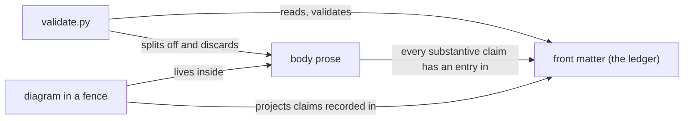

# Standard: diagrams

Whether a corpus node carries a diagram, what form that diagram may take, what evidence
it owes, and how it stays honest as the thing it depicts changes. Look up the rule you
need; this is reference material for whoever authors a node and for the reviewer who, as
*Enforcement* explains, is the only enforcement a diagram has.

## Scope and authority

**This node governs** diagrams **inside a hand-authored corpus node** — that is, inside a
Markdown file under `launchpad/docs/corpus/`: whether a node carries one, what form it may
take, what evidence obligations it carries, and how it is kept honest. Diagrams elsewhere
in this repository are not its business.

**Its authority is issue #1312's definition of done**, which requires this node to state
its scope and authority, to separate MUST requirements from SHOULD guidance, to define
enforcement and an exception process, and to link decisions rather than duplicate them.
Where this document states a rule that no other source establishes, it names its own
authority in place. A standard is allowed to decide things; it is not allowed to attribute
its decisions to a source that did not make them.

**This standard duplicates none of the following. Where it and one of them disagree, they
win and this document has drifted.**

| For | Read |
|---|---|
| Why Markdown with front matter is the one canonical authored form | `launchpad/decisions/ADR-0028-corpus-canonical-representation.md` |
| The front-matter contract, including the `evidence` ledger's shape | `launchpad/docs/corpus/schema/node.schema.json` |
| Prose explanation of those fields | `launchpad/docs/corpus/schema/README.md` |
| Relationship types and their directionality | `launchpad/docs/corpus/schema/relationships.schema.json` |
| How to rank conflicting evidence, and when to stop | `launchpad/decisions/ADR-0029-corpus-evidence-precedence.md` |
| What a standard document must itself contain | `launchpad/docs/corpus/standards/documentation-standard.md` |
| The citation shapes — but see **#1478**, which records that this file, the instruction node and the validator disagree on the forms and their count; where they differ, the validator is what runs | `launchpad/project-intelligence/CONTRACT.md` §3 |
| What the checker actually enforces | `launchpad/project-intelligence/corpus/validate.py` |

**Not covered here, and these are gaps rather than silence:**

| Not covered | Owned by |
|---|---|
| How a generated artifact proves its provenance, and the exception process for one | #1316 |
| The evidence standard as a whole — classes, citation shapes, ledger composition | #1314 |
| What a recorded revision means, and when it moves | #1321 |
| Node classification and taxonomy — which kinds of node exist | #1324 |
| Linking between nodes as a general subject | #1318 |
| Automated staleness detection for corpus nodes | #556 |

## MUST

| # | Requirement | Enforced by |
|---|---|---|
| **DG1** | A diagram in a corpus node MUST be **diagram-as-text inside a fenced code block in the Markdown body**. There is no other legal form today. | Nothing. No check reads the body. |
| **DG2** | A node MUST NOT add an image file under the corpus root — not a `.png`, not an `.svg`, not any non-`.md` file, and **not one placed under a `generated/` directory either**. | `validate.py`, hard error, both inside and outside `generated/`. |
| **DG3** | A node MUST NOT carry a diagram whose subject is wider than the node's own subject. | Nothing. Atomicity is #1307's subject and this rule defers to it. |
| **DG4** | Every relationship a diagram asserts MUST **already be asserted in the node's prose**, by a claim carrying its own ledger entry or by a rule this standard states with named authority (*Scope and authority*). A diagram projects what the node already establishes; it never extends it. | Nothing. |
| **DG5** | A diagram MUST NOT be the only place a claim appears. | Nothing. |
| **DG6** | A diagram MUST NOT carry a ledger entry for being a diagram. It gets none of its own, because it contributes no claim of its own. | Nothing. |
| **DG7** | An edge drawn between two corpus nodes MUST be declared in the front matter's `relationships` array, not merely drawn. | `validate.py` checks the front-matter array — a target naming no loaded node's id is a hard error. Nothing checks that a drawn edge was declared. |
| **DG8** | For every edge whose backing is a ledger claim (DG4's first case), that claim's own citation MUST follow the corpus-wide citation rule. A diagram adds no citation of its own; it inherits the one on the claim it projects. | `validate.py` checks the citation's form, never its correspondence to the claim. |
| **DG9** | An edge backed by a rule this standard states with named authority (DG4's second case) MUST NOT be treated as needing a citation at all. Requiring one would contradict DG4, since a self-authored rule is not evidence and has nothing to cite. | Nothing. |
| **DG10** | When a diagram changes, the ledger entries it projects MUST be updated **in the same edit** and re-checked against their sources. A claim whose source moved is not still a FACT because it used to be. | Nothing. |

## SHOULD

| # | Guidance | Enforced by |
|---|---|---|
| **DGS1** | Prefer Mermaid for a diagram with typed nodes and labelled edges; prefer box-drawing characters for a containment or layering picture, where the boxes *are* the point. | Nothing. |
| **DGS2** | Do not reach for a body image link (``) to an image hosted elsewhere as a way around DG2. **Authority: this standard.** | Nothing, in this repository or outside it. |
| **DGS3** | Carry a diagram when the node's subject is a **shape**: a topology, a call or message sequence, a state machine, a containment hierarchy. | Nothing. |
| **DGS4** | Do not carry one when ordered prose or a table says the same thing at comparable length. A diagram restating a three-item list costs a surface and buys nothing. | Nothing. |
| **DGS5** | When a diagram depicts edges between nodes, label them with the vocabulary in `relationships.schema.json` rather than inventing verbs, so the picture and the front matter read as one graph. | Nothing. |
| **DGS6** | Do not draw a value into a diagram that changes more often than the node does: counts, version numbers, port numbers, timeouts. **Authority: this standard.** Those belong in prose beside a citation, where a reader can see what they were checked against. | Nothing. |

## What form a diagram takes

**The permitted set is deliberately open, not closed.** Any fence language is legal —
` ```mermaid `, ` ```text `, an untagged ` ``` `, box-drawing characters with no
language tag, even ASCII art — because the corpus has exactly one requirement on the
form (diagram-as-text, inside a fence, in the body) and none on the dialect. This is a
choice, stated so it reads as one: closing the set to Mermaid and box-drawing alone
would contradict *Enforcement*'s own admission that nothing checks fence language, since
enforcing a closed set is precisely the enforcement that does not exist. DGS1 narrows by
*preference*, not by *permission* — an untagged code block or an unlisted fence language
still complies; it is merely not the preferred choice.

DG2 is not a style preference; the check fails closed, in both positions:

```
$ python3 launchpad/project-intelligence/corpus/validate.py --root <a corpus with images>
FAIL  generated/arch.png: generated artifact whose provenance and reproducibility
      cannot be established -- no corpus generator exists yet to reproduce it from
      canonical Markdown (ADR-0028); see #1316
FAIL  topology.svg: non-.md file outside generated/ -- misplaced generated
      artifact, or hand-authored content in the wrong format
FAIL  2 corpus validation error(s)
```

The `generated/` case is the surprising one and worth understanding rather than
memorising. ADR-0028 asks two things of a derived view: that it be segregated, and that
it be reproducible from canonical Markdown. A directory name can prove the first. Nothing
can prove the second until a generator exists to regenerate from, so a file hand-written
straight into `generated/` is indistinguishable from a real projection, and the validator
refuses what it cannot establish. Making that possible is #1316's work, not this
standard's, and not something to route around locally.

DGS1's two preferences are already established here — `ARCHITECTURE.md` and `README.md`
carry box-drawn component topologies, and `launchpad/Research/hardening-linux-servers.md`
carries a Mermaid flowchart — so neither is a new convention this standard is introducing.
At the recorded revision the counts are one Mermaid fence and twenty files containing
box-drawing characters, across all tracked Markdown.

DGS2's reason is staleness: nothing checks a body image link, so an external one is
content that can change underneath a green validation run — the precise staleness that
provenance exists to catch. If the picture matters, it belongs in the node as text; if it
cannot be, see *Exceptions and escalation*.

## When a node carries a diagram

A diagram is not free. *Enforcement* establishes that nothing checks it, which makes every
diagram a maintenance surface no tool is watching. The bar is therefore not "would a
picture be nice" but "does prose fail to carry this shape" — which is what DGS3 and DGS4
divide, and DG3 bounds.

DGS3's cases are the ones where prose has to enumerate what a reader then has to
reassemble. DG3's bound is worth stating separately from atomicity because the diagram is
often where a second idea first becomes visible: a picture that has to reach into two
nodes is a signal that the node is describing two things, not that it needs a bigger
picture.

## What evidence a diagram owes

This is the part with a genuinely open question in it, so the reasoning is shown rather
than just the rule.

A diagram that draws an edge between two components asserts a relationship. Under the
front-matter contract, the `evidence` array is the node's provenance ledger and carries
one entry per claim. A diagram's edges are claims. So the ledger has to account for them
somehow — but a diagram lives in the body, and **the body is discarded before anything
is checked**: a node is parsed by splitting its leading front matter from the remainder,
and only the front matter is returned. Measured, on a node whose body carried a fenced
diagram asserting a wholly invented topology *and* a Markdown link to a file that does
not exist:

```
PASS  corpus validation clean
```

A diagram therefore cannot be cited, classified, or verified as a diagram. Whatever rule
this standard picks, no tool will hold it. DG4, DG5 and DG6 are that rule; DG4's second
case is narrow and follows from *Scope and authority* — a self-authored rule legitimately
has no ledger entry, so an edge depicting one is backed by the rule rather than exempt
from backing.

**How a reviewer checks it, and how an author checks their own work:** take each edge in
turn and name the ledger entry that backs it. An edge with no entry is one of two things
— a claim that was never sourced, or an edge that should not be drawn. Both are fixed by
the author, and neither is visible to CI.

**The alternative that was rejected, and why.** The other honest reading is that each
edge is its own claim and so needs its own ledger entry. It was rejected on two grounds.
It invents a granularity the schema does not describe — the schema says one entry per
claim and gives diagrams no hook at all — and it does not survive contact with the
checker, which cannot tell the two versions apart. Between two rules neither of which is
enforced, the one worth having is the one that keeps every claim on the surface that *is*
checked. **This is a choice, not a fact.** A reviewer may reasonably prefer the other; if
the evidence standard (#1314) settles it differently, DG4 defers to it.

**One sharp edge**, which is why DG7 exists. A drawn edge between two corpus nodes is
**not** a `relationships` entry. The front-matter array is the checked one — a target
naming no loaded node's id is a hard error — while a line drawn in a fence resolves
against nothing at all. If a node genuinely depends on another, the edge belongs in front
matter, and the diagram may depict it. Drawing it instead of declaring it produces a
picture of a graph the corpus does not have.

**A worked example — this standard's own diagram.** Every edge below is backed by a
ledger entry in this node's own front matter, and the caption names which:



Reading all five edges against their backing, in the order drawn:

1. `CHK -> FM` "reads, validates" — the FACT entry citing `validate.py` on front-matter
   parsing.
2. `CHK -> BODY` "splits off and discards" — the same entry; it is one parse.
3. `DIA -> BODY` "lives inside" — **DG1**, a rule this standard states with named
   authority. It has no ledger entry, correctly, and this is exactly the second case
   DG4 admits.
4. `DIA -> FM` "projects claims recorded in" — the INFERENCE entry on body invisibility,
   at confidence 0.9.
5. `BODY -> FM` "every substantive claim has an entry in" — the FACT entry citing
   `node.schema.json` and `CONTRACT.md`.

The diagram adds nothing that is not already written above it — which is the rule
demonstrating itself. Edge 3 is the one worth pausing on: it is why DG4 reads "or by a
rule this standard states with named authority" rather than "a ledger entry" alone. A
standard whose own worked example failed its own rule would be evidence the rule was
wrong.

## Keeping a diagram honest

A diagram drifts from its subject silently. Nothing detects it, and no citation form
helps: a position citation would be the obvious anchor, and positions are not checked.

The citation-shape rules — prefer a bare repository-relative path, avoid `path:line`
(**#1459**), keep the ledger updated in the same edit as the body it backs — are
`AGENTS.md`'s, corpus-wide, not this standard's. DG8, DG9, DG10 and DGS6 state only the
diagram-specific application.

**Why bare paths, concretely.** Once every source behind a diagram is a bare path in the
ledger, `git diff --name-only <the node's recorded revision> -- <those paths>` is a real
staleness test: empty output means nothing the diagram rests on has moved. That test
degrades to nothing if the paths are incomplete, and it is the only staleness check
available until **#556** extends detection to corpus nodes.

## Enforcement

| Surface | What checks it |
|---|---|
| An image file anywhere under the corpus root (DG2) | `validate.py`, hard error, both inside and outside `generated/` |
| A `relationships` target naming no loaded node (DG7, declared half) | `validate.py`, hard error |
| A diagram's syntax, in any fence language (DG1) | nothing |
| Whether a diagram's edges are true | nothing |
| Whether a diagram's edges are backed by ledger entries (DG4, DG5, DG6) | nothing |
| Whether a drawn inter-node edge was also declared (DG7, drawn half) | nothing |
| Whether a diagram still matches what it depicts (DG10) | nothing |
| Every SHOULD in this standard | nothing |

The same command runs locally and in CI, on pull requests and on pushes to `launchpad`,
for changes under `launchpad/docs/corpus/`. A local failure is a CI failure.

**What a passing run does not establish.** A green validation run establishes that no
image file sits under the corpus root and that every declared relationship target
resolves. It establishes nothing else in this standard. It does not establish that a
diagram is syntactically valid, that its edges are true, that any edge is backed by a
ledger entry, that a drawn inter-node edge was declared, or that the picture still matches
what it depicts — because no check reads a node's body at all. For every row in the second
column above reading "nothing", a local pass is not a check.

So **enforcement of this standard is human review of the pull-request diff.** That is not
a weakness peculiar to diagrams: it is the mechanism ADR-0028 chose for the corpus as a
whole, whose deciding factor was that the authored form must be something a human
reviewer can read comfortably in a PR diff. Diagram-as-text keeps a diagram inside that
mechanism, because every edge it asserts appears in the diff as text. An image would
leave it.

**Reviewer checklist**, since the reviewer is the check:

1. Every edge traces to a ledger entry, or to a rule this standard states with named
   authority (DG4).
2. No claim appears only in the diagram (DG5).
3. No `path:line` citation anchors it (DG8).
4. Edges between corpus nodes are declared in `relationships`, not merely drawn (DG7).

## Exceptions and escalation

**An image that genuinely cannot be expressed as text.** There is no local exception to
DG2, and none can be granted here — the validator fails closed and the contract that would
permit one is #1316's to define. Do one of: express the picture as text; keep the asset
outside the corpus and describe in prose what it shows; or, if the node truly cannot be
written without it, say so in the node's scope section and raise it on **#1316** so the
generated-artifact contract is written with that case in view. Do not commit the file and
do not route around the check.

**Two authorities disagree about an edge.** If two sources with authority over the *same*
claim type contradict each other about a relationship the diagram would show, **do not
draw it**. Record the contradiction and leave the node flagged for a human rather than
picking a side; ADR-0029 is the full rule and this standard adds nothing to it.

**A rule in this document is wrong for a particular node.** Deviating quietly is the one
response that is not available, because nothing will surface it. State the deviation and
its reason in that node's own scope section, naming the requirement by its identifier, and
file an issue against **#605** naming the node and the rule. A standard that cannot be
argued with becomes a standard people work around silently.

**A case this standard does not cover** goes to the owner named in *Scope and authority*'s
second table if it appears there, and to **#605** otherwise.

## Scope and omissions

**This document covers** whether a corpus node carries a diagram, what form it may take,
what evidence obligations it carries, how it is kept honest, what enforces it, and how to
raise an exception. *Scope and authority* names what it does not cover and who owns each of
those.

**No `relationships` in this node's front matter.** The edges this node wants — to the
evidence standard, to generated content, to atomicity — are all to nodes that have not
merged. Declaring them is a later pass, and because the reason expires as the sibling
standards merge, the backfill is tracked as **#1489** rather than left to be noticed.

**`audiences` omits `developer`, deliberately.** This node addresses whoever authors a
corpus node and the reviewer who is its only enforcement. Whether a human developer
authoring a node is a distinct audience with distinct needs is genuinely unsettled across
the corpus standards, and asserting it here would claim an audience whose workflow this
document has not been written for. If that is wrong, it is a one-line fix and worth
raising.

**`AGENTS.md` is cited nowhere, deliberately.** `launchpad/docs/corpus/AGENTS.md` governs
this work, but every claim here is sourced to a primary file instead — the schema, the
ADRs and the validator — each checked with `git cat-file -e origin/launchpad:<path>` before
it was written. The cost is that rules this standard inherits from the instruction node
are cited to those files rather than to the node that states them; those citations are
worth revisiting in the **#1489** pass.

**One FACT in this node's ledger rests only on `UNVERIFIED` citations that are not
commit references.** The entry recording the measured diagram-as-text counts cites two
tool results, which the checker recognises and cannot open. It is disclosed here because
a reviewer holds that convention, no check does, and a reader should see the choice
rather than discover it: the counts are a direct observation, which makes `FACT` the
honest class — `TEAM_KNOWLEDGE` would attribute to a person who does not exist and
`INFERENCE` would dress an observation as reasoning — and the shape is one CONTRACT.md
§3 enumerates. The reviewer's signal named for commit-only FACTs is a **second**
commit-only entry; this node has exactly one, the revision.

**How to check this node's recorded revision.** Run
`git diff --name-only ebe2daf721c7d7a96fdd84eba0a0a5d37eefa109 -- <the bare paths in the
ledger>`. Empty output means no cited source has moved since the revision was recorded.
Do not take that on this document's word — the command is the check.

**Expected but not verified when this node was written:**

- **Nothing establishes that a Mermaid fence renders for any consumer of this corpus.**
  No CI step, configuration, or statement in the tree says so. The single existing fence
  proves the convention is used here, not that anything draws it. DGS1's preference for
  Mermaid therefore rests on reviewability in a diff, which is verified, and not on
  rendering, which is not.
- **The rendering capability of the knowledge crate was not inspected.** ADR-0028 records
  that per ADR-0027 the crate consumes pre-rendered projections of this corpus. Whether
  those projections can carry diagram-as-text through to a reader is unknown here, and it
  is the question most likely to change DGS1's preference between fence languages.
- **The image-rejection behaviour was measured with `--root` against scratch corpora, not
  against the real corpus root.** Committing an image into the branch to prove it would
  put a knowingly-invalid file in history; the `--root` form exercises the same code path
  and both messages in *What form a diagram takes* are its verbatim output.
