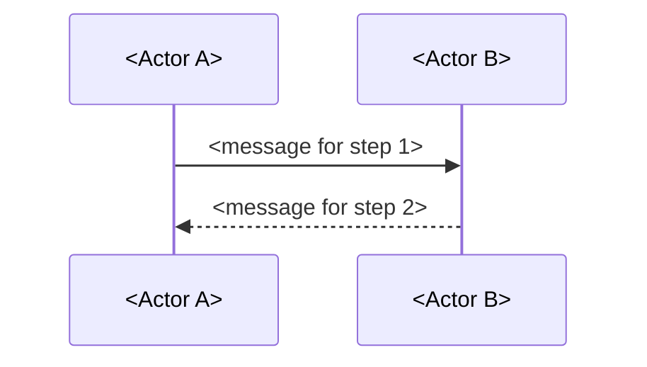

# Template: flow

How to write a corpus node documenting one **flow** -- the ordered, step-by-step path
one real interaction takes across two or more actors, components, containers or
services, grounded in a specific scenario (a handshake, a request/response, a
publish-and-fan-out) rather than in the standing structure that makes the scenario
possible. This is a template node, not a policy node -- it prescribes the shape of a
future document's *body*, not a MUST/SHOULD rule about corpus-wide behavior. See
*Note on Definition of Done* for why that distinction matters for this specific node.

## Scope and authority

**This node covers** what a corpus node's body must contain when it documents one
flow: the required sections, the evidence expectations for a step-by-step claim, and
the industry model considered (and how far each source could be verified).

**It does not cover**:
- The front-matter contract itself (`node.schema.json` governs that, unconditionally,
  for every node type) or how to create/update/retire a node procedurally
  (`AGENTS.md` governs that).
- The standing structure a flow's actors are built from -- the systems, containers
  and components a flow's steps move between. That is the architecture family's
  territory (`#1326` component, `#1327` container, `#1328` context), all three
  following the C4 model's static diagrams.
- What a capability lets a user or agent do. That is `#1329`'s territory
  (capability) -- a capability node states the "what"; a flow node narrates the
  "how" for one concrete path through it. See *Boundary* below for the exact line,
  read directly from `#1329`'s own already-drafted text.
- The boundary contract a flow's steps cross -- a CLI command group, an HTTP route
  group, a protocol surface, considered in general and durable terms independent of
  any one scenario. That is `#1342`'s territory (interface).
- The wire contract of any single Nostr event kind a flow's steps happen to use.
  That is `#1337`'s territory (event-kind).

**Its authority is derived, not original.** The structural half is already law:
`node.schema.json` enforces front matter, `validate.py` runs that schema, and CI runs
`validate.py` on every corpus change. What this node adds is the half no schema can
hold -- which sections a flow-shaped node needs, what evidence backs a step-by-step
claim, and what industry model was checked before this template's structure was
decided. That half is enforced by review, the same way the existing corpus standards
describe their own review-enforced half.

| For | Read |
|---|---|
| The front-matter contract itself | `launchpad/docs/corpus/schema/node.schema.json` |
| Prose walkthrough of those fields | `launchpad/docs/corpus/schema/README.md` |
| Relationship types and their directionality | `launchpad/docs/corpus/schema/relationships.schema.json` |
| Creating, updating and retiring a node | `launchpad/docs/corpus/AGENTS.md` |
| The standing structure a flow's actors are built from | `#1326`/`#1327`/`#1328`'s templates (architecture, not yet merged) |
| What a capability lets a user or agent do | `#1329`'s template (capability, not yet merged) |
| The boundary contract a flow's steps cross | `#1342`'s template (interface, not yet merged) |
| One event kind's own wire contract | `#1337`'s template (event-kind, not yet merged) |

If this node and any of those disagree, **they win** -- this one has drifted and
should be fixed.

## Industry model considered, and what could and could not be verified

**C4's Dynamic diagram is the closest structural fit, fully read.** Its own
documentation states it is "useful when you want to show how elements in the static
model collaborate at runtime to implement a user story, use case, feature, etc.,"
that "you can show software systems, containers, or components interacting at
runtime," and that interactions are numbered to show their order. It offers two
equivalent visual styles -- a free-form "collaboration" layout and a top-to-bottom
"sequence" layout -- and recommends the diagram be used "sparingly, to show
interesting/recurring patterns or features that require a complicated set of
interactions," which this template treats as a caution against a flow node for every
minor request/response and toward reserving flow nodes for scenarios genuinely worth
narrating step by step.

**UML's sequence diagram supplies the notation C4's own "sequence style" already
borrows from.** A UML reference site (not the formal OMG specification -- see below)
describes a sequence diagram as focusing "on the message interchange between a number
of lifelines," each lifeline "an individual participant in the interaction," read in
top-to-bottom temporal order. This is not a second, competing model: C4's own Dynamic
diagram documentation says its numbered interactions are "similar to UML
communication diagrams," and offers the sequence-style layout as visually equivalent
to a traditional UML sequence diagram. This template therefore adopts one model, not
two -- C4's Dynamic diagram, rendered in its sequence-style form -- and borrows UML
sequence-diagram vocabulary (lifeline, message, ordering) to describe that form's
elements, because C4's own documentation licenses the borrowing rather than this
template inventing a new hybrid.

**The formal OMG UML specification was not read.** The specification PDF that would
settle sequence-diagram notation authoritatively -- rather than through the
third-party reference site actually cited above -- exceeded the available fetch
tool's size limit and could not be opened. Nothing in this node's UML vocabulary
rests on the OMG text itself; it rests on the secondary reference site named in the
evidence ledger, and on C4's own explicit statement that its sequence style matches
that vocabulary. If the OMG text becomes readable later, this is the section to
revisit.

**What this template adapts, concretely.** A flow node's diagram is a Mermaid
`sequenceDiagram` block, not the same experimental Mermaid `C4Context` type
`#1328`/architecture-context already flagged as unstable for its own static
diagrams. Mermaid's `sequenceDiagram` type carries no experimental notice, is
described in its own documentation as showing "how processes operate with one
another and in what order," and uses a plain `[Actor][Arrow][Actor]:Message text`
syntax GitHub already renders in Markdown. Participants map to a flow's actors
(components, containers, services, or external systems); each numbered message maps
to one narrated step, cited to the code that actually sends or handles it.

## A note on `type`

No enum member in `node.schema.json` is named `flow`, `dynamic` or `sequence` --
confirmed directly against the schema, not assumed. Parent Feature `#602`'s own
acceptance criteria, read directly rather than taken on this node's word, likewise
name no such surface. The closest fit is `architecture`: C4's own documentation
frames the Dynamic diagram as a fourth member of the same model the
context/container/component triad already draws its static diagrams from, using the
same "static model" vocabulary and the same "elements ... interacting at runtime"
framing. `#1326`/`#1327`/`#1328` (architecture) already establish the precedent that
an *instance* node built from a C4-family template carries `type: architecture` while
the *template* node itself carries `type: governance`; this node extends that
precedent to a fourth C4 diagram type rather than inventing a new one.

**This is a judgment call, not a schema fact, and the evidence ledger marks it
`INFERENCE` accordingly (confidence 0.6).** The genuinely-considered alternative was
`interfaces-events`, since a flow's steps are, mechanically, events crossing
interfaces in sequence -- the same surface `#1342` (interface) and `#1337`
(event-kind) already claim. This template rejects that fit for the *node's own*
`type` because a flow node's subject is the runtime *order and coordination* across
possibly several interfaces and several event kinds, not any one interface's or
event kind's own durable contract -- the same distinction the *Boundary* section
below draws in prose. A flow node's body will typically `references` one or more
`interfaces-events`-typed nodes as the interfaces and event kinds it narrates a path
across, without itself being typed `interfaces-events`.

**This template node itself carries `type: governance`**, per the precedent in the
evidence ledger above, because it documents the corpus's own authoring rules -- not
because flow-shaped instance nodes in general use `governance`.

## Boundary: what this template is not

Read this section before drafting.

- **Not architecture (`#1326`/`#1327`/`#1328`, component/container/context).** Those
  three document the *standing structure* a flow's steps move between -- containers,
  components, deployment topology -- using C4's static diagrams. A flow node
  `references` the architecture node(s) whose elements it narrates a path across; it
  never re-derives their structure, and a flow node that spends most of its body
  describing what a component *is* rather than what happens between components has
  picked the wrong template.
- **Not capability (`#1329`).** Read directly from `#1329`'s own already-drafted
  text: a capability node "states that the product can do the thing; it does not
  narrate the sequence of steps a user or agent takes to do it." A flow node is the
  narration `#1329` explicitly defers to this template. A flow node may `references`
  the capability node(s) the interaction it narrates realizes, but a capability
  statement ("Git hosting exists") is not itself a flow, and a flow node restating
  that statement instead of narrating steps has picked the wrong template.
- **Not interface (`#1342`).** An interface node documents a boundary contract in
  general, durable terms -- what operations exist, what a caller may rely on --
  independent of any one scenario. A flow node narrates one particular, ordered path
  that happens to cross that boundary, and `references` the interface node(s)
  involved rather than re-describing their contract. A single flow can cross more
  than one interface (the worked example below crosses both a relay's WebSocket
  protocol surface and its internal auth-state machine), and a single interface can
  participate in more than one flow.
- **Not event-kind (`#1337`).** An event-kind node documents one Nostr `kind`
  integer's own wire contract -- its tags, its content semantics, its access model
  -- independent of any scenario that uses it. A flow node may narrate a step that
  sends an event of that kind, and cites the event-kind node for what the event
  means, but does not restate that meaning itself.
- **Not procedure (`#1345`) or runbook (`#1347`).** Both are human-executed,
  goal-oriented step lists -- `#1345` adapts Diátaxis's How-to guide form, `#1347`
  covers what an operator does when a running system alerts. A flow node narrates
  what the *system itself* does at runtime, whether or not a human is present to
  read the narration; it is not instructions for a human to carry out, and a flow
  node written as a numbered list of operator actions has picked the wrong template.

A node built from this template that drifts into any of the five above has picked
the wrong template, not merely written prose that needs tightening.

## Required sections

A corpus node using this template's `type: architecture` (see *A note on `type`*
above for why, and for the rejected `interfaces-events` alternative) must carry the
following in its body, in addition to whatever schema-required front matter
`node.schema.json` demands of every node:

1. **Flow statement.** One paragraph naming the scenario this node narrates (a
   handshake, a request/response, a publish-and-fan-out), the actors involved, and
   the trigger that starts it.
2. **Sequence.** The ordered steps, each cited to the code, message format or
   protocol document that actually performs it -- not a paraphrase of what the
   author expects the code to do. Every step needs a citation the same way every
   substantive claim elsewhere in the corpus does; a flow node with an uncited step
   is a flow node with an unverifiable claim.
3. **Diagram.** A Mermaid `sequenceDiagram` fenced block showing the same steps as
   the prose sequence, participants named to match the prose's actors, and each
   numbered or ordered message corresponding to one narrated step. See *Industry
   model considered* above for why `sequenceDiagram` rather than the experimental
   `C4Context` type.
4. **Outcome.** What state each actor is in once the flow completes, on both the
   success path and at least one failure/rejection path if one exists in the code --
   grounded in a citation, not assumed. A flow node that narrates only the happy
   path when the underlying code has real failure branches has left a known
   incompleteness unstated.
5. **Boundary statement.** An explicit paragraph naming what this node does not
   cover, using the five exclusions in *Boundary: what this template is not* as the
   checklist, plus any node-specific exclusion the author found.
6. **Relationships**, per the guidance below.
7. **Scope and omissions**, per `AGENTS.md`'s own required step 8: what the node
   does not cover, who owns it, and separately, what was expected but could not be
   verified when the node was written.

### Worked example grounding this skeleton

This repository's own NIP-42 authentication handshake is a real, currently-wired,
multi-file flow this template's author verified against code rather than describing
from memory (see the evidence ledger): the relay generates a challenge and records
`AuthState::Pending` on a new connection (`crates/buzz-relay/src/connection.rs:167,
186-188`), sends it as `["AUTH", "<challenge>"]`
(`crates/buzz-relay/src/protocol.rs:181-184`), the client waits for it and sends back
a signed kind:22242 event (`crates/buzz-ws-client/src/connection.rs:70-93`), and the
relay's handler verifies challenge, relay URL, timestamp tolerance and signature
before transitioning to `AuthState::Authenticated`
(`crates/buzz-relay/src/handlers/auth.rs:43, 87-90, 277-282`;
`crates/buzz-auth/src/nip42.rs:47-86`). A flow node documenting this scenario is not
included here as a full validated instance -- drafting one is a separate task from
drafting this template, per this template's own *One node is one independently
maintainable idea* rule inherited from `AGENTS.md` -- but the skeleton below is
shaped directly from it.

### Template skeleton

Copy this structure; the bracketed placeholders are not literal content.

````markdown
---
id: flow-<scenario-slug>
type: architecture
status: draft
origin: launchpad
audiences:
  - agent
  - developer
  - reviewer
evidence:
  - statement: "This node was authored and checked against repository revision <sha>."
    entry_class: FACT
    evidence:
      - "commit <sha>"
  - statement: "<Step N of the flow does <specific thing>.>"
    entry_class: FACT
    evidence:
      - "<path/to/the/file/that/does/it>"
relationships:
  - type: references
    target: <architecture node id for the actors involved, if one exists>
  - type: references
    target: <interface node id for the boundary crossed, if one exists>
---

# <Scenario name>: flow

[One paragraph: what triggers this flow, who the actors are, what it accomplishes.]

## Sequence

1. [Actor A does X.] (`path/to/file.rs:NN`)
2. [Actor B receives X and does Y.] (`path/to/other_file.rs:NN`)
3. ...

## Diagram



## Outcome

[State of each actor after success. State of each actor after the failure path(s)
that exist in the code, cited the same way the sequence steps are.]

## Boundary

This node does not describe:
- [the standing structure of <actor> -- see the architecture node for <actor>, if
  one exists]
- [what <capability> lets a user or agent do -- see the capability node for
  <capability>, if one exists]
- [the general contract of <interface> -- see the interface node for <interface>,
  if one exists]
- [any node-specific exclusion]

## Relationships

- references: <architecture node(s) for the actors involved, if any>
- references: <interface node(s) the flow crosses, if any>
- references: <event-kind node(s) the flow's messages use, if any>

## Scope and omissions

**This node covers** ...

**It does not cover, and these are gaps rather than silence:**

| Not covered here | Owned by |
|---|---|
| ... | ... |

**Expected but not verified when this node was written:**
- ...
````

## Evidence expectations

The corpus-wide evidence rules in `AGENTS.md` apply unchanged: `FACT` means the
author opened the cited source and it says so, `INFERENCE` means the author reasoned
to the claim and rated the reasoning, `TEAM_KNOWLEDGE` means an uncorroborated
statement attributed to whoever said it. Nothing about this template relaxes or
narrows that. Two expectations follow specifically from a flow node's step-by-step
shape:

- **Every step is a `FACT` or nothing.** A flow node's entire value is that its
  steps are checkable against real code, not a plausible-sounding narrative. A step
  cited to nothing, or cited to a source the author did not open, is not a step this
  template's *Sequence* section accepts -- reclassify as `INFERENCE` with reasoning
  and confidence, or remove the step until it can be checked.
- **A step citing a line number is checked structurally, not semantically.**
  `AGENTS.md` states plainly that the validator opens a cited file but never checks
  a cited line number against the file's actual length, and never confirms a
  citation supports the claim it sits under. A flow node's line-numbered steps carry
  the same limit as any other corpus citation -- a green `validate.py` run does not
  mean a human reviewer has confirmed each step happens where it says it does.

## Note on Definition of Done

Issue `#1338`'s own Definition of Done carries the same four bullets found copied
across `#1326`-`#1351` -- "states scope and authority/source of the policy,"
"separates MUST requirements from SHOULD guidance," "defines enforcement/checks and
exception/escalation process," "links decisions or higher-order policy instead of
duplicating them" -- verbatim from the standards-track issues that produced
`standards/confidence.md` and `standards/decision-references.md`, including the line
"Create ... as the single canonical **policy** node for flow." Those describe a
**policy/standard** node (a MUST/SHOULD normative document over existing corpus
behavior); this node is a **template** (a prescription for the shape of a future
document's body), and flow is not a policy subject in any reading this node's author
could construct -- unlike `#1344` (policy), which this batch's own dispatch brief
flags as a real candidate for policy-shaped content, nothing about narrating a
runtime interaction resembles a MUST/SHOULD normative rule. The real acceptance
criterion, from parent Feature `#605` itself, is: *"every template states its
purpose, required sections, evidence expectations and the industry model/standard it
adapts."* This node is built against that sentence -- *Required sections*,
*Evidence expectations* and *Industry model considered, and what could and could not
be verified* above answer it directly -- rather than against the standards-track
checklist, which does not fit a document with no MUST/SHOULD normative claims about
existing system behavior to separate.

## Scope and omissions

**This node covers** what a corpus node's body must contain when it documents one
flow: the required sections, the evidence expectations for a step-by-step claim
(including the line-number-is-structural-only limit inherited from `AGENTS.md`), the
industry model considered (C4's Dynamic diagram, fully read; UML sequence-diagram
vocabulary via a secondary reference site, the formal OMG specification unreachable;
Mermaid's stable `sequenceDiagram` type versus its experimental `C4Context` type),
the explicit boundary against the architecture, capability, interface, event-kind,
procedure and runbook neighbors, the judgment call and rejected alternative behind
`type: architecture`, and the relationship types a node built from this template
should use.

**It does not cover, and these are gaps rather than silence:**

| Not covered here | Owned by |
|---|---|
| The standing structure a flow's actors are built from | `#1326`/`#1327`/`#1328` (architecture templates) |
| What a capability lets a user or agent do | `#1329` (capability template) |
| The boundary contract a flow's steps cross, in general terms | `#1342` (interface template) |
| One event kind's own wire contract | `#1337` (event-kind template) |
| Human-executed goal-oriented instructions | `#1345` (procedure template) |
| What an operator does when a running system alerts | `#1347` (runbook template) |
| The front-matter contract itself | `node.schema.json` |
| Creating, updating and retiring a node procedurally | `AGENTS.md` |

**Expected but not verified when this node was written:**
- **No corpus node instance has yet been drafted from this template.** Every
  required section and the skeleton above is validated only against this
  repository's own NIP-42 handshake as a worked-from-code example, not against a
  real flow instance node passing `validate.py` end to end. The first flow node
  drafted from this template may surface a required section that does not fit every
  flow shape cleanly -- a flow with more than two actors, or one with no clean
  success/failure split, in particular.
- **The formal OMG UML 2.5.1 specification was never read**, only attempted and
  found to exceed the available fetch tool's size limit -- this node's UML
  vocabulary rests on a secondary reference site and on C4's own statement that its
  sequence style matches UML's, not on the OMG text itself.
- **Whether Mermaid `sequenceDiagram` blocks render correctly wherever this corpus
  is eventually published was not exercised inside this repository.** GitHub is
  known to render Mermaid fences generally (the same fact `#1328`/architecture-context
  already established for its own diagram type), but this node did not independently
  confirm `sequenceDiagram` specifically renders in this repository's GitHub Pages or
  MkDocs pipeline, if one exists.
- **`#1329` (capability) was read directly for this node's boundary text, but its
  own front matter and evidence ledger were not independently re-verified beyond
  the boundary paragraph quoted above** -- this node trusts that quoted paragraph as
  accurately representing `#1329`'s content at the commit read, not the entirety of
  that node's claims.
