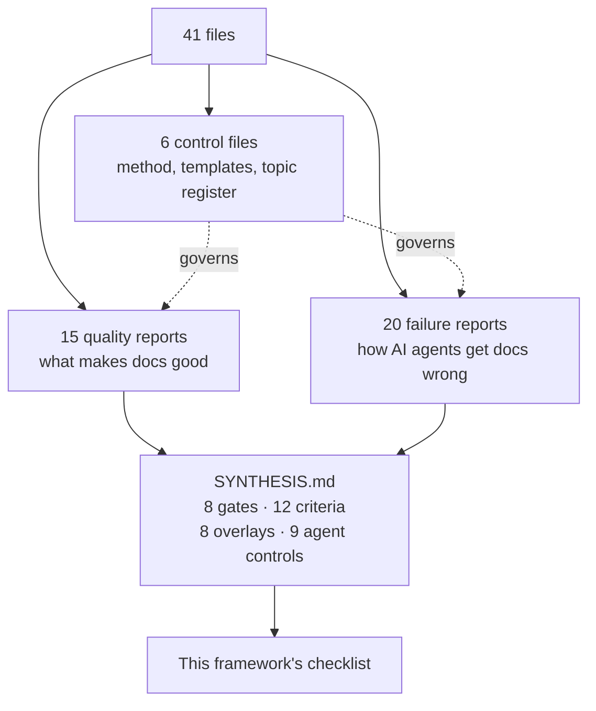

# Output 2 — Research source inventory

## In plain terms

**What this is.** A catalogue of the 41 research files the checklist was built from — what
each one says, how strong its evidence is, and where it disagrees with the others.

**Who it's for.** Anyone who wants to check where a checklist rule came from before
trusting it.

**What to do with it.** Look things up. Do not read it start to finish. If a checklist item
cites `R07` or `F12`, this is where you find out what that is and how much weight it carries.

**The one thing to know.** Not one of the 41 files could obtain a paid ISO standard in
full. Every ISO citation is to a public summary page. So nothing here may be used to claim
conformance with any ISO standard.

### How the corpus is organised

*In words:* six control files set the research method. Fifteen reports cover documentation
quality generally; twenty cover the specific ways AI agents produce wrong documentation.
Both sets feed one synthesis document, and that synthesis is the main input to the
checklist.

---

**Corpus reviewed:** `launchpad/Research/documentation-corpus-review/`
**Baseline revision:** `78e789369e3392f187e8c63753262669108fda81` (2026-09-14)
**Files present:** 41. **Files read in full:** 41. **Unreadable / excluded:** 0.

Every file in the directory is UTF-8 Markdown and was read end to end. There are no
binary, generated, or inaccessible files in this corpus, so the "could not be reviewed"
list below is empty by observation rather than by omission.

---

## A. Orientation and control files (6)

These are not research reports. They define the programme, not its findings.

| File | Type | Subject | Purpose | Audience | Evidence basis | Limitations |
|---|---|---|---|---|---|---|
| `README.md` | Programme index | Research loop and topic queue for the 15 general reports | Records the 10-step deep-research loop and marks all 15 general topics complete; states that reports "do not establish project policy" | Cohort, agents | Convention | Does not itself evaluate any report |
| `SYNTHESIS.md` | Cross-topic synthesis | Reconciles all 35 reports into 8 hard gates (H1–H8), 12 universal criteria (C01–C12), 8 genre overlays (G01–G08), 9 agent controls (A01–A09), a 12-step corpus-review procedure, and a review-record schema | The single most load-bearing file; the intended input to any checklist | Reviewers, decision owners | Synthesis of the 35 reports; no independent revalidation | Status is explicitly `PROPOSED`, not adopted. Supplies no thresholds, weights, sample sizes, cadences or risk tiers |
| `llm-authored-documentation-failures/README.md` | Programme index | Progress register for the 20 LLM-failure reports | Records which model authored each report (Claude 12 / Codex 8) and that all 20 are complete | Cohort | Convention | — |
| `.../TOPICS.md` | Topic register | The 20 exact research questions, verbatim | Authoritative wording workers must preserve | Workers | Convention | Records that provider limits forced a Claude→Codex reallocation on topics 14–16, 18 |
| `.../RESEARCH-CONTRACT.md` | Method contract | 8-step research method: frame, inspect locally, source-plan, triangulate, claim ledger, challenge, separate known from concluded, stop on saturation | Defines what counts as a valid report; includes the instruction/evidence separation rule | Workers | Convention + standards practice | Self-described as a contract, not validated against outcomes |
| `.../REPORT-TEMPLATE.md` | Template | 10-section report skeleton with a metadata table | Structural contract for the 20 failure reports | Workers | Convention | — |

---

## B. General technical-documentation quality (15 reports)

All fifteen are dated 2026-09-06 to 2026-09-08, all carry the disclaimer "This is
research, not an adopted corpus standard", and all apply to **all project types** unless
the "Project types" column narrows it.

| # | File | Subject | Main recommendations | Evidence basis | Key conflicts / limitations |
|---|---|---|---|---|---|
| 01 | `01-quality-model-for-technical-documentation.md` | What "quality" means | Quality is **multidimensional, contextual, non-compensatory**; 8 dimensions (integrity, sufficiency, purpose/genre fitness, comprehensibility, organisation/findability, consistency, task effectiveness, currency) with accessibility cross-cutting; never produce a single score | ISO/IEC/IEEE 26514, IEC/IEEE 82079-1, ISO 9241-11, ISO 24495-1, WCAG 2.2, Diátaxis; empirical: Treude 2020 (4 editors, 41 docs), COCA (Zalewski 2015), Garousi 2013 (n=25), Aghajani 2019 (878 artefacts, 162 issue types) | No paid ISO text obtained — scope only. Eight-dimension grouping is novel and untested. Empirical samples small |
| 02 | `02-genre-specific-quality-criteria.md` | Genre as a content contract | Three layers: universal criteria → 8 genre families → template overlays. Subject surface ≠ writing genre | DITA 1.3, Diátaxis, Good Docs, ISO 42010, C4, BCP 14, ISO 29119, MADR, OWASP | Classified 26 templates, not real nodes. Eight families untested for reviewer agreement. Contestable placements named (`capability`, `deployment`, `configuration`, `flow`, `threat-model`) |
| 03 | `03-truth-and-evidence-in-living-technical-documentation.md` | When is a claim established | An **8-link semantic evidence chain**; claim-type evidence map; citation ≠ evidence; outcome vocabulary (established / supported inference / narrower than written / unsupported / stale / contradicted / flagged conflict) | W3C PROV, ISO 15026-2, OMG SACM, ISO 26513, GitHub permalinks, Google docguide; Aghajani 2019, Wen 2019 (3.3M commits) | Chain not calibrated on any node sample. "Entailment" in prose is judgement-dependent. Proposed outcome labels may collide with existing `status` enum |
| 04 | `04-measuring-corpus-completeness-and-coverage.md` | Coverage measurement | No completeness % without a **declared, versioned obligation denominator**; coverage obligations, not nodes, are the unit; 9 disposition states; dashboard not score; extensive anti-metric list | ISO 26514, GQM (Basili), NASA SE Handbook verification matrix, DITA maps, Google OpenDocs Docs Advisor, ISTQB 4.0.1, W3C RDF open-world, Uddin & Robillard | Transfers from requirements engineering/testing are analogies. No thresholds set. Measured a working tree, not a release |
| 05 | `05-information-architecture-for-atomic-documentation.md` | Atomic corpus architecture | Four layers: nodes / classification / semantic relationships / maps. Buzz's 5 relationship types **cannot express a reader journey**; generators must not invent sequence | DITA topic-vs-map, W3C SKOS, Red Hat modular docs, Every Page Is Page One, ISO 26514 | Graph snapshot only counted front-matter edges, not body links. No reader tested. Map representation left undecided |
| 06 | `06-documentation-usability-and-findability.md` | Findability and use | 7-stage findability→outcome chain (exposure, expression, prediction, recognition, extraction, application, recovery); separate *designed-content checks* from *outcome evidence* | ISO 9241-11, ISO 26514, NIST CIF, GOV.UK benchmarking, WCAG Multiple Ways, Stanford IR, SNIF-ACT, Meng 2018, Nam CHI 2024 | No Buzz reader performed any task. Schema has no title/description/synonym field. Navigation studies are general-web, not repository-oriented |
| 07 | `07-freshness-staleness-and-change-impact.md` | Currency and change impact | Freshness = **semantic currency at a declared baseline**, not recency; 8-level staleness model; 6 currency dimensions; trigger taxonomy with 4 strength classes; 11 review outcomes including *false positive* | ISO 26514, ISO 23026, ISO 10007, Google SRE on-call, GitHub CODEOWNERS; Tan 2024 (outdated code refs), Javed & Zdun traceability experiments, Lethbridge 2003 | Measured 86.9% "stale" nodes at that snapshot — a saturated signal. File-level diff has high recall, unknown precision. Staleness ≠ wrongness |
| 08 | `08-reviewing-procedural-and-operational-documentation.md` | Procedures and runbooks | Review the whole action system: **Select → Prepare → Act/observe → Decide/coordinate → Verify → Recover/escalate → Learn**; 8-level evidence ladder (structural → live execution) | ISO 26514, IEC 82079-1, NASA/TM-2016-219421, UK HSE, NIST SP 800-61r3 / 800-184 / 800-84, AWS, Google SRE, AIR4ICS | Aviation/process-safety sources are higher-consequence than most dev docs. No procedure executed. Local procedure/runbook vocabulary conflicts with AWS usage |
| 09 | `09-normative-versus-descriptive-technical-writing.md` | Requirement language | Normativity is an **authority-and-conformance relationship**, not typography. Classify statement function → authority → bound obligation → make verifiable → compare with reality → expose lifecycle | RFC 2119/8174/7322, ISO directives, NASA NPR 1400.1I, W3C Manual of Style, ISO 29148, Google prescriptive docs; Femmer 2017 Requirements Smells (59% precision / 82% recall) | No universal keyword vocabulary exists — conventions genuinely conflict. Local standard is enforced by review only. Keyword counts cannot count requirements |
| 10 | `10-architecture-documentation-quality.md` | Architecture descriptions | Separate three review targets: description quality / architecture quality / implementation conformance. Views must answer named stakeholder concerns and cross-correspond | ISO 42010, SEI Views and Beyond + structured review, C4 checklist, arc42, ATAM, Nygard ADR; Ernst & Robillard 2023 (n=65), Fraunhofer IESE 2013 | Full 42010 text unavailable. Ernst & Robillard found **no significant effect of document format** on task performance — template conformance does not establish usability. Student sample |
| 11 | `11-terminology-and-conceptual-consistency.md` | Concepts and terms | **Concept-first**, not word-first: stable concept identity, preferred label *per declared scope*, admitted/deprecated labels, cross-surface mappings. "One term one concept" is a local authoring rule, not a synonym ban | ISO 704 / 1087 / 860 / 30042, W3C SKOS, WCAG 3.1.3 + G62, Microsoft, Google, Vale; Ahmad 2020 mapping study (90 studies) | Only public ISO abstracts. Lexical counts cannot distinguish quotation from authorial use. No reader tested. Concept/node identity boundary unresolved |
| 12 | `12-examples-commands-code-and-configuration.md` | Executable content | Classify the artefact before testing it; **7-level assurance ladder** (render → parse → build → execute → assert → integrate → reader task); separate *actual default* / *example value* / *recommended value* | Google code-samples + code-syntax + placeholders, Microsoft, rustdoc doctests, JSON Schema annotations, OWASP secure-by-default, 12-Factor, ShellCheck SC2148, RFC 2606/5737; Hoffman & Strooper 2003, Robillard & DeLine 2011 | No sample executed. Fence counts are lexical. Risk tiers and required assurance levels left unresolved |
| 13 | `13-documentation-accessibility-and-inclusive-comprehension.md` | Accessibility and comprehension | Review the **delivered experience**, not Markdown alone; separate WCAG conformance from comprehension; preserve meaning across modes; plain language = audience-appropriate precision, never a grade threshold | WCAG 2.2 + Understanding pages, W3C COGA, WAI tables tutorial, ISO 24495-1, ISO 26514, GFM spec, Mermaid accessibility options; Redish & Selzer 1985 | Explicitly **not** a WCAG conformance assessment. No rendered page, screen reader, keyboard or zoom test performed. No disabled readers consulted |
| 14 | `14-documentation-review-at-corpus-scale.md` | The review programme itself | A 11-stage assurance programme: decision & criteria → freeze population → risk strata → census + structured + **random discovery** sample → declare method/depth/coverage → calibrate reviewers → record findings before editing → prioritise → own/remediate/retest → combine change-time + periodic → report bounded conclusions | ISO 26513, ISO 19011:2026, NIST SP 800-53A Rev.5, W3C WCAG-EM 2.0, NIST/SEMATECH sampling, GAO 2024, GOV.UK, NASA peer review | Frameworks govern other domains. No sample drawn, no calibration trial run. Baseline counts (205 nodes / 3,936 entries) are now superseded |
| 15 | `15-security-and-disclosure-quality-in-public-technical-documentation.md` | Security content | **Classify before publishing**; 7-class routing model; security claims need object/property/threat/boundary/layer/conditions/evidence/freshness; stop-and-route procedure on discovery; redaction preserves meaning | ISO 29147 / 30111, RFC 9116, CERT/CC CVD guide, NIST SP 800-216 / 800-218 / 800-160v1r1, GitHub advisories + leaked-secret guidance, OWASP secrets cheat sheet, RFC 2606/5737 | No security test performed. No legal review. Does not determine whether any root `SECURITY.md` claim is true. Disclosure safety changes with deployment state |

---

## C. LLM-authored documentation failures (20 reports)

Dated 2026-09-08 to 2026-09-09. Every one carries an explicit "Evidence limitations"
metadata row. **All twenty state that no study measures their failure mode in
agent-authored repository documentation specifically** — the quantitative evidence is
transferred from adjacent settings and each report flags the transfer inline.

| # | File | Failure mechanism | Load-bearing evidence | Most useful transferable output |
|---|---|---|---|---|
| 01 | `01-context-selection-and-evidence-sufficiency.md` | Agents select context by **reachability, not relevance to the claim** | Barnett 2024 FP1–FP7; Joren ICLR 2025 (35–62% correct on *provably insufficient* context); DocAgent ablation 94.64%→86.75% entity truthfulness; local sparse-checkout demo (612 of 6,287 files on disk) | **Insufficiency is detectable; sufficiency is at best not-yet-falsified.** Report as "no insufficiency detected", never "evidence sufficient" |
| 02 | `02-tool-mediated-evidence-failures.md` | False absence / false completeness / false success from tool boundaries | ripgrep default filters; POSIX pipeline status; curl HTTP-vs-transfer; Git sparse-checkout & worktree semantics; SWE-agent interface ablation (+10.7pp); ToolSandbox | The **evidence envelope**: revision, cwd, dirty state, command, exit status, stderr, truncation, postcondition |
| 03 | `03-temporal-and-revision-coherence.md` | Three clocks (model prior, working tree, tool output) and one undated output format | Wang ICSE 2025 (deprecated-API use 70–90% when context is old vs 9–18% when new); Cheng 2024 cutoffs; local: wall-clock order ≠ reachability order, 86.9% stale | **Reachability is not chronology.** A date comparison is not an ancestry test |
| 04 | `04-technical-hallucination-and-unsupported-inference.md` | Contradictory vs merely unsupported claims | Maharaj ACL 2025 (31.63% of 411 summaries carry a hallucinated entity); Kang 2024 (18% of 540 Java comments inaccurate); CloudAPIBench; Spracklen USENIX 2025 | **Claim-type-matched verification stack**; "existence is not correctness" |
| 05 | `05-claim-provenance-and-circular-evidence.md` | Fabricated / misapplied / mutable / circular citations | Walters & Wilder 2023 (55% GPT-3.5, 18% GPT-4 fabricated); Onweller 2026 (link validity >94%, relevance >80%, **factual accuracy 39–77%**); Greenberg BMJ 2009; *Mata v. Avianca*; 2025 meta-analysis (16.9% human quotation inaccuracy) | **The checkable surface and the property that matters move independently.** Relevance is not entailment |
| 06 | `06-code-to-document-semantic-fidelity.md` | What source code can and cannot establish | CoRe (92.56% pairwise F1 → **42.61% exact-match enumeration**, 15.61% information-flow); SemBench 80.42%; Su & McMillan call graphs (0.00011 chain accuracy); Fang USENIX 2024 (97.4% explanation accuracy — counterevidence) | The **granularity cliff**: high per-claim accuracy still yields high probability that one consequential claim in a long document is false |
| 07 | `07-omissions-and-false-completeness.md` | Absence has no representation to attend to | AbsenceBench NeurIPS 2025 (best model 69.6% F1 **with the original available**); Fox 2026 (omission discrimination 0.50–0.63 vs commission 0.79–0.94); Peters & Chin-Yee OR=4.85; local: 170 env vars read vs 19 in `.env.example` | **Structural completeness is the metric the failure maximises.** Build the required-topic inventory from the artefact, then enumerate-then-verify |
| 08 | `08-executable-procedures-examples-and-configuration.md` | Plausible-but-wrong executable content | EvalPlus (pass rates fall 19.3–28.9% under stronger tests); DS-1000; SWE-bench; Terraform validate/plan semantics; GitHub Actions secure-use; OpenAI agent system card (tool substitution + misrepresentation) | The **three-boundary model**: content validation / isolated execution / target authorisation. Stop at the first boundary you cannot verify |
| 09 | `09-normative-distortion.md` | Force, authority, claim mode and enforcement collapse into one confident stream | Wallace 2024 instruction hierarchy; Peters & Chin-Yee (accuracy prompt **doubled** overgeneralisation, OR=1.90); Leng 2024; Sharma 2023 sycophancy; Truong 2023 negation | **Phantom enforcement** is the defect that survives review, because a fabricated gate reads as diligence |
| 10 | `10-transformation-and-summarization-fidelity.md` | Transformation preserves content and drops grounding | Zhang ACL 2023 (**30% of purely extractive summaries unfaithful**); Belem 2026 (certainty distortion up to 75%); ClashEval NeurIPS 2024 (>60% override own correct prior); Anthropic contextual retrieval (−35% failure) | **Relocation breaks text nobody rewrote.** Never reconcile toward the more authoritative document; reconcile toward the better-evidenced claim |
| 11 | `11-reader-and-task-fitness.md` | Fitness is a difference and one operand is not in the repository | Singhal 2023 length bias; Dubois 2024; Verbalized Sampling typicality bias; Zheng EMNLP 2024 persona **null result**; Hertzum & Jacobsen (evaluator agreement 5–65%); Harasta 2024 (verbose preferred) | **Preference is the wrong instrument for fitness.** Every favourable study of agent docs measures preference, not task completion |
| 12 | `12-security-privacy-and-disclosure-failures.md` | Read authority silently becomes publication authority | NIST AI 600-1; NIST SP 800-122; GitHub secret-scanning scope + leaked-secret remediation; Presidio no-guarantee; ICO motivated-intruder; Carlini USENIX 2021; Perry CCS 2023 vs Sandoval USENIX 2023 (conflicting) | **Classify source *and* destination before generation.** A `.gitignore` does not affect tracked files; deletion is not remediation |
| 13 | `13-epistemic-calibration-and-deceptive-fluency.md` | Nothing in the pipeline connects internal uncertainty to the document's wording | GPT-4 report ("post-training hurts calibration significantly"); Zhou ACL 2024 (**only 5% of answers carry epistemic markers**; weakener reward −1.86 vs plain 4.03); Kabir CHI 2024 (52% incorrect, 39% overlooked); LMSYS style control (length 0.249 vs markdown ≤0.031) | **Length, not markdown, is the dominant style effect.** Judge models are far more format-biased than humans |
| 14 | `14-cross-document-consistency-and-terminology-drift.md` | Each edit is locally plausible and globally unvalidated | DELEGATE-52 (degradation across all 19 models, worse over 20 interactions); DocOps 2026; Liu TACL 2024; WIKICOLLIDE (best automated corpus-level system 75.1% AUROC) | Corpus consistency requires finding **no** contradiction anywhere — an exhaustive condition. Automated "no conflicts" verdicts are not justified |
| 15 | `15-error-propagation-and-false-consensus.md` | Pipelines preserve claim content and drop evidential state | Greenberg 2009 (242 papers, 220,553 citation paths around an unfounded claim); Yousif 2019 dependent consensus; Ye 2026 meta-analysis (g=0.37, heterogeneous); Jin LREC 2024 frequency bias | **Count independent roots, not copies.** Corrections must fan out to descendants and rebuild retrieval indexes |
| 16 | `16-coverage-inflation.md` | The visible numerator grows faster than the definition of what must be covered | Diátaxis; Aghajani ICSE 2020; Oakden-Rayner 2020 hidden stratification; NIST AI RMF Measure | **Reject any completeness percentage lacking universe, unit, revision, exclusions and unknown-handling** |
| 17 | `17-adversarial-context-prompt-injection-and-source-poisoning.md` | Same input carries the authorised task and the evidence | Greshake 2023; InjecAgent (24% base-case vulnerability for ReAct GPT-4); AgentDojo (97 tasks / 629 security cases); PoisonedRAG USENIX 2025; NIST AI 100-2e2025; OWASP LLM01 | **Content authority must not imply instruction authority; read authority must not imply publication authority** |
| 18 | `18-human-review-and-automation-bias.md` | Review approves presentation, not evidence | Parasuraman & Riley 1997; Skitka 2000 omission/commission + accountability; Bansal CHI 2021 (explanations raise acceptance **regardless of correctness**); Buçinca CSCW 2021 (effective forcing functions are the least liked); Logg 2019 algorithm appreciation (counterevidence) | Make the review object **evidence-bearing**; elicit an independent view before showing the conclusion for high-consequence claims |
| 19 | `19-automated-detection-and-validation.md` | Validators prove predicates, not documents | JSON Schema; rustdoc `no_run`/`ignore`; DocChecker 72.3%; Tang ACL 2023; Zheng 2023 LLM-judge biases | **Five-level reliability ladder (A–E)** and a mandatory result envelope naming what a pass supports |
| 20 | `20-evaluation-provenance-and-accountability.md` | Provenance and assurance get conflated | W3C PROV-O; SLSA v1.2; C2PA 2.2 (provenance ≠ truth); NIST AI RMF; Mitchell 2019 model cards; Pepe 2024 (32,111 cards — **limitations and evaluation least filled**) | A 9-group minimum provenance record and a **quality profile, never a score** |

---

## D. Consolidated recommendations (deduplicated, sources preserved)

Where several files make the same recommendation it is stated once here with all
supporting files named. These are the recommendations that recur most and carry the most
independent support.

| Consolidated recommendation | Supporting files |
|---|---|
| Never report a single aggregate quality/completeness score | 01, 04, 10, 11, 14, 16, 19, 20 |
| A green deterministic check proves its predicate and nothing about content | 01, 03, 04, 05, 09, 12, 13, 14, 19, 20, F02, F13, F19 |
| Distinguish required / intended / implemented / enforced / tested / observed | 03, 09, 10, 15, F06, F09, F15 |
| Evidence authority must match the claim type | 03, 07, 09, 15, F04, F05, F06 |
| Completeness needs a declared, versioned denominator with counts beside percentages | 04, 14, 16, F07, F16 |
| Relevance is not entailment — open the source and check the exact proposition | 03, 11, F05, F04, F18 |
| Treat repository/tool/external content as evidence, never as instruction | 15, F17, F02, RESEARCH-CONTRACT §6 |
| Test procedures by execution proportionate to risk; disclose what was not run | 08, 12, F08, F19 |
| Record `unable to assess` rather than converting a tool failure into a pass | 14, 19, F02, F19, SYNTHESIS H8 |
| Prefer a named gap to a low-confidence claim | 03, 13, F07, F13 |
| Do not add "be accurate" to a prompt and call it a mitigation | F07, F09, F10, F13 |
| Preserve conflicts; do not reconcile toward the more authoritative document | 03, F10, F14, F15 |
| Accessibility must be reviewed on the delivered surface, not the source alone | 01, 13, F19 |
| Human review is necessary at authority boundaries but is not sufficient | 14, F18, F20 |

*(F-prefixed numbers are `llm-authored-documentation-failures/NN`.)*

---

## E. Conflicts and disagreements *inside* the corpus

These are genuine tensions, not errors. Any adopted checklist must resolve them
explicitly rather than inherit both sides.

1. **Volume vs. fitness.** Report 04 and F16 treat volume as a false proxy for coverage;
   F11 records that LLM documentation *wins* human preference tests (RepoAgent 70% and
   91.33% win rates; Dvivedi et al. "all LLMs consistently outperform the original
   documentation"). F11 resolves this by rejecting preference as the instrument —
   but that resolution is the report's own interpretation, not a measured result.
2. **Structural completeness.** F07 argues that a filled template *is* what false
   completeness looks like; report 02 recommends template overlays as a precision
   mechanism. Both are right at different layers; the checklist must never let overlay
   satisfaction count as substantive coverage.
3. **Staleness severity.** Report 07 cites Lethbridge 2003 (81% of engineers agreed
   documentation stays useful while not up to date) against its own 86.9% stale
   measurement. F03 repeats the tension. Neither resolves it; both conclude that
   abstraction level, not age, governs.
4. **Automation.** Report 19/F19 place semantic detection at "calibrated detector"
   reliability; report 14 warns that a detector's own errors concentrate on the nuanced
   cases that matter. The corpus never claims a semantic gate is safe to block on.
5. **Accessibility formatting.** Report 13 identifies tables as the corpus's largest
   structural hotspot and GFM as unable to express row headers or captions; report 03,
   04, 07 and others are themselves table-dense. The corpus does not acknowledge that
   its own reports instantiate the hazard they describe.
6. **Provenance depth.** F20 proposes a 9-group provenance record; F12 warns that
   provenance traces are themselves a disclosure channel requiring minimisation and
   retention rules. The two must be reconciled per-field, not per-principle.

---

## F. Evidence-basis classification

| Basis | Share of corpus | Notes |
|---|---|---|
| **External standard** (ISO, IEEE, W3C, IETF, NIST, OASIS) | Heavily used in all 15 general reports | **No paid ISO/IEC/IEEE standard was obtained in full anywhere in the corpus.** Every ISO citation is to a public abstract, scope page, or Online Browsing Platform excerpt. No report claims conformance |
| **Peer-reviewed empirical study** | ~45 distinct studies | Sample sizes are frequently small (4 editors / 41 docs; n=25; n=45; 17 curated cases; 30 annotated pairs) and the reports say so |
| **Preprint (not peer-reviewed)** | ~20 distinct, all marked at point of use | Concentrated in the 2026 agent-specific evidence (DELEGATE-52, DocOps, Onweller, Rao, Belem, Soumik, van Dort & Heuss, Yu) |
| **First-party vendor documentation** | Google, Microsoft, GitHub, Anthropic, OpenAI, HashiCorp, Rust, Mermaid, Vale, Docusaurus | Authoritative for their own product behaviour only; several reports flag vendor incentive |
| **Practitioner convention** | Diátaxis, C4, arc42, Good Docs, Red Hat modular docs, Every Page Is Page One, MADR | Explicitly labelled as frameworks, not evidence |
| **Local repository observation** | Present in every LLM-failure report and most general reports | Reproducible commands given inline; every one is a snapshot of a working tree, and several were taken in **sparse checkouts** whose limits the reports disclose |
| **Researcher interpretation** | Labelled inline throughout | The corpus is unusually disciplined about this labelling |

---

## G. Files that could not be reviewed

None. All 41 files were read in full. No file in
`launchpad/Research/documentation-corpus-review/` is binary, generated, encrypted, or
otherwise inaccessible.

**One boundary worth recording:** this corpus is not present on the branch this review
was commissioned from (`docs/verification-programme`). It exists on `origin/launchpad`.
The directory was read from a worktree verified byte-identical to `origin/launchpad`
(`git diff --stat origin/launchpad -- <path>` empty). That is the same view-boundary
hazard report F02 and F03 document, and it is recorded here rather than left implicit.
