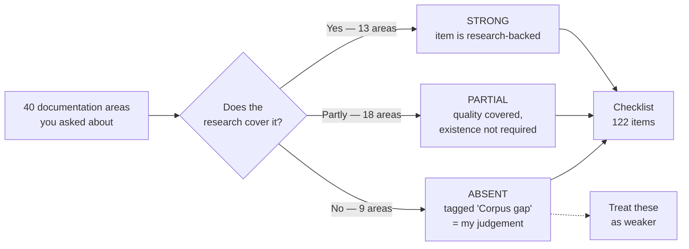

# Output 3 — Corpus gap analysis

## In plain terms

**What this is.** An honest account of what the 41 research files cover well, what they
cover only partly, and what they do not cover at all.

**Who it's for.** Anyone deciding how much to trust a given checklist item.

**What to do with it.** Before relying on a checklist rule, check here whether it is backed
by the research or is my own judgement. The 21 items tagged
`Corpus gap — supplementary best practice` are the weaker ones.

**The one thing to know.** The research is about **how to judge documentation quality**,
not **which documents a project needs**. So it is strong on evidence, staleness,
accessibility and security — and silent on README structure, database schemas, background
jobs, logging, performance, licensing and changelogs.

### Where the checklist items come from

*In words:* of the forty areas, thirteen are strongly covered by the research, eighteen are
covered for quality but never required to exist, and nine are not covered at all. All three
groups produce checklist items, but the nine absent areas are tagged so nobody mistakes my
judgement for the research's evidence.

---

**What the corpus is.** Thirty-five research reports plus a synthesis about **how to
judge whether documentation is trustworthy**: evidence, authority, staleness, genre
fitness, accessibility, security disclosure, review process, and the specific ways LLM
agents fail when they author from repository evidence.

**What the corpus is not.** It is not a specification of **which documents a software
project should have**. That distinction governs everything below.

---

## 1. The structural gap, stated once

The brief asks for a checklist covering ~40 documentation *areas* — README, installation,
prerequisites, API reference, database schemas, background jobs, error handling, logging,
runbooks, disaster recovery, changelogs, deprecation, licensing, support contacts, and so
on.

The corpus supplies **quality dimensions and review procedure**. It supplies almost no
**content-area obligations**. Where it touches an area at all, it does so as a worked
example of a quality problem, not as a requirement that the area be documented.

This is not an oversight by the researchers. Report 04 makes the omission deliberate and
argues it is correct:

> "There is no meaningful corpus-completeness percentage until the project declares the
> set of obligations it expects the corpus to satisfy. The denominator must be designed,
> versioned, and reviewable."
> — `04-measuring-corpus-completeness-and-coverage.md`

The corpus's position is that the content-area list **is a project decision**, not a
research finding, and that importing a generic list would be exactly the "biased
denominator" F16 warns about. That position is defensible and I have preserved it.

**Consequence for this framework.** Sections A, H and I of the master checklist are
almost entirely corpus-derived. Sections B, C, D, E, F and G are largely
`Corpus gap — supplementary best practice`, drawn from named external practice and
labelled as such on every affected item. A reader must be able to tell which items carry
the corpus's evidentiary weight and which carry mine.

---

## 2. Area-by-area assessment

**Coverage key**
`STRONG` — the corpus gives directly usable review criteria.
`PARTIAL` — the corpus addresses the *quality* of this content but never says it must exist.
`ABSENT` — the corpus does not address the area at all.

| # | Area | Coverage | What the corpus gives | What is missing | Why it matters | Which projects need it | Into the checklist? | Human research needed? |
|---|---|---|---|---|---|---|---|---|
| 1 | README | `PARTIAL` | F01 measures agent-context-file coverage (testing 75.9%, architecture 68.1%, **security 14.8%, performance 14.5%**); F11 measures README length parity | No statement that a README must exist or what it must contain | First contact for every human and agent | All | Yes — `START-001/002` marked corpus-gap | No |
| 2 | Installation & setup | `PARTIAL` | Report 08 covers procedures generically; F07 cites Gao 2023 — pre-installation instruction was the largest README change category (628 updates across 400 repos) | No installation-content contract | Unstated prerequisites are invisible to every reading-based check | All | Yes — `START-003/004/008` | No |
| 3 | System prerequisites | `PARTIAL` | F07 class **O1 prerequisite elision** is precisely this failure; report 08 lists preconditions to review | No requirement to enumerate them | The one class F07 says has **no mechanical enumerator** | All | Yes — `START-003`, routed to human review | No |
| 4 | Architecture & boundaries | `STRONG` | Report 10 in full: stakeholder concerns, view sufficiency, cross-view correspondence, drivers→decisions→evidence→risk; C4/arc42/42010 mapping | Nothing material | — | Non-trivial | Yes — `ARCH-001…010` | No |
| 5 | Repository structure | `ABSENT` | — | Entirely absent | Agents navigate by structure; F01 C2 shows a 9.7%-materialised checkout reads as a different repository | All, acutely agent-facing | Yes — `AGENT-004` corpus-gap | No |
| 6 | Local development workflow | `PARTIAL` | Report 08's Select→Prepare→Act→Verify→Recover model applies | No dev-workflow content obligation | Onboarding blocker | All with contributors | Yes — `DEV-001…003` | No |
| 7 | Configuration & env vars | `STRONG` | Report 12 §"Configuration documentation": actual default vs example value vs recommended value; 13 facts per setting; validate the sample as a coherent whole | — | — | All with config | Yes — `API-008/009` | No |
| 8 | Secrets & credentials | `STRONG` | Report 15 (7-class routing, stop-and-route), F12 (read authority ≠ publication authority), report 12 (placeholders, RFC 2606/5737) | — | — | All | Yes — `OPS-010…013` | No |
| 9 | API reference | `PARTIAL` | Report 02 G02 descriptive-reference criteria; F06 on what code can establish | No API-reference content contract (endpoints, params, status codes, errors, auth, pagination, rate limits) | The most-consulted document type in most projects | APIs, libraries, services | Yes — `API-001…005` corpus-gap | No |
| 10 | AuthN / AuthZ | `PARTIAL` | Report 15's security-claim schema applies; F06 warns trust boundaries may not be in source at all | No requirement to document the auth model | Security-critical and frequently wrong | Anything with users | Yes — `API-006/007`, `OPS-009` | No |
| 11 | DB schema & migrations | `ABSENT` | — | Entirely absent | Migrations are irreversible; buzz auto-applies them on relay startup | Anything with a datastore | Yes — `DEV-007`, `API-010` corpus-gap | No |
| 12 | Data flows | `PARTIAL` | Report 10 names data/state as a concern family; F06 measures **information-flow enumeration at 15.61%** for a leading model | No data-flow content obligation | Privacy and security reasoning depends on it | Systems handling user data | Yes — `ARCH-006` | No |
| 13 | Background jobs / scheduled tasks | `ABSENT` | — | Entirely absent | Invisible failure surface; not reachable from an HTTP route inventory | Anything with async work | Yes — `ARCH-009` corpus-gap | **Yes** — needs a cohort decision on scope |
| 14 | Error handling | `PARTIAL` | F06 "error-contract distortion" (sentinel vs throw, catch/rethrow); F07 **O3 failure-mode silence**, measured locally: 22 of 266 declared error literals appear anywhere in tracked Markdown | No error-documentation obligation | Readers meet errors, not happy paths | All | Yes — `API-011`, `HUMAN-007` | No |
| 15 | Logging & observability | `ABSENT` | Only as a leakage risk (OWASP logging cheat sheet in F12) | No observability-documentation obligation | Operators cannot diagnose what is not described | Services | Yes — `OPS-001/002` corpus-gap | No |
| 16 | Testing | `PARTIAL` | Report 02 G06 verification/assurance genre; report 12's assurance ladder; test-reference standard | No requirement to document the test strategy | Contributors cannot validate changes | All | Yes — `DEV-004` | No |
| 17 | Build / release / deploy / rollback | `PARTIAL` | Report 08 covers procedures; F08 gives the three-boundary execution model | No release-documentation obligation | Rollback is the highest-consequence undocumented path | Deployed systems | Yes — `DEV-009…011` | No |
| 18 | Security considerations | `STRONG` | Report 15 and F12 in full | — | — | All public | Yes — `OPS-008…013` | No |
| 19 | Privacy / sensitive data | `PARTIAL` | F12 (NIST SP 800-122 linkability, ICO motivated-intruder) | No data-classification obligation | Re-identification is not detectable by pattern scan | Anything with personal data | Yes — `OPS-012` | **Yes** — legal scope is out of research reach |
| 20 | Accessibility | `STRONG` | Report 13 in full: delivered surface, equivalence across modes, tables, diagrams, plain language, evaluation triangulation | Report 13 is explicitly *not* a WCAG conformance assessment | — | All published | Yes — `FOUND-008`, `HUMAN-010/011` | **Yes** — target level and renderer ownership are unresolved |
| 21 | Performance & scalability | `ABSENT` | F01 records that agent context files cover performance at **14.5%** — noting the gap, not filling it | Entirely absent | Capacity limits are operational safety | Services at scale | Yes — `OPS-014` corpus-gap | No |
| 22 | Troubleshooting | `PARTIAL` | Report 08's troubleshooting-guide row ("lists causes without discriminating observations") | No requirement that one exist | The reader is already failing when they arrive | All | Yes — `HUMAN-007`, `OPS-005` | No |
| 23 | Operational runbooks | `STRONG` | Report 08 in full; F08's boundaries | — | — | Operated services | Yes — `OPS-004…007` | No |
| 24 | Disaster recovery | `PARTIAL` | Report 08 cites NIST SP 800-184 recovery criteria; report 14 makes recovery a census stratum | No DR-documentation obligation | Highest consequence, lowest exercise frequency | Production systems | Yes — `OPS-006/007` | No |
| 25 | Contribution guidelines | `ABSENT` | — | Entirely absent | Governs every inbound change | Open / multi-contributor | Yes — `GOV-001` corpus-gap | No |
| 26 | Code of conduct | `ABSENT` | — | Entirely absent | Community safety | Public projects | Yes — `GOV-002` corpus-gap | No |
| 27 | Licensing | `ABSENT` | — | Entirely absent | Legal reuse | All published | Yes — `GOV-003` corpus-gap | **Yes** — licence choice is a human decision |
| 28 | Ownership & support contacts | `PARTIAL` | Report 07 separates change author / content maintainer / subject authority / approver; F20 requires an empowered owner | No requirement to publish contacts | An unowned document cannot be corrected | All | Yes — `GOV-004/005` | No |
| 29 | Decision records | `STRONG` | Report 02 G07; report 10 (Nygard, MADR); F09's D3 lifecycle laundering and superseded-ADR warning | — | — | Non-trivial | Yes — `GOV-006/007` | No |
| 30 | Changelog & versioning | `ABSENT` | Google's timeless-documentation guidance exempts release notes (F03) — the only mention | Entirely absent | Readers cannot tell what changed | Released software | Yes — `GOV-008` corpus-gap | No |
| 31 | Deprecation & migration | `PARTIAL` | Report 07's deprecated/retired lifecycle; report 11's terminology-change contract; F09's D3 | No deprecation-documentation obligation | Silent removal breaks consumers | Anything with consumers | Yes — `API-013`, `GOV-009` | No |
| 32 | Examples & tutorials | `STRONG` | Report 12 in full (7-level assurance ladder, artefact classes, placeholder safety) | Tutorials specifically are thin — Diátaxis is cited but not developed | Adoption depends on them | All | Yes — `API-012`, `HUMAN-005/006` | No |
| 33 | Glossary & domain terminology | `STRONG` | Report 11 in full (concept-first, scoped preferred labels, cross-surface mapping, lifecycle) | — | — | Domain-heavy | Yes — `FOUND-006/007` | No |
| 34 | Documentation maintenance | `STRONG` | Report 07 in full; report 14 stage 10–11 | — | — | All | Yes — `FOUND-009/010` | No |
| 35 | Documentation validation & testing | `STRONG` | Report 19/F19's A–E reliability ladder and mandatory result envelope | — | — | All | Yes — `FOUND-011`, `AGENT-020…022` | No |
| 36 | Docs for AI coding agents | `STRONG` | The entire 20-report failure collection; F01's measured agent-context-file coverage | Prescribes *controls*, not an `AGENTS.md` content contract | This is the corpus's deepest and most distinctive contribution | Agent-touched repos | Yes — all of section I | No |
| 37 | Machine-readable project context | `PARTIAL` | Report 05 (facets, maps), F20 (PROV / SLSA / C2PA patterns), the local node schema | No recommendation on what machine-readable metadata a project should publish | Agents cannot infer boundaries from prose reliably | Agent-touched repos | Yes — `AGENT-002/003/023` | **Yes** — schema change is a project decision the corpus declines to make |
| 38 | Instructions **not** to give agents | `PARTIAL` | F17 (instruction root, plane separation), F09 (never-invent clause), F08 (stop at the first unverifiable boundary) | No positive "do-not-modify / do-not-run" content contract | This is how agents cause irreversible damage | Agent-touched repos | Yes — `AGENT-011…016` | No |
| 39 | System context / external integrations | `STRONG` | Report 10's context view and concern families | — | — | Integrated systems | Yes — `ARCH-001/008` | No |
| 40 | First-run verification | `PARTIAL` | Report 08 requires positive verification after consequential actions | Not framed as a getting-started obligation | "It installed" ≠ "it works" | All | Yes — `START-007` | No |

**Totals:** `STRONG` 13 · `PARTIAL` 18 · `ABSENT` 9.

---

## 3. The nine absent areas, grouped

| Absent area | Best explanation | Risk of importing a generic list anyway |
|---|---|---|
| Repository structure; background jobs; DB schema/migrations; logging/observability; performance/scalability | The corpus scoped itself to *content quality*, not *content inventory*. Report 04 argues the inventory must be project-derived | Moderate — a generic list becomes an unowned denominator that inflates coverage (F16) |
| Contribution guidelines; code of conduct; licensing; changelog/versioning | Project-governance artefacts. The corpus treats governance as a *subject surface* a node may document, never as files a repository must have | Low — these are near-universal conventions with stable external definitions |

**How this framework handles it.** Every checklist item in these nine areas is marked
`Corpus gap — supplementary best practice`, carries `Applicability: Conditional` with an
explicit `Applies when`, and names its external basis. None of them inherits the corpus's
evidentiary weight, and the audit does **not** count their absence as a defect unless the
`Applies when` condition holds.

---

## 4. Gaps in the corpus's own method

These are weaknesses in the research as research, distinct from coverage gaps.

| Gap | Evidence | Consequence for anyone reusing this corpus |
|---|---|---|
| **No paid standard was obtained in full, anywhere** | Every ISO/IEC/IEEE citation in all 15 general reports is to a public abstract, scope page or OBP excerpt; every report says so | No conformance claim may be made against ISO 26514, 26513, 42010, 29148, 24495-1, 9241-11, 19011, 29119, 15026-2 or 30042 on the strength of this corpus |
| **No measurement of agent-authored documentation in a repository** | All 20 failure reports state this in their own limitations | Every magnitude is transferred. Directions are well supported; **no number in the corpus is a Buzz rate** |
| **No reader, operator or contributor was ever tested** | Reports 06, 10, 11, 13 and F11 each record it | Every claim about usability, findability, comprehension or task fitness is a diagnosis of *missing evidence*, not a measured outcome |
| **No reviewer calibration trial was run** | Report 14 §Limitations | Inter-reviewer agreement for these criteria is unknown; report 14 itself cites 5–65% agreement ranges in the general literature |
| **Local observations are working-tree snapshots, several in sparse checkouts** | Reports 04, 05, 06, 07, 10, 13, 14 and F01/F03/F05/F07/F09 | Baseline counts are stale by construction. **This audit re-measured every one it relies on** |
| **Prevalence is never established** | Stated in F02, F05, F07, F09, F11, F12, F14, F15, F16, F17 | The corpus can say a failure mode is possible and how to detect it. It cannot say how common it is here |
| **The corpus does not review itself** | No report applies the criteria to the research reports | Report 13 identifies table density as the largest accessibility hotspot; the corpus is itself extremely table-dense. Report F13 identifies length as the dominant style bias; these reports are long |
| **Adoption is unresolved** | `SYNTHESIS.md` lists 8 open adoption decisions and `README.md` leaves the adoption checkbox unticked | Nothing here is policy. A reviewer citing it as policy is committing the corpus's own F09 "phantom authority" failure |

---

## 5. What still needs a human

Carried forward to Output 9's maintainer questions.

1. **The obligation register.** Which content areas does `launchpad/` actually owe? Until
   someone decides, every coverage number — including the corpus's own `37 of 408` — has
   an undeclared denominator.
2. **The accessibility target.** Which rendered surface is official, at what WCAG level,
   and who owns renderer-controlled failures? Report 13 asks this and cannot answer it.
3. **Privacy and licensing scope.** Outside research competence; needs an authorised
   decision.
4. **Machine-readable metadata.** Reports 05, 06, 11 and F20 each identify a missing
   field and each declines to prescribe a schema change. That decision is still open.
5. **Which hard gates block a merge.** `SYNTHESIS.md` adoption decision 1. Without it,
   the eight gates are advisory and the corpus's own F09 analysis says advisory gates
   documented as enforced are the durable failure.
