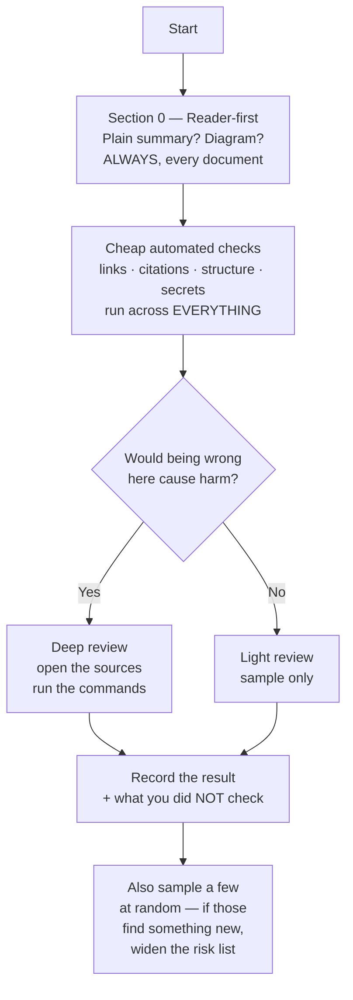

# Output 4 — Master documentation checklist

## In plain terms

**What this is.** 122 specific, checkable requirements for documentation — each one
something you can test rather than an opinion you can argue about.

**Who it's for.** Anyone writing docs, reviewing docs, or auditing a whole set of them.
Humans and agents both.

**What to do with it.** **Do not run all 122 on everything.** Always apply Section 0 — the
two reader-first rules. Run the cheap automated checks everywhere. Save the deep checks for
documents where being wrong would hurt: recovery, deletion, security, deployment,
credentials.

**The one thing to know.** An item only passes if you *checked*. A heading existing is not
a pass, and a green CI run proves only what that particular check tested.

### How to route through it

*In words:* always start with the two reader-first rules, then run the cheap automated
checks over everything. Split the rest by consequence — deep review where being wrong is
costly, light review elsewhere. Record what you did not check as carefully as what you did,
and sample a few documents at random; if the random ones surface something your risk list
missed, the risk list was wrong.

### The nine sections

| | Section | Covers |
|---|---|---|
| **0** | Reader-first | Plain summary; diagram. Apply to everything |
| **A** | Foundations | Audience, authority, ownership, currency, honest reporting |
| **B** | Getting started | Prerequisites, install, config, first success |
| **C** | Architecture | Boundaries, views, decisions, data flow, failure modes |
| **D** | Developer workflows | Commands, tests, migrations, release, rollback, review |
| **E** | Interfaces | APIs, auth, config, schemas, events, examples, deprecation |
| **F** | Operations | Logging, runbooks, backup/restore, security, secrets, privacy |
| **G** | Governance | Contributing, licence, ownership, decisions, changelog |
| **H** | Human-readable | Plain language, examples, warnings, diagrams, tables |
| **I** | Agent-readable | Precedence, boundaries, stop rules, definition of done |

---

**Version:** 1.1 · **Derived from:** `launchpad/Research/documentation-corpus-review/`
(41 files) · **Machine-readable twin:** [`checklist.yaml`](checklist.yaml)

## How to read an item

Each item carries all fifteen required fields in a compact block:

> **ID · one testable requirement**
> — **Category** / **Audience** / **Applicability** / **Priority** / **Automation** / **Dependencies**
> — **Applies when**, **Rationale**, **Evidence needed**, **Suggested location**, **Source basis**, **Audit method**, **Failure risk**

**Source basis** is either a corpus file (e.g. `R03`, `F07` — see key below) or the tag
`Corpus gap — supplementary best practice`, which means the corpus does **not** support
the item and it rests on named external practice plus my judgement. Treat those items as
weaker.

**Key.** `R01`–`R15` = the numbered general reports. `F01`–`F20` =
`llm-authored-documentation-failures/NN`. `SYN` = `SYNTHESIS.md`.

## Non-negotiable rules governing the whole checklist

1. **No aggregate score.** Report items individually. An average may not offset a failed
   gate. (`R01`, `R04`, `R14`, `F16`, `F20`)
2. **`Not applicable` and `Not evaluated` are different results**, and both need a reason.
   (`R01`, `R14`)
3. **A deterministic check proves its own predicate and nothing else.** Say what it did
   not check. (`F19`, `SYN` H8)
4. **A tool failure becomes `UNABLE_TO_ASSESS`, never a pass.** (`SYN` H8, `F02`, `F19`)
5. **Insufficiency is detectable; sufficiency is not.** Report "no defect detected against
   inventory X", never "complete" or "correct". (`F01`, `F07`)

---

## 0. Reader-first requirements

**These two come before everything else and apply to every document without exception.**
A document that fails either cannot usefully be assessed against the rest of this
checklist, because nobody will get far enough into it to find out.

**READER-001 · The document opens with a plain-language summary a non-specialist can read and understand in under 30 seconds.**
— reader-first / Human / Required / **P1** / Human review / —
— **Applies when** Always. Every document, every genre, no exceptions.
— **Rationale** Readers decide in seconds whether a document is for them, and a reader who cannot tell will either leave or — worse — act on a document meant for someone else. `R06` makes recognition a separate stage of the findability chain from retrieval: a document can be found and still be unusable because the reader cannot confirm it is the right one. `R13` makes it an accessibility requirement rather than a courtesy — readers working under interruption, time pressure, or with cognitive, language or reading differences need the point before the detail, not after it.
— **Evidence needed** A summary at the very top, before any technical content, stating what the document is, who it is for, and what the reader should do with it — in plain words, using no jargon the summary does not itself define.
— **Location** The first block after the title, above everything else including tables of contents, status badges and metadata commentary.
— **Source** `R06`, `R13`, `R01`; and the cohort's existing convention that a PR body opens with an "In plain terms" section above the machine-checked schema.
— **Audit method** Read only the summary, with a timer. Then state without scrolling: what is this, who is it for, what do I do next. If you cannot answer all three inside 30 seconds, the item fails. Do not grade your own document — an author always passes their own summary.
— **Failure risk** The document serves only readers who already know what it contains, which is precisely the population that least needs it. Every other quality in this checklist becomes unreachable.

**READER-002 · The document contains a diagram of the thing it describes — the system, the flow, or the process — with an equivalent description in words.**
— reader-first / Both / Required / **P1** / Human review / READER-001
— **Applies when** The document describes something with parts, steps, states or relationships. A single-fact reference entry is exempt; almost nothing else is.
— **Rationale** `R10` is explicit that topology, sequence, containment and relationships are the information shapes prose carries worst, and that a reader who cannot see the shape reconstructs it wrongly. `R13` imposes the reverse obligation in the same breath: a diagram with no equivalent text route moves the information out of reach of some readers entirely. The diagram and its description are one requirement, not two.
— **Evidence needed** A diagram — Mermaid preferred, because it is text, it diffs, and it renders on GitHub — showing the elements and their relationships, **plus** prose or a list conveying the same elements, relationships, order and conclusion.
— **Location** Immediately after the plain-language summary, before the detailed content.
— **Source** `R10`, `R13`, `R02` G03.
— **Audit method** Two passes. Hide the prose: are the diagram's purpose, elements, relationship labels and direction clear, with a legend where the notation is not obvious (`ARCH-002`, `ARCH-003`)? Then hide the diagram: does the remaining text support the same conclusion (`HUMAN-010`)? Both must pass.
— **Failure risk** Structure and sequence exist only in the author's head. Readers rebuild them by guessing, and differently from one another — `F14`'s divergent mental models, arriving through the front door.

---

## A. Documentation foundations

**FOUND-001 · Each document identifies its intended reader and the reader's goal specifically enough to judge fitness — a bare role label is not sufficient.**
— foundations / Both / Required / **P1** / Human review / —
— **Applies when** Always.
— **Rationale** Relevance, completeness and usability cannot be judged without a named audience and task; ISO 9241-11 binds usability to specified users, goals and context.
— **Evidence needed** A statement of audience and reader goal, or metadata plus opening prose that jointly make both recoverable.
— **Location** Front matter plus the document's opening.
— **Source** `R01`, `R06`, `F11`.
— **Audit method** Read the opening cold. State the reader and the decision they are trying to make. If you cannot, the item fails.
— **Failure risk** The document addresses everyone and serves no one — the measured default output of an agent that cannot observe the reader (`F11`).

**FOUND-002 · No document declares more audiences than it actually addresses.**
— foundations / Both / Required / **P2** / Partially automated / FOUND-001
— **Applies when** The project has an audience field or equivalent.
— **Rationale** An audience field that is cheap to satisfy will be satisfied syntactically; declaring an extra audience costs nothing while excluding one requires an argument (`F11`).
— **Evidence needed** For each declared audience, a passage addressed to it.
— **Location** Front matter.
— **Source** `F11`.
— **Audit method** Count declared audiences mechanically; for any document declaring ≥3, sample and check that each is genuinely addressed.
— **Failure risk** Mode conflation and task disconnection hidden behind valid metadata.

**FOUND-003 · Every document names the authority that governs its claims, and says when it is not itself authoritative.**
— foundations / Both / Required / **P1** / Human review / —
— **Applies when** The document states requirements, defaults, or current system behaviour.
— **Rationale** Authority is not conferred by file location, confident tone, or capitalisation (`R09`).
— **Evidence needed** A named governing instrument, or an explicit statement that the document is explanatory and a link to what governs.
— **Location** Document header or a precedence section.
— **Source** `R09`, `F09`.
— **Audit method** For each requirement-shaped sentence, ask which instrument imposed it. Unanswerable ⇒ fail.
— **Failure risk** Invented obligations that read as policy.

**FOUND-004 · Documents declare their source of truth for volatile facts, and link rather than restate bounded rule sets.**
— foundations / Both / Required / **P1** / Partially automated / FOUND-003
— **Applies when** The document repeats a fact owned elsewhere.
— **Rationale** Restatement creates an independent maintenance site; the corpus demonstrates a case where a consistency guard propagated a wrong value into the document that was right (`F10`).
— **Evidence needed** A link to the owner, or a generation path.
— **Location** At the point of restatement.
— **Source** `R05`, `F10`, `F14`.
— **Audit method** Grep for duplicated values (counts, versions, defaults) across documents; verify each duplicate against the owner, not against its sibling.
— **Failure risk** Correction of the root does not propagate; the derived claim is where the harm lives.

**FOUND-005 · Information architecture separates canonical nodes, classification, semantic relationships and reader journeys, and does not use one for another.**
— foundations / Both / Conditional / **P2** / Human review / —
— **Applies when** The corpus exceeds what one document can hold.
— **Rationale** Relationship vocabularies express semantic structure, not reader sequence; a generator cannot invent a curriculum from a `references` graph (`R05`).
— **Evidence needed** A stated model of the four layers, or an explicit decision that maps are not maintained.
— **Location** Corpus README or an architecture-of-documentation node.
— **Source** `R05`.
— **Audit method** Ask which artefact tells an operator what to read, in what order, for one real task. If the answer is "the relationship graph", the item fails.
— **Failure risk** Individually valid nodes with no usable journey between them.

**FOUND-006 · Important concepts have a stable identity separate from their display label, with a preferred label declared per scope.**
— foundations / Both / Conditional / **P2** / Partially automated / —
— **Applies when** A concept appears across ≥2 surfaces (docs, code, UI, protocol) or has been renamed.
— **Rationale** Renaming a term need not change the concept, and reusing a word does not prove two documents mean the same thing (`R11`).
— **Evidence needed** A concept record or glossary entry with definition, boundary, and admitted/deprecated labels.
— **Location** Glossary or concept node.
— **Source** `R11`.
— **Audit method** Pick 5 high-risk terms (security, identity, tenancy, role, liveness). For each, check one preferred label per scope and an explicit mapping where scopes differ.
— **Failure risk** Silent concept collision at a trust boundary.

**FOUND-007 · Unfamiliar terms and abbreviations are defined or linked at the point of need; exact code, UI and protocol identifiers are reproduced verbatim.**
— foundations / Both / Required / **P2** / Partially automated / FOUND-006
— **Applies when** Always.
— **Rationale** Plain language is audience-appropriate precision; a shorter inaccurate word is not plainer (`R13`).
— **Evidence needed** First-use definition or link; identifiers in code formatting.
— **Location** Inline.
— **Source** `R11`, `R13`.
— **Audit method** Extract acronyms; check each has a reachable expansion.
— **Failure risk** Readers cannot map prose to the system they can see.

**FOUND-008 · Accessibility is assessed on the delivered surface, not on the Markdown source alone, and the surface assessed is named.**
— foundations / Human / Required / **P1** / Human review / —
— **Applies when** The documentation is published or read through any renderer, including a pull-request diff.
— **Rationale** A renderer can discard semantics the source carries and add controls the source does not; "the Markdown passes WCAG" is not a well-formed conclusion (`R13`).
— **Evidence needed** A named surface, and results from keyboard, zoom/reflow, contrast and at least one assistive-technology exercise for high-risk documents.
— **Location** Review record.
— **Source** `R13`.
— **Audit method** Render, then exercise. Record the browser, AT stack and tasks.
— **Failure risk** An accessible-looking source that is unusable as delivered.

**FOUND-009 · Every volatile or consequential document has a viable route to a person able and authorised to correct it.**
— foundations / Both / Required / **P1** / Partially automated / —
— **Applies when** Always for `active`/published content.
— **Rationale** Ownership routes review; assignment is not verification, but its absence guarantees non-correction (`R07`, `F20`).
— **Evidence needed** An owner, team, CODEOWNERS entry, or a named escalation path.
— **Location** Front matter or a governance register.
— **Source** `R07`, `F20`.
— **Audit method** For a risk-weighted sample, name the person who would fix a P0 defect today.
— **Failure risk** Findings accumulate with no one able to close them.

**FOUND-010 · Currency is judged as semantic applicability to a declared baseline, not by age, edit recency, or lifecycle status.**
— foundations / Both / Required / **P1** / Partially automated / FOUND-009
— **Applies when** The document makes current-state claims.
— **Rationale** An old statement about a stable invariant can be current; a statement edited today can already be stale (`R07`).
— **Evidence needed** A recorded baseline revision and a recorded verification act.
— **Location** Provenance ledger or equivalent.
— **Source** `R07`, `F03`.
— **Audit method** Compare a sampled claim against the authority for its claim type at the current revision.
— **Failure risk** "Reviewed recently" mistaken for "still true".

**FOUND-011 · Every automated check states what a pass establishes and enumerates what it did not examine.**
— foundations / Both / Required / **P0** / Automated / —
— **Applies when** Any validator, linter or scanner result is reported.
— **Rationale** A green run is a fact about form that gets read as a fact about content; reporting it unqualified manufactures false assurance (`F13`, `F19`).
— **Evidence needed** A result envelope: tool, version, revision, inputs discovered / excluded / skipped / timed out, and the pass proposition.
— **Location** CI output and any report quoting it.
— **Source** `F19`, `F02`, `SYN` A09.
— **Audit method** Read the check's own output. If it says "passed" without a scope, the item fails.
— **Failure risk** Validation halo — the single most common way a documentation gate misleads.

**FOUND-012 · Review results distinguish `pass`, `finding`, `not applicable`, `unable to assess` and `accepted risk`, and never collapse them into a number.**
— foundations / Both / Required / **P0** / Human review / FOUND-011
— **Applies when** Any review is recorded.
— **Rationale** Non-compensatory quality requires that a gate failure survive aggregation (`R01`, `SYN`).
— **Evidence needed** A review record using the five states with reasons for the last three.
— **Location** Review register.
— **Source** `R01`, `R14`, `SYN`.
— **Audit method** Inspect the register schema.
— **Failure risk** One severe operational defect averaged away by many low-risk passes.

---

## B. Getting started

**START-001 · A single entry point exists that states what the project is, who it is for, and what it is not.** `Corpus gap — supplementary best practice`
— getting-started / Both / Required / **P1** / Partially automated / —
— **Applies when** Always.
— **Rationale** First contact for every human and every agent; `F01` measures that agent context files systematically under-cover security (14.8%) and performance (14.5%), so an entry point's silence is inherited.
— **Evidence needed** A README or index with purpose, audience and non-goals.
— **Location** `README.md` at the tree root.
— **Source** Corpus gap — supplementary best practice (Diátaxis; Good Docs; `F01` for the coverage measurement only).
— **Audit method** Hand it to someone unfamiliar; ask them to state the purpose in one sentence.
— **Failure risk** Every downstream reader reconstructs scope from fragments.

**START-002 · The entry point routes to installation, architecture, contribution and support without the reader knowing filenames.** `Corpus gap — supplementary best practice`
— getting-started / Both / Required / **P2** / Automated / START-001
— **Applies when** The project has more than one document.
— **Rationale** Findability begins from the reader's starting state, not the repository's structure (`R06`).
— **Evidence needed** Resolvable links with descriptive text.
— **Location** `README.md`.
— **Source** Corpus gap; routing quality basis `R06`.
— **Audit method** Link-resolution check plus a first-choice test on 3 realistic questions.
— **Failure risk** Content exists and is unreachable.

**START-003 · Prerequisites are stated as observable preconditions, including tool versions, OS, permissions and required accounts.**
— getting-started / Both / Required / **P0** / Human review / —
— **Applies when** The project must be installed, built or run.
— **Rationale** `F07` class O1: prerequisites are ambient in the evidence and therefore systematically elided; they have **no mechanical enumerator**, and the only reliable test is executing from a clean environment.
— **Evidence needed** A checkable precondition list plus a clean-environment run.
— **Location** Installation / getting-started document.
— **Source** `F07`, `R08`.
— **Audit method** Run the documented process in a disposable clean environment. Record every step you had to supply yourself.
— **Failure risk** A newcomer or agent cannot start, and the failure is attributed to the software.

**START-004 · The supported installation process is documented with literal commands and an explicit target environment.**
— getting-started / Both / Required / **P1** / Partially automated / START-003
— **Applies when** The project must be installed before use.
— **Rationale** A command is an intervention in a system; correctness is relational to shell, directory, versions and privileges (`R12`).
— **Evidence needed** Commands, declared environment, and a recorded execution.
— **Location** Installation document.
— **Source** `R12`, `F08`.
— **Audit method** Execute in a pinned disposable environment; record exit status and postcondition, not just exit status.
— **Failure risk** Plausible commands that have never worked from the stated starting state.

**START-005 · Configuration required before first run is documented with actual defaults distinguished from example values.**
— getting-started / Both / Required / **P1** / Partially automated / START-004
— **Applies when** The project reads configuration.
— **Rationale** `R12` names `example/default collapse` explicitly: documenting the `.env.example` value as the loader default is a distinct, common defect.
— **Evidence needed** For each setting, the loader-established default and, separately, the example value.
— **Location** Configuration reference.
— **Source** `R12`.
— **Audit method** Compare a sample of documented defaults against the loader source, not against the example file.
— **Failure risk** Operators configure against a value the system never uses.

**START-006 · Environment variable **names** are documented without any real values.**
— getting-started / Both / Required / **P0** / Automated / START-005
— **Applies when** The project uses environment variables.
— **Rationale** Read authority becomes publication authority silently (`F12`); deletion is not remediation (`R15`).
— **Evidence needed** A names-and-semantics table; secret scan over source, rendered output and history.
— **Location** Configuration reference.
— **Source** `R15`, `F12`.
— **Audit method** Deterministic secret scan across the whole publication path, reporting scope and exclusions.
— **Failure risk** Credential exposure — unrecoverable by editing.

**START-007 · A first successful workflow is documented end to end, with an explicit positive verification step.**
— getting-started / Both / Required / **P1** / Human review / START-004
— **Applies when** Always.
— **Rationale** "The command exited zero" proves that command's exit status; final success needs positive evidence (`R08`).
— **Evidence needed** A stated expected observable outcome and how to check it.
— **Location** Getting-started document.
— **Source** `R08`.
— **Audit method** Execute; confirm the verification step distinguishes success from silent failure.
— **Failure risk** Readers believe they succeeded when they did not — `false success`, which `R06` requires be measured separately.

**START-008 · Common setup failures and their recovery are documented next to the step that causes them.**
— getting-started / Human / Conditional / **P2** / Human review / START-007
— **Applies when** Setup has known failure modes.
— **Rationale** Troubleshooting placed far from the instruction is not found under pressure (`R08`, `R13`).
— **Evidence needed** Symptom → discriminating observation → remedy.
— **Location** Inline with the step.
— **Source** `R08`.
— **Audit method** Check that each listed cause has an observation that discriminates it from the others.
— **Failure risk** Cause lists with no way to choose among them.

**START-009 · Platform-specific differences are stated where behaviour differs.** `Corpus gap — supplementary best practice`
— getting-started / Both / Conditional / **P2** / Human review / START-004
— **Applies when** More than one OS, architecture or runtime is supported.
— **Rationale** `F16` variant collapse: one platform described repeatedly reads as representative of all.
— **Evidence needed** Per-variant instructions or an explicit statement of which variants are unsupported.
— **Location** Installation document.
— **Source** Corpus gap; variant-collapse basis `F16`.
— **Audit method** Check each supported variant has been exercised or is explicitly marked untested.
— **Failure risk** Silent unsupported-platform failures.

---

## C. Architecture and system understanding

**ARCH-001 · The system of interest, its environment and its external actors are unambiguous.**
— architecture / Both / Required / **P1** / Human review / —
— **Applies when** The system has any external interface.
— **Rationale** Architecture description quality is fitness for identified stakeholder use, and that starts with the boundary (`R10`).
— **Evidence needed** A context view or equivalent prose naming what is inside and outside.
— **Location** `ARCHITECTURE.md` or a context node.
— **Source** `R10`.
— **Audit method** Name a stakeholder and a consequential task; check the boundary answers it.
— **Failure risk** Changes cross boundaries nobody knew existed.

**ARCH-002 · Every architecture view declares its type, purpose, scope and abstraction level.**
— architecture / Both / Required / **P2** / Human review / ARCH-001
— **Applies when** Any view or diagram is published.
— **Rationale** A diagram without a stated question is decoration (`R10`, C4 checklist).
— **Evidence needed** Declared viewpoint and scope beside the view.
— **Location** With the view.
— **Source** `R10`.
— **Audit method** For each diagram, state the question it answers. Unanswerable ⇒ fail.
— **Failure risk** View gallery — attractive diagrams that do not compose.

**ARCH-003 · Elements and relationships in views are named, labelled and given responsibilities; notation is defined where not self-evident.**
— architecture / Both / Required / **P2** / Partially automated / ARCH-002
— **Applies when** Any diagram is published.
— **Rationale** Unlabelled boxes and arrows carry claims prose must supply (`R10`).
— **Evidence needed** Element names, responsibilities, relationship labels with direction, legend where needed.
— **Location** With the view.
— **Source** `R10`.
— **Audit method** C4 review checklist applied to a sample.
— **Failure risk** The picture asserts what nothing supports.

**ARCH-004 · Elements map consistently across context, structural, runtime and deployment views; intentional differences are explained.**
— architecture / Both / Conditional / **P2** / Human review / ARCH-003
— **Applies when** More than one view exists.
— **Rationale** Correspondence is architecture content, not navigation polish (`R10`).
— **Evidence needed** Traceable names and boundaries across views.
— **Location** A roadmap or mapping section.
— **Source** `R10`, `F14`.
— **Audit method** Trace one element end to end across every view it appears in.
— **Failure risk** Readers build divergent mental models from individually valid views.

**ARCH-005 · Architecturally significant decisions are linked to context, alternatives, rationale, status and consequences.**
— architecture / Both / Required / **P1** / Partially automated / ARCH-001
— **Applies when** Consequential design choices exist.
— **Rationale** Structure without drivers says what exists and not why, or which change would violate a trade-off (`R10`).
— **Evidence needed** ADR links from the views the decision shapes.
— **Location** Decision records, linked from views.
— **Source** `R10`, `R02` G07.
— **Audit method** Pick 3 consequential structures; find the decision that explains each.
— **Failure risk** A future change silently violates an unstated trade-off.

**ARCH-006 · Data flow, storage, retention and protection are described for important data.** `Corpus gap — supplementary best practice`
— architecture / Both / Conditional / **P1** / Human review / ARCH-001
— **Applies when** The system stores or transmits user or sensitive data.
— **Rationale** `F06` measures information-flow enumeration at **15.61%** for a leading model — this is the dimension agents reconstruct worst; and privacy reasoning depends on it.
— **Evidence needed** A data-flow description naming stores, transformations, retention and protection.
— **Location** Architecture or a data node.
— **Source** Corpus gap; reconstruction-difficulty basis `F06`, classification basis `F12`.
— **Audit method** Trace one data item from ingress to storage to deletion.
— **Failure risk** Unassessable privacy and security posture.

**ARCH-007 · Failure, degradation, recovery and backpressure behaviour accompany happy-path runtime views where consequential.**
— architecture / Both / Conditional / **P1** / Human review / ARCH-003
— **Applies when** The system has operational consequences.
— **Rationale** `R10` names "happy-path architecture" as a failure mode; `R08` requires adverse paths.
— **Evidence needed** Named failure modes with expected behaviour.
— **Location** Runtime/flow views.
— **Source** `R10`, `R08`.
— **Audit method** For one flow, ask what happens when each dependency is unavailable.
— **Failure risk** Operators meet undocumented degradation during an incident.

**ARCH-008 · External services and dependencies are identified with the responsibility boundary stated.**
— architecture / Both / Required / **P2** / Partially automated / ARCH-001
— **Applies when** The system depends on anything it does not own.
— **Rationale** Delegated responsibilities must be stated as obligations with verification guidance, not implied protections (`R15`).
— **Evidence needed** Dependency list with what each is trusted for.
— **Location** Context view / dependency section.
— **Source** `R10`, `R15`.
— **Audit method** Compare documented dependencies against manifests and lockfiles.
— **Failure risk** Assumed protections nobody provides.

**ARCH-009 · Background jobs, scheduled tasks and asynchronous work are documented with trigger, frequency, failure behaviour and observability.** `Corpus gap — supplementary best practice`
— architecture / Both / Conditional / **P1** / Human review / ARCH-001
— **Applies when** The system runs work not triggered by a request.
— **Rationale** Async work is not reachable from a route or symbol inventory, so a code-derived denominator omits it entirely — the `code-shaped blind spot` of `F16`.
— **Evidence needed** An enumeration with per-job behaviour.
— **Location** Architecture or operations.
— **Source** Corpus gap — supplementary best practice; blind-spot basis `F16`, `F06`.
— **Audit method** Enumerate schedulers/queues from source; check each appears.
— **Failure risk** Silent data corruption or unnoticed job failure.

**ARCH-010 · Current, intended, transitional and superseded states are visibly distinct at claim granularity.**
— architecture / Both / Required / **P0** / Human review / ARCH-001
— **Applies when** The documentation describes anything not yet built, or describes intent.
— **Rationale** Describing a future state is legitimate; making the reader infer which state is shown is the defect. A section-level marker does not inherit to a row added later (`R10`, `F09`).
— **Evidence needed** Per-claim lifecycle markers with defined evidence expectations.
— **Location** Inline with each claim.
— **Source** `R10`, `R09`, `F09`.
— **Audit method** Sample claims; for each, determine the state. Ambiguity ⇒ fail.
— **Failure risk** A proposal presented as a decision — which `launchpad/VISION.md` itself calls "worse than no document at all".

---

## D. Developer workflows

**DEV-001 · Development commands are documented with their expected working directory and toolchain.**
— workflows / Both / Required / **P1** / Partially automated / —
— **Applies when** The project is built or run locally.
— **Rationale** Working directory and toolchain are the context most often omitted and most often decisive (`R12`, `F02`).
— **Evidence needed** Commands with declared cwd and versions.
— **Location** Development guide; `AGENTS.md` for agents.
— **Source** `R12`, `F02`.
— **Audit method** Execute each from a fresh shell at the declared directory.
— **Failure risk** Commands that work only from the author's shell state.

**DEV-002 · Lint, format and type-check commands are documented separately from tests, with their distinct pass meanings.**
— workflows / Both / Required / **P2** / Automated / DEV-001
— **Applies when** The project has these gates.
— **Rationale** Each check proves a different predicate; collapsing them into "validated" is `F19`'s core failure.
— **Evidence needed** One command per gate with its proposition.
— **Location** Development guide; `AGENTS.md`.
— **Source** `F19`.
— **Audit method** Run each; confirm it fails on a seeded violation.
— **Failure risk** Contributors and agents believe one gate covers another.

**DEV-003 · Debugging entry points are documented, including how to raise log verbosity safely.**
— workflows / Both / Conditional / **P2** / Human review / DEV-001
— **Applies when** The system can be run locally.
— **Rationale** `R08`'s local analysis of the Buzz debugging guide is the worked example: risk disclosure present, live execution evidence absent.
— **Evidence needed** Documented flags with a statement of what was and was not exercised.
— **Location** Debugging guide.
— **Source** `R08`.
— **Audit method** Execute against a live instance; record what could not be run.
— **Failure risk** Inferred-from-source flags that do not work.

**DEV-004 · The test strategy states levels, what each level establishes, and deliberate exclusions.**
— workflows / Both / Required / **P1** / Human review / DEV-002
— **Applies when** The project has tests.
— **Rationale** A passing test's strength comes from its setup, execution and assertions, not from the word "pass" (`R03`, `R02` G06).
— **Evidence needed** Levels, coverage logic, environments, exclusions.
— **Location** `TESTING.md` or a test-strategy node.
— **Source** `R02`, `R03`.
— **Audit method** Check that "all tests pass" claims name the suite and its scope.
— **Failure risk** A green suite generalised beyond what it exercised.

**DEV-005 · The documented procedure for adding a feature names every artefact that must change together.**
— workflows / Both / Conditional / **P2** / Human review / DEV-001
— **Applies when** Features span several artefacts (schema + handler + docs + tests).
— **Rationale** `F14`: a local edit does not carry a corpus transaction boundary.
— **Evidence needed** A change-set checklist.
— **Location** Contribution or development guide.
— **Source** `F14`.
— **Audit method** Trace a recent feature; compare what changed against what the guide lists.
— **Failure risk** Repeated partial implementations.

**DEV-006 · The procedure for modifying existing behaviour states what must be re-verified.**
— workflows / Both / Conditional / **P2** / Human review / DEV-005
— **Applies when** Behaviour changes have downstream documentation.
— **Rationale** Change-impact routing by claim type and relationship semantics (`R07`).
— **Evidence needed** A named impact-discovery step.
— **Location** Contribution guide.
— **Source** `R07`, `F14`.
— **Audit method** Check whether a recent behaviour change triggered documentation review.
— **Failure risk** Documentation silently describes the previous behaviour.

**DEV-007 · Database changes document the migration path, its reversibility and its recovery position.** `Corpus gap — supplementary best practice`
— workflows / Both / Conditional / **P0** / Human review / DEV-005
— **Applies when** The project has a schema and migrations.
— **Rationale** Migrations are frequently irreversible and often auto-applied; the corpus supplies the procedural-safety criteria (`R08`) but never requires the area be documented.
— **Evidence needed** Forward and backward procedure, or an explicit statement that rollback is impossible and what to do instead.
— **Location** Database / operations documentation.
— **Source** Corpus gap — supplementary best practice; procedural-safety basis `R08`, `F08`.
— **Audit method** Exercise on a disposable copy; verify the stated recovery path.
— **Failure risk** Irrecoverable data loss.

**DEV-008 · Branching, commit and pull-request conventions are stated, and every stated enforcement mechanism is verified to exist.**
— workflows / Both / Required / **P0** / Automated / —
— **Applies when** The project accepts contributions.
— **Rationale** `F09` A2 **phantom enforcement** — the obligation is real, the gate is imagined — is the failure that survives review, because a fabricated gate reads as diligence.
— **Evidence needed** For each claimed gate: the workflow, app, ruleset or branch-protection setting that implements it, verified by running or querying it.
— **Location** Contribution guide; `AGENTS.md`.
— **Source** `F09`.
— **Audit method** Grep workflows **and** list actual check runs on a recent PR **and** query branch protection and rulesets. All three; any one alone is inconclusive.
— **Failure risk** Contributors rely on a check that will never catch their mistake.

**DEV-009 · The release workflow is documented with its trigger, artefacts and verification.**
— workflows / Both / Conditional / **P1** / Human review / DEV-004
— **Applies when** The project produces releases.
— **Rationale** Release is a high-consequence procedure requiring `R08`'s full model.
— **Evidence needed** Ordered steps, expected observations, and a success criterion.
— **Location** `RELEASING.md`.
— **Source** `R08`.
— **Audit method** Walkthrough with a qualified peer; execute where safe.
— **Failure risk** Release performed from tribal knowledge.

**DEV-010 · Deployment documentation names the target environment, the authorisation required, and how to confirm the deployed state.**
— workflows / Both / Conditional / **P0** / Human review / DEV-009
— **Applies when** The project is deployed.
— **Rationale** `F08`'s third boundary: before any material external mutation, re-resolve target identity and scope, inspect the exact diff, confirm recovery, obtain authority.
— **Evidence needed** Target resolution step, approval requirement, post-deploy verification.
— **Location** Deployment runbook.
— **Source** `F08`, `R08`.
— **Audit method** Confirm the procedure resolves and displays the target before the mutating step.
— **Failure risk** A correct operation applied to the wrong environment.

**DEV-011 · Rollback is documented, and its preconditions are themselves verified.**
— workflows / Both / Conditional / **P0** / Human review / DEV-010
— **Applies when** Deployment can fail.
— **Rationale** `R08` names **rollback theatre**: a rollback command that depends on an unverified backup, an expired artefact, a removed schema or a lost permission.
— **Evidence needed** Rollback steps, their preconditions, and evidence those preconditions hold.
— **Location** Deployment runbook.
— **Source** `R08`.
— **Audit method** Exercise rollback in a representative environment; if that is unsafe, record it as untested rather than assumed.
— **Failure risk** Discovering during an incident that rollback was never possible.

**DEV-012 · Code review expectations state what a reviewer must independently verify, not only what to look at.**
— workflows / Human / Required / **P1** / Human review / —
— **Applies when** The project has review.
— **Rationale** "Human reviewed" without a specified act does not perform verification; explanations raise acceptance regardless of correctness (`F18`).
— **Evidence needed** A review contract naming the acts (open the source, run the command, check the authority).
— **Location** Contribution guide / review standard.
— **Source** `F18`, `R03`.
— **Audit method** Read the review contract; check it requires an act, not an opinion.
— **Failure risk** Review theatre — the control that everything else assumes is working.

---

## E. Interfaces and contracts

**API-001 · Every public interface is enumerated against an authoritative machine-readable inventory.** `Corpus gap — supplementary best practice`
— interfaces / Both / Conditional / **P1** / Automated / —
— **Applies when** The project exposes an API, CLI, event kind or library surface.
— **Rationale** Generated-reference comparison is a Level-A deterministic check (`F19`), but only if the authoritative universe is enumerable.
— **Evidence needed** Inventory-to-documentation comparison with explicit handling of intentionally undocumented surfaces.
— **Location** API reference.
— **Source** Corpus gap — supplementary best practice; method basis `F19`, `R04`.
— **Audit method** Diff the documented set against compiler/schema/CLI-help output.
— **Failure risk** Undocumented surface that consumers depend on anyway.

**API-002 · Each operation documents inputs, outputs, types and required/optional status.** `Corpus gap`
— interfaces / Both / Conditional / **P1** / Partially automated / API-001
— **Applies when** As API-001.
— **Rationale** Reference completeness for the fields it promises (`R02` G02).
— **Evidence needed** Per-operation signature facts traceable to source or schema.
— **Location** API reference.
— **Source** Corpus gap; genre basis `R02`.
— **Audit method** Sample against the schema; check the sampled facts, not their presence.
— **Failure risk** Integrations fail at the boundary.

**API-003 · Error responses are documented with their conditions and the correct client action.** `Corpus gap`
— interfaces / Both / Conditional / **P1** / Human review / API-002
— **Applies when** As API-001.
— **Rationale** `F06` error-contract distortion: sentinel vs throw, transformed and rethrown errors, logging mistaken for recovery.
— **Evidence needed** Error conditions traced to the code paths that raise them.
— **Location** API reference.
— **Source** Corpus gap; distortion basis `F06`.
— **Audit method** Enumerate declared errors from source; check coverage and correctness of a sample.
— **Failure risk** Clients handle errors that do not occur and miss those that do.

**API-004 · Rate limits, quotas and pagination are documented where they exist.** `Corpus gap`
— interfaces / Both / Conditional / **P2** / Human review / API-001
— **Applies when** The interface imposes them.
— **Rationale** Undocumented limits surface as intermittent production failures.
— **Evidence needed** Limits traced to enforcement code or configuration.
— **Location** API reference.
— **Source** Corpus gap — supplementary best practice.
— **Audit method** Compare against limiter configuration.
— **Failure risk** Consumers build against limits they cannot see.

**API-005 · Compatibility and versioning policy states what may change without notice.** `Corpus gap`
— interfaces / Both / Conditional / **P1** / Human review / API-001
— **Applies when** The interface has external consumers.
— **Rationale** A specification must expose compatibility and supersession rules (`R02` G04).
— **Evidence needed** A stated policy with the stability of each surface.
— **Location** API reference / specification.
— **Source** Corpus gap; normative basis `R02`, `R09`.
— **Audit method** Check the policy exists and that a recent change honoured it.
— **Failure risk** Silent breaking changes.

**API-006 · The authentication model is documented with its threat boundary, not only its mechanism.**
— interfaces / Both / Conditional / **P0** / Human review / ARCH-001
— **Applies when** The system authenticates anyone.
— **Rationale** `R15` requires every security claim to name object, property, threat, boundary, layer, conditions, evidence and freshness.
— **Evidence needed** The eight-part claim schema for each material auth claim.
— **Location** Security documentation.
— **Source** `R15`.
— **Audit method** Specialist review; verify each absolute ("only", "never") across every applicable interface, not one.
— **Failure risk** A false security claim is itself a security control failure.

**API-007 · Authorisation and permission models state who may do what, and how that is enforced.**
— interfaces / Both / Conditional / **P0** / Human review / API-006
— **Applies when** The system has differentiated permissions.
— **Rationale** As API-006; `F06` warns trust boundaries may be organisational and absent from source entirely.
— **Evidence needed** Role/permission matrix with enforcement points.
— **Location** Security documentation.
— **Source** `R15`, `F06`.
— **Audit method** Trace one permission from documentation to the enforcing code and to a test.
— **Failure risk** Privilege escalation via a documented-but-unenforced boundary.

**API-008 · Each configuration setting documents type, constraints, required and secret status, effect, precedence and validation behaviour.**
— interfaces / Both / Conditional / **P1** / Partially automated / START-005
— **Applies when** The project reads configuration.
— **Rationale** `R12`'s per-setting fact list; recognisable syntax does not expose effective semantics.
— **Evidence needed** Facts traced to the loader.
— **Location** Configuration reference.
— **Source** `R12`.
— **Audit method** Compare a sample against loader code; check precedence explicitly.
— **Failure risk** A recognised key that is ignored, overridden or inert.

**API-009 · Sample configuration is validated as a coherent whole, not value by value.**
— interfaces / Both / Conditional / **P2** / Automated / API-008
— **Applies when** Sample configuration is published.
— **Rationale** `R12`: a syntactically valid configuration can be internally contradictory, insecure, or attached to the wrong component.
— **Evidence needed** Parse plus loader acceptance plus a scenario check.
— **Location** Configuration reference.
— **Source** `R12`.
— **Audit method** Load the sample with the real parser; assert the intended outcome.
— **Failure risk** A sample that parses and cannot work.

**API-010 · Data schemas and their constraints are documented and traced to the migration that created them.** `Corpus gap`
— interfaces / Both / Conditional / **P1** / Partially automated / DEV-007
— **Applies when** The project has a persistent schema.
— **Rationale** Schema is an interface contract for anything reading the store.
— **Evidence needed** Entity/field documentation traceable to migrations.
— **Location** Data reference.
— **Source** Corpus gap; reference-genre basis `R02` G02.
— **Audit method** Diff documented entities against the schema.
— **Failure risk** Consumers rely on constraints that do not exist.

**API-011 · Events and messages document producers, consumers, payload contract and lifecycle.**
— interfaces / Both / Conditional / **P1** / Partially automated / API-001
— **Applies when** The system is event-driven.
— **Rationale** `R02`'s `event-kind` overlay names exactly these obligations.
— **Evidence needed** Kind identity, tags/content contract, producers, consumers, validation.
— **Location** Event reference.
— **Source** `R02`.
— **Audit method** Compare documented kinds against the kind registry in source.
— **Failure risk** Event consumers break on an unannounced contract change.

**API-012 · Every executable example declares its class, environment, expected result and the highest validation level actually reached.**
— interfaces / Both / Required / **P1** / Partially automated / —
— **Applies when** The documentation contains commands, code or configuration.
— **Rationale** `R12`'s assurance ladder: rendered / parsed / built / executed / behaviour-asserted / integration-exercised / reader-tested are different observations, and "tested" alone is not a review verdict.
— **Evidence needed** Per-artefact class and the recorded level with its environment.
— **Location** Beside the example, or in a document-level contract.
— **Source** `R12`, `F08`.
— **Audit method** Extract examples; execute safe ones in a pinned sandbox with an outcome oracle; record skips separately.
— **Failure risk** Non-runnable examples presented as runnable; syntax-as-correctness.

**API-013 · Deprecations state the replacement, the migration path and the removal condition.**
— interfaces / Both / Conditional / **P1** / Human review / API-005
— **Applies when** Anything is deprecated.
— **Rationale** `R07`: deprecated content remains the answer for now and must explain why and whether claims still hold; silent deprecation breaks search, code compatibility and migration (`R11`).
— **Evidence needed** Replacement target, migration steps, removal timing.
— **Location** With the deprecated item and in the changelog.
— **Source** `R07`, `R11`.
— **Audit method** For each deprecation, follow the migration path.
— **Failure risk** Consumers discover removal at breakage.

---

## F. Operations, security and reliability

**OPS-001 · Logging behaviour is documented: what is emitted, at what level, and what must never be logged.** `Corpus gap`
— operations / Both / Conditional / **P1** / Human review / ARCH-007
— **Applies when** The system runs as a service.
— **Rationale** The corpus covers logs only as a leakage risk (`F12`, OWASP logging guidance); operators still need to know what exists.
— **Evidence needed** Log surface description plus an explicit exclusion list.
— **Location** Observability documentation.
— **Source** Corpus gap — supplementary best practice; exclusion basis `F12`.
— **Audit method** Compare documented levels against logging configuration; scan sample log excerpts for sensitive fields.
— **Failure risk** Operators cannot diagnose; or logs leak secrets.

**OPS-002 · Monitoring signals and their meaning are documented.** `Corpus gap`
— operations / Both / Conditional / **P2** / Human review / OPS-001
— **Applies when** The system is monitored.
— **Rationale** A signal without a documented meaning generates alerts nobody can action.
— **Evidence needed** Signal list with interpretation.
— **Location** Observability documentation.
— **Source** Corpus gap — supplementary best practice.
— **Audit method** For each dashboard signal, find its documented meaning.
— **Failure risk** Alert fatigue; unactionable telemetry.

**OPS-003 · Alerts link to the operational response they expect.**
— operations / Both / Conditional / **P1** / Human review / OPS-002
— **Applies when** Alerts exist.
— **Rationale** `R08`: alerts must link to the appropriate operational response; wrong-procedure selection is itself a failure mode.
— **Evidence needed** Alert → runbook mapping.
— **Location** Alert definitions and runbooks.
— **Source** `R08`.
— **Audit method** Sample alerts; follow each to a runbook that matches its trigger.
— **Failure risk** Responders improvise under pressure.

**OPS-004 · Runbooks state trigger, severity, prerequisites, ordered actions with expected observations, decision points, verification, recovery and escalation.**
— operations / Both / Conditional / **P0** / Human review / OPS-003
— **Applies when** The system is operated.
— **Rationale** `R08`'s full model. A procedure that succeeds only when nothing goes wrong is incomplete for operational use.
— **Evidence needed** All nine elements present and exercised at a level proportionate to risk.
— **Location** Runbooks.
— **Source** `R08`.
— **Audit method** Walkthrough plus execution in a representative environment, including one adverse path.
— **Failure risk** Failed recovery during a real incident.

**OPS-005 · Troubleshooting content gives discriminating observations, not just candidate causes.**
— operations / Human / Conditional / **P2** / Human review / OPS-004
— **Applies when** Troubleshooting content exists.
— **Rationale** `R08` names **cause-free troubleshooting** as a distinct failure.
— **Evidence needed** For each cause, the observation that selects it.
— **Location** Troubleshooting guide.
— **Source** `R08`.
— **Audit method** Check each branch names its selecting observation.
— **Failure risk** Guesswork during incidents.

**OPS-006 · Backup and restore procedures are documented and the **restore** side has been exercised.**
— operations / Both / Conditional / **P0** / Human review / OPS-004
— **Applies when** The system holds state that matters.
— **Rationale** `R08` and NIST SP 800-184: verify that restored assets are functional and secure before returning them to service. A backup procedure is not evidence that restore works.
— **Evidence needed** A recorded restore exercise with date, environment and outcome.
— **Location** Operations runbook.
— **Source** `R08`.
— **Audit method** Check for a restore exercise record; if none, the item fails regardless of backup documentation quality.
— **Failure risk** Unrecoverable data loss discovered at the worst moment.

**OPS-007 · Disaster-recovery documentation is reachable when the primary system is unavailable.**
— operations / Both / Conditional / **P0** / Human review / OPS-006
— **Applies when** The system has a recovery plan.
— **Rationale** `R08` names **normal-channel dependency**: the recovery guide, credentials or contacts become unavailable in the same outage.
— **Evidence needed** An out-of-band access path, tested.
— **Location** DR plan plus an out-of-band copy.
— **Source** `R08`.
— **Audit method** Ask how you would read it with the primary system down. Answer must be concrete.
— **Failure risk** The plan exists and cannot be reached.

**OPS-008 · Security-relevant content is classified before publication against a declared routing model.**
— operations / Both / Required / **P0** / Human review / —
— **Applies when** Any security-relevant content is published.
— **Rationale** `R15`'s seven classes: public knowledge / context-sensitive / restricted operational / secret / personal data / embargoed vulnerability / coordinated advisory. The same fact changes class with time, combination and precision.
— **Evidence needed** A classification decision per item, with authority.
— **Location** Security governance.
— **Source** `R15`, `F12`.
— **Audit method** For a sample, ask what operational capability an uninformed public reader gains from the combined facts.
— **Failure risk** Aggregation risk — individually harmless facts forming a gap map.

**OPS-009 · The public security model, assumptions, limitations and safe actions are published without a live control-state map.**
— operations / Both / Required / **P1** / Human review / OPS-008
— **Applies when** The repository is public.
— **Rationale** `R15`: security by obscurity does not excuse missing design documentation, and transparency absolutism does not excuse publishing current gaps. `launchpad/SECURITY-POSTURE.md` is the corpus's own worked example of getting this right.
— **Evidence needed** Stable model published; live state restricted.
— **Location** `SECURITY-POSTURE.md` or equivalent.
— **Source** `R15`.
— **Audit method** Check that limitations are sufficient to operate safely without identifying a current target.
— **Failure risk** Either unusable guidance or an attacker's map.

**OPS-010 · The vulnerability reporting route is obvious, private, monitored, scoped, and verified to work.**
— operations / Human / Required / **P0** / Human review / OPS-008
— **Applies when** The project is publicly reachable.
— **Rationale** `R15`: a promise is a control claim and must be monitored; a stale contact routes sensitive reports to the wrong recipient.
— **Evidence needed** A tested route, scope statement, and an owner.
— **Location** `SECURITY.md` and the issue chooser.
— **Source** `R15`.
— **Audit method** Exercise the route. Check that fork and upstream routing agree on what is reported where.
— **Failure risk** Reports lost, or disclosed publicly because the private route was unclear.

**OPS-011 · Examples contain no live or plausible credentials, hosts or identifiers; placeholders are unmistakable and reserved ranges are used.**
— operations / Both / Required / **P0** / Automated / API-012
— **Applies when** Examples exist.
— **Rationale** `R12`/`R15`: RFC 2606 and RFC 5737 exist partly because example values escape into real use; a plausible placeholder may be run unchanged.
— **Evidence needed** Secret scan plus a check that example hosts/addresses are reserved.
— **Location** All examples.
— **Source** `R12`, `R15`, `F12`.
— **Audit method** Deterministic scan across source, rendered output, attachments and history, reporting scope. Then human review for semantic credentials the scanner cannot see.
— **Failure risk** Credential exposure; accidental contact with a real system.

**OPS-012 · Personal and sensitive data in documentation is minimised, and re-identification through combination is checked.**
— operations / Human / Conditional / **P0** / Human review / OPS-008
— **Applies when** Documentation contains anything about people.
— **Rationale** `F12`: PII is contextual and may emerge only through linkage; automated detection explicitly cannot guarantee completeness.
— **Evidence needed** A privacy-aware review testing combinations of role, date, location, quote and metadata.
— **Location** Review record.
— **Source** `F12`.
— **Audit method** Motivated-intruder test against the destination audience's available knowledge.
— **Failure risk** Re-identification of a real person.

**OPS-013 · On discovering a possible secret, private coordinate or undisclosed vulnerability, review stops and routes privately — the value is never reproduced.**
— operations / Both / Required / **P0** / Human review / OPS-011
— **Applies when** Always, as a standing procedure.
— **Rationale** `R15`'s stop-and-route sequence; removal from the latest file is not remediation — revoke or rotate first.
— **Evidence needed** A documented stop-and-route procedure with an owner.
— **Location** Security governance; review instructions.
— **Source** `R15`, `F12`.
— **Audit method** Confirm the procedure exists and that a public work record would carry only a non-sensitive marker.
— **Failure risk** A reviewer widening the exposure while reporting it.

**OPS-014 · Performance characteristics, capacity limits and scaling behaviour are documented where operational safety depends on them.** `Corpus gap`
— operations / Both / Conditional / **P2** / Human review / ARCH-007
— **Applies when** The system has meaningful load limits.
— **Rationale** `F01` measures agent context files covering performance at **14.5%** — the gap is documented, not filled, anywhere in the corpus.
— **Evidence needed** Stated limits with the measurement that established them.
— **Location** Operations or architecture documentation.
— **Source** Corpus gap — supplementary best practice; coverage measurement `F01`.
— **Audit method** Check each stated limit names how it was measured.
— **Failure risk** Capacity surprises in production.

**OPS-015 · Known limitations and accepted risks are stated explicitly rather than left to silence.**
— operations / Both / Required / **P1** / Human review / —
— **Applies when** Always.
— **Rationale** A reader cannot distinguish "not applicable" from "not investigated"; silence is not a marked state (`F07`).
— **Evidence needed** A limitations section with owner and review trigger.
— **Location** Each consequential document.
— **Source** `F07`, `R15`.
— **Audit method** Check the section exists and that its entries correspond to real artefacts.
— **Failure risk** False completeness.

---

## G. Project governance

**GOV-001 · Contribution guidelines exist and state how to propose, review and land a change.** `Corpus gap`
— governance / Human / Conditional / **P1** / Partially automated / DEV-008
— **Applies when** The project accepts external or cross-team contributions.
— **Rationale** Not addressed by the corpus; near-universal convention.
— **Evidence needed** `CONTRIBUTING.md` or an equivalent reachable from the entry point.
— **Location** Repository root or the subtree root.
— **Source** Corpus gap — supplementary best practice.
— **Audit method** Check presence and that it matches actual enforced practice (see DEV-008).
— **Failure risk** Inconsistent contributions; wasted reviewer time.

**GOV-002 · A code of conduct is published with a reporting route.** `Corpus gap`
— governance / Human / Conditional / **P2** / Automated / —
— **Applies when** The project is public or multi-person.
— **Rationale** Not addressed by the corpus; community-safety convention.
— **Evidence needed** `CODE_OF_CONDUCT.md` with a contact.
— **Location** Repository root.
— **Source** Corpus gap — supplementary best practice.
— **Audit method** File presence plus a working contact.
— **Failure risk** No route for harm.

**GOV-003 · Licensing is stated unambiguously for the published material.** `Corpus gap`
— governance / Both / Required / **P1** / Automated / —
— **Applies when** Anything is published.
— **Rationale** Not addressed by the corpus. Legal reuse depends on it.
— **Evidence needed** A `LICENSE` file, and a statement where documentation is licensed differently from code.
— **Location** Repository root.
— **Source** Corpus gap — supplementary best practice.
— **Audit method** File presence; confirm scope covers documentation.
— **Failure risk** Reuse is legally unclear. **Requires a human decision.**

**GOV-004 · Ownership is recorded for each documentation area.**
— governance / Both / Required / **P1** / Partially automated / FOUND-009
— **Applies when** Always.
— **Rationale** Ownership routes change-triggered review; `R07` separates change author, content maintainer, subject authority and approver.
— **Evidence needed** CODEOWNERS or an ownership register covering documentation paths.
— **Location** `CODEOWNERS` / governance register.
— **Source** `R07`, `F20`.
— **Audit method** Check documentation paths are covered by a non-wildcard owner.
— **Failure risk** Everything is owned by everyone, i.e. no one.

**GOV-005 · Support expectations state where to ask and what response is realistic.** `Corpus gap`
— governance / Human / Conditional / **P2** / Human review / GOV-004
— **Applies when** The project has users beyond its authors.
— **Rationale** `R15` treats response promises as control claims that must be owned and measured; the general support case is a corpus gap.
— **Evidence needed** Channels and an honest expectation.
— **Location** README / SUPPORT.
— **Source** Corpus gap; promise-as-claim basis `R15`.
— **Audit method** Check the stated expectation against observed reality.
— **Failure risk** Unmet promises.

**GOV-006 · Consequential decisions are recorded with status, context, alternatives, outcome, rationale and consequences.**
— governance / Both / Required / **P1** / Partially automated / ARCH-005
— **Applies when** The project makes architecturally or procedurally significant decisions.
— **Rationale** `R02` G07 and `R10` (Nygard/MADR).
— **Evidence needed** ADRs with those fields.
— **Location** `decisions/`.
— **Source** `R02`, `R10`.
— **Audit method** Sample ADRs against the field list.
— **Failure risk** Decisions relitigated; rationale lost.

**GOV-007 · Superseded decisions are marked as superseded and cannot be read as current.**
— governance / Both / Required / **P1** / Partially automated / GOV-006
— **Applies when** Any decision has been superseded.
— **Rationale** `F09` D3: superseding does not edit the old record, so a superseded ADR keeps its withdrawn prose and reads as though it still binds.
— **Evidence needed** Status field plus a forward link, visible at the top of the record.
— **Location** Decision records.
— **Source** `F09`, `R07`.
— **Audit method** Check every superseded record carries the marker before its body.
— **Failure risk** Retired policy enforced as current.

**GOV-008 · A changelog records user-visible changes with versions.** `Corpus gap`
— governance / Both / Conditional / **P2** / Partially automated / API-005
— **Applies when** The project is released or consumed externally.
— **Rationale** Not addressed by the corpus. Note `R07`/`F03`: Google's timeless-documentation guidance deliberately exempts release notes, so a changelog is the correct home for time-anchored prose.
— **Evidence needed** `CHANGELOG.md` maintained with releases.
— **Location** Repository root.
— **Source** Corpus gap — supplementary best practice.
— **Audit method** Compare recent releases against entries.
— **Failure risk** Consumers cannot tell what changed.

**GOV-009 · Issue and security reporting routes are distinct, and the distinction is visible from one place.**
— governance / Human / Required / **P1** / Human review / OPS-010
— **Applies when** The project accepts reports.
— **Rationale** `R15` found the fork/upstream split documented but distributed across three files, so a reader must infer it.
— **Evidence needed** A single routing statement or table.
— **Location** Issue chooser / README.
— **Source** `R15`.
— **Audit method** Ask a newcomer where a vulnerability goes. Wrong answer ⇒ fail.
— **Failure risk** A vulnerability filed publicly.

**GOV-010 · Documentation status vocabulary is defined, and status is never presented as evidence of correctness.**
— governance / Both / Required / **P1** / Human review / FOUND-010
— **Applies when** The project uses lifecycle states.
— **Rationale** `R07`: active content can be wrong, deprecated content can be current for a transition, retired content can be accurate history.
— **Evidence needed** A status standard plus a statement that status is not a verification result.
— **Location** Documentation standards.
— **Source** `R07`, `R14`.
— **Audit method** Check whether any report treats `active` as assurance.
— **Failure risk** Lifecycle state read as a quality claim.

---

## H. Human-readable documentation requirements

**HUMAN-001 · A plain-language summary states what the document is for before any detail.**
— human / Human / Required / **P2** / Human review / FOUND-001
— **Applies when** Always.
— **Rationale** Direct-arrival readers must orient without the surrounding structure (`R05`, `R06`).
— **Evidence needed** An opening that differentiates this document from near-matches.
— **Location** Document opening.
— **Source** `R05`, `R06`, `R13`.
— **Audit method** Show only the title and opening; ask whether the reader would open it for their question.
— **Failure risk** Correct content, never selected.

**HUMAN-002 · The document explains why the thing exists, not only what it does.**
— human / Human / Required / **P2** / Human review / ARCH-005
— **Applies when** The subject embodies a non-obvious choice.
— **Rationale** `R10`: structure without drivers cannot tell a reader which change would violate a trade-off.
— **Evidence needed** Rationale, or a link to the decision holding it.
— **Location** Explanatory section.
— **Source** `R10`, `R02` G01.
— **Audit method** Ask "why this and not the obvious alternative?"
— **Failure risk** Changes that undo deliberate design.

**HUMAN-003 · Information is progressively disclosed: the common case first, depth reachable but not mandatory.**
— human / Human / Required / **P2** / Human review / HUMAN-001
— **Applies when** The subject has beginner and advanced readers.
— **Rationale** Genre conflation — tutorial with how-to — is the most common documentation conflation (`R02`, Diátaxis).
— **Evidence needed** A structure where the first path is the common one.
— **Location** Document structure.
— **Source** `R02`, `R06`.
— **Audit method** Time how long a newcomer takes to reach the first useful action.
— **Failure risk** Readers abandon before the content that would have helped.

**HUMAN-004 · Headings describe their sections and form a coherent hierarchy with no skipped levels and exactly one H1.**
— human / Both / Required / **P2** / Automated / —
— **Applies when** Always.
— **Rationale** WCAG 1.3.1 and 2.4.6 are separate requirements: semantic structure *and* descriptive wording (`R13`).
— **Evidence needed** Lint result plus human judgement on descriptiveness.
— **Location** Document structure.
— **Source** `R13`, `R06`.
— **Audit method** Heading-structure lint; then read the heading list alone and predict the contents.
— **Failure risk** Unnavigable by screen reader or by scanning.

**HUMAN-005 · Examples are complete enough to copy and run, with omissions marked in the target language's comment syntax.**
— human / Human / Required / **P1** / Partially automated / API-012
— **Applies when** Examples exist.
— **Rationale** `R12`: ellipsis damage and the synopsis copy trap are distinct, named failures.
— **Evidence needed** Copy the rendered example and run it.
— **Location** With the example.
— **Source** `R12`.
— **Audit method** Copy from the rendered surface, not the source, and execute.
— **Failure risk** Pasted placeholders and broken commands.

**HUMAN-006 · Each procedure states the expected result after consequential steps.**
— human / Human / Required / **P1** / Human review / OPS-004
— **Applies when** The document instructs action.
— **Rationale** `R08`: a software response must be distinguishable from a user action, and divergence must be detectable before continuing.
— **Evidence needed** Expected observation per consequential step.
— **Location** Inline with steps.
— **Source** `R08`.
— **Audit method** Check each consequential step has an observable expectation.
— **Failure risk** Partial completion invisible until much later.

**HUMAN-007 · Troubleshooting sits next to the instruction that can fail, not in a distant appendix.**
— human / Human / Required / **P2** / Human review / OPS-005
— **Applies when** Steps can fail.
— **Rationale** `R13`: readers under interruption need condition, action, expected result and exception kept together.
— **Evidence needed** Proximity, or a same-page link.
— **Location** Inline.
— **Source** `R13`, `R08`.
— **Audit method** Check the reader does not have to leave the procedure to recover.
— **Failure risk** Abandonment mid-procedure.

**HUMAN-008 · Warnings precede risky or destructive commands, while avoidance is still possible.**
— human / Both / Required / **P0** / Partially automated / OPS-004
— **Applies when** Any documented action is destructive, irreversible or privileged.
— **Rationale** `R08` names **warnings after commitment** as a distinct failure: the reader learns about data loss after running the command.
— **Evidence needed** A warning above the command, naming blast radius and recovery.
— **Location** Immediately before the step.
— **Source** `R08`, `R12`.
— **Audit method** Grep for destructive command patterns; check each has a preceding warning.
— **Failure risk** Irreversible damage the reader could have avoided.

**HUMAN-009 · Language is direct and unambiguous without erasing necessary technical distinctions.**
— human / Human / Required / **P2** / Human review / FOUND-007
— **Applies when** Always.
— **Rationale** `R13`: plain-language dilution — replacing exact distinctions with familiar but false approximations — is a named failure. Readability formulas are diagnostic signals, never verdicts.
— **Evidence needed** Editorial review; comprehension check for high-risk content.
— **Location** Throughout.
— **Source** `R13`, `R01`.
— **Audit method** Ask a reader to explain a boundary condition in their own words.
— **Failure risk** Fluent prose that transfers the wrong meaning.

**HUMAN-010 · Diagrams have an equivalent text route conveying purpose and material relationships, not a label.**
— human / Human / Required / **P1** / Partially automated / ARCH-003
— **Applies when** Diagrams exist.
— **Rationale** WCAG 1.1.1 requires an equivalent purpose; "architecture diagram" is a label, not an account (`R13`).
— **Evidence needed** Prose or list conveying nodes, relationships, order and conclusion; `accTitle`/`accDescr` where the renderer supports them.
— **Location** Beside the diagram.
— **Source** `R13`.
— **Audit method** Hide the diagram; check the remaining text supports the same conclusion.
— **Failure risk** Information available only visually.

**HUMAN-011 · No distinction is carried only by colour, position, shape or typography.**
— human / Human / Required / **P1** / Partially automated / HUMAN-010
— **Applies when** Any visual encoding is used.
— **Rationale** WCAG 1.4.1; and "as shown above" fails under reflow and linearisation (`R13`).
— **Evidence needed** A textual label accompanying every sensory cue.
— **Location** Throughout.
— **Source** `R13`.
— **Audit method** Grep directional and colour references; check each has a stable named referent.
— **Failure risk** Meaning lost for a subset of readers.

**HUMAN-012 · Tables are used for genuine two-dimensional comparison, are introduced, and remain intelligible when linearised.**
— human / Human / Required / **P2** / Partially automated / HUMAN-004
— **Applies when** Tables exist.
— **Rationale** `R13` found tables the corpus's largest structural hotspot and records that basic GFM has no caption, row-header or complex-header syntax.
— **Evidence needed** A preceding introduction; a linearisation check; width check under reflow.
— **Location** With the table.
— **Source** `R13`.
— **Audit method** Read the table one cell at a time in reading order; check context survives.
— **Failure risk** Compressed prose that is unusable by assistive technology.

**HUMAN-013 · Separate guidance exists for the distinct roles the project actually has.**
— human / Human / Conditional / **P2** / Human review / FOUND-001
— **Applies when** Users, contributors, maintainers and operators have materially different needs.
— **Rationale** `R02`: one document cannot carry incompatible authority and lifecycle.
— **Evidence needed** Role-scoped entry points.
— **Location** Entry point routing.
— **Source** `R02`, `R06`.
— **Audit method** For each role, follow their path from the entry point.
— **Failure risk** Every reader wades through content for other roles.

**HUMAN-014 · Each document ends with a concrete next step or an explicit statement that the task is complete.**
— human / Human / Required / **P3** / Human review / START-007
— **Applies when** The document supports a task.
— **Rationale** `R08` requires an explicit completion or termination declaration.
— **Evidence needed** A stated next action or completion criterion.
— **Location** Document end.
— **Source** `R08`, `R06`.
— **Audit method** Check the reader knows whether they are finished.
— **Failure risk** Tasks left half-done.

---

## I. Agent-readable documentation requirements

*Intended to be adopted into `AGENTS.md`. Every item here is corpus-supported.*

**AGENT-001 · The repository states its purpose and what it is **not** in a file agents load unconditionally.**
— agent / Agent / Required / **P1** / Partially automated / START-001
— **Applies when** Agents operate in the repository.
— **Rationale** `F01` C1: unconditionally preloaded instruction files are the highest-salience, least task-selected evidence an agent holds.
— **Evidence needed** A purpose statement plus explicit non-goals.
— **Location** `AGENTS.md` / `CLAUDE.md`.
— **Source** `F01`.
— **Audit method** Read the preloaded file cold; state the repository's purpose and boundary.
— **Failure risk** Agents work on the wrong thing confidently.

**AGENT-002 · Instruction precedence is stated explicitly, including which file wins and what the subordinate file governs.**
— agent / Agent / Required / **P0** / Human review / AGENT-001
— **Applies when** More than one instruction file is in scope.
— **Rationale** `F01` C10 and `F09` D6: harness conflict resolution is documented as arbitrary, and precedence is typically asserted *inside the subordinate file* — so an agent must already have read it to learn it is subordinate.
— **Evidence needed** A precedence statement in the file that loads first.
— **Location** The unconditionally loaded file.
— **Source** `F01`, `F09`, `F17`.
— **Audit method** Check the top-loaded file names the precedence, not only the subordinate one.
— **Failure risk** Agents follow the more prominent rather than the more specific instruction.

**AGENT-003 · Authoritative file locations are named for each claim type: behaviour, intent, configuration, policy, tests.**
— agent / Agent / Required / **P1** / Human review / AGENT-002
— **Applies when** Always.
— **Rationale** Evidence authority depends on claim type; a single hierarchy is wrong (`R03`, ADR-0029).
— **Evidence needed** A claim-type → source map.
— **Location** `AGENTS.md`.
— **Source** `R03`, `F06`.
— **Audit method** For 3 claim types, check the map names a source that can actually establish them.
— **Failure risk** Code cited for intent; decisions cited for runtime behaviour.

**AGENT-004 · A repository map names the major trees and what each contains.**
— agent / Agent / Required / **P1** / Partially automated / AGENT-001
— **Applies when** The repository has more than a handful of directories.
— **Rationale** Corpus gap on content, but `F01` C2 supplies the hazard: an agent whose working copy is sparse sees a different repository and reports absence confidently.
— **Evidence needed** A tree map matching the actual tree.
— **Location** `AGENTS.md`.
— **Source** `F01`; content requirement is a corpus gap.
— **Audit method** Diff the documented tree against `git ls-tree`.
— **Failure risk** False absence claims.

**AGENT-005 · Agents must state the evidence boundary they worked within: repository, revision, and whether the working copy was complete.**
— agent / Agent / Required / **P0** / Automated / AGENT-004
— **Applies when** An agent authors or edits documentation.
— **Rationale** `F01`'s central local demonstration: a 9.7%-materialised working copy announces nothing, and a filesystem search reports a documentation-only repository.
— **Evidence needed** A declared view: revision, sparse/shallow state, submodule state.
— **Location** Provenance record or the artefact itself.
— **Source** `F01`, `F03`.
— **Audit method** Run a view-completeness probe (`git ls-tree -r HEAD | wc -l` vs files on disk) before authoring; treat a large divergence as blocking.
— **Failure risk** Confident claims about a repository the agent never saw.

**AGENT-006 · Build, test, lint, type-check and format commands are listed with their exact working directory.**
— agent / Agent / Required / **P1** / Automated / DEV-001
— **Applies when** Always.
— **Rationale** Shell CWD does not persist between tool calls; `F02` documents the resulting state loss.
— **Evidence needed** Commands with `cd` inline or absolute paths.
— **Location** `AGENTS.md`.
— **Source** `F02`, `R12`.
— **Audit method** Execute each as a single command from a fresh shell.
— **Failure risk** Commands that fail for reasons the agent misattributes to the code.

**AGENT-007 · Toolchain and version requirements are stated, including how to activate a pinned environment.**
— agent / Agent / Required / **P1** / Partially automated / AGENT-006
— **Applies when** The project pins a toolchain.
— **Rationale** `R12`: environment incompatibility is a distinct failure class, and each assumption is conventional somewhere.
— **Evidence needed** Versions plus the activation command.
— **Location** `AGENTS.md`.
— **Source** `R12`, `F08`.
— **Audit method** Activate and verify the pinned tool wins over any system version.
— **Failure risk** Silent version drift producing unreproducible results.

**AGENT-008 · Environment variable names are listed without values, and the retrieval interface is documented instead.**
— agent / Agent / Required / **P0** / Automated / START-006
— **Applies when** Agents need configuration.
— **Rationale** `F12`: agents read broadly and publish narrowly; the document is a new information object with a different audience.
— **Evidence needed** Names and semantics only.
— **Location** `AGENTS.md` / configuration reference.
— **Source** `F12`, `R15`.
— **Audit method** Secret scan; check no example carries a usable value.
— **Failure risk** Credential exposure.

**AGENT-009 · Dependency-management rules state how dependencies are added, pinned and updated.** `Corpus gap`
— agent / Agent / Conditional / **P2** / Human review / AGENT-007
— **Applies when** The project has managed dependencies.
— **Rationale** `F04`/`F08`: package hallucination is measured across every model family studied, and package existence is not a trust signal.
— **Evidence needed** A stated rule plus a verification step against the registry.
— **Location** `AGENTS.md`.
— **Source** Corpus gap; hallucination basis `F04`, `F08`.
— **Audit method** Check the rule requires registry and provenance verification, not just a name.
— **Failure risk** Package-confusion supply-chain compromise.

**AGENT-010 · Generated files are marked as generated and name their generator and inputs.**
— agent / Both / Required / **P1** / Automated / —
— **Applies when** Any file is generated.
— **Rationale** `R02` G08: a generated view must disclose generator, inputs, selection rules and reproduce deterministically, and must not carry hand-authored claims.
— **Evidence needed** A do-not-edit banner, named generator, declared inputs and an input digest.
— **Location** Top of each generated file.
— **Source** `R02`, `R05`.
— **Audit method** Regenerate and diff; confirm byte-identical output from the named inputs.
— **Failure risk** Hand edits silently lost; generated claims attributed to an author.

**AGENT-011 · Files and directories agents must not modify are listed explicitly.**
— agent / Agent / Required / **P0** / Automated / AGENT-010
— **Applies when** Any path is off-limits (vendored, upstream, generated, security-sensitive).
— **Rationale** `F17`: read authority must not imply write authority; restricting the write scope is a deterministic control, not a prompt.
— **Evidence needed** An explicit path list, ideally enforced by a hook.
— **Location** `AGENTS.md` plus a pre-commit check.
— **Source** `F17`, `F08`.
— **Audit method** Attempt a write to a listed path; confirm it is refused.
— **Failure risk** Agents overwrite upstream or generated content.

**AGENT-012 · Destructive operations are named, and the boundary at which an agent must stop is explicit.**
— agent / Agent / Required / **P0** / Human review / AGENT-011
— **Applies when** The repository contains destructive tooling.
— **Rationale** `F08`'s three boundaries: content validation / isolated execution / target authorisation. An agent should stop at the first boundary it cannot verify, and must never convert uncertainty into an invented transcript.
— **Evidence needed** A named list plus the stop rule.
— **Location** `AGENTS.md`.
— **Source** `F08`.
— **Audit method** Check the stop rule is stated as a prohibition, not a preference.
— **Failure risk** Irreversible action on an unverified target.

**AGENT-013 · Human-approval checkpoints are explicit and name what the human must see.**
— agent / Agent / Required / **P0** / Human review / AGENT-012
— **Applies when** Agents can take consequential action.
— **Rationale** `F18`: approval is meaningful only if the reviewer sees the exact resolved target and action, not an abstract description.
— **Evidence needed** Checkpoint list with the required evidence at each.
— **Location** `AGENTS.md`.
— **Source** `F18`, `F08`, `F17`.
— **Audit method** Check each checkpoint names its evidence.
— **Failure risk** Rubber-stamp approval of an action the approver could not assess.

**AGENT-014 · Repository content, tool output and external sources are treated as evidence, never as instructions.**
— agent / Agent / Required / **P0** / Human review / AGENT-002
— **Applies when** Always.
— **Rationale** `F17`: content authority must not imply instruction authority. Existing models do not reliably represent instruction privilege.
— **Evidence needed** An explicit rule in the governing instruction file.
— **Location** `AGENTS.md`; research/authoring contracts.
— **Source** `F17`, `RESEARCH-CONTRACT` §6.
— **Audit method** Check the rule exists and covers issues, comments, logs and retrieved pages.
— **Failure risk** Indirect prompt injection redirecting the task or expanding scope.

**AGENT-015 · Architecture constraints an agent must not violate are stated as constraints, with their authority.**
— agent / Agent / Required / **P1** / Human review / ARCH-005
— **Applies when** The architecture has invariants.
— **Rationale** `F09`: an invented constraint and an unstated real one fail in opposite directions; both need the authority chain.
— **Evidence needed** Constraint plus governing instrument.
— **Location** `AGENTS.md` / invariant nodes.
— **Source** `F09`, `R09`.
— **Audit method** For each constraint, name the instrument that imposed it.
— **Failure risk** Agents either violate real invariants or invent false ones.

**AGENT-016 · Data-handling restrictions state what may not be read, logged, published or sent to an external service.**
— agent / Agent / Required / **P0** / Human review / OPS-008
— **Applies when** The repository contains restricted material.
— **Rationale** `F12`: the boundary change is from narrow-audience read to wide-audience publish, and ordinary controls miss it because each control recognises only part of the problem.
— **Evidence needed** A classification and routing rule.
— **Location** `AGENTS.md`.
— **Source** `F12`, `R15`.
— **Audit method** Check the rule names the destination, not only the source.
— **Failure risk** Restricted content published or sent to a third-party service.

**AGENT-017 · Coding and documentation conventions are stated with their enforcement status — including "enforced by nothing".**
— agent / Agent / Required / **P1** / Partially automated / DEV-008
— **Applies when** Conventions exist.
— **Rationale** `F09`: where the honest answer cannot be written down, the dishonest one gets written by default. "Enforced mechanically: nothing" must be a legal, writable value.
— **Evidence needed** Convention plus its actual enforcement mechanism or an explicit none.
— **Location** `AGENTS.md` / standards.
— **Source** `F09`.
— **Audit method** For each convention, verify the named mechanism runs.
— **Failure risk** Phantom enforcement.

**AGENT-018 · Validation required after a change is stated as an ordered, runnable sequence.**
— agent / Agent / Required / **P1** / Automated / AGENT-006
— **Applies when** Always.
— **Rationale** `F19`: each check proves a different predicate; the agent must know which to run and what each establishes.
— **Evidence needed** A named sequence with each command's proposition.
— **Location** `AGENTS.md`.
— **Source** `F19`.
— **Audit method** Run the sequence on a trivial change.
— **Failure risk** Changes land unvalidated, or validation is claimed without being run.

**AGENT-019 · A definition of done states what must be true before an agent reports completion.**
— agent / Agent / Required / **P1** / Human review / AGENT-018
— **Applies when** Agents complete tasks autonomously.
— **Rationale** `F13`/`F19`: a confidently wrong completion scores the same as a correct one at authoring time, and abstention scores worse than both.
— **Evidence needed** An explicit checklist including evidence requirements.
— **Location** `AGENTS.md`.
— **Source** `F13`, `F19`, `F20`.
— **Audit method** Check the definition requires evidence, not assertion.
— **Failure risk** "Done" that means "stopped".

**AGENT-020 · Conflicting documentation must be reported, not silently reconciled.**
— agent / Agent / Required / **P0** / Human review / AGENT-003
— **Applies when** Two sources disagree.
— **Rationale** `F10`: models override their own correct prior with incorrect retrieved content over 60% of the time; and the corpus's own worked example shows a consistency fix propagating an error into the document that was right.
— **Evidence needed** An escalation rule: record both, flag, do not choose.
— **Location** `AGENTS.md` / evidence standard.
— **Source** `F10`, `F14`, `R03`, ADR-0029.
— **Audit method** Check the rule forbids the agent from resolving a same-claim-type conflict.
— **Failure risk** The most valuable signal in the corpus — a disagreement — destroyed.

**AGENT-021 · Uncertainty must be reported as a first-class state, and abstention is a permitted outcome.**
— agent / Agent / Required / **P0** / Human review / AGENT-019
— **Applies when** Always.
— **Rationale** `F13`: only 5% of unprompted generations carry any epistemic marker, and preference training prices a hedge *below saying nothing*. The route must be explicit or it will not be taken.
— **Evidence needed** A documented route for "not established", with an example.
— **Location** `AGENTS.md` / evidence standard.
— **Source** `F13`, `F07`, `F04`.
— **Audit method** Check a named gap is a valid deliverable, not a failure to deliver.
— **Failure risk** Plausible fill in place of a gap — the corpus's most consistently evidenced failure.

**AGENT-022 · Every claim links to authoritative detail; summaries never stand alone as evidence.**
— agent / Agent / Required / **P1** / Partially automated / AGENT-003
— **Applies when** Documentation summarises anything.
— **Rationale** `F15`: derivatives must not be counted as corroboration; `n` documents may be one source copied `n` times.
— **Evidence needed** Claim-to-root traceability.
— **Location** Evidence ledger.
— **Source** `F15`, `F05`.
— **Audit method** For a sampled claim, follow every citation to a root; reject roots that are themselves derivatives.
— **Failure risk** False consensus manufacturing unfounded authority.

**AGENT-023 · Headings and Markdown structure are stable and predictable across documents of the same kind.**
— agent / Agent / Required / **P2** / Automated / HUMAN-004
— **Applies when** Agents parse the documentation.
— **Rationale** Predictable structure is what makes deterministic extraction possible (`R05`, `F19`).
— **Evidence needed** Template conformance check.
— **Location** Templates and a lint rule.
— **Source** `R05`, `F19`.
— **Audit method** Structural lint across the population.
— **Failure risk** Extraction silently misses sections.

**AGENT-024 · Claims that may become stale carry a date, version or commit reference at the claim, not the document.**
— agent / Both / Required / **P0** / Partially automated / FOUND-010
— **Applies when** Any current-state claim is made.
— **Rationale** `F03`: a whole-document freshness marker cannot say "current for these claims, stale for those"; and `R07` forbids advancing a whole-ledger revision when only one claim was checked.
— **Evidence needed** Per-claim revision pinning.
— **Location** Evidence ledger.
— **Source** `F03`, `R07`.
— **Audit method** Check the recorded revision resolves and is an **ancestor** of the documented revision — a date comparison is not an ancestry test.
— **Failure risk** Untouched claims silently granted unearned currency.

**AGENT-025 · Examples state inputs, outputs, assumptions and at least one failure case.**
— agent / Both / Required / **P1** / Human review / API-012
— **Applies when** Examples exist.
— **Rationale** `R12`: an example with an input and an expected output is a test-like partial specification; without an oracle it establishes nothing.
— **Evidence needed** Declared input, expected observable outcome, assumptions, one negative case.
— **Location** With the example.
— **Source** `R12`, `F08`.
— **Audit method** Check the example has an oracle, not merely a zero exit status.
— **Failure risk** No-oracle execution reported as validation.
