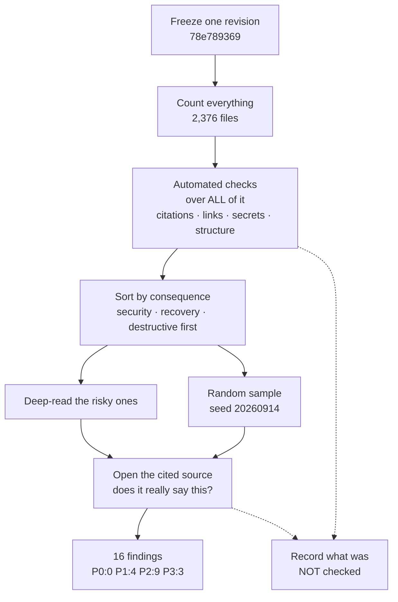

# Output 5 — Documentation audit report

## In plain terms

**What this is.** What I found when I ran the checklist over everything in `launchpad/`.

**Who it's for.** Maintainers deciding what to fix, and in what order.

**What to do with it.** Read the four P1 findings. They are the ones worth acting on this
week. Everything below P1 can wait.

**The short version.** Nothing dangerous. No leaked credentials, no broken security
reporting, no destructive command pointed at an unknown target. But two documents say a
sign-off check protects you and it does not exist; the coverage report flatters itself; and
93.7% of the corpus is still draft. I checked 43 of 122 items — **the other 79 were not
checked, which is not the same as them passing.**

### How the audit was run

*In words:* freeze one revision so every measurement refers to the same thing; run
automated checks across the whole population; sort what remains by how much harm an error
would cause; deep-read the risky material and a random sample; verify sampled claims by
opening the source they cite. Findings come out of that, and so does an explicit record of
everything left unchecked.

---

## Review identity and bounds

| Field | Value |
|---|---|
| **Object** | The `launchpad/` subtree of `launchpad-26/buzz` |
| **Frozen baseline** | `78e789369e3392f187e8c63753262669108fda81` (2026-09-14, `origin/launchpad`) |
| **Baseline history** | **Measured at `b4a78fe3b7c01da6a986f15e0021f5a486f9abc2`.** `origin/launchpad` advanced to the stated head while the review was running; the baseline was re-pointed only after every finding-bearing path was verified unchanged across the two revisions. See "Re-baselining" below |
| **Population** | 2,376 tracked files, of which **1,651 Markdown**. Within `launchpad/docs/corpus/` (excluding `schema/`): 748 files = **719 canonical nodes + 29 registered generated outputs** |
| **Criteria** | `03-master-checklist.md` v1.1 (122 items) |
| **Methods used** | Full-population deterministic census; purposive deep review of high-risk artefacts; a **seeded random discovery sample** (seed `20260914`, 6 nodes from a 727-node frame) |
| **Methods NOT used** | No reader, operator or contributor task testing. No rendered-surface accessibility evaluation. No screen-reader, keyboard, zoom or contrast exercise. No procedure executed end to end. No reviewer calibration. No statistical sample |
| **What this report may support** | A remediation baseline and a first risk-ranked worklist |
| **What it may NOT support** | Any statement that the corpus is correct, complete, accessible or usable. Deep review was purposive; per `14-documentation-review-at-corpus-scale.md` its results **must not be projected to the population** |

---

## Coverage declaration

| Layer | Coverage achieved |
|---|---|
| Deterministic checks (citations, links, relationships, secrets, structure) | **Census** — 100% of the in-scope population |
| Semantic claim verification | **4 claims across 4 nodes** from the random sample. 0.5% of nodes |
| Genre / architecture / procedure review | **Purposive** — entry points, standards, generated views, deploy runbooks |
| Accessibility | **Source-level only.** Rendered-surface conformance: `UNABLE_TO_ASSESS` |
| Task fitness | **Not assessed.** No reader was tested |

Checklist items assessed: **43 of 122**. The remaining 79 are `NOT_EVALUATED` — not passes.
This distinction is required by `FOUND-012` and is the single most important thing to
carry out of this report.

---

## Findings by priority

### P0 — Critical

**None confirmed.** Stated plainly rather than left implicit: the census found no exposed
credential, no unresolvable citation, no broken security-reporting route, and no
destructive instruction without a bounded target.

That is a real result, and it is bounded: it covers what deterministic checks and a
purposive review can reach. It does **not** establish that no P0 defect exists — the
classes with no mechanical enumerator (unstated prerequisites, usage constraints, negative
behaviour, per `F07`) were not assessed at all.

---

### P1 — High priority

#### F-01 · The DCO check that two entry points say is enforced does not run
- **Checklist** `DEV-008`, `AGENT-017` · **Status** `INCORRECT`
- **Existing evidence** `launchpad/AGENTS.md:395` — "The DCO check fails any commit without a `Signed-off-by` trailer"; `launchpad/README.md:123` — "the DCO check is not optional"; `launchpad/AGENTS.md:390` — "`-s` is required: DCO check".
- **Code evidence** 0 of **33** tracked files under `.github/workflows/` contain `dco` or `signed-off-by` (case-insensitive, whole-word). Independently: **39** distinct check runs on merged PR #2245 in `launchpad-26/buzz`, **zero** matching `dco|sign.?off`. Prior corroboration: `launchpad/Research/354-dco-check-on-vendor-drops.md` (2026-08-22, 40 PRs scanned).
- **Gap** An enforcement mechanism is asserted as fact in the fork's normative spec and its README. It does not exist in this fork. The sentence is true in the root `AGENTS.md`, which is upstream's guide — this is `F09`'s **A3 transplanted obligation** producing **A2 phantom enforcement**.
- **Risk** Contributors and agents rely on a gate that will never catch their mistake. Unsigned commits accumulate and are discovered later, when a branch must be rebased with `--signoff`.
- **Recommended action** Either install a DCO check and keep the sentence, or rewrite both sentences to state what actually enforces sign-off (the `commit-msg` hook `just hooks` installs, which `--no-verify` bypasses).
- **Destination** `launchpad/AGENTS.md` §6; `launchpad/README.md` "Opening a PR".
- **Effort** Small (text) or Medium (install the check). **Owner** Maintainer.
- **Validation** Re-run both checks; the sentence and the check-run list must agree.
- **Note on priority** The checklist default for `DEV-008` is P0 because enforcement claims can be security gates. This instance is rated **P1**: the consequence is process friction, not exposure. The priority model is applied to the finding, not inherited from the item.

#### F-02 · The generated coverage report's `documented` disposition is earned by file-level citation, not by documenting the item
- **Checklist** `FOUND-011`, `FOUND-004` · **Status** `INCORRECT`
- **Existing evidence** `launchpad/docs/corpus/generated/coverage.md` — "**37 of 408 in-scope source items are `GAP` rows at this revision**". Its own contract states `documented` is "earned by a canonical node's file/position citation".
- **Code evidence** Every `config:` row lists a near-identical set of ~46 crediting nodes. Sampled five nodes credited with documenting `config:PGPASSWORD` — `layers-data-redis-role`, `layers-networking-heartbeat`, `operations-runbooks-redis-unavailable`, `capabilities-git-git-object-storage`, `corpus-template-datastore` — **each mentions `PGPASSWORD` zero times**. Same result for `TYPESENSE_API_KEY`. 74 nodes cite `.env.example` at all.
- **Gap** Any node citing `.env.example` is credited with documenting *every* key in it — including a **template** being credited with documenting a production database password. The headline reads as 91% coverage; the numerator is not what a reader will take it to be.
- **Risk** Exactly `16-coverage-inflation.md`'s inventory substitution: the visible numerator grows faster than the definition of what must be covered, and the 37 real GAPs look like the whole gap.
- **Recommended action** Require key-level evidence (`\.env\.example:LINE` matching the key's line, or the key name appearing in the node) before awarding `documented`; re-run; expect the GAP count to rise substantially. Until then, add a sentence to `coverage.md` stating that `documented` means "some node cites the file this item lives in".
- **Destination** `launchpad/project-intelligence/corpus/index_defs/coverage.py`; regenerate `generated/coverage.md`.
- **Effort** Medium. **Owner** Developer.
- **Validation** After the change, a node crediting a config key must contain that key.
- **Credit where due** `coverage.md` is *honest about its mechanism* — it states the disposition rule in its own inclusion rules. The defect is that the headline number will be read as something the mechanism does not support.

#### F-03 · The corpus grew 3.5× while the count of `active` nodes did not move
- **Checklist** `GOV-010`, `FOUND-010` · **Status** `PARTIAL`
- **Existing evidence** At baseline: **47 `active`, 701 `draft`** (93.7% draft). The research baseline of 2026-09-08 recorded **47 active of 205**.
- **Code evidence** Front-matter census over all 748 files at the frozen revision.
- **Gap** 543 nodes were added in roughly eight days and not one was promoted. Either promotion is blocked on a gate nobody has run, or `draft` has become the corpus's resting state and carries no information.
- **Risk** `14-documentation-review-at-corpus-scale.md` warns that `draft` does not mean "ignore" — draft material is still found, cited, copied and used by agents. A 93.7% draft corpus that agents read as authoritative has a lifecycle vocabulary that is not doing any work.
- **Recommended action** Decide what promotion requires (`SYNTHESIS.md` adoption decision 3) and either promote a first tranche or state explicitly that `draft` is the expected steady state for generated-from-code nodes.
- **Destination** `launchpad/docs/corpus/standards/status.md`; a governance decision.
- **Effort** Large. **Owner** Human decision.
- **Validation** Either the active count moves, or the status standard says why it will not.

#### F-04 · Confidence values diverge from the standard that governs them, at scale
- **Checklist** `FOUND-011`, `AGENT-021` · **Status** `FAIL`
- **Existing evidence** `launchpad/docs/corpus/standards/confidence.md`: "Two decimal places are not warranted. The scale has no calibration behind it, so `0.83` claims a precision that nothing supports."
- **Code evidence** **349 of 794** `INFERENCE` confidence values (44.0%) use two decimals. The research measured 166 of 384 (43.2%) on 2026-09-09. The *rate held* while the absolute count more than doubled.
- **Gap** A documented rule with no checker does not propagate. The standard's own limitation — "Enforced mechanically: nothing" — is now demonstrated over a population 2× larger.
- **Risk** False precision. A reader comparing `0.83` and `0.85` is comparing noise.
- **Recommended action** Add a deterministic check to `validate.py` restricting `confidence` to the standard's declared band values. This is a Level-A predicate and is cheap.
- **Destination** `launchpad/project-intelligence/corpus/validate.py`.
- **Effort** Small. **Owner** Developer.
- **Validation** The check fails on a seeded two-decimal value and the corpus converges.

---

### P2 — Medium priority

#### F-05 · Audience overdeclaration has increased
- **Checklist** `FOUND-002` · **Status** `PARTIAL`
- **Evidence** **625 of 748** files (83.6%) declare ≥3 of the 4 permitted audiences; **127** declare all four; only 122 declare two, and one declares none. The research measured 75.1% at ≥3 on 2026-09-09.
- **Gap** The corpus's own entry point argues that `audiences` means "who this is written *for*", and calls its own exclusion of `agent` "the corpus's first deliberate audience *exclusion*". The permissive reading has won by a wider margin than when it was measured.
- **Risk** The field is satisfied syntactically and cannot route review or filtering.
- **Action** Either narrow the semantics (and lint for ≥3 as a review trigger) or redefine the field as "may read" and stop treating it as a pitch declaration. **Effort** Medium. **Owner** Maintainer.

#### F-06 · The confidence standard still carries visible merge damage
- **Checklist** `HUMAN-004`, `AGENT-023` · **Status** `INCORRECT`
- **Evidence** `launchpad/docs/corpus/standards/confidence.md` contains **2 H1 headings** and **3 `---` delimiters** in 417 lines. The duplicate `## Requirements`/`## MUST` headings the research found on 2026-09-09 have been fixed; the front-matter/H1 duplication has not, five days later.
- **Corpus-wide** **33 of 748** files contain more than one H1. 715 contain exactly one; none contain zero.
- **Gap** No tracked Markdown linter configuration exists anywhere in the repository (`markdownlint`, `.mdlrc`, `vale`, `remarkrc` — all absent), so nothing catches this class.
- **Risk** Low direct harm; high signal value. A structural defect survived five days in the standard whose subject is honest confidence, which is precisely `F13`'s "polished structure, corrupt substance".
- **Action** Repair the file; add a heading-structure lint. **Effort** Small. **Owner** Developer.

#### F-07 · Diagrams carry no accessible name or description
- **Checklist** `HUMAN-010`, `FOUND-008` · **Status** `PARTIAL`
- **Evidence** **68** Mermaid fences across the corpus; **0** occurrences of `accTitle` or `accDescr`. The research measured 28 fences / 0 accessibility metadata on 2026-09-08; both scaled.
- **Bounded** The active diagram standard requires every diagram claim to appear in prose, which may already supply an equivalent route. **I did not verify that it does**, for any diagram. The honest verdict is: accessible-name metadata is absent and prose equivalence is `UNKNOWN`.
- **Risk** Information available only visually, for an unknown share of 68 diagrams.
- **Action** Sample 5 diagrams; hide each and check the remaining prose supports the same conclusion. Add `accTitle`/`accDescr` where the renderer supports them. **Effort** Medium. **Owner** Technical Writer.

#### F-08 · Table density is the corpus's largest unassessed accessibility surface
- **Checklist** `HUMAN-012` · **Status** `UNKNOWN`
- **Evidence** **721 of 748** files (96%) contain a GFM table. GFM provides one header row and no caption, row-header or complex-header syntax.
- **Gap** Not assessed — no rendered surface was inspected. Recorded as `UNABLE_TO_ASSESS` rather than converted to a pass.
- **Risk** Wide grids carrying prose become unusable one cell at a time under assistive technology.
- **Action** Assess after the delivery surface is decided (see `HC-2`). **Effort** Medium. **Owner** Human decision, then Technical Writer.

#### F-09 · An archived deployment runbook containing destructive commands does not say it is archived
- **Checklist** `GOV-007`, `ARCH-010` · **Status** `INCORRECT`
- **Evidence** `launchpad/deploy/archived/runbooks/dev-deployment-SOP.md` opens identically to the live `launchpad/deploy/runbooks/dev-deployment-SOP.md` — same title, same "What you will have at the end" framing — with no superseded banner in its body. It contains `sudo rm -rf /opt/buzz/web /opt/buzz/admin-web` at line 3179.
- **Gap** The path says `archived/`; the document does not. `F09` D3 and `R07` are explicit that a superseded record retaining its prose "reads as though it still binds" — and a search hit or an agent's retrieval does not show the reader a directory name.
- **Risk** An operator or agent follows a retired procedure containing destructive steps.
- **Action** Add a superseded banner above the first heading naming the live replacement. **Effort** Small. **Owner** DevOps.
- **Validation** The first screen of the archived file says it is archived.

#### F-10 · A destructive command's rationale is placed after the block that contains it
- **Checklist** `HUMAN-008` · **Status** `PARTIAL`
- **Evidence** `launchpad/deploy/runbooks/dev-deployment-SOP.md:3004` runs `ssh … 'sudo rm -rf /opt/buzz/web /opt/buzz/admin-web'`. The explanation — "The `rm -rf` first matters: copying onto an existing folder nests the files *inside* it" — appears **after** the code block.
- **Bounded assessment** This is `R08`'s "warnings after commitment" pattern, but the consequence here is low: the targets are explicitly named, narrow, and on a disposable local dev VM (`127.0.0.1:2222`). It is a `PARTIAL`, not a `FAIL`, and P2 rather than P0. Rated on consequence, not on pattern match.
- **Action** Move the rationale above the block. **Effort** Small. **Owner** DevOps.

#### F-11 · The subtree's entry point does not route to contribution, licence or conduct guidance, and the root guidance it would inherit is disavowed
- **Checklist** `GOV-001`, `GOV-002`, `GOV-003`, `START-002` · **Status** `PARTIAL`
- **Evidence** `launchpad/README.md` contains **zero** mentions of `CONTRIBUTING`, `LICENSE`, or `CODE_OF_CONDUCT`. Those files exist at the repository root. But `launchpad/AGENTS.md:29–32` states that the root `CLAUDE.md`/`AGENTS.md` are "upstream's contributor guide" and that for cohort work "that guidance **is wrong, not merely irrelevant**".
- **Gap** A contributor to `launchpad/` who follows the root `CONTRIBUTING.md` is following a process the fork explicitly disavows, and nothing in the subtree's entry point tells them otherwise.
- **Risk** Wasted contributor effort; contributions shaped by the wrong process.
- **Action** Add a short routing block to `launchpad/README.md`: what governs contributions here (`launchpad/AGENTS.md`), what the licence is, where the code of conduct lives. **Effort** Small. **Owner** Maintainer.

---

#### F-15 · Almost nothing carries a diagram, and no entry point does
- **Checklist** `READER-002`, `ARCH-002` · **Status** `FAIL`
- **Evidence** **67 of 748** corpus files (8%) contain a Mermaid diagram. Of the seven top-level entry points — `README.md`, `AGENTS.md`, `ARCHITECTURE.md`, `VISION.md`, `REQUIREMENTS.md`, `SECURITY-POSTURE.md`, `ENVIRONMENTS.md` — **none contains a diagram at all**, including `ARCHITECTURE.md`.
- **Gap** `R10` is explicit that topology, sequence, containment and relationships are the shapes prose carries worst. An architecture document with no diagram asks every reader to rebuild the structure from sentences, and they will each rebuild it differently.
- **Risk** `F14`'s divergent mental models, entering through the front door rather than through drift.
- **Recommended action** Add one diagram per entry point, and to corpus nodes whose subject has parts, steps or states. Mermaid — it is text, it diffs, and it renders on GitHub. Each diagram needs an equivalent description in words (`HUMAN-010`), or it trades one access problem for another.
- **Destination** The seven entry points first; then architecture and flow nodes.
- **Effort** Medium. **Owner** Technical Writer + Developer.
- **Validation** Re-run the count. Every entry point has a diagram and a text equivalent.

#### F-16 · Whether documents open with a readable summary is unverified
- **Checklist** `READER-001` · **Status** `PARTIAL`
- **Evidence** **628 of 748** corpus files (83%) have more than 80 characters of prose between the title and the first subheading, so the *shape* of an opening summary is common. All seven entry points have one (322–452 characters).
- **Bounded — and this is the point** A block of intro prose is not the same thing as a summary a non-specialist can read and understand in 30 seconds. Establishing that requires reading each one against a timer, with someone who is not its author. **I did not do that**, so this is `PARTIAL`, not a pass.
- **Risk** The measurable proxy looks healthy while the property that matters is untested — which is the failure mode `F07` names as structural completeness substituting for substantive completeness.
- **Recommended action** Timer-test the seven entry points with someone who did not write them. That is an hour of work and it converts an unknown into a result.
- **Effort** Small. **Owner** Human.
- **Validation** A recorded result per entry point: what is this, who is it for, what do I do next — answered inside 30 seconds.

---

### P3 — Low priority

#### F-12 · Two relative links do not resolve
- **Checklist** `START-002` · **Status** `FAIL` · Of **745** relative links checked, **2** are broken (99.7% resolve).
- `launchpad/docs/corpus/schema/README.md` → `../../plans/2026-08-25-issue-622-corpus-schema.md` (resolves to `launchpad/docs/plans/`; the file is at `launchpad/plans/` — needs `../../../`).
- `launchpad/docs/corpus/standards/linking.md` → `../../decisions/ADR-0028-corpus-canonical-representation.md` (same off-by-one; file is at `launchpad/decisions/`).
- **Action** Fix both paths. **Effort** Small. **Owner** Developer. **Validation** Re-run the link check.

#### F-13 · A public test fixture contains a high-entropy synthetic token indistinguishable from a real credential
- **Checklist** `OPS-011` · **Status** `PASS with observation`
- **Evidence** `launchpad/agents/the-professor/tools/contract/fixtures/block-api-key.md` contains a 44-character token with 40 distinct characters. The file is a deliberate fixture for a secret-*blocking* tool, sits beside `block-private-key.md`, `block-password-literal.md` and 40 other fixtures, and states in its own body "placeholder shape only, never a real credential".
- **The value was not reproduced at any point in this review**, in line with `R15`'s stop-and-route rule.
- **Observation** It is benign, and it is also indistinguishable from a live key to GitHub secret scanning, to any external scanner, and to a future reader. Every scan of this repository will keep surfacing it.
- **Action** Make fixture tokens unmistakably non-functional (an `EXAMPLE_`/`NOTAREALKEY_` prefix, or a charset no provider issues) and record the allowlist. **Effort** Small. **Owner** Developer.
- **Confirmation still wanted:** a human who owns the fixture should confirm it was synthesised, not copied. A shape check cannot establish that.

#### F-14 · Twenty-nine nodes use quoted YAML scalars where the rest of the corpus does not
- **Checklist** `AGENT-023` · **Status** `PARTIAL`
- **Evidence** 29 nodes write `status: "draft"`, `type: "governance"`, `origin: "launchpad"` and quoted audience values; 85 evidence entries use `entry_class: "FACT"`.
- **Bounded** YAML parses `"draft"` and `draft` to the same string, so **schema validation is unaffected and these nodes are valid**. This is a source-consistency observation, not a defect.
- **Action** Normalise, or state in the standard that both forms are acceptable. **Effort** Small. **Owner** Developer.

---

## Human confirmation required

| ID | Question | Why research cannot answer it |
|---|---|---|
| **HC-1** | What is the documentation obligation register for `launchpad/`? | Every coverage number, including `coverage.md`'s own, has an undeclared denominator until this exists (`R04`) |
| **HC-2** | Which rendered surface is official, at what WCAG level, and who owns renderer-controlled failures? | `R13` poses this and explicitly declines to answer it |
| **HC-3** | Under what licence is `launchpad/` documentation published? | Legal decision |
| **HC-4** | Which of the eight hard gates block a merge? | `SYNTHESIS.md` adoption decision 1; an advisory gate documented as enforced is `F09`'s durable failure |
| **HC-5** | Is `draft` the intended steady state for generated-from-code nodes? | Governance decision underlying F-03 |
| **HC-6** | Was the `block-api-key.md` fixture token synthesised rather than copied? | A shape check cannot establish provenance |

---

## Not applicable

| Item | Reason |
|---|---|
| `GOV-008` (changelog) | `launchpad/` is a subtree of a fork, not a released artefact. The root `CHANGELOG.md` is upstream's |
| `API-004` (rate limits) | The `launchpad/` subtree exposes no API of its own |
| `HUMAN-008` for `layers/data/postgres/partitions.md` and `layers/security/provider-boundary.md` | `DROP TABLE` and `rm -rf` appear there only as **quoted test inputs** for injection-rejection tests, not as instructions |

---

## Positive results

The corpus requires that positive findings be recorded, not only defects. These are the
strongest, and several represent remediation of defects the research itself found.

| Result | Measurement |
|---|---|
| **Citation resolution** | **0 unresolved** repo-path citations of **18,715**, across 20,680 citation strings in 748 files |
| **Positional citation bounds** | **0 out-of-bounds** line/range citations (symlink-resolved) |
| **Relationship integrity** | **1,341** typed edges, **0 unresolved targets** |
| **Relationship coverage** | **516 of 748** files (69%) declare relationships, up from 89 of 205 (43%) at the research baseline |
| **Link health** | 743 of 745 relative links resolve (99.7%) |
| **Credential hygiene** | 0 matches for AWS, GitHub, Slack, Google or PEM private-key patterns. One match, a self-labelled fixture (F-13) |
| **Claim entailment** | **4 of 4** claims sampled from the seeded random sample are exactly supported by their cited source at the cited line range — including a verbatim module-doc quotation. *Not projectable* |
| **Generated-view discipline** | Every generated index declares generator, script, inputs, ordering, input digest, and **both** inclusion and exclusion rules; `stale-docs.md` explicitly refuses to claim a flagged node's FACT is false, "which AGENTS.md itself calls 'a narrowing step, not a certification'" |
| **Denominator honesty** | `INDEX.md` states 719 canonical nodes, names all 29 excluded generated outputs, and reports "0 discovered file(s) failed to parse or validate" |
| **Remediated since the research** | The README/AGENTS **approving-review contradiction** (found by reports 10, 14 and 15 as a live defect on 2026-09-09) is **fixed** — both now say "one" |
| **Remediated since the research** | The **32 out-of-bounds** positional citations and **309 nonexistent-path** citations measured on 2026-09-06 are now **zero** |

---

## Methodological corrections made during this audit

Recorded because `F02` requires that tool-mediated evidence failures be visible rather
than silently absorbed. Three of my own checks produced false positives and were
corrected before any finding was drawn from them:

1. **50 "broken links"** — an artefact of extracting only `launchpad/` from the archive, so
   links to files outside it appeared unresolvable. Re-run against the full tracked file
   list: **2** genuine.
2. **18 "out-of-bounds citations"** — all to `CLAUDE.md`, which is a **symlink** (mode
   `120000`) to `AGENTS.md`. My line counter read the 1-line symlink blob. Symlink-resolved:
   **0**.
3. **A 29-node "discrepancy"** between my 748-file count and `INDEX.md`'s declared 719 —
   my arithmetic, not the index's. 748 − 29 registered generated outputs = 719. The index
   was correct and had stated its exclusions explicitly.

Each is an instance of the failure class the corpus documents: a tool's contract misread
as a fact about the repository.

---

## Re-baselining after PR #2259

Every measurement in this report was taken at
`b4a78fe3b7c01da6a986f15e0021f5a486f9abc2`. PR #2259
(`feature/2151-professor-discoverability`) subsequently merged, advancing
`origin/launchpad` to `78e789369e3392f187e8c63753262669108fda81` across 13 commits.

`git merge-base --is-ancestor b4a78fe3b 78e78936` exits 0, so the measured revision is a
genuine **ancestor** of the stated one rather than merely older by date — the test
`AGENT-024` requires, because in a merge-based history those two orders disagree.

The corpus's own provenance rule — and this checklist's `FOUND-010` and `AGENT-024` —
forbid advancing a recorded revision unless every claim is known to hold at the new one.
So the baseline was **not** simply updated. Each path carrying a finding was diffed
between the two revisions:

| Path | Files changed between baselines |
|---|---|
| `.github/workflows/` | 0 |
| `launchpad/AGENTS.md` | 0 |
| `launchpad/README.md` | 0 |
| `launchpad/docs/corpus/` | 0 |
| `launchpad/deploy/` | 0 |
| `launchpad/agents/the-professor/tools/contract/fixtures/` | 0 |

All six are byte-identical, so **all 16 findings hold unchanged**. F-01 was additionally
re-verified directly at the new head: `launchpad/AGENTS.md` still asserts the DCO check,
and 0 of 33 workflow files reference `dco` or `signed-off-by`.

What #2259 did change: `launchpad/agents/the-professor/**` (README, persona, seven
`SKILL.md` files) and one added plan document. It also registered the Professor's skills
at the repository root by symlink, creating nine new symlinks under `.claude/skills/` and
nine under `.agents/skills/`.

**One consequence for future audits.** The symlink count in this repository has gone from
one (`CLAUDE.md`) to nineteen. `AGENTS.md` §4 already requires symlink resolution before
checking line bounds — that rule was written because a naive line count of `CLAUDE.md`
returns 1 and produced 18 false positives during this audit. It now matters eighteen times
more.

**Not re-run at the new head:** the full citation, link, relationship and secret censuses.
They were not re-run because their input trees are byte-identical, which is a stronger
guarantee than re-running would provide. Had any corpus path differed, the census would
have been repeated rather than carried forward.
