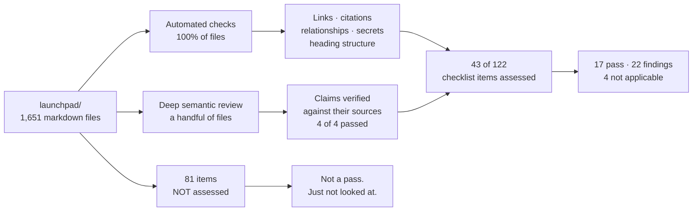

# Output 6 — Existing-document coverage matrix

## In plain terms

**What this is.** A table of every documentation area under `launchpad/` — what it is for,
whether I checked it, and what state it is in.

**Who it's for.** Anyone asking "was *my* area looked at?" and anyone deciding how much of
the audit to believe.

**What to do with it.** Find your area in the tables. `NOT_ASSESSED` means I did not look —
it does not mean the area is fine.

**The one thing to know.** I assessed 43 of 122 checklist items. The strongest material is
the corpus standards and the generated indexes. The biggest unreviewed risk is
`docs/corpus/operations/` — 36 nodes covering backup, restore and disaster recovery, none
of them checked.

### What was and was not covered

*In words:* automated checks ran across all 1,651 files; deep semantic review touched only
a handful. Together they covered 43 of the 122 checklist items, producing 17 passes, 22
findings and 4 not-applicable results. The remaining 81 items were not assessed at all, and
that is recorded as an absence of evidence rather than as a pass.

---

Baseline `78e789369e3392f187e8c63753262669108fda81`. Rows are the documentation
*surfaces* under `launchpad/`, not individual files — 1,651 Markdown files cannot be
tabulated one per row, and a surface is the unit at which ownership and action apply.

**Accuracy status** uses the audit vocabulary: `PASS` / `PARTIAL` / `FAIL` /
`INCORRECT` / `STALE` / `UNKNOWN` / `NOT_ASSESSED`. `NOT_ASSESSED` is not a pass.

---

## A. Entry points and governance (8 files)

| Surface | Purpose | Audience | Checklist areas covered | Missing areas | Accuracy | Staleness risk | Recommended action |
|---|---|---|---|---|---|---|---|
| `launchpad/README.md` | Human entry point to the cohort subtree | Developer, contributor | START-001, START-002 (partly), ARCH-001 pointer | GOV-001/002/003 routing **added in this branch**; licence ownership still undecided (`HC-3`) | `PARTIAL` → **`PASS`** on both audited counts. It repeated the DCO enforcement claim (F-01) and lacked governance routing (F-11); **both fixed in this branch**. The approving-review count was already **correct** | **High** — restates facts owned by `AGENTS.md` | Done (roadmap 0.1b, 0.6). The new routing table *names* `HC-3` rather than answering it |
| `launchpad/AGENTS.md` | The fork's normative spec; supersedes root guidance under `launchpad/` | Agent, developer, reviewer | FOUND-003, AGENT-001/002/003, DEV-008, GOV-004 | — | `INCORRECT` at §6 (DCO) → **`PASS`**, fixed in this branch; otherwise strong — it records its own prior error about review counts with the measurement that corrected it | Medium | Done (roadmap 0.1a) |
| `launchpad/VISION.md` | Intent and status of the programme | All | ARCH-010, FOUND-003 | — | `PASS` — the four-marker system (`IMPLEMENTED`/`DECIDED`/`PROPOSED`/`OPEN`) with per-row evidence is the corpus's own best worked example of `ARCH-010`, and it warns that a section marker does not inherit to a later row | Medium | Preserve. Use as the model for `ARCH-010` elsewhere |
| `launchpad/ARCHITECTURE.md` | System architecture for the cohort's operation | Developer, operator | ARCH-001, ARCH-005 | ARCH-006 data flow; ARCH-009 background jobs | `NOT_ASSESSED` | Medium | Assess in the first deep-review tranche |
| `launchpad/SECURITY-POSTURE.md` | Public security posture and the public-repository rule | All | OPS-008, OPS-009 | — | `PASS` — cited by `15-security-and-disclosure-quality…` as a worked example of publishing the stable model while withholding a live control-state map | **High** — posture claims are the most perishable content class | Assign an owner and a review trigger (`FOUND-009`) |
| `launchpad/REQUIREMENTS.md` | Cohort requirements | All | FOUND-003 | — | `NOT_ASSESSED` | Medium | Assess |
| `launchpad/ENVIRONMENTS.md` | Environment inventory | Operator | START-005, ARCH-008 | — | `NOT_ASSESSED` | **High** — environment facts move fastest | Assess early |
| `launchpad/AGENT_PR_TEMPLATE.md` | PR template with security and secret-check prompts | Agent | AGENT-013, OPS-013 | — | `PASS` on inspection — carries security-implication, secret-check and never-deferrable prompts | Low | Preserve |

---

## B. The canonical corpus — `launchpad/docs/corpus/` (748 files)

| Surface | Files | Purpose | Audience | Areas covered | Missing | Accuracy | Staleness risk | Action |
|---|---|---|---|---|---|---|---|---|
| `standards/` | 19 | The corpus's own rules: evidence, confidence, provenance, atomicity, naming, linking, status, diagrams, normative language | Agent, developer, reviewer | FOUND-003/004/010/011/012, AGENT-014/020/021/024 | — | `PARTIAL` — substantively the strongest material in the subtree; `confidence.md` carries structural merge damage (F-06) and its own rule is 44% unmet (F-04) | Medium | Repair `confidence.md`; add the band-value check |
| `templates/` | 26 | Genre contracts per node type | Agent | R02 genre overlays; `API-012` | — | `NOT_ASSESSED` | Low — templates change slowly | Assess against `R02`'s eight families |
| `architecture/` | 47 | Context, container, deployment, flow, principle views | Developer, operator | ARCH-001…005 | ARCH-006, ARCH-009 | `NOT_ASSESSED` — the research found (2026-09-07) 48 nodes all `draft`, 7 with diagrams, 2 with relationships; relationship coverage has since risen corpus-wide to 69% | Medium | First deep-review tranche |
| `layers/` | 170 | Cross-cutting system layers — the largest single group | Developer | ARCH-006/007, API-008 | — | `NOT_ASSESSED`; 2 of 4 random-sample claims verified here | Medium | Sample-based review |
| `capabilities/` | 140 | Product capabilities | Developer, reviewer | R02 G01 | — | `NOT_ASSESSED` | Medium | Sample-based review |
| `operations/` | 36 | Runbooks, databases, deployment, reliability | Operator | OPS-004…007 | — | `NOT_ASSESSED` — **highest-consequence unreviewed group** | **High** | **Review first** (see roadmap) |
| `verification/` | 45 | CI, test contracts, assurance | Reviewer | DEV-002/004, FOUND-011 | — | `NOT_ASSESSED`; 1 random-sample claim verified here | Medium | Sample-based review |
| `interfaces/`, `events/` | 64 | WebSocket, HTTP, event kinds | Developer | API-001…005, API-011 | — | `NOT_ASSESSED`; 1 random-sample claim verified here | **High** — protocol surfaces move | Deep review after operations |
| `platforms/`, `implementation/`, `ingestion/`, `development/`, `releases/`, `agents/`, `governance/`, `specifications/`, `decisions/` | 221 | Remaining subject surfaces | Mixed | Various | — | `NOT_ASSESSED` | Medium | Sample-based |
| `generated/` (21) + `INDEX.md` + `GLOSSARY.md` + 6 others | 29 | Deterministic projections | Agent, reviewer | AGENT-010, FOUND-011 | — | `PARTIAL` — **exemplary** provenance and exclusion discipline; `coverage.md`'s disposition rule inflates its numerator (F-02) | Low (regenerated) | Fix `coverage.py` |
| `README.md`, `AGENTS.md` | 2 | Corpus entry points and authoring contract | Agent | AGENT-001…005 | — | `PARTIAL` — `README.md` was described by the research as "a much earlier state of construction"; not re-verified here | Medium | Re-verify against the current 719-node corpus |

---

## C. Operational and deployment documentation

| Surface | Files | Purpose | Audience | Areas covered | Missing | Accuracy | Staleness risk | Action |
|---|---|---|---|---|---|---|---|---|
| `deploy/runbooks/` | live SOPs | Stand up a dev environment end to end | Operator, newcomer | OPS-004, START-003/004/007, HUMAN-006 | — | `PARTIAL` — a destructive step's rationale follows the block (F-10). Otherwise unusually complete: every command written out, nothing hidden in a script | **High** — environment-bound | Move the rationale; assign an owner |
| `deploy/archived/` | archived SOPs | Superseded procedures | — | GOV-007 | — | `INCORRECT` → **`PASS`** — the archived SOP did not say it was archived while containing destructive commands (F-09); **banner added in this branch**, naming the live replacement | **High** | Done (roadmap 0.2). `GOV-007` across all 67 ADRs remains open at Stage 2.5 |
| `deploy/` (compose, configs) | 41 md + configs | Deployment configuration | Operator | API-008/009 | OPS-001/002 logging and monitoring | `NOT_ASSESSED` | **High** | Assess with operations |

---

## D. Working and research material

| Surface | Files | Purpose | Audience | Accuracy | Staleness risk | Action |
|---|---|---|---|---|---|---|
| `plans/` | 439 | Per-issue implementation plans | Agent, developer | `NOT_ASSESSED` — by genre these are `G07` historical records, not current guidance | **Low if labelled historical; high if read as current** | Confirm they carry a historical marker (`ARCH-010`); they are the largest single group in the subtree and the most likely to be retrieved as if current |
| `Research/` | 98 | Deep-research reports, including the 41-file corpus this framework derives from | Reviewer, decision owner | `PASS` on discipline — every report carries explicit evidence limitations and labels interpretation | Medium — pinned to revisions that have moved | Preserve. Re-verify any report's local counts before quoting them (this audit did) |
| `skills/`, `agents/`, `review-agent/` | 185 | Agent skill and persona definitions | Agent | `NOT_ASSESSED` | Medium | Assess against section I |
| `decisions/` | 67 | ADRs | All | `NOT_ASSESSED` | Low | Check `GOV-007` supersession marking across all 67 |
| `project-intelligence/` | 29 md + 523 py | Corpus tooling and contracts | Developer, agent | `PARTIAL` — `validate.py`, `stale.py` and `indexes.py` state their own boundaries unusually well, and the audit relied on those statements | Medium | Extend `validate.py` with the confidence band check |

---

## E. Coverage of the checklist by surface

| Checklist section | Items | Assessed | Passed | Findings | Not applicable | Not assessed |
|---|---|---|---|---|---|---|
| A · Foundations | 12 | 7 | 3 | 4 | 0 | 5 |
| B · Getting started | 9 | 3 | 2 | 1 | 0 | 6 |
| C · Architecture | 10 | 2 | 1 | 1 | 0 | 8 |
| D · Developer workflows | 12 | 3 | 2 | 1 | 0 | 9 |
| E · Interfaces and contracts | 13 | 3 | 2 | 0 | 1 | 10 |
| F · Operations, security, reliability | 15 | 8 | 5 | 2 | 1 | 7 |
| G · Governance | 10 | 5 | 0 | 4 | 1 | 5 |
| H · Human-readable | 14 | 5 | 0 | 4 | 1 | 9 |
| I · Agent-readable | 25 | 5 | 2 | 3 | 0 | 20 |
| 0 · Reader-first | 2 | 2 | 0 | 2 | 0 | 0 |
| **Total** | **122** | **43** | **17** | **22** | **4** | **79** |

A finding count of 22 against 16 numbered findings is expected: one finding can fail
several items. F-11 alone fails `GOV-001`, `GOV-002`, `GOV-003` and `START-002`.

**Read this table as it is written.** 79 items were not evaluated. That is a statement
about the depth of this audit, not about the quality of the documentation. Per
`FOUND-012` and `14-documentation-review-at-corpus-scale.md`, an unevaluated item is not
a pass and must never be counted as one.
