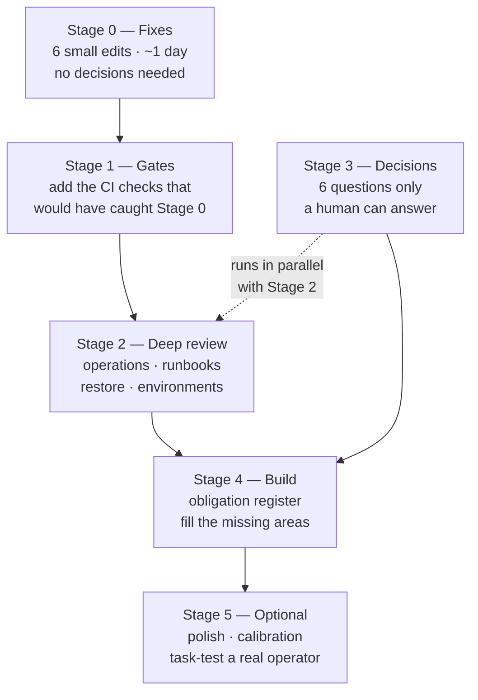

# Output 7 — Documentation improvement roadmap

## In plain terms

**What this is.** What to fix, in what order, and why that order and not another.

**Who it's for.** Whoever is planning the work.

**What to do with it.** Start at Stage 0. It is six small fixes and takes about a day. Do
not skip ahead to the big review — the later stages depend on decisions and gates that come
first.

**The one thing to know.** Two decisions block most of the measurable work: nobody has
declared **what documentation this project owes**, and nobody has named **which rendered
page is the official one**. Until those exist, any coverage number or accessibility verdict
is built on sand.

### The order, and why



*In words:* fixes first because they need no decisions. Then the automated gates, so
reviewer attention is not spent on things a script can catch. Then deep review of the
highest-consequence content. The six human decisions run in parallel with that review,
because the building work in Stage 4 cannot start without them. Optional polish comes last.

---

Ordered so that foundational work lands before anything that depends on it. The
dependency column names the reason for the order, not a preference.

**Effort key** — Small: under an hour. Medium: half a day to two days. Large: a week or
more, or a decision that cannot be rushed.

---

## Stage 0 — Immediate fixes — ✅ **DONE in this branch**

Small, unambiguous, no decision required. Every one is a text or config change with a
mechanical validation step. All six were applied here; each row records the validation that
was actually run, not the one that was planned.

| # | Action | Finding | Effort | Status | Validation run |
|---|---|---|---|---|---|
| 0.1 | Correct the DCO enforcement sentences in `launchpad/AGENTS.md` and `launchpad/README.md` to describe the `commit-msg` hook rather than a CI check | F-01 | Small | ✅ Done | Workflow grep re-run: still 0 of 33. Both sentences now describe the hook as **adding** the trailer (`lefthook.yml:73-76`, `git interpret-trailers --in-place`), not rejecting — the hook has no failure path |
| 0.2 | Add a superseded banner above the first heading of `launchpad/deploy/archived/runbooks/dev-deployment-SOP.md` | F-09 | Small | ✅ Done | Banner is the first content after the H1 and names `../../runbooks/dev-deployment-SOP.md` |
| 0.3 | Move the `rm -rf` rationale above the code block in `launchpad/deploy/runbooks/dev-deployment-SOP.md` | F-10 | Small | ✅ Done | Warning at line 3003, command at line 3013 — verified by line number, not by eye |
| 0.4 | Fix the broken relative link in `schema/README.md` | F-12 | Small | ✅ Done | `../../plans/` → `../../../plans/`; target resolves. **The second link in this row was withdrawn** — it was my checker's false positive, not a defect (audit report, correction 4) |
| 0.5 | Repair the duplicated front matter and second H1 in `launchpad/docs/corpus/standards/confidence.md` | F-06 | Small | ✅ Done | 1 H1, 2 delimiters, front matter parses, **14 evidence entries preserved** including the orphaned `TEAM_KNOWLEDGE` entry. `validate.py` exits 0 with 0 errors |
| 0.6 | Add a governance routing block to `launchpad/README.md` | F-11 | Small | ✅ Done (partial by design) | All four root targets verified present. Routes to them **and states which apply to this fork**; `HC-3` (licence) is named as undecided rather than answered |

**Why these first.** None needed a decision, none could be got wrong, and 0.1 removed a
false statement from the two documents every contributor and agent reads first.

**What Stage 0 taught, which matters more than the fixes.** Two rows changed shape once
the work was actually done — 0.4 lost half its scope to a false positive in my own tooling,
and 0.5 turned out to be a *recovery* rather than a deletion, because the stray lines were
a provenance entry whose loss the schema validator would not have caught. Both are the same
lesson: **a fix planned from a finding must be re-derived against the file before it is
applied.** A roadmap row is a hypothesis about a repository, and Stage 1 exists precisely
because hypotheses like these should be checked by machines rather than by memory.

---

## Stage 1 — Close the checks that would have caught Stage 0 (next two weeks)

Turning one-off fixes into gates. Each of these is a Level-A deterministic predicate in
`F19`'s terms — cheap, reproducible, and safe to block on.

| # | Action | Serves | Owner | Effort | Depends on | Validation |
|---|---|---|---|---|---|---|
| 1.1 | Add a `confidence` band-value check to `validate.py`, restricting values to the bands `standards/confidence.md` declares | F-04, `FOUND-011` | Developer | Small | 0.5 | Check fails on a seeded `0.83`; the 349 existing violations become visible and convergeable |
| 1.2 | Add a Markdown structure lint (one H1, no skipped heading levels, no duplicate H2 within a document) | F-06, `HUMAN-004`, `AGENT-023` | Developer | Small | 0.5 | Fails on a seeded second H1; the 33 multi-H1 files are enumerated |
| 1.3 | Add the relative-link resolution check to CI, scoped to `launchpad/**` | F-12, `START-002` | Developer | Small | 0.4 | Fails on a seeded broken link |
| 1.4 | Add an enforcement-claim check: grep the documentation for "check fails", "is enforced", "is required by CI", and require each hit to name a mechanism that exists | F-01, `DEV-008`, `AGENT-017` | Developer | Medium | 0.1 | The check reproduces F-01 on the pre-fix revision and passes after |
| 1.5 | Fix `coverage.py` so a config key earns `documented` only from key-level evidence, then regenerate | F-02 | Developer | Medium | — | A node crediting a config key contains that key. Expect the GAP count to rise well above 37 — **that is the check working** |

**Why before Stage 2.** Stage 2 is expensive human review. Running it while these
predicates are unenforced means paying reviewer attention for defects a script can catch,
which is exactly the misallocation `F19`'s reliability ladder exists to prevent.

---

## Stage 2 — First deep-review tranche (weeks 3–6)

The first genuinely risk-based review. Ordered by consequence, per
`14-documentation-review-at-corpus-scale.md`'s census-plus-sampling design.

| # | Action | Serves | Owner | Effort | Depends on | Validation |
|---|---|---|---|---|---|---|
| 2.1 | Census-review all 36 `operations/` nodes against `OPS-004…007` — runbooks, backup/restore, disaster recovery | Highest-consequence unreviewed group | Operator + Maintainer | Large | 1.1–1.3 | Each node has a recorded result in the five-state vocabulary; every `unable to assess` names what blocked it |
| 2.2 | Execute the dev-deployment SOP end to end from a clean environment, recording every prerequisite you had to supply yourself | `START-003`, `START-004`, `START-007`, `OPS-004` | Operator | Large | 0.2, 0.3 | A recorded execution with environment, outcome and the list of unstated prerequisites. This is the only reliable test for `F07`'s O1 class |
| 2.3 | Exercise **restore**, not backup, in a representative environment | `OPS-006` | DevOps | Medium | 2.1 | A dated restore record. Absent one, `OPS-006` fails regardless of how good the backup documentation is |
| 2.4 | Review `launchpad/ENVIRONMENTS.md` and `deploy/` configuration against `API-008` | Fastest-moving content | Operator | Medium | 1.5 | Sampled settings match the loader, not the example file |
| 2.5 | Check all 67 ADRs for supersession marking (`GOV-007`) | F-09 generalised | Maintainer | Medium | — | Every superseded record carries the marker above its body |

---

## Stage 3 — Decisions that unblock everything measurable (parallel with Stage 2)

These are not tasks; they are decisions. They are listed here because several Stage 4
items cannot start without them, and because leaving them open is itself the highest-
leverage unresolved risk in the subtree.

| # | Decision | Blocks | Owner | Effort |
|---|---|---|---|---|
| 3.1 | **HC-1** — Declare the documentation obligation register for `launchpad/`: which content areas the subtree owes, to which audiences | Every coverage number, including `coverage.md`'s own | Human decision | Large |
| 3.2 | **HC-4** — Decide which of the eight hard gates block a merge | Whether the checklist is policy or advice. An advisory gate documented as enforced is F-01 repeated | Human decision | Medium |
| 3.3 | **HC-5** — Decide whether `draft` is the intended steady state for generated-from-code nodes, or define what promotion requires | F-03; the meaning of the entire status vocabulary | Human decision | Medium |
| 3.4 | **HC-2** — Name the official rendered surface and its accessibility target, and who owns renderer-controlled failures | All of `FOUND-008`, `HUMAN-010`, `HUMAN-012` | Human decision | Medium |
| 3.5 | **HC-3** — Decide the documentation licence for `launchpad/` | `GOV-003` | Human decision | Small |
| 3.6 | **HC-6** — Confirm the `block-api-key.md` fixture token was synthesised, not copied | F-13 | Developer who owns the fixture | Small |

**Recommended order:** 3.6 first (one minute, closes a security question), then 3.2 and
3.3 (cheap, and they determine how everything else is reported), then 3.4, 3.5, and 3.1
last — 3.1 is the largest and benefits from what Stage 2 learns.

---

## Stage 4 — Medium-term (months 2–3)

| # | Action | Serves | Owner | Effort | Depends on | Validation |
|---|---|---|---|---|---|---|
| 4.1 | Build the obligation register decided in 3.1 and map existing nodes to it bidirectionally | `R04`'s coverage model; makes any completeness claim meaningful for the first time | Maintainer | Large | 3.1 | Every obligation has a disposition; every node traces to an obligation or gets an explicit orphan disposition |
| 4.2 | Resolve the `audiences` semantics: narrow it and lint ≥3 as a review trigger, or redefine it as "may read" | F-05 | Maintainer | Medium | 3.1 | The field's meaning is stated and the corpus converges on it |
| 4.3 | Sample 5 diagrams: hide each, check the surrounding prose supports the same conclusion; add `accTitle`/`accDescr` where supported | F-07, `HUMAN-010` | Technical Writer | Medium | 3.4 | A recorded equivalence check per sampled diagram |
| 4.4 | Assess table accessibility on the official rendered surface | F-08, `HUMAN-012` | Technical Writer | Medium | 3.4 | A linearisation result for a sample of the 721 table-bearing files |
| 4.5 | Fill the nine `ABSENT` content areas the obligation register confirms are owed — most likely repository structure, background jobs, migrations, logging, performance | `02-corpus-gap-analysis.md` §3 | Developer + Operator | Large | 4.1 | Each new area has a node and an obligation it satisfies |
| 4.6 | Adopt the checklist's section I into `launchpad/AGENTS.md` | `AGENT-001…025` | Maintainer | Medium | 3.2 | `AGENTS.md` states precedence, boundaries, do-not-modify paths, stop rules and the definition of done |

---

## Stage 5 — Optional refinements

Real improvements, low urgency. Do not let them displace Stages 0–3.

| # | Action | Serves | Effort |
|---|---|---|---|
| 5.1 | Normalise the 29 quoted-YAML-scalar nodes, or state in the standard that both forms are acceptable | F-14 | Small |
| 5.2 | Make fixture tokens unmistakably non-functional and record the scanner allowlist | F-13 | Small |
| 5.3 | Re-verify `launchpad/docs/corpus/README.md` against the current 719-node corpus | Coverage matrix §B | Small |
| 5.4 | Confirm the 439 files in `plans/` carry a historical marker so retrieval cannot surface them as current guidance | `ARCH-010`; the largest single group in the subtree | Medium |
| 5.5 | Run a reviewer calibration trial on 6 nodes spanning three genres, and measure disagreement by criterion | `14`'s stage 7; nobody has measured agreement on these criteria | Medium |
| 5.6 | Task-test one operator journey with a real operator | `R06`; the single thing no evidence in this whole programme has ever established | Large |

**5.6 deserves a note.** Across 41 research files and this audit, **no reader, operator or
contributor has ever been tested**. Every claim about usability, findability and task
fitness in the corpus and in this framework is a diagnosis of missing evidence. One real
operator attempting one real task would produce more usability evidence than everything
written so far.

---

## Dependency graph

```
0.1 ─────────────────────────────► 1.4
0.4 ─────────────────────────────► 1.3
0.5 ──┬──────────────────────────► 1.1
      └──────────────────────────► 1.2
0.2, 0.3 ────────────────────────► 2.2
1.1, 1.2, 1.3 ───────────────────► 2.1 ───► 2.3
1.5 ─────────────────────────────► 2.4
3.1 ──┬──────────────────────────► 4.1 ───► 4.5
      └──────────────────────────► 4.2
3.2 ─────────────────────────────► 4.6
3.4 ──┬──────────────────────────► 4.3
      └──────────────────────────► 4.4
```

---

## What this roadmap deliberately does not do

- **It does not schedule a full deep review of all 719 nodes.** `14-documentation-review-at-corpus-scale.md`
  is explicit that deep review of everything is usually infeasible and that equal-depth
  review of low-risk leaves and destructive recovery procedures is a misallocation.
- **It does not set a target coverage percentage.** Until 3.1 lands there is no
  denominator, and a percentage without one is the defect F-02 describes.
- **It does not promise the corpus will be correct at the end.** It will have fewer known
  defects, more of its claims mechanically checked, and — most importantly — an honest
  record of what remains unassessed.
