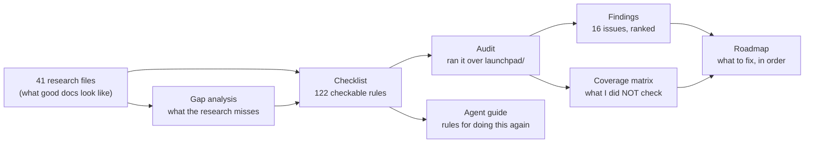

# Documentation review framework and audit

## In plain terms

**What this is.** A list of 122 things you can check to find out whether a piece of
documentation can actually be relied on — plus a report on what happened when I ran those
checks over everything in `launchpad/`.

**Who it's for.** Anyone writing or reviewing docs here, and any agent doing the same job.

**What to do with it.** Read the summary below, then the five urgent actions at the bottom
of this page. That is enough to act. Everything else is reference.

**The short version of the result.** The docs are mechanically excellent — nearly every
link, citation and cross-reference resolves. But almost none of it has been checked for
whether it is *true and useful*, 93.7% is still marked draft, and two documents claim a
safety check exists that does not.

### How the pieces fit together

*In words:* the research corpus feeds two things — the checklist of rules, and an analysis
of what the research does not cover. Running the checklist over `launchpad/` produces both
a list of findings and an honest record of what went unchecked. Those two together produce
the roadmap. Separately, the checklist feeds a guide so an agent can repeat the review.

---

A reusable checklist for creating, reviewing and auditing software documentation, derived
from the 41-file research corpus at `launchpad/Research/documentation-corpus-review/`,
plus an audit of the `launchpad/` subtree against it.

| Output | File |
|---|---|
| 1 · Executive summary | this file, below |
| 2 · Research source inventory | [`01-source-inventory.md`](01-source-inventory.md) |
| 3 · Corpus gap analysis | [`02-corpus-gap-analysis.md`](02-corpus-gap-analysis.md) |
| 4 · Master checklist (122 items) | [`03-master-checklist.md`](03-master-checklist.md) |
| 5 · Audit report | [`04-audit-report.md`](04-audit-report.md) |
| 6 · Coverage matrix | [`05-coverage-matrix.md`](05-coverage-matrix.md) |
| 7 · Improvement roadmap | [`06-roadmap.md`](06-roadmap.md) |
| 8 · Human review guide | this file, below |
| 9 · Agent execution guide | [`AGENTS.md`](AGENTS.md) |
| 10 · Machine-readable checklist | [`checklist.yaml`](checklist.yaml) |
| — · Generator for output 10 | [`generate_checklist_yaml.py`](generate_checklist_yaml.py) |

**Editing the checklist:** change `03-master-checklist.md`, then run
`python3 generate_checklist_yaml.py` from this directory. Never hand-edit
`checklist.yaml` — it is overwritten, and the generator fails loudly rather than silently
dropping an item it cannot parse.

---

## Output 1 — Executive summary

**What was reviewed.** All 41 files of the documentation-corpus-review research (none
excluded, none unreadable), and the `launchpad/` subtree of `launchpad-26/buzz` at frozen
revision `78e789369e3392f187e8c63753262669108fda81` — 2,376 tracked files, 1,651 Markdown,
including 719 canonical corpus nodes and 29 registered generated outputs.

**Overall health: structurally excellent, semantically unverified.**

The `launchpad/` documentation has the strongest mechanical integrity I can measure. Every
one of **18,715 repository-path citations resolves**, and across the **20,680 citations**
parsed in total not one positional citation points past the end of its file. All
**1,341 relationship edges** resolve. **744 of 745** relative links
work — and **745 of 745** after the Stage 0 fixes in this branch. (That figure was
originally reported as 743; one of the two "broken" links was my own checker's error, not
the repository's. Audit report, methodological correction 4.) There are no exposed
credentials. The generated indexes declare their generator,
inputs, ordering, input digest, and both inclusion *and* exclusion rules — and explicitly
refuse to overclaim beyond what a `git diff` establishes.

That is not the same as being correct, and the corpus's own research is the authority for
that distinction. **93.7% of nodes are `draft`.** The count of `active` nodes — 47 — has
not moved while the corpus grew from 205 to 719. No reader, operator or contributor has
ever been tested against any of it.

**Strongest areas.** Evidence discipline (4 of 4 randomly sampled claims verified exactly
against their cited source at the cited line range, including a verbatim module-doc
quotation); citation and relationship integrity; generated-view provenance;
`launchpad/VISION.md`'s per-claim status markers; `SECURITY-POSTURE.md`'s handling of the
public/private boundary.

**Most serious gaps.**

1. **A gate that does not exist is documented as enforced.** `launchpad/AGENTS.md:395` and
   `launchpad/README.md:123` both state the DCO check rejects unsigned commits. Zero of 33
   workflows reference it; zero of 39 check runs on a real merged PR match it.
   **Fixed in this branch** — both sentences now describe what actually happens: no CI
   check, a `commit-msg` hook that *adds* the trailer rather than rejecting, and upstream
   as the place its absence bites.
2. **The generated coverage report inflates its own numerator.** `37 of 408 GAP` reads as
   91% coverage, but `documented` is earned by a node citing `.env.example` at all — five
   nodes credited with documenting `PGPASSWORD` mention it zero times, including a
   *template*.
3. **There is no declared documentation obligation register**, so no coverage number in
   the subtree — including that one — has a denominator anyone has agreed.
4. **A 44% divergence from the corpus's own confidence standard persisted and doubled** as
   the corpus grew, because the rule has no checker.

**Immediate risks.** None rated P0. No credential exposure, no unresolvable citation, no
broken security-reporting route, no destructive instruction with an unbounded target. That
result is bounded by method: the failure classes with no mechanical enumerator — unstated
prerequisites, usage constraints, negative behaviour — were **not assessed at all**.

**Findings.** P0: 0 · P1: 4 · P2: 9 · P3: 3 · Human confirmation required: 6.

**Coverage.** 43 of 122 checklist items assessed. 17 pass, 22 findings, 4 not applicable.
**79 items were not evaluated — which is not the same as passing them.**

**Recommended first action — already done.** The two DCO sentences (roadmap 0.1) are
corrected in this branch, along with the other five Stage 0 fixes. That was the right
first move because it removes a false statement from the two documents every contributor
and agent reads first, and it is the cleanest instance of the failure the research corpus
argues is the most durable: a fabricated gate reads as diligence.

**So your actual first action** is a decision, not an edit: **`HC-4` — which of the eight
hard gates block a merge?** Everything in Stage 1 depends on it, because a gate you have
not decided to enforce cannot be built into CI, and documenting it as enforced anyway is
how F-01 happened in the first place.

---

## Output 8 — Human review guide

Written to be usable without reading the research corpus first.

## What this checklist is for

It helps you answer one question about a piece of documentation: **can the person it is
for actually rely on it?** Not "is it tidy", not "does it have the right headings" — those
are easy to satisfy and easy to fake.

## How to use it

**Start with the audience, not the document.** Every item assumes you can name who the
document is for and what they are trying to do. If you cannot, stop there — that is
`FOUND-001` and it is the first finding.

**Do not run all 122 items on everything.** That would be a waste and the corpus says so
directly. Instead:

1. Run the cheap mechanical checks across everything (links, citations, structure,
   secrets). A script does this.
2. Pick the documents where being wrong would hurt most — anything about recovery,
   deletion, security, deployment, or credentials.
3. Review those properly, with the source open beside them.
4. Pick a few more at random. If the random ones turn up something your risk list missed,
   your risk list was wrong — widen it.

**Record what you did not check.** This is the part people skip and it matters more than
the passes. A review that says "47 items checked, 73 not evaluated" is far more useful
than one that says "looks good".

## Reading the statuses

| Status | Plain meaning |
|---|---|
| `PASS` | I checked, and it holds |
| `PARTIAL` | It is there but it is not enough |
| `FAIL` | It should be here and it is not |
| `INCORRECT` | It says something the code or configuration contradicts |
| `STALE` | It was true once |
| `NOT_APPLICABLE` | It genuinely does not apply here — **and here is why** |
| `UNKNOWN` | I could not tell |
| `HUMAN_CONFIRMATION_REQUIRED` | Someone with authority has to decide |

The two that get abused are `PASS` and `NOT_APPLICABLE`. **A heading existing is not a
pass.** And `NOT_APPLICABLE` without a reason is just a skipped item wearing a nicer label.

## Reading the priorities

- **P0** — someone could lose data, leak a credential, or break production.
- **P1** — someone will waste a day, or make the same mistake repeatedly.
- **P2** — someone will be confused and work it out.
- **P3** — it would be nicer.

Rate the **finding you found**, not the checklist item's default. An item can be P0 as a
class and P2 in the instance in front of you. Saying so is part of the work, not a
softening of it.

## What you must check by hand

No tool can do these, and no amount of automation will change that:

- **Does the source actually say this?** Open it. A resolvable link is not support.
- **Is anything missing?** Tools find what is there. They cannot find what should have
  been written and was not. This is the single hardest class and it is where a human who
  knows the system is irreplaceable.
- **Would a newcomer get stuck?** Unstated prerequisites are invisible to every check that
  reads rather than runs.
- **Is this actually enforced?** If a document says a check rejects something, go and look.
- **Is this safe to copy and paste?**

## Questions worth asking a maintainer

- Who decides what documentation this project owes?
- If this document were wrong, how would anyone find out?
- What is the last thing that broke because documentation was wrong?
- Which of these documents would you not trust?
- Who fixes this when it is wrong?

## Resolving uncertainty

**Write down that you are uncertain.** The corpus's most consistently supported finding
across 20 separate reports is that agents — and people — fill gaps with plausible text
rather than marking them. "I could not determine this" is a better result than a
confident guess, and it is a valid deliverable here.

If two documents disagree, **do not pick one.** Record both and escalate. The disagreement
is the most valuable thing you have found; resolving it quietly destroys it.

## How often to review

- **When the thing it describes changes** — this catches most of it.
- **When something breaks** and documentation was involved.
- **On a schedule, for the dangerous things only** — recovery, security, deployment.
- Not on a uniform calendar for everything. Age is not the signal; change is.

## How to avoid this becoming box-ticking

The corpus is blunt about this and so is this guide:

- **Never publish a single quality score.** It hides exactly the failure it should surface.
- **Never report a green CI run as a documentation result.** It proves its own predicate.
- **Never let "we told the agent to be accurate" count as a control.** There is a direct
  measurement that an accuracy instruction roughly *doubled* overgeneralisation.
- **Expect the checks that actually work to be unpopular.** Controlled studies found the
  interventions that most reduced overreliance were the ones people rated worst. A review
  that feels frictionless is weak evidence that it is working.
- **If every item passes, be suspicious of the review, not pleased with the corpus.**

---

## The five most urgent actions

*Action 1 as originally written — correct the DCO enforcement claim — is **done in this
branch**, together with the rest of Stage 0. It is replaced below by the decision that now
blocks the most work.*

1. **Decide which of the eight hard gates block a merge (`HC-4`).** Stage 1 cannot start
   without it: every check it would add needs a decision that the gate is enforced. Deciding
   nothing and documenting enforcement anyway is exactly how F-01 arose. *(HC-4, roadmap 1,
   decision only)*
2. **Fix `coverage.py` so `documented` requires key-level evidence**, and regenerate.
   Expect the GAP count to rise well above 37 — that is the check working. *(F-02,
   roadmap 1.5, Medium)*
3. **Confirm the `block-api-key.md` fixture token was synthesised, not copied.** One
   minute of a human's time closes a security question a shape check cannot. *(F-13,
   roadmap 3.6, Small)*
4. **Exercise a restore** — not a backup — in a representative environment and record it.
   `OPS-006` fails by default until someone has. *(roadmap 2.3, Medium)*
5. **Decide whether `draft` is the intended steady state** for 93.7% of the corpus, or
   define what promotion requires. *(F-03, HC-5, roadmap 3.3, Medium)*

## Questions that need answers from maintainers

| | Question | Why I cannot answer it |
|---|---|---|
| HC-1 | What documentation does `launchpad/` owe, to whom? | Until this exists, no coverage number has a denominator — including `coverage.md`'s own |
| HC-2 | Which rendered surface is official, at what WCAG level, and who owns renderer failures? | Report 13 poses this and explicitly declines to answer it |
| HC-3 | Under what licence is `launchpad/` documentation published? | Legal decision |
| HC-4 | Which of the eight hard gates block a merge? | Governance decision; an advisory gate documented as enforced is F-01 repeated |
| HC-5 | Is `draft` the intended steady state for generated-from-code nodes? | Governance decision |
| HC-6 | Was the `block-api-key.md` fixture token synthesised rather than copied? | A shape check cannot establish provenance |

## Claims I could not independently verify

Stated explicitly rather than left to inference:

1. **That no DCO check runs anywhere.** I verified 0 of 33 workflows and 0 of 39 check
   runs on one merged PR. A GitHub App that never ran, or a ruleset requiring a context
   that has never been reported, would not appear in either. The prior research recorded
   the same limit — it could not enumerate installed apps without `admin:org`.
2. **That the 68 Mermaid diagrams lack an equivalent text route.** I verified that zero
   carry `accTitle`/`accDescr`. I did **not** check whether the surrounding prose supplies
   equivalence, which the diagram standard requires. Recorded as `UNKNOWN`, not as a fail.
3. **Anything about the rendered surface.** No page was rendered, no screen reader,
   keyboard, zoom or contrast test was run. All accessibility conformance is
   `UNABLE_TO_ASSESS`.
4. **Anything about task fitness.** No reader, operator or contributor was tested. Every
   usability statement here is a diagnosis of missing evidence.
5. **That the 4 verified sample claims represent the population.** They do not. The sample
   was 4 claims across 4 nodes of 719, and `14-documentation-review-at-corpus-scale.md`
   forbids projecting from a sample this size.
6. **Every quantitative figure quoted from the research corpus.** The corpus states in
   twenty separate reports that its magnitudes were transferred from adjacent settings and
   that none is a measurement of this repository. I re-measured every local figure I
   relied on; I did not re-derive any external study.

## Recommended next review step

**Run roadmap Stage 0 (six small fixes, about a day), then Stage 1's five deterministic
gates.** Do not start a deep review before the gates exist — reviewer attention spent on
defects a script can catch is the misallocation the whole framework exists to prevent.

Then the first deep-review tranche should be `docs/corpus/operations/` (36 nodes) together
with the deploy runbooks, because that is where a documentation defect becomes data loss,
and it is the largest unreviewed high-consequence group in the subtree.

The highest-value single item in the whole roadmap is the cheapest thing nobody has done:
**give the dev-deployment SOP to one person who has not used it, and watch.**
