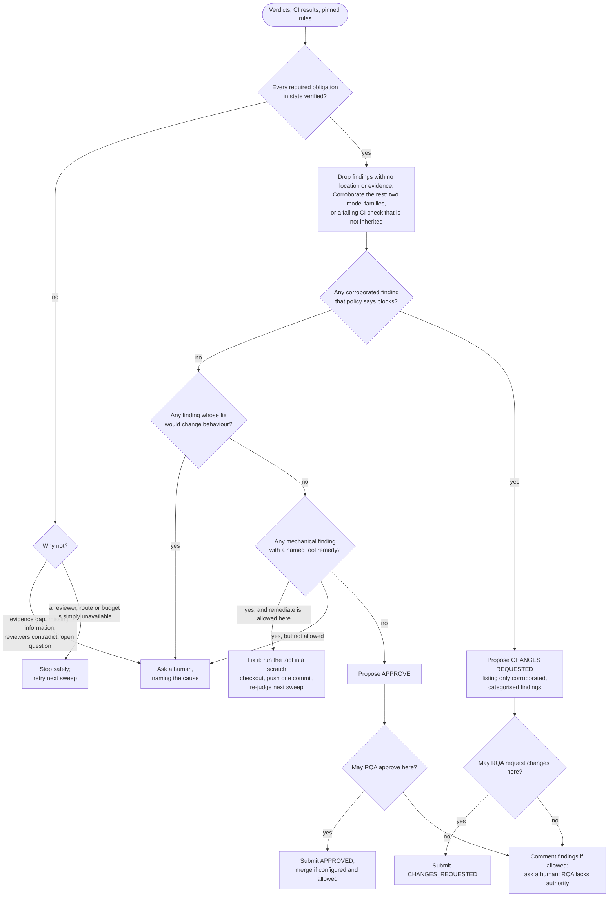
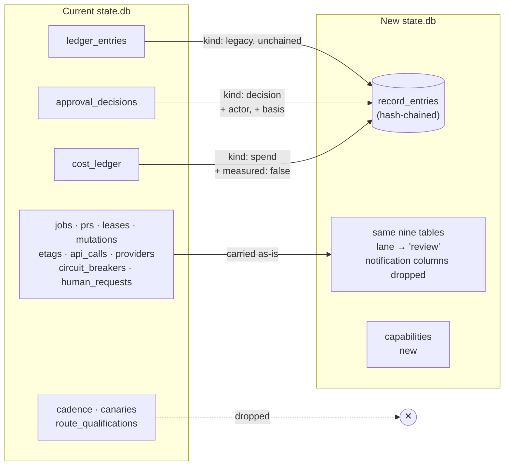

# RQA — the architecture

This is the complete design of Review Queue Automation (RQA), written to be read top to bottom by a
person. The four files beside it are C4 views of the same design — [`context.md`](context.md) (the
system and its neighbours), [`container.md`](container.md) (what runs and what it stores),
[`components.md`](components.md) (the parts inside and their contracts) and
[`flow-review-lifecycle.md`](flow-review-lifecycle.md) (one review, step by step) — and they carry the
tables, identifiers and citations that the consistency checker and the decomposition work depend on.
Read this document first. Go to a view when you need the exact contract behind a sentence here.

Nothing in this document is new information; every statement is pinned in one of the views. The four
decisions this description assumed are now ratified (§18); where a sentence rests on one that is not,
it says so.

---

## 1. What RQA is, in one paragraph

RQA is a program that runs on one person's machine, unattended, every few minutes. Each time it runs
it looks at the pull requests open on the repositories it has been told about, gets an AI to review
each one against *that repository's own* written rules, decides — deterministically, from the evidence
and the rules — whether the pull request should be approved, sent back, fixed on the spot, or put in
front of a human, and then does exactly as much of that as the repository has permitted it to do.
Every decision and every action is written to a tamper-evident record, so that one command can later
explain who reviewed a pull request, under which rules, what they examined, what they found, and why
the outcome followed.

## 2. Why it exists

The problems it solves are the ones the product requirements document names, and they reduce to
four:

- **"Approved" means nothing consistent.** Every reviewer, human or AI, reviews to their own standard
  and blocks at their own threshold, so GitHub's review state does not tell you whether a change was
  actually examined.
- **Nobody writes down who reviewed or what they checked.** An approval satisfies merge mechanics
  and preserves no evidence.
- **The same unchanged code is reviewed again and again**, and a formatting nit uses the same
  "changes requested" mechanism as a security hole, so model budget and human attention are spent
  where they do nothing.
- **Humans are interrupted for things that need no judgement**, and the things that do need judgement
  are buried in the noise.

RQA's answer is one protocol per repository, one record per review, one place that decides, and a
strict rule that a human is asked only when a human is genuinely needed.

## 3. The shape of the thing

RQA is **one process and one directory**. There is no server, no daemon, no hosted service and no
database server: a scheduler (launchd on a Mac) launches the `rqa` command, it does a sweep, it exits.
Its state is a SQLite file plus some folders in a directory it owns. Its credential is the operator's
own GitHub login, borrowed through `gh auth token` — by decision, not by accident: personal access
tokens and GitHub Apps are out of scope for this version because of organisation policy, and the
consequence (that the login can reach repositories RQA does not manage) is accepted for now and will be
addressed outside this project.

Around it sit eight things it talks to:

| Neighbour | What crosses the boundary |
|---|---|
| **The operator**, who is also the human RQA asks when it needs a decision | Repository configuration; the GitHub login; answers to escalations; the questions "what state is this PR in?" and "why did that happen?" |
| **GitHub** | RQA reads pull requests, diffs, files and CI results; it writes reviews, comments, merges and — for mechanical fixes — commits pushed to the PR's own branch. Every write is permitted per repository and per kind of action. |
| **The review harness** — the program that actually runs an AI model | RQA hands it an evidence bundle and a definition of what a review is; it hands back a structured verdict. Any harness that speaks the published file-based contract can take part; RQA's own source does not change to admit one. |
| **An external model provider**, if the repository allows one | RQA never calls a provider itself. It decides *whether* the repository's content may leave the machine and names the route before handing the bundle to the harness; the harness does the sending. |
| **Each managed repository** | Supplies its rules in a file, `.rqa/config.json`, re-read on every sweep. Changing the rules needs no rebuild or redeploy. |
| **The OS scheduler** | Launches a sweep every few minutes. |
| **The OS keychain** | Holds the one key that seals the review record; RQA reads it, never writes it. Absent key means "unverifiable", never "stopped". |
| **Local tool processes** | The formatters in RQA's closed set, and `git`, run in a scratch checkout for a mechanical fix. |

Everything else — the parts described in §5 — lives inside the one process.

## 4. What happens to a pull request

The whole design is easiest to hold as the story of one pull request. The precise contract behind each
step is in `flow-review-lifecycle.md`.

**Finding it.** A sweep starts. RQA reads each managed repository's `.rqa/config.json`; a repository
whose config is missing or invalid is refused outright, with the reason, and nothing runs for it. For
each admitted repository RQA asks GitHub for the open pull requests and creates one **job** per pull
request *per commit*. If a pull request it already has a job for has moved to a new commit, the old
job is marked superseded and a new one begins. This is what stops the same revision being reviewed
twice.

**Permission to look.** Before touching the pull request on GitHub, RQA pins the repository's rules
into a snapshot for this job — so an edit to the rules mid-review cannot change what this review is
judged against — and asks a single question of its authority gate: *may I review pull requests on this
repository?* If not, the job goes straight to "awaiting human judgement" with a note that RQA lacks
authority here. If so, RQA assigns itself to the pull request (a lease, so two sweeps never review the
same PR at once) and fetches the diff, the files, the CI results and the labels.

**Not redoing work.** If this pull request was reviewed at an earlier commit, RQA compares the two
commits and works out which of the review's obligations the change actually invalidates. The rest are
carried forward as evidence — pointing at the earlier judgement and the attestations that established
them — and only the invalidated ones are re-run. A push that changes nothing material re-runs nothing:
judgement still runs, over the carried evidence alone, and still writes its entry, so the record
shows a real judgement with zero new attestations rather than a gap.

**Choosing a reviewer, and paying for it.** For each obligation that needs a model, the harness
interface resolves the route the repository configured — which harness, which model, which provider — checks the repository
allows content to go to that provider (and that this particular change has not been flagged as
"do not send"), and probes that the route is alive. Then it reserves budget against every limit the
repository configured. If the route is down and a fallback is configured, it uses the fallback; if
none is configured it *invents none* and the job stops in a clean, resumable state. If a budget limit
is reached, no model is called, and the job either falls back to a cheaper configured route, stops as
explicitly incomplete, or asks a human — never proceeds to a success.

**Running the review.** RQA plans the review from the pinned rules — which obligations, which
reasoning strategy, how many independent reviewers — builds the evidence bundle, and marks every byte
that came from the pull request itself as *data, not instructions*, so that nothing an author writes
in a diff or a description can steer the reviewer. It hands the bundle to the harness and gets back a
`verdict.json`. It checks the verdict is well-formed against the published protocol; a malformed one is
discarded and the next candidate tried. It writes down, itself, what actually ran — harness, model,
provider — rather than trusting the model's account of itself.

**Deciding what it means.** Judgement is deterministic from the panel (including its post-attempt
evidence cutoff), coherent GitHub facts, carried evidence and pinned rules. It materialises an evidence
state per obligation, multi-category findings, the blocking set, CI attribution and disposition.

**Acting on it.** The judgement proposes one of four things, and each is gated by the same question —
*may RQA do this here?* — asked of the same gate with a different argument:

- *Approve* or *request changes*: RQA submits the review on GitHub, and if the repository has also
  enabled merging after review, merges.
- *Fix it*: only an exact closed-tool remedy is eligible. RQA validates confined changed files, applies
  the formatter outside every checkout, proves the actual before/after syntax behavior-equivalent,
  requires exact scope/check/fixpoint, then pushes one commit only to the PR's own validated,
  unprotected, policy-allowed head repository/ref—never force or merge.
- *Ask a human*: RQA writes down exactly what it needs decided — one of five named causes — and
  stops. No notification is sent. The human reads the pending list and answers with a command,
  naming themselves and their reason.

If the repository has not enabled the action the judgement calls for — an "advisory-only" repository
that lets RQA comment but not approve — RQA posts its findings as a comment where it may, and asks a
human with the cause *RQA lacks authority here*. The human acts on GitHub and records what they did;
RQA verifies it and closes the job with that as the outcome.

**Remembering it.** Every one of the steps above — the plan, what was reused, what ran, what it cost,
the judgement, each permission asked and answered, each action taken, each escalation and each human
answer — is appended to the job's record as it happens, in the same transaction as the state change
it describes. If the record cannot be written, the step does not happen and the job stops safely.

## 5. The parts inside

The process is made of thirteen parts. They exist because requirements need them, not because the
current code is arranged that way; `components.md` §4 gives each one's justification, and §5 there
assigns every one of the 86 requirements to exactly one accountable part. Read them in five groups.

**Finding and holding work.** *Intake* runs the sweep, finds pull requests, creates jobs and holds the
lease. *Lifecycle* is the single owner of a job's state: it is the only part that moves a job from one
state to another, and every other part's output is a *value* it interprets — a permission, a refusal,
a judgement, a pushed commit — never a state change made behind its back. That single ownership is what
makes "no success while anything is unsatisfied" one proof rather than one per code path.

**Knowing the rules.** *Policy* reads, validates and pins each repository's configuration. *Protocol*
is the one published definition of what a review is — its obligations, its finding categories, its
seven evidence states, what blocks, what "complete" means — as a JSON schema plus prose; every verdict
is validated against it, and it is the contract an external harness writes to.

**Getting a review.** *Reviewer supply* chooses routes, enforces the external-provider permission,
walks configured fallbacks and nothing else, and reserves budget before any spend. *Harness interface*
is the only part that runs an AI: it plans, bundles, invokes through the published contract, attests
what ran, and classifies failures.

**Deciding and acting.** *Judgement* turns evidence into a decision basis (§6). *Authority gate* is one
function — may RQA do *this activity* on *this repository*? — for six activities: review, comment,
approve, request changes, remediate, merge. All six are off until a repository turns them on; a
malformed policy grants nothing. *GitHub adapter* is the only part that talks to GitHub, and every
write it makes is idempotent. *Remediation* applies mechanical fixes under the bounds above.
*Escalation* is the human seam: durable, named questions and recorded, named answers.

**Remembering and reusing.** *Record* owns the one append-only, hash-chained log per job and the
`explain` command that reconstructs any outcome from it alone. *Revision reuse* works out what a new
commit invalidates.

Where the current code had the same responsibility spread across several files — authority checked in
six places, three of them never wired; state changed by whichever module got there first; the human's
"approved" written straight into the decision table without re-checking anything — the design puts it
in one part. Those three consolidations are argued in `components.md` §8.

## 6. How a pull request's fate is decided

The AI's verdict is *input*, not the decision. Judgement decides, and it is deterministic: the same
verdicts, CI results and rules always give the same answer.

**First, is the review complete?** The protocol names the obligations a review must discharge for this
kind of change. Each one ends in exactly one of seven states: verified, not verified, unavailable,
contradictory, failed, incomplete, unknown. Only *verified* counts. A review with any obligation in
another state is unsatisfied, and an unsatisfied review can never end in approval — not by any path,
not under any pressure.

**Second, what do the findings mean?**

- A finding with no location or no evidence is dropped; there is nothing to act on.
- Every finding carries at least one category from the two named groups — *mechanical, procedural,
  creation-time* or *correctness, security, architectural, evidence* — and may carry more, plus open
  tags, so a formatting complaint and a vulnerability are never the same kind of thing in the record,
  even when both block. A finding with any substantive category is never mechanical.
- A finding **blocks** only if the repository's policy says its kind blocks **and** it is corroborated:
  two independent model families agree, or a real failing CI check backs it. One model's severity
  never blocks on its own.
- A failing CI check that also fails on the base branch is **inherited**: it is recorded and stated,
  and it is not held against the pull request.
- A pull request whose content tries to manipulate the reviewer is itself a blocking finding, at
  every authority level. RQA detects this structurally, not by phrase-matching: a broken or forged
  data envelope in any PR field, or a verdict that finds nothing wrong on a diff that touched
  obligations requiring evidence, is recorded as a blocking `evidence` finding and needs a second
  reviewer family before anything can be approved.

**Third, what should happen?**

| The judgement finds | Proposed outcome |
|---|---|
| Every obligation verified, nothing blocking | **Approve** |
| A blocking finding stands | **Request changes**, listing only corroborated, categorised findings |
| The only outstanding finding is mechanical — it carries an exact remedy (a tool from RQA's closed set, the paths it may change, the check that must pass), has no substantive category, and the reviewer asserts it is behaviour-preserving — and remediation is permitted | **Fix it**, then re-judge the new commit |
| A decision RQA cannot make: an unresolved question, reviewers who contradict each other, an evidence gap, information RQA lacks, or an action RQA is not permitted to take | **Ask a human**, naming which of those five and why |
| A finding whose fix would change the software's behaviour, however small | Never mechanical — **ask a human** |


The same logic as a flowchart:



Then the authority gate decides whether the repository has actually enabled the proposed action. RQA
never closes or "denies" a pull request; its only negative verdict is *request changes*. A pending CI
run, a rate limit or a spent budget never asks a human: RQA waits, stops safely, or degrades to a
configured alternative.

## 7. What a repository controls

Everything a repository can decide lives in its `.rqa/config.json`, read fresh on every sweep and
pinned per job:

- **Which of the six activities RQA may perform** — review, comment, approve, request changes,
  remediate, merge. Each independent; each off by default. A repository that enables none of them is
  never touched.
- **Which harness, model and provider** to use, in what fallback order, and how many independent
  reviewers a change of a given risk needs.
- **Whether content may go to an external provider**, and a label an author or operator can put on one
  pull request to say "not this one".
- **The review policy itself**: which obligations apply to which paths, what blocks, which finding
  categories count as mechanical (from a closed set RQA defines — policy chooses from it, it cannot
  widen it), and which tools may be run to fix them.
- **Budget limits** per pull request, per day, per model.

A repository controls nothing about *how* RQA judges — the evidence-state rule, corroboration and
inherited-check attribution are the protocol's, so that "approved by RQA" means the same thing on
every repository.

## 8. What RQA writes down

One record per job, append-only, each entry hash-chained to the one before, written by one part and
never by reviewed content or model output. Its entries are the plan; what was reused and what was
re-run; the attestation of what ran; what it cost, and whether that figure was measured or estimated;
the judgement in full; every permission asked and its answer; every action taken; every escalation and
every human decision, with the human's name and stated basis. A non-authoritative trace of milestones
sits beside it for observability.

```mermaid
flowchart LR
  L[legacy rows<br/>no hash, never verified] -.-> T1
  T1["1 transition<br/>queued→claimed<br/>prev: —"] --> P["2 plan<br/>prev: h1"]
  P --> C["3 carry_over<br/>reused 8, re-run 2<br/>prev: h2"]
  C --> G1["4 grant<br/>review: yes<br/>prev: h3"]
  G1 --> AT["5 attestation<br/>harness X, model Y<br/>prev: h4"]
  AT --> SP["6 spend<br/>1,240 tokens, measured<br/>prev: h5"]
  SP --> J["7 judgement<br/>10 verified, 0 blocking<br/>prev: h6"]
  J --> G2["8 grant<br/>approve: yes<br/>prev: h7"]
  G2 --> AC["9 action<br/>APPROVED, mutation id<br/>prev: h8"]
  AC --> T2["10 transition<br/>submitting→approved<br/>prev: h9"]
  T2 --> X([rqa explain reads the chain end to end<br/>and stops at the first row whose hash does not match])
```




Each row's hash covers its own content and the previous row's hash, so altering, removing or
reordering any row breaks every hash after it. `explain` recomputes the chain before it trusts a row.

`rqa explain` reconstructs, from that record alone and without contacting GitHub or a model, every
element the requirements demand: the exact commit, the protocol and policy in force, who and what
reviewed, what was examined, what was found, the basis of the decision and the outcome. `rqa status`
reports where a pull request is now — being reviewed, blocked, awaiting remediation, awaiting human
judgement, review-complete, or unable to progress — and why.

Existing records from the current implementation are carried across but marked as a legacy segment
without integrity guarantees, because retrofitting provenance onto history is out of scope.

## 9. What keeps it safe

Seven properties the design is built to hold, each in one place so it can be proved once:

1. **No success while anything is unsatisfied** — the state machine has no path from an unsatisfied
   judgement, a refused budget or an unavailable route to an approved state.
2. **No action without permission** — one gate, asked before every action, with the activity as its
   argument; a missing or unreadable policy grants nothing.
3. **Pull-request content is data, never instructions** — provider role separation and nonce envelopes
   are mandatory, every verdict reports semantic injection attempts, and every adapter passes paired
   clean/adversarial conformance before registration.
4. **Remediation is bounded** — exact files, closed deterministic tools, semantic equivalence proof,
   scratch worktree, pinned fork policy and exact unprotected PR head; never force or merge.
5. **Provenance is written by RQA** — a harness's or model's account of itself is input RQA records,
   not a write it performs; the record is tamper-evident within the operator's machine.
6. **Content leaves the machine only where the repository said it may**, and RQA names the route before
   it does.
7. **Reaching a limit never produces a green review** — budget is reserved before spend and a refusal
   is a value the state machine cannot turn into success.

## 10. Data model

Everything RQA persists lives in one directory. The tables are SQLite; the rest are files. One part
writes each; `container.md` §5 is the authoritative ownership table.

**Working state (SQLite, `state.db`)**

| Table | One row per | Key fields | Written by |
|---|---|---|---|
| `jobs` | pull request × commit | `repo`, `number`, `head_sha`, `status`, `snapshot_hash`, `predecessor_job` | Intake creates; Lifecycle owns `status` |
| `pr_facts` | pull request | head, base, author, labels, last seen | Intake |
| `leases` | claimed pull request | job, GitHub assignee node id, claimed at | Intake |
| `snapshots` | pinned policy version | `hash`, activated at, the validated config as JSON | Policy |
| `capabilities` | repository × job | which of the six activities the login proved it can perform there | Authority gate |
| `mutations` | GitHub write | deterministic `client_mutation_id`, kind, accepted | GitHub adapter |
| `etags`, `api_calls` | cached read / API call | ETag per URL; rate-limit consumption | GitHub adapter |
| `spend`, `breakers` | budget axis / provider scope | tokens used per axis; failure counts and cooldowns | Reviewer supply |
| `human_requests` | open escalation | job, cause, raised at (an index over the record) | Escalation |

```mermaid
stateDiagram-v2
  direction LR
  state "being reviewed" as BR {
    queued --> claimed: review permitted,<br/>lease taken
    claimed --> planned: plan and carry-over recorded
    planned --> reviewing: harness invoked
    planned --> judged: nothing to re-run
    reviewing --> judged: judgement recorded
    judged --> submitting: verdict permitted
  }
  state "awaiting remediation" as AR {
    remediating
  }
  state "awaiting human judgement" as AH {
    escalated
  }
  state "blocked" as BL {
    changes_requested
  }
  state "review-complete" as RC {
    approved --> merged: merge configured<br/>and permitted
  }
  state "unable to progress" as UP {
    stopped
  }
  [*] --> queued: PR seen at a new commit
  queued --> escalated: review not permitted
  judged --> remediating: mechanical fix permitted
  judged --> escalated: a human is needed
  submitting --> changes_requested
  submitting --> approved
  escalated --> judged: human supplied the input
  escalated --> approved: human acted on GitHub<br/>and recorded it
  escalated --> changes_requested: human acted on GitHub<br/>and recorded it
  planned --> stopped: no route, no fallback;<br/>or budget reached
  reviewing --> stopped: all candidates failed
  stopped --> claimed: reason cleared,<br/>next sweep
  remediating --> [*]: new commit observed;<br/>this job superseded
  changes_requested --> [*]: new commit observed;<br/>this job superseded
```




Two things to see in the picture: every arrow into `approved` comes from `submitting` (a permitted,
satisfied verdict) or from a recorded human action — none from `stopped`, none from a refusal; and a
remediation never approves anything itself, it produces a new commit that starts over with most of the
work reused.

**Job status** is a closed enum owned by Lifecycle: `queued`, `claimed`, `planned`, `reviewing`,
`judged`, `remediating`, `escalated`, `submitting`, `changes_requested`, `approved`, `merged`,
`stopped`, `superseded`. `flow-review-lifecycle.md` §4 maps each onto the six values `rqa status`
reports and lists the legal transitions.

**The record (SQLite, `record_entries`, append-only)**

One row per event, per job. Every row carries `job`, `seq`, `kind`, `at`, `payload` (JSON), `prev_hash`
and `hash`; the hash covers the row and its predecessor's hash. Kinds and what their payload holds:

| Kind | Payload |
|---|---|
| `transition` | from-state, to-state, reason |
| `plan` | obligations selected and omitted with reasons; strategy; participants required |
| `carry_over` | obligations reused (with source job) and regenerated; the diff basis |
| `bundle` | ready/incomplete assembly status, nonce, protocol and manifest |
| `attestation` | harness/model/provider/route/effort actually run; self-reported identity marked untrusted |
| `spend` | tokens, `measured` or `estimated`, source |
| `panel` | attempt ids, completeness/reason, evidence cutoff captured after final consumption |
| `judgement` | obligation states; multi-category findings including injection findings; blocking/corroboration; check attribution; assurance; disposition |
| `grant` | activity asked, snapshot hash, capability proof, answer and reason |
| `action` | mutation id, kind, GitHub response |
| `escalation` | one of the five causes, and the specific question |
| `decision` | actor, basis, the obligation it substantiates or the outcome it records |

Rows imported from the current implementation's `ledger_entries` are kept under kind `legacy` with no
hash chain, so they are readable but never presented as verified provenance.

**Files under the state directory**

| Path | Contents | Written by |
|---|---|---|
| `lock` | exclusive lock; held for the life of one sweep | Intake |
| `snapshots/<hash>.json` | the pinned policy, immutable once written | Policy |
| `jobs/<job>/bundle/` | the evidence handed to the harness, with a manifest of hashes | Harness interface |
| `jobs/<job>/harness/<NN>/` | the harness's raw output and RQA's attestation sidecar | Harness interface |
| `jobs/<job>/trace.jsonl` | non-authoritative milestone trace | Record |
| `worktrees/<job>/` | scratch checkout for a mechanical fix; removed when done | Remediation |

**Outside the state directory:** `.rqa/config.json` in each repository (written by the operator, and by
`rqa onboard` once, never overwritten); the operator's GitHub login, read through `gh auth token` and
never stored.

## 11. Interfaces

Sketch level: enough to see the shape and what is fixed; exact schemas are produced by the Features
that build them and must conform to what is stated here.

**Operator CLI**

| Command | Does |
|---|---|
| `rqa tick` | one sweep over every configured repository; what the scheduler runs |
| `rqa onboard <repo>` | writes a valid starter `.rqa/config.json`; refuses if one exists |
| `rqa status <repo> <pr>` | the current disposition (one of six) and its reason |
| `rqa pending` | open escalations, each naming its cause and question |
| `rqa decide <escalation> --actor <name> --basis <text> [--outcome approved\|changes_requested]` | records a human decision; `--outcome` only for an authority-requirement escalation |
| `rqa explain <repo> <pr>` | reconstructs the outcome from the record alone |

Exit codes: 0 success; non-zero with a named reason otherwise. A tick that finds another sweep running
exits 0 with the message `sweep already running`.

**Repository configuration (`.rqa/config.json`)** — the shape of what a repository controls (§7):

```
authority:   { review, comment, approve, request_changes, remediate, merge }   each true/false, default false
routes:      ordered list of { harness, model, provider, external: bool }, first is preferred, rest are fallbacks
external:    { allowed: bool, deny_label: "<label>" }
policy:      { version, obligations: [ { id, paths, required_for, evidence } ],
               blocking: { categories, severities, corroboration },
               mechanical: { categories, tools: [ "<tool id from RQA's closed set>" ] },
               assurance: { <risk class>: participants } }
budget:      { per_pr_tokens, per_repo_daily_tokens, per_model_daily_tokens }
```

Validation is fail-closed: an unknown key, a missing `policy`, or a tool id outside RQA's set makes
the whole file invalid and the repository is skipped with the reason.

**Harness interaction contract** — the published boundary an external harness writes to:

- RQA launches a registered adapter with paths to the bundle, immutable protocol and verdict output.
- Every PR-derived byte is nonce-enveloped and supplied only through the provider's data role; the
  protocol is the only instruction.
- Every adapter passes the published paired clean/adversarial suite over diff/body/comments,
  paraphrases and every authority mode before release. Failure means no registration.
- The verdict schema requires seven-state obligations, non-empty category sets, exact nullable remedies,
  nullable behavior assertion, mandatory `injection_attempts` (field, SHA-256 span hash, reason), and
  untrusted self-reported identity.
- A probe-only bundle exits zero and writes no verdict.

**GitHub** — REST v3 and GraphQL v4 with the operator's login: reads of pull requests, files, diffs,
labels and check runs (ETag-cached); writes limited to review submission, comments, merge and assignee;
git smart HTTP for the remediation fetch and push.

## 12. Failure modes and recovery

Every failure resolves to one of three outcomes: **retry next sweep**, **stop this job safely**, or
**ask a human**. None resolves to a success, and none corrupts the record. The general rule is in
Lifecycle: a persistence or record-write error stops the affected job only; a programming error is not
caught, so it surfaces loudly rather than becoming a routine stop.

| What fails | What RQA does | What the operator sees |
|---|---|---|
| Process crashes mid-job | The next sweep finds the lease and the recorded state, releases the lease, and re-enters the job at that state. Nothing is re-decided; the record shows the gap. | `status`: last recorded state; `explain`: a transition with reason `recovered` |
| GitHub unreachable or rate-limited | Reads fail before any decision; the job stops with the reason and the sweep continues with the next job. Writes are idempotent by mutation id, so a retry cannot double-post. | `status`: *unable to progress — GitHub unavailable*; clears on a later sweep |
| Harness hangs or crashes | Each invocation consumes its unique reservation; one transient retry requires a fresh reservation, otherwise cursor advances. | Attestation/spend per invocation; incomplete panel if ladder ends |
| Provider down, no fallback configured | Incomplete exhausted panel; no invented evidence. | `panel` entry and stopped status |
| Budget limit reached | Refusal occurs before that invocation; fallback or incomplete, never green. | Recorded incomplete panel; no unreserved model call |
| `verdict.json` malformed | Discarded; next candidate. If all candidates produce malformed output, stop. | `attestation` entries with the validation failure |
| Record append fails (disk full, locked, corrupt) | The transition that was in flight does not commit; the job stops. Other jobs continue if their own appends succeed. | `status`: *unable to progress — record unwritable*; requires operator attention |
| Record tampered with | `explain` recomputes the chain and refuses to present a broken segment as authoritative; it reports where the chain breaks. | `explain` fails with the first bad row; `status` is unaffected |
| Policy file invalid or unreadable | The repository is refused at admission; no job runs; no authority is granted. | The tick log names the repository and the validation error |
| Policy changes mid-job | Nothing: the job runs against its pinned snapshot. The next job picks up the change. | Two jobs on the same repository may cite different snapshot hashes |
| Head commit changes mid-review | Detected at the next sweep; the running job is superseded and its work reused where the diff allows. A review submission checks the head first and does not submit against a stale one. | `status` answers for the new head |
| Human decision made against a stale head or policy | Refused; the escalation stays open with the refusal reason. | `decide` exits non-zero with the reason |
| Two sweeps overlap | The second finds the lock and exits 0 as a named no-op. | `sweep already running` |
| Remediation target/push unsafe | Invalid exact path, symlink/escape, protected head, disallowed fork or invalid ref refuses before formatter/push; rejection is never force-retried. | Named `RemediationRefused`; no wrong destination |
| Formatter diff out of scope or behavior differs | Exact changed-set and registered semantic fingerprints are checked before commit. | `SCOPE_EXCEEDED` or `BEHAVIOUR_CHANGED`; cleaned worktree |
| Tool binary missing | `RemediationRefused(TOOL_UNAVAILABLE)`; the finding goes to a human. | Named escalation |
| Keychain key absent | Appends proceed unkeyed and say so; `verify`/`explain` report that segment as unverifiable rather than refusing it. | `explain` shows *unverifiable: no key* |

## 13. Operations

**Installation.** The `rqa` command and a scheduler entry that runs `rqa tick` every few minutes
(launchd on macOS; any equivalent timer elsewhere). The operator must be logged in to `gh`. Nothing
else is installed and nothing listens.

**State.** One directory, defaulting to a per-user location, containing `state.db` and the folders in
§10. It is not shared and not synchronised. The operator's ordinary filesystem backup is the only
backup; RQA offers none.

**Onboarding a repository.** `rqa onboard <repo>` writes a starter config with every activity off and
no routes. The operator edits it, commits it to the repository, and the next tick uses it. Nothing
happens on that repository until at least `review` is enabled and a route is configured.

**Day-to-day.** The operator's only routine touchpoints are `rqa pending` (is anything waiting on me?)
and `rqa decide`. `rqa status` and `rqa explain` answer questions after the fact. There is nothing to
restart, reset or clear; breakers expire on their own deadlines.

**What to watch.** The tick's exit status and log (a refused repository or an unwritable record are
the two things that need a person); disk growth under `jobs/`, which is unbounded by design; the count
of open escalations, which on an advisory-only repository grows by one per completed review.

**Upgrading.** Replace the binary. The record format is versioned by entry kind; a newer RQA reads
older entries. The policy schema is versioned in the snapshot; a policy that an upgraded RQA no longer
accepts is refused at admission like any invalid one, with the reason.

## 14. Migration from the current implementation

The gap analysis's transition needs (its §6) are honoured as follows.

**Stays running throughout.** Detection, the lease, the fixed-interval tick, repo-local config with
snapshot pinning, routing confined to configured pools, the machine-written attestation, the guarded
approve path and idempotent mutations, local-only operation and read-only reconstruction — each is a
`keep` in the current code and is placed unchanged in a part.

**Switched off.** The maintenance commands (`backup`, `cooldown-reset`, `retention`), notification
delivery, the shadow and calibration surface, the author-triage lane and its schema, the route shadow
lock, the onboarding readiness report, the adaptive interval, and every code path the thirteen
`conflicting` requirements name: mechanical-gate escalation, the inherited-check blocker, the
human-resume bypass, the permissive budget reserve, the verdict-less termination, the swallowed ledger
write, the unenforced activities, the unclamped snapshot fallback, and the environment-variable
credential path.

**State converted, one way, by a migration step that runs once:**

| From | To |
|---|---|
| `ledger_entries` | `record_entries` kind `legacy`, unchained |
| `approval_decisions` | `record_entries` kind `decision`, with `actor` and `basis` — historical rows carry `actor: unknown` and are marked so |
| `cost_ledger` | `record_entries` kind `spend`, with `measured: false` on every historical row |
| `jobs`, `prs`, `leases`, `mutations`, `etags`, `api_calls`, `providers`, `circuit_breakers`, `human_requests` | carried as-is; `jobs.lane` collapsed to the constant `review`; notification columns dropped |
| `cadence`, `canaries`, `route_qualifications` | dropped |




**Configuration converted** by `rqa onboard --migrate`: `authority.review/fix/triage` become the six
activities (everything not previously live is `false`); notification and retention keys are removed;
`per_model_daily_tokens` is kept and is now enforced.

**Test coverage** for surviving behaviour is carried; coverage of removed behaviour is removed with it;
tests that pinned the contrary behaviour (advisory terminal outcomes, the resume bypass) are rewritten
against the requirement, not kept.

**Cutover.** Stop the old timer; run the migration; install the new timer. The first sweep re-probes
capabilities and re-pins snapshots; in-flight jobs resume at their recorded state.

## 15. Risks and trade-offs

| Risk | Consequence | Mitigation in the design | Accepted residual |
|---|---|---|---|
| The login can reach repositories RQA does not manage | A bug or a hostile input could, in principle, make RQA act outside the configured set | One adapter, one gate, no repository addressed that is not in configuration; capability proven per job | Accepted for this version by the maintainer; to be closed outside this project |
| Lifecycle concentrates every transition, recovery and degradation rule | A defect there affects every job | One part is one proof; its transition table is closed and tested as such | The part will be the largest and the most reviewed |
| The record grows without bound | Disk fills; `explain` slows | Nothing; deliberate — no requirement permits deleting provenance | Operator monitors disk; retention is a future decision |
| Advisory-only repositories accumulate open escalations | Noise for the operator | Escalations are durable, not notifications; `pending` groups them | Inherent to "no verdict-less success"; revisit with the ADR |
| Mechanical fixes limited to a closed tool/oracle set | Many cheap fixes still go to humans | Additions require a design decision plus behavior-equivalence fixtures; policy can only narrow | Accepted fail-closed trade |
| Tamper-evidence depends on operator key | Key loss makes rows unverifiable | OS keychain; explicit segment status | Accepted operator-machine threat model |
| External harness misbehaves | Wasted budget or hostile output | Role-separated data, schema, RQA attestation, paired injection conformance, blocking injection reports | Slow/expensive behavior remains bounded by timeout/budget |
| Obligation-to-path mapping is policy content | Poor mapping under/over-reviews | Versioned snapshot and job record | Repository owns mapping quality |

## 16. How the safety properties are verified

Each property in §9 has one place where it is proved and one way to demonstrate it.

| Property | Where it is enforced | How it is demonstrated |
|---|---|---|
| No success while unsatisfied | Lifecycle's transition table; Judgement's proposal | A transition-table test enumerating every path to `approved`; a judgement test with each of the six non-verified states |
| No action without permission | The single gate; every write path in the adapter takes a grant | A test that every adapter write refuses a missing grant; a search that no other module reads `authority` |
| PR content is data | Provider roles, envelopes, mandatory injection reports, pre-registration paired suite | Every adapter preserves clean evidence under paraphrased attacks in all authority modes; runtime report blocks |
| Remediation bounded | Exact-path confinement, fork/protection/ref checks, closed tool and semantic oracle | Traversal/symlink/wrong-ref/semantic-change fixtures all refuse before commit/push |
| Provenance written by RQA | Only Record appends; Harness interface attests observed process | Lying harness identity cannot alter RQA attestation |
| Content leaves only where permitted | Reviewer supply route resolution | external-disabled/deny-label fixtures never yield external route |
| A limit never gives a green review | Fresh reservation immediately before each invocation | every bound/refusal branch has no invocation or approval |

## 17. What RQA deliberately does not do

It supports GitHub only. It has no server, no multi-user mode and no hosted form. It does not mandate
any particular model, provider or harness — defaults are named, none is depended on, and an
open-source model path exists. It does not decide whether its approval counts toward a repository's
required approvals; that is branch protection's business. It sends no notifications. It keeps no
backups and purges nothing — the record grows for the life of the state directory, a cost the operator
carries knowingly. It does not carry forward the shadow, backtest and calibration tooling, the
author-triage lane, or the adaptive sweep interval of the current implementation, because no
requirement asks for them.

## 18. The decisions this architecture could not make

Four ADR sub-issues of [#2006](https://github.com/launchpad-26/buzz/issues/2006) carried the questions
this description could not settle. **All four were decided on 2026-09-11**, each to the recommendation
the architecture assumed, and recorded as `launchpad/decisions/ADR-0061`–`ADR-0064`; the assumption
annotations throughout these documents therefore stand ratified. `components.md` §9 is the
authoritative gate and carries the parts and requirements each one shapes.

- [#2157](https://github.com/launchpad-26/buzz/issues/2157) → **[ADR-0061](../../../decisions/ADR-0061-rqa-terminal-outcome-without-verdict-authority.md).** No verdict authority:
  comment where granted, then an authority-requirement escalation; `review-complete` keeps one
  meaning. Was blocking.
- [#2158](https://github.com/launchpad-26/buzz/issues/2158) → **[ADR-0062](../../../decisions/ADR-0062-rqa-credential-floor-and-ceiling.md).** `gh auth token`: prove
  exercised per-repository authority and record the broader-token residual, which RQA-NFR-030's
  ceiling half accepts rather than meets. Was blocking.
- [#2159](https://github.com/launchpad-26/buzz/issues/2159) → **[ADR-0063](../../../decisions/ADR-0063-rqa-record-provenance-integrity.md).** Record integrity: hash
  chain plus an operator-held HMAC. Was not blocking.
- [#2160](https://github.com/launchpad-26/buzz/issues/2160) → **[ADR-0064](../../../decisions/ADR-0064-rqa-exact-automatic-remedy.md).** Automatic remedies: exact
  files, closed formatter/check and an actual-diff semantic oracle; never a model patch. Was blocking.

A fifth question, [#2217](https://github.com/launchpad-26/buzz/issues/2217) (ADR-H) — how a harness
RQA ships no adapter for is admitted to run — was raised later, by the review of the pull request that
repaired this description, and is tracked in `components.md` §9 with the same table.

## 19. How this maps to the views

| You want | Read |
|---|---|
| Who and what RQA talks to, and every constraint bound to a part | `context.md` |
| What runs, what it stores, and which part writes each record | `container.md` |
| Each part's responsibility, the contract on every interaction, which part answers for each requirement, and where every piece of the current code ends up | `components.md` |
| One review as an ordered sequence with every branch, and the state table behind `rqa status` | `flow-review-lifecycle.md` |
| The rationale behind each recorded decision | `adr-drafts/`, with the accepted records in `launchpad/decisions/` |
| Whether the views agree with each other | `python3 validate.py` |
