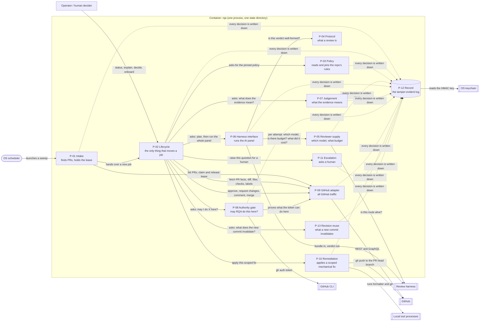

# RQA architecture — component view of the `rqa` container

This document decomposes the **one** container named in [`container.md`](container.md) — the `rqa`
process and its state directory — into thirteen parts, and is the load-bearing document of the
#2071 architecture description. It follows the corpus `architecture-component` template's section
shape (purpose, legend, diagram, building blocks, boundary, scope) without corpus node machinery.
Tables are canonical; the diagram states nothing the tables do not.
[`validate.py`](validate.py) reads the tables in §5, §6, §7 and §9.

Inputs are the frozen requirements specification at `9267b6308` (86 requirements), the #2070 gap
register and dispositions (162 units), the nine constraints, non-goals and security implications of
the frozen extract (bound in [`context.md`](context.md) §7), and one maintainer constraint given during
this task: the GitHub credential is the operator's `gh auth token`; personal access tokens are out of
scope. Paths in citations are relative to `launchpad/skills/review-queue-automation/`.

**Packaging provenance.** The architecture was originally authored from requirements commit
`eb1cedb19` and gap-analysis commit `3bbbd8367`. Clean PR assembly republishes the identical
requirements tree at `9267b6308` and the same gap analysis at `ee317fdea`, with only its revision
anchors and packaging note changed. The original hashes remain here as authoring provenance; the
clean hashes are the durable inputs carried by this PR.

## 1. Definitions

**Part.** A grouping of related functionality behind a stated interface, executing inside the `rqa`
process. A part carries an immutable identifier `P-NN`, used identically in all four documents, the
disposition reconciliation (§7) and the ADR list (§9). Numbering is roughly the order a part first acts in one review and carries no
priority.

**Accountable part.** For a requirement, the one part answerable for that requirement being met: if
the requirement is unmet, that part's behaviour is what is wrong. Every requirement names exactly one
accountable part (§5). Two requirements — RQA-FR-034 and RQA-FR-035 — are discharged outside the
runtime and name a *carrier* instead: `ARCH` (this description, whose §4 per-part justification is
FR-034's recorded justification) and `TRACKER` (the issue tracker, through #2068; the gap register's
own finding is that no code can serve FR-035). The checker admits exactly those two ids and no other
non-part.

**Contributing part.** A part whose behaviour the accountable part relies on to meet the requirement.
Contribution is listed separately and is never ownership: a cross-cutting requirement such as
RQA-NFR-010 has one accountable part (P-02) and several contributors, and a contributor's defect is
still reported against the accountable part.

**The parts exist for requirements, not for clusters.** The seven #2070 clusters (`queue`, `dispatch`,
`policy`, `verdict`, `authority`, `resilience`, `docs`) partition files for parallel assessment; no
part below corresponds to one. Every part is accountable for at least one requirement (§5 totals:
P-01 4, P-02 8, P-03 6, P-04 6, P-05 11, P-06 7, P-07 13, P-08 7, P-09 2, P-10 4, P-11 6, P-12 5, P-13 5; `ARCH` 1; `TRACKER` 1; total 86), and no part is
present that no requirement needs. Where two candidate parts were considered and merged or split, §4's
justification says so.

## 2. Notation legend

| Shape | Meaning |
|---|---|
| Rectangle inside the `rqa` boundary | A part (`P-NN`) |
| Cylinder | The part that owns the authoritative record (P-12) |
| Double-bordered box | An external system, defined in [`context.md`](context.md) |
| Rounded box | The trigger |
| Solid arrow, labelled in words | An interaction; its precise contract is a row of §6, which also carries its `E-NN` id |
| Dotted arrows to P-12 | A part that appends to the record does so through E-13; P-04 returns a validation result and appends nothing itself |

## 3. Component diagram

## 4. Building blocks

### P-01 — Intake

**Responsibility.** Finds work and holds it. Fires on the timer, resolves each configured repository, admits nothing without a valid repo-local config, takes the exclusive runtime lock, reads the PR inventory, creates at most one job per `(repo, number, head_sha)`, detects a head change and asks P-02 to supersede the prior job, claims the GitHub-verified assignee lease, and hands the claimed job to P-02.

**Interfaces.** Provides: E-21. Consumes: E-01, E-02, E-03 (admission gate, `job=None`). (Contracts in §6.)

**Accountable for (4).** RQA-BR-007, RQA-FR-031, RQA-NFR-004, RQA-NFR-006

**Contributes to (10).** RQA-BR-010, RQA-FR-004, RQA-FR-005, RQA-FR-006, RQA-FR-016, RQA-NFR-005, RQA-NFR-007, RQA-NFR-011, RQA-NFR-017, RQA-NFR-020

**Records written.** jobs, pr_facts, leases, lock

**Units placed or replaced (20).** U-DISPATCH-01, U-DISPATCH-02, U-DISPATCH-08, U-DISPATCH-10, U-DISPATCH-22, U-DOCS-03, U-DOCS-23, U-DOCS-25, U-DOCS-46, U-POLICY-07, U-QUEUE-01, U-QUEUE-02, U-QUEUE-03, U-QUEUE-04, U-QUEUE-05, U-QUEUE-07, U-QUEUE-08, U-QUEUE-14, U-RESILIENCE-13, U-RESILIENCE-16

**Justification (RQA-FR-034).** Serves RQA-BR-007 (one job per revision, no concurrent claim), RQA-FR-031 and RQA-NFR-004 (one sweep per configured repository, independent of the others), RQA-NFR-006 (one process, one machine). Simpler alternative rejected: folding intake into P-02 makes the state machine depend on GitHub inventory shape and on scheduling; the disjoint requirement sets mean the two change for different reasons. Constraint: C3, C5. Schedule state: the adaptive interval and its persisted per-scope next-due (`cadence` table) are not carried — no frozen requirement obliges an adaptive interval, the launchd timer fires at a fixed interval (U-QUEUE-08), and per-repository independence is a property of how the sweep iterates, not of a stored schedule.
### P-02 — Lifecycle

**Responsibility.** The only part that changes a job's state. Owns the closed transition table, the mapping from internal states to the six FR-016 dispositions, the total ordering of outcome authority, the containment boundary that turns a persistence or audit failure into a safe stop, crash recovery, and resume from an escalation at the recorded step. Every transition is committed in one transaction with its `transition` entry in the record (E-13); a failed append is a failed transition. Fetches PR facts, diff, files and labels through E-23 and hands them to the parts that need them, so no part other than P-09 talks to GitHub and no part other than P-02 decides what a fact means for the job.

**Interfaces.** Provides: E-02, E-17. Consumes: E-03, E-04, E-05, E-07, E-09, E-10, E-11, E-12, E-13, E-14, E-23. (Contracts in §6.)

**Accountable for (8).** RQA-BR-001, RQA-BR-010, RQA-FR-016, RQA-FR-027, RQA-FR-028, RQA-FR-038, RQA-NFR-007, RQA-NFR-010

**Contributes to (7).** RQA-BR-007, RQA-FR-011, RQA-FR-012, RQA-FR-022, RQA-FR-029, RQA-FR-037, RQA-FR-039

**Records written.** jobs.status

**Units placed or replaced (21).** U-AUTHORITY-07, U-DISPATCH-03, U-DISPATCH-07, U-DISPATCH-17, U-DISPATCH-18, U-DISPATCH-21, U-DISPATCH-23, U-DOCS-02, U-DOCS-06, U-DOCS-19, U-DOCS-20, U-DOCS-34, U-DOCS-38, U-DOCS-47, U-DOCS-54, U-DOCS-56, U-DOCS-57, U-QUEUE-11, U-QUEUE-12, U-RESILIENCE-11, U-RESILIENCE-17

**Justification (RQA-FR-034).** Serves RQA-FR-016, RQA-NFR-007, RQA-NFR-010, RQA-FR-028, RQA-FR-038, RQA-FR-027, RQA-BR-010 and, as the process owner, RQA-BR-001. Simpler alternative rejected: distributed transitions (today's shape) are exactly what produced the human-resume bypass, the swallowed ledger write and the advisory dead-end; one minter is one proof. Constraint: C6, C7.
### P-03 — Policy

**Responsibility.** Reads the repo-local configuration on every tick, validates it fail-closed against the schema and its semantic rules, derives the policy as a copy of the validated object, versions it, pins it by content hash into a snapshot activated atomically with last-known-good retention, and hands one snapshot per job to P-02. Writes the starter config on onboarding and never overwrites one.

**Interfaces.** Provides: E-03, E-17. Consumes: E-13. (Contracts in §6.)

**Accountable for (6).** RQA-FR-003, RQA-FR-004, RQA-NFR-005, RQA-NFR-008, RQA-NFR-013, RQA-NFR-023

**Contributes to (17).** RQA-BR-004, RQA-FR-009, RQA-FR-019, RQA-FR-029, RQA-FR-031, RQA-FR-032, RQA-NFR-004, RQA-NFR-006, RQA-NFR-009, RQA-NFR-012, RQA-NFR-017, RQA-NFR-018, RQA-NFR-019, RQA-NFR-024, RQA-NFR-025, RQA-NFR-026, RQA-NFR-029

**Records written.** snapshots

**Units placed or replaced (15).** U-DOCS-10, U-DOCS-14, U-DOCS-30, U-DOCS-31, U-DOCS-51, U-POLICY-01, U-POLICY-02, U-POLICY-03, U-POLICY-04, U-POLICY-05, U-POLICY-06, U-QUEUE-06, U-QUEUE-09, U-QUEUE-10, U-RESILIENCE-09

**Justification (RQA-FR-034).** Serves RQA-FR-003, RQA-FR-004, RQA-NFR-005, RQA-NFR-008, RQA-NFR-013, RQA-NFR-023. Simpler alternative rejected: reading config ad hoc where needed re-creates the unpinned-job defect (`policy_version` blank in the ledger) and the mid-job policy change. Constraint: C4.
### P-04 — Protocol

**Responsibility.** The published review protocol: the one definition of review scope, required obligations, finding categories (the mechanical/procedural/creation-time group against the correctness/security/architectural/evidence group), the seven evidence states, blocking-condition semantics, review completion and final-disposition semantics — as a JSON Schema for `verdict.json` plus prose, versioned. Validates every verdict against it, including contradiction detection.

**Interfaces.** Provides: E-08. Consumes: -. (Contracts in §6.)

**Accountable for (6).** RQA-BR-002, RQA-BR-005, RQA-FR-001, RQA-FR-002, RQA-FR-008, RQA-FR-033

**Contributes to (8).** RQA-BR-004, RQA-BR-008, RQA-FR-010, RQA-FR-030, RQA-NFR-002, RQA-NFR-003, RQA-NFR-016, RQA-NFR-031

**Records written.** (none; the protocol definition is a tracked artefact, cited by hash in the snapshot)

**Units placed or replaced (5).** U-DOCS-22, U-DOCS-48, U-VERDICT-01, U-VERDICT-02, U-VERDICT-03

**Justification (RQA-FR-034).** Serves RQA-FR-001, RQA-FR-002, RQA-FR-008, RQA-BR-002, RQA-BR-005, RQA-FR-033. Simpler alternative rejected: leaving the schema inside P-07 makes the contract an external harness must satisfy a private detail of the judgement code; FR-030 needs it published and stable independently of how judgement evolves. Constraint: C1, C2.
### P-05 — Reviewer supply

**Responsibility.** Decides who may be asked and how much may be spent, before anything is asked. Resolves a configured route per obligation through the alias registry given a `RouteCursor` of what has already been excluded — so a caller that advances the cursor is guaranteed a different answer or `Unavailable` — probes it through E-24, enforces the per-repository external-send grant and the per-change deny (a policy-named label in the fact set P-02 hands it, read from GitHub through E-23 and never as an instruction), walks the configured fallback ladder subscription-first and never past it, keeps provider families distinct, counts failures per scope into a breaker, reserves budget on every configured axis inclusively before a run and refuses as a value, and records consumption as `measured` or `estimated`.

**Interfaces.** Provides: E-06, E-15. Consumes: E-13, E-24. (Contracts in §6.)

**Accountable for (11).** RQA-BR-012, RQA-FR-021, RQA-FR-022, RQA-FR-023, RQA-FR-024, RQA-FR-032, RQA-FR-039, RQA-NFR-009, RQA-NFR-012, RQA-NFR-027, RQA-NFR-029

**Contributes to (9).** RQA-BR-001, RQA-FR-019, RQA-FR-026, RQA-FR-033, RQA-FR-038, RQA-NFR-001, RQA-NFR-013, RQA-NFR-014, RQA-NFR-023

**Records written.** spend, breakers

**Units placed or replaced (16).** U-DISPATCH-05, U-DISPATCH-12, U-DISPATCH-13, U-DOCS-07, U-DOCS-15, U-DOCS-27, U-DOCS-37, U-POLICY-10, U-POLICY-11, U-POLICY-12, U-POLICY-13, U-POLICY-14, U-RESILIENCE-01, U-RESILIENCE-02, U-RESILIENCE-03, U-VERDICT-09

**Justification (RQA-FR-034).** Serves RQA-FR-021, RQA-FR-022, RQA-FR-023, RQA-FR-024, RQA-FR-032, RQA-FR-039, RQA-BR-012, RQA-NFR-009, RQA-NFR-012, RQA-NFR-027, RQA-NFR-029. Simpler alternative rejected: separate routing and budget parts (considered) share one outcome family — FR-022's "configured fallback" is FR-023's ladder — so splitting them puts one decision in two places. Constraint: C7, C9, SEC-5, SEC-7.
### P-06 — Harness interface

**Responsibility.** The only part that invokes a harness with PR content. Plans regenerated obligations, owns the finite panel loop, obtains a fresh P-05 reservation immediately before every invocation (including the one transient retry), nonce-envelopes every PR byte, enforces the E-19 provider-role/injection-conformance contract, validates each verdict, attests and reports every attempt, then records and returns one `PanelResult` whose evidence cutoff is captured after the final attempt. Built-in and external adapters satisfy the same contract.

**Interfaces.** Provides: E-07. Consumes: E-06, E-08, E-13, E-15, E-19. (Contracts in §6.)

**Accountable for (7).** RQA-FR-019, RQA-FR-030, RQA-NFR-001, RQA-NFR-002, RQA-NFR-003, RQA-NFR-014, RQA-NFR-015

**Contributes to (17).** RQA-BR-002, RQA-BR-003, RQA-BR-009, RQA-BR-012, RQA-BR-014, RQA-FR-001, RQA-FR-002, RQA-FR-005, RQA-FR-012, RQA-FR-021, RQA-FR-023, RQA-FR-024, RQA-NFR-012, RQA-NFR-016, RQA-NFR-022, RQA-NFR-027, RQA-NFR-032

**Records written.** bundle, jobs/<job>/harness/<NN>/

**Units placed or replaced (17).** U-DISPATCH-14, U-DISPATCH-24, U-DISPATCH-25, U-DOCS-09, U-DOCS-21, U-DOCS-26, U-DOCS-36, U-DOCS-41, U-POLICY-08, U-POLICY-09, U-RESILIENCE-04, U-RESILIENCE-15, U-VERDICT-07, U-VERDICT-08, U-VERDICT-10, U-VERDICT-11, U-VERDICT-12

**Justification (RQA-FR-034).** Serves RQA-FR-030, RQA-NFR-001, RQA-NFR-002, RQA-NFR-003, RQA-NFR-014, RQA-NFR-015, RQA-FR-019. Simpler alternative rejected: letting P-07 call harnesses directly binds judgement to invocation and defeats FR-030's "no change to the system's own source". Constraint: C1, C2, SEC-1, project requirement.
### P-07 — Judgement

**Responsibility.** Deterministically judges exactly planned plus carried obligations. Uses the post-panel `PanelResult.evidence_cutoff`, captured GitHub checks, seven evidence states and multi-category findings; corroborates ordinary findings; turns every reported injection attempt or broken envelope into an immediately blocking `evidence` finding; and attributes failures to PR/base. It selects only exact, non-substantive, policy-allowed remedies as candidates—the reviewer assertion is a veto, while P-10 proves the real diff behavior-equivalent. It computes assurance, never succeeds with an unsatisfied obligation, and materialises/records carry-only judgements without a harness call.

**Interfaces.** Provides: E-09. Consumes: E-13. (Contracts in §6.)

**Accountable for (13).** RQA-BR-004, RQA-BR-008, RQA-BR-009, RQA-BR-014, RQA-FR-009, RQA-FR-010, RQA-FR-011, RQA-FR-014, RQA-FR-015, RQA-FR-036, RQA-FR-037, RQA-NFR-016, RQA-NFR-031

**Contributes to (18).** RQA-BR-001, RQA-BR-002, RQA-BR-003, RQA-BR-005, RQA-BR-006, RQA-BR-010, RQA-BR-013, RQA-FR-002, RQA-FR-003, RQA-FR-008, RQA-FR-012, RQA-FR-017, RQA-FR-025, RQA-FR-026, RQA-FR-028, RQA-NFR-007, RQA-NFR-015, RQA-NFR-033

**Records written.** (none; its output is a `judgement` entry P-12 records)

**Units placed or replaced (21).** U-AUTHORITY-03, U-AUTHORITY-04, U-DISPATCH-15, U-DOCS-08, U-DOCS-11, U-DOCS-32, U-DOCS-33, U-DOCS-42, U-DOCS-43, U-DOCS-49, U-DOCS-58, U-RESILIENCE-05, U-VERDICT-04, U-VERDICT-05, U-VERDICT-13, U-VERDICT-14, U-VERDICT-15, U-VERDICT-16, U-VERDICT-18, U-VERDICT-19, U-VERDICT-20

**Justification (RQA-FR-034).** Serves RQA-FR-009, RQA-FR-010, RQA-FR-011, RQA-FR-014, RQA-FR-015, RQA-FR-036, RQA-FR-037, RQA-BR-004, RQA-BR-008, RQA-BR-009, RQA-BR-014, RQA-NFR-016, RQA-NFR-031. Simpler alternative rejected: keeping the 22-gate conjunction — it has no evidence-state vocabulary, so FR-010 cannot be expressed in it, and its mechanical gates are what escalate to humans. Constraint: SEC-1.
### P-08 — Authority gate

**Responsibility.** One fail-closed gate for six activities: pinned policy plus repository capability proof. Remediation receives the finding's full non-empty category set and grants only when every member is system-mechanical and policy-allowed. No snapshot, no grant. The only credential is ephemeral `gh auth token` (ADR-E); RQA confines what it exercises and records the broader-token residual.

**Interfaces.** Provides: E-04. Consumes: E-13, E-16, E-22. (Contracts in §6.)

**Accountable for (7).** RQA-NFR-017, RQA-NFR-018, RQA-NFR-019, RQA-NFR-024, RQA-NFR-025, RQA-NFR-026, RQA-NFR-030

**Contributes to (9).** RQA-BR-006, RQA-FR-017, RQA-FR-026, RQA-FR-028, RQA-FR-029, RQA-FR-031, RQA-NFR-004, RQA-NFR-008, RQA-NFR-021

**Records written.** capabilities

**Units placed or replaced (10).** U-AUTHORITY-01, U-AUTHORITY-02, U-DISPATCH-09, U-DISPATCH-11, U-DOCS-04, U-DOCS-12, U-DOCS-28, U-DOCS-29, U-DOCS-44, U-RESILIENCE-10

**Justification (RQA-FR-034).** Serves RQA-NFR-017, RQA-NFR-018, RQA-NFR-019, RQA-NFR-024, RQA-NFR-025, RQA-NFR-026, RQA-NFR-030. Simpler alternative rejected: per-action gates (today's shape) are six proofs of fail-closed, and three of the six were never wired. Constraint: SEC-2, SEC-3, SEC-6, and the maintainer's `gh auth token` constraint.
### P-09 — GitHub adapter

**Responsibility.** All GitHub traffic. Reads coherent facts including exact head target/protection, full PR and predecessor-to-current diffs, immutable check observation times, and submitted review actor/outcome/head/time. Writes review, comment, merge and assignee lease under activity-bound grants, with deterministic mutation ids and visibility checks. Performs P-08 capability probes.

**Interfaces.** Provides: E-01, E-12, E-14, E-16, E-23. Consumes: E-13, E-18. (Contracts in §6.)

**Accountable for (2).** RQA-FR-029, RQA-NFR-011

**Contributes to (11).** RQA-BR-007, RQA-BR-009, RQA-FR-014, RQA-FR-021, RQA-FR-028, RQA-FR-036, RQA-NFR-008, RQA-NFR-021, RQA-NFR-024, RQA-NFR-029, RQA-NFR-030

**Records written.** mutations, etags, api_calls

**Units placed or replaced (11).** U-AUTHORITY-08, U-AUTHORITY-09, U-AUTHORITY-10, U-AUTHORITY-11, U-DISPATCH-16, U-DOCS-01, U-DOCS-24, U-DOCS-45, U-DOCS-50, U-RESILIENCE-12, U-VERDICT-06

**Justification (RQA-FR-034).** Serves RQA-NFR-011 and RQA-FR-029 (the merge capability exists here and nowhere else). Simpler alternative rejected: letting parts call GitHub directly loses the single-transport boundary that makes idempotency and the credential floor provable in one place. Constraint: C8.
### P-10 — Remediation

**Responsibility.** Under a remediation grant and pinned snapshot, validates fork/protection policy and an exact PR-head target before work, rejects non-file/traversal/glob/symlink paths, runs only a closed formatter on exact changed files in an isolated worktree, proves the actual before/after diff behavior-equivalent with the registered language oracle, checks scope/fixpoint, and pushes one commit only to that PR head branch—never force, merge, protected head, disallowed fork, or another ref. Cleans every exit (ADR-G).

**Interfaces.** Provides: E-10. Consumes: E-13, E-20, E-26. (Contracts in §6.)

**Accountable for (4).** RQA-BR-006, RQA-FR-017, RQA-NFR-020, RQA-NFR-021

**Contributes to (4).** RQA-BR-010, RQA-FR-018, RQA-NFR-007, RQA-NFR-019

**Records written.** worktrees

**Units placed or replaced (3).** U-DISPATCH-26, U-DOCS-13, U-DOCS-53

**Justification (RQA-FR-034).** Serves RQA-BR-006, RQA-FR-017, RQA-NFR-020, RQA-NFR-021. Simpler alternative rejected: a comment telling the author to run the tool — it is what P5 in the problem statement describes and BR-006 forbids. Constraint: SEC-3.
### P-11 — Escalation

**Responsibility.** The human seam. Raises a durable escalation naming one of the five FR-026 causes, never pushes a notification, indexes what is pending, and records a human decision — actor, basis, the obligation it substantiates — as an entry P-02 resumes from. A behaviour-changing finding is an escalation; a routine condition never is.

**Interfaces.** Provides: E-11, E-17. Consumes: E-13. (Contracts in §6.)

**Accountable for (6).** RQA-BR-011, RQA-BR-013, RQA-FR-013, RQA-FR-025, RQA-FR-026, RQA-NFR-033

**Contributes to (7).** RQA-BR-001, RQA-BR-010, RQA-FR-011, RQA-FR-017, RQA-FR-022, RQA-FR-027, RQA-NFR-007

**Records written.** human_requests

**Units placed or replaced (6).** U-AUTHORITY-05, U-AUTHORITY-06, U-AUTHORITY-12, U-DOCS-05, U-DOCS-35, U-DOCS-52

**Justification (RQA-FR-034).** Serves RQA-FR-013, RQA-FR-025, RQA-FR-026, RQA-BR-011, RQA-BR-013, RQA-NFR-033. Simpler alternative rejected: folding into P-02 puts the human interface inside the state machine; the decision must be a recorded fact P-02 evaluates, not a transition a human triggers. Constraint: C5 (the human reaches it through the local CLI).
### P-12 — Record

**Responsibility.** The one review record: a closed fourteen-kind append-only hash chain per job, including bundle/panel cutoff evidence, attempts, judgement, grants, actions, escalations and decisions. Only P-12 performs storage writes; callers construct typed payloads. `explain` reconstructs FR-012 offline. ADR-F / [#2159](https://github.com/launchpad-26/buzz/issues/2159) governs optional operator-key HMAC; an absent key marks a segment unverifiable rather than blocking append. Trace remains non-authoritative.

**Interfaces.** Provides: E-13, E-17. Consumes: E-25. (Contracts in §6.)

**Accountable for (5).** RQA-BR-003, RQA-FR-012, RQA-NFR-022, RQA-NFR-028, RQA-NFR-032

**Contributes to (14).** RQA-BR-001, RQA-BR-005, RQA-BR-008, RQA-BR-011, RQA-BR-014, RQA-FR-007, RQA-FR-013, RQA-FR-015, RQA-FR-016, RQA-FR-020, RQA-FR-021, RQA-FR-038, RQA-NFR-006, RQA-NFR-010

**Records written.** record_entries, trace

**Units placed or replaced (17).** U-DISPATCH-04, U-DISPATCH-06, U-DISPATCH-19, U-DISPATCH-20, U-DOCS-16, U-DOCS-17, U-DOCS-18, U-DOCS-39, U-DOCS-40, U-DOCS-55, U-QUEUE-13, U-RESILIENCE-06, U-RESILIENCE-07, U-RESILIENCE-08, U-RESILIENCE-14, U-VERDICT-17, U-VERDICT-21

**Justification (RQA-FR-034).** Serves RQA-BR-003, RQA-FR-012, RQA-NFR-022, RQA-NFR-028, RQA-NFR-032. Simpler alternative rejected: several authoritative tables (today's shape) is why the decision has no actor or basis and the spend has no `measured` flag. Constraint: SEC-4, NG-8.
### P-13 — Revision reuse

**Responsibility.** Decides what a new head may inherit and hands the evidence forward. Given the predecessor job's record, the changed paths and the snapshot, marks an obligation regenerated when a changed path matches one of its globs (through the protocol's one matcher), when the protocol or policy pin moved, when the predecessor did not have it `verified`, or when it is new; every other obligation is reused as `CarriedEvidence` pointing at the predecessor's judgement and attestations. Records both sets with a reason per obligation. It does not judge: P-07 consumes the carry-over.

**Interfaces.** Provides: E-05. Consumes: E-13. (Contracts in §6.)

**Accountable for (5).** RQA-FR-005, RQA-FR-006, RQA-FR-007, RQA-FR-018, RQA-FR-020

**Contributes to (3).** RQA-BR-006, RQA-BR-007, RQA-BR-012

**Records written.** (none; its output is a `carry_over` entry P-12 records)

**Units placed or replaced (0).** none — four of its five requirements are `not built` and the fifth, RQA-FR-018, is `built then orphaned` in the remediation family (placed in P-10); no unit at `9267b6308` names reviewer-result reuse as its responsibility, so this is the one part with no incumbent code

**Justification (RQA-FR-034).** Serves RQA-FR-005, RQA-FR-006, RQA-FR-007, RQA-FR-018, RQA-FR-020. Simpler alternative rejected: re-running everything on every head is problem P6; folding into P-02 makes the state machine diff-aware. Constraint: none binds this part directly; it exists for the criterion AC03 states and for RQA-BR-012's use of shared capacity (problem P11).

## 5. Requirement → accountable part

One row per requirement of the frozen specification, in the specification's own order. `accountable
part` is exactly one `P-NN`, or one of the two carriers named in §1. The gap degree is copied from the
#2070 register so a reader can see which rows the accountable part must *change* behaviour for
(`conflicting`) rather than add to.

| requirement | accountable part | contributing parts | gap degree at `9267b6308` |
|---|---|---|---|
| RQA-BR-001 | P-02 | P-12, P-07, P-05, P-11 | partial gap |
| RQA-BR-002 | P-04 | P-07, P-06 | partial gap |
| RQA-FR-001 | P-04 | P-06 | partial gap |
| RQA-FR-002 | P-04 | P-06, P-07 | fit |
| RQA-BR-004 | P-07 | P-03, P-04 | partial gap |
| RQA-BR-005 | P-04 | P-12, P-07 | full gap |
| RQA-FR-003 | P-03 | P-07 | fit |
| RQA-FR-008 | P-04 | P-07 | full gap |
| RQA-FR-009 | P-07 | P-03 | fit |
| RQA-BR-007 | P-01 | P-13, P-09, P-02 | fit |
| RQA-BR-009 | P-07 | P-09, P-06 | partial gap |
| RQA-FR-005 | P-13 | P-01, P-06 | full gap |
| RQA-FR-006 | P-13 | P-01 | full gap |
| RQA-FR-007 | P-13 | P-12 | full gap |
| RQA-FR-014 | P-07 | P-09 | conflicting |
| RQA-FR-015 | P-07 | P-12 | full gap |
| RQA-FR-036 | P-07 | P-09 | conflicting |
| RQA-BR-003 | P-12 | P-06, P-07 | partial gap |
| RQA-BR-008 | P-07 | P-12, P-04 | partial gap |
| RQA-BR-011 | P-11 | P-12 | partial gap |
| RQA-BR-014 | P-07 | P-12, P-06 | partial gap |
| RQA-FR-010 | P-07 | P-04 | full gap |
| RQA-FR-012 | P-12 | P-02, P-06, P-07 | partial gap |
| RQA-FR-013 | P-11 | P-12 | partial gap |
| RQA-NFR-022 | P-12 | P-06 | fit |
| RQA-NFR-028 | P-12 | - | full gap |
| RQA-NFR-032 | P-12 | P-06 | fit |
| RQA-FR-011 | P-07 | P-02, P-11 | conflicting |
| RQA-FR-016 | P-02 | P-12, P-01 | full gap |
| RQA-FR-028 | P-02 | P-07, P-08, P-09 | conflicting |
| RQA-FR-029 | P-09 | P-08, P-03, P-02 | full gap |
| RQA-FR-037 | P-07 | P-02 | conflicting |
| RQA-NFR-007 | P-02 | P-07, P-10, P-11, P-01 | partial gap |
| RQA-NFR-008 | P-03 | P-08, P-09 | full gap |
| RQA-BR-006 | P-10 | P-07, P-08, P-13 | full gap |
| RQA-BR-010 | P-02 | P-07, P-11, P-10, P-01 | conflicting |
| RQA-BR-013 | P-11 | P-07 | conflicting |
| RQA-FR-017 | P-10 | P-07, P-08, P-11 | full gap |
| RQA-FR-018 | P-13 | P-10 | full gap |
| RQA-FR-025 | P-11 | P-07 | partial gap |
| RQA-FR-026 | P-11 | P-07, P-08, P-05 | partial gap |
| RQA-FR-027 | P-02 | P-11 | partial gap |
| RQA-NFR-019 | P-08 | P-03, P-10 | full gap |
| RQA-NFR-020 | P-10 | P-01 | full gap |
| RQA-NFR-021 | P-10 | P-08, P-09 | full gap |
| RQA-NFR-031 | P-07 | P-04 | full gap |
| RQA-NFR-033 | P-11 | P-07 | full gap |
| RQA-BR-012 | P-05 | P-06, P-13 | partial gap |
| RQA-FR-019 | P-06 | P-03, P-05 | partial gap |
| RQA-FR-020 | P-13 | P-12 | partial gap |
| RQA-FR-021 | P-05 | P-06, P-09, P-12 | partial gap |
| RQA-FR-022 | P-05 | P-02, P-11 | conflicting |
| RQA-FR-023 | P-05 | P-06 | fit |
| RQA-FR-024 | P-05 | P-06 | fit |
| RQA-FR-038 | P-02 | P-05, P-12 | partial gap |
| RQA-FR-039 | P-05 | P-02, P-06, P-07 | conflicting |
| RQA-NFR-009 | P-05 | P-03 | fit |
| RQA-NFR-010 | P-02 | P-12 | conflicting |
| RQA-FR-004 | P-03 | P-01 | fit |
| RQA-FR-030 | P-06 | P-04, P-05 | full gap |
| RQA-FR-031 | P-01 | P-03, P-08 | fit |
| RQA-NFR-001 | P-06 | P-05 | partial gap |
| RQA-NFR-002 | P-06 | P-04 | full gap |
| RQA-NFR-003 | P-06 | P-04 | partial gap |
| RQA-NFR-004 | P-01 | P-03, P-08 | fit |
| RQA-NFR-005 | P-03 | P-01 | fit |
| RQA-NFR-006 | P-01 | P-03, P-12 | fit |
| RQA-FR-032 | P-05 | P-03 | fit |
| RQA-FR-033 | P-04 | P-05 | fit |
| RQA-NFR-012 | P-05 | P-06, P-03 | partial gap |
| RQA-NFR-013 | P-03 | P-05 | full gap |
| RQA-NFR-023 | P-03 | P-05 | full gap |
| RQA-NFR-027 | P-05 | P-06 | fit |
| RQA-NFR-029 | P-05 | P-03, P-09 | full gap |
| RQA-NFR-015 | P-06 | P-07 | partial gap |
| RQA-NFR-016 | P-07 | P-06, P-04 | full gap |
| RQA-NFR-017 | P-08 | P-03, P-01 | conflicting |
| RQA-NFR-018 | P-08 | P-03 | conflicting |
| RQA-NFR-024 | P-08 | P-03, P-09 | full gap |
| RQA-NFR-025 | P-08 | P-03 | fit |
| RQA-NFR-026 | P-08 | P-03 | partial gap |
| RQA-NFR-030 | P-08 | P-09 | conflicting |
| RQA-FR-034 | ARCH | - | full gap |
| RQA-FR-035 | TRACKER | - | full gap |
| RQA-NFR-011 | P-09 | P-01 | fit |
| RQA-NFR-014 | P-06 | P-05 | full gap |

**One row is met only under an accepted residual.** RQA-NFR-030's fit criterion inspects the
credential's granted scopes and requires none on any unmanaged repository. The credential is the
operator's `gh auth token` by maintainer constraint (Launchpad-26 organisation policy places personal
access tokens and GitHub Apps out of scope for this version), so P-08 can bound what RQA *exercises* and
cannot bound what the token *holds*. The maintainer accepted that residual on 2026-09-08 for this
version, to be addressed outside this project; ADR-E records it. The row stays with P-08 because P-08
is what would be wrong if RQA ever exercised access outside the configured set.

## 6. Contracts between parts and across the boundary

Every edge in the diagram, with what crosses it, in what shape, and how it is invoked. The verbatim
Python signature of every edge, and every type two parts exchange, is in [`code/CONTRACTS.md`](code/CONTRACTS.md);
this table is the prose view of that file and the checker verifies the two agree. The published
harness interaction contract (RQA-FR-030) is E-19 and is stated at the same level as every other edge.
An edge that is not listed does not exist: a part reaches another part only through a listed edge, and
reaches the outside only through E-18, E-19, E-20, E-22, E-24, E-25 or E-26.

| edge | from | to | contract | shape | invocation |
|---|---|---|---|---|---|
| E-01 | P-01 | P-09 | `inventory(repo)`; `claim_lease(job)`; `release_lease(job)` | open pull requests with head SHA, base ref, author, labels; the assignee-lease claim and release as fixed mutation kinds | in-process calls; P-09 performs the GraphQL read and the idempotent assignee writes |
| E-02 | P-01 | P-02 | `admit(job)` | a queued job: `(repo, number, head_sha)` and the inventory facts that created it; no lease yet | in-process call before any GitHub write; the lease is claimed at step 4 under the `review` grant |
| E-03 | P-02, P-01 | P-03 | `snapshot_for(repo, job)` | the pinned snapshot: content hash, validated policy, six activity grants, provider permission, mechanical tool set | in-process call; P-02 pins once per job and never re-reads. P-01 calls it at admission with `job=None` — the fail-closed config gate that admits nothing without a valid repo-local policy (`P-01-intake.md` §3) — and never pins |
| E-04 | P-02 | P-08 | `grant(repo, activity, snapshot, categories?)` | `Grant` or `Deny`; the complete non-empty category set is required only for remediation | before every activity; never cached across actions |
| E-05 | P-02 | P-13 | `carry_over(job, prior, facts, snapshot, record)` | `CarryOver`: `reused` as `CarriedEvidence` (obligation, VERIFIED, source job, source judgement seq, attestation ids), `regenerated` ids, a reason per obligation | in-process call when a job has a predecessor; without one every obligation is `regenerated` with reason `no_predecessor` |
| E-06 | P-06 | P-05 | `route(job, obligation, snapshot, facts, cursor, ...)`; `reserve(job, plan, route, snapshot, ...)` | `(Route, RouteCursor)` or `RouteUnavailable`; `Reservation` or `Refusal`. Cursor growth makes fallback finite | in-process through `SupplyPort`; P-06 obtains a fresh reservation immediately before every invocation, including transient retry |
| E-07 | P-02 | P-06 | `plan(job, facts, snapshot, carry, record)`; `run(job, plan, facts, snapshot, supply, state_dir, record)` | `Plan`; one call returns `PanelResult(attempts, complete, incomplete_reason, evidence_cutoff)` or `BundleFailure`; cutoff is recorded after the final attempt | P-02 transitions to reviewing then calls once; P-06 owns all retry/fallback |
| E-08 | P-06 | P-04 | `validate(verdict.json)` | `Valid(verdict)` or `Invalid(reasons)` against the published schema | in-process call per attempt |
| E-09 | P-02 | P-07 | `judge(job, plan, panel, carry, facts, snapshot, decision, record)` | `Judgement` over exactly planned plus carried obligations; `panel.evidence_cutoff` bounds attempts; an empty panel materialises a current carry-only judgement | deterministic in-process call; injection attempts become blocking EVIDENCE findings |
| E-10 | P-02 | P-10 | `remediate(job, finding, grant, facts, snapshot, state_dir, runner, record)` | `RemediationPushed` or `RemediationRefused`; P-10 enforces pinned fork policy, exact confined paths, protected head, scope, check, fixpoint and semantic equivalence | in-process; pushes only to exact head repo/ref, never force |
| E-11 | P-02 | P-11 | `raise(job, cause)`; `pending()` | an `escalation` entry naming one of the five FR-026 causes; the pending index | in-process; the reverse edge `resume(job, decision)` is driven by the human CLI |
| E-12 | P-02 | P-09 | `submit_review(job, state, body)`; `comment(job, body)`; `merge(job)` | `Mutation(id, accepted)`; idempotent by deterministic mutation id | in-process call; P-09 performs the REST write with pre- and post-checks |
| E-13 | every part except P-04 | P-12 | `append(job, entry)` | `Entry(seq, hash)` or `AppendFailed`, which stops the job through P-02 | in-process call inside the same SQLite transaction as the state change it records |
| E-14 | P-02 | P-09 | `checks(repo, sha)` for `head_sha` and `merge_base_sha`, assembled into `Facts.checks` / `Facts.base_checks` | canonical `CheckConclusion` per check; `FAILING`, `UNSETTLED` and `PASSING` sets are the protocol for attribution and corroboration alike | in-process call inside E-23; ETag-cached REST reads. P-07 reads the result from `Facts`, it does not call GitHub |
| E-15 | P-06 | P-05 | `consumed(job, attempt, reading, reservation, ...)` | `Spend(tokens, measured, source)`; a reservation is never written as a spend | in-process call after each attempt, through `SupplyPort` |
| E-16 | P-08 | P-09 | `probe(repo, credential)` | proven scopes on that repository: the activities the credential can actually perform there | in-process call; REST capability probe per job, cached in `capabilities` for the job |
| E-17 | operator | P-02 / P-12 / P-11 / P-03 | `status`; `explain`; `decide`; `pending` (P-11 `pending()`); `onboard` | CLI commands: FR-016 disposition and reason; FR-012 reconstruction; a named decision with basis; a starter config | the CLI on the operator machine; the only human interface |
| E-18 | P-09 | GitHub | REST v3 and GraphQL v4 | reads: PRs, checks, files; writes: reviews, comments, merges, assignees | HTTPS with the operator's `gh auth token` credential (ADR-E) |
| E-19 | P-06 | review harness | published role-separated interaction and injection-conformance contract | in: nonce-enveloped bundle as data, immutable protocol instruction, output path; out: verdict with mandatory `injection_attempts`; probe writes nothing | process execution; adapters failing paired clean/adversarial conformance are not registered |
| E-20 | P-10 | GitHub | git smart HTTP | fetch of the PR head; push to the PR head branch only | git transport with the operator's `gh auth token` credential; `--force` never passed |
| E-21 | OS scheduler | P-01 | `tick` | no payload; one process launch per interval | launchd (macOS) or an equivalent timer |
| E-22 | P-08 | GitHub CLI | `gh auth token` | the operator's GitHub CLI credential | process execution of `gh auth token`; the only credential path (maintainer constraint); RQA never persists the value |
| E-23 | P-02 | P-09 | `facts(job, record)` | coherent `Facts`: exact target/protection, PR-wide and predecessor-to-current path sets, files, timestamped checks, submitted reviews, labels, capture time | once per admission/resume; P-07 bounds checks to panel cutoff; P-13 uses only revision paths |
| E-24 | P-05 | review harness | `probe(route)` | a no-content liveness probe: the harness is invoked with an empty bundle directory and a probe marker file, and must exit 0 without writing a verdict | process execution; the marker is part of the published interaction contract (E-19) so an external harness can honour it |
| E-25 | P-12 | OS keychain | `KeyStore.read(name)` | the operator-held key for the record HMAC, or `None` | process execution of the platform keychain tool; key absent → append proceeds unkeyed and the entry says so, `verify`/`explain` report the segment unverifiable (ADR-F) |
| E-26 | P-10 | local tool processes | canonical `ProcessRunner.run` | closed formatter/git argv on exact files; missing binary is `RemediationRefused(TOOL_UNAVAILABLE)`; registered semantic oracle must prove before/after equivalence | isolated worktree; no network except E-20 |

## 7. Disposition reconciliation

One row per #2070 disposition unit. `keep`, `salvage` and `rework` units are **placed in** a named
part — placement means that part owns the responsibility the unit names, whatever happens to the
code; a `salvage` row names the mechanism carried. `bin` units are **replaced by** a named part —
the part whose behaviour now covers the concern the unit addressed, or the part that makes the
concern moot. Where this architecture departs from the recommended disposition the row says so and
the reason is in §4. Totals: keep 83, salvage 18, rework 43, bin 18; 162.

| unit | recommended | relation | part | how |
|---|---|---|---|---|
| U-AUTHORITY-01 | rework | placed in | P-08 | rebuilt as gate input: six activities including `merge`; `review`, `fix`, `triage` keys are gone |
| U-AUTHORITY-02 | rework | placed in | P-08 | rebuilt: one credential (`gh auth token`), capability probed per managed repository and persisted per job; the downgrade of exercised authority to proven capability is the mechanism that carries RQA-NFR-024 |
| U-AUTHORITY-03 | rework | placed in | P-07 | rebuilt inside this part |
| U-AUTHORITY-04 | keep | placed in | P-07 | placed as-is |
| U-AUTHORITY-05 | rework | placed in | P-11 | rebuilt: the request is a `escalation` record entry with a pending index; no transport |
| U-AUTHORITY-06 | rework | placed in | P-11 | rebuilt inside this part |
| U-AUTHORITY-07 | rework | placed in | P-02 | rebuilt: a human decision re-enters P-02, which re-evaluates through P-07 with the decision as a recorded, named obligation; the direct `eligible` write is gone |
| U-AUTHORITY-08 | keep | placed in | P-09 | placed as-is |
| U-AUTHORITY-09 | rework | placed in | P-09 | rebuilt: gains `review_submit` (APPROVE / REQUEST_CHANGES) and `merge` events; all remain idempotent by mutation id |
| U-AUTHORITY-10 | keep | placed in | P-09 | placed as-is |
| U-AUTHORITY-11 | keep | placed in | P-09 | placed as-is |
| U-AUTHORITY-12 | bin | replaced by | P-11 | replaced by P-11: the durable request is the escalation; there is no push transport, the human CLI reads the pending index |
| U-DISPATCH-01 | salvage | placed in | P-01 | mechanism: one fail-closed admission gate before any command dispatch, naming the missing-config reason and the onboarding command |
| U-DISPATCH-02 | salvage | placed in | P-01 | mechanism: exclusive non-blocking `flock` on a lock file in the state directory, kernel-released; contention is a named successful no-op |
| U-DISPATCH-03 | rework | placed in | P-02 | rebuilt: `status` answers FR-016 from `jobs.status` and the latest transition entry |
| U-DISPATCH-04 | bin | replaced by | P-12 | replaced by P-12: the record is crash-safe and hash-chained; copying the state directory is the operator's filesystem concern |
| U-DISPATCH-05 | bin | replaced by | P-05 | replaced by P-05: breaker cooldowns expire on their own deadline; nothing needs a manual reset |
| U-DISPATCH-06 | bin | replaced by | P-12 | replaced by P-12: the record is retained for the life of the state directory; artefacts accumulate (risk recorded in `container.md`) |
| U-DISPATCH-07 | rework | placed in | P-02 | rebuilt: recovery releases leases through P-01 and re-enters the job at its recorded state; nothing is re-decided |
| U-DISPATCH-08 | keep | placed in | P-01 | sweep stays bounded and FIFO; the cadence gate is replaced by the fixed timer interval (`cadence` table not carried) |
| U-DISPATCH-09 | rework | placed in | P-08 | the capability clamp is P-08's; the snapshot pin half is U-QUEUE-10, placed in P-03. `resolve_snapshot`'s unclamped return on `SnapshotError` is removed: no snapshot, no grant |
| U-DISPATCH-10 | keep | placed in | P-01 | placed as-is |
| U-DISPATCH-11 | rework | placed in | P-08 | canary keys collapse into per-activity grants; the persisted `canaries` table is not carried (deviation from gap §6.3, reasoned here) |
| U-DISPATCH-12 | salvage | placed in | P-05 | mechanism: the spend gate is consulted before the work it bounds and its refusal is a value carrying the downgrade to apply |
| U-DISPATCH-13 | rework | placed in | P-05 | rebuilt: a reservation is never written as a spend; a spend row without an actual reading is marked `estimated` |
| U-DISPATCH-14 | keep | placed in | P-06 | the panel-driving loop is the harness invocation loop; degradation targets come from P-05 refusals and are applied by P-02 |
| U-DISPATCH-15 | rework | placed in | P-07 | the evaluation becomes P-07's disposition; the escalation causes it routes are handed to P-11 as one of FR-026's five named kinds |
| U-DISPATCH-16 | keep | placed in | P-09 | guarded live APPROVE path: pre- and post-checks stay with the mutation |
| U-DISPATCH-17 | rework | placed in | P-02 | the satisfied→submitted transition is P-02's; corroboration stays in P-07, the grant in P-08, the mutation in P-09 |
| U-DISPATCH-18 | rework | placed in | P-02 | advisory posting is replaced by the comment activity plus an authority-requirement escalation when verdict authority is absent (ADR-D) |
| U-DISPATCH-19 | keep | placed in | P-12 | placed as-is |
| U-DISPATCH-20 | rework | placed in | P-12 | rebuilt: an append failure stops the job (U-DISPATCH-21's boundary) instead of being swallowed |
| U-DISPATCH-21 | salvage | placed in | P-02 | mechanism: a typed containment boundary converting persistence or audit failure into "stop this job safely", with programming errors excluded so they fail loudly |
| U-DISPATCH-22 | keep | placed in | P-01 | placed as-is |
| U-DISPATCH-23 | salvage | placed in | P-02 | mechanism: the total ordering of outcome authority and the one-reachable-rung rule; the ordering is owned by P-02 because P-02 is the only minter |
| U-DISPATCH-24 | keep | placed in | P-06 | placed as-is |
| U-DISPATCH-25 | rework | placed in | P-06 | rebuilt around the published interaction contract; built-in adapters are defaults, not dependencies |
| U-DISPATCH-26 | salvage | placed in | P-10 | mechanism: worktree from the exact PR head, refusing any fallback ref; push refuses force and any ref but the configured head. Location changes to the state directory |
| U-DOCS-01 | rework | placed in | P-09 | rebuilt inside this part |
| U-DOCS-02 | rework | placed in | P-02 | rebuilt inside this part |
| U-DOCS-03 | keep | placed in | P-01 | placed as-is |
| U-DOCS-04 | rework | placed in | P-08 | rebuilt inside this part |
| U-DOCS-05 | rework | placed in | P-11 | rebuilt inside this part |
| U-DOCS-06 | rework | placed in | P-02 | rebuilt inside this part |
| U-DOCS-07 | keep | placed in | P-05 | placed as-is |
| U-DOCS-08 | rework | placed in | P-07 | rebuilt inside this part |
| U-DOCS-09 | keep | placed in | P-06 | placed as-is |
| U-DOCS-10 | rework | placed in | P-03 | rebuilt inside this part |
| U-DOCS-11 | keep | placed in | P-07 | recommended `keep`; placed as rework because the shadow surface it documents is binned (U-VERDICT-21). What survives is the positive-evidence rule (U-VERDICT-19), documented under P-07 |
| U-DOCS-12 | keep | placed in | P-08 | recommended `keep`; canary gating collapses into authority defaults, so the document is rewritten as P-08's fail-closed defaults |
| U-DOCS-13 | rework | placed in | P-10 | rebuilt: the isolated-worktree claim becomes true because P-10 is reachable from P-02 |
| U-DOCS-14 | rework | placed in | P-03 | rebuilt inside this part |
| U-DOCS-15 | rework | placed in | P-05 | rebuilt inside this part |
| U-DOCS-16 | keep | placed in | P-12 | placed as-is |
| U-DOCS-17 | rework | placed in | P-12 | rebuilt inside this part |
| U-DOCS-18 | bin | replaced by | P-12 | replaced by P-12: the retention statement is "kept indefinitely", documented with the record |
| U-DOCS-19 | keep | placed in | P-02 | placed as-is |
| U-DOCS-20 | bin | replaced by | P-02 | replaced by P-02: `status` is the FR-016 disposition command; backup and cooldown-reset have no successor |
| U-DOCS-21 | rework | placed in | P-06 | rebuilt inside this part |
| U-DOCS-22 | bin | replaced by | P-04 | replaced by P-04: one published protocol definition that documentation and code both cite removes the naming drift the suite policed |
| U-DOCS-23 | keep | placed in | P-01 | placed as-is |
| U-DOCS-24 | salvage | placed in | P-09 | mechanism: a non-token-shaped credential paired with a socket constructor that raises, so a suite regressing into a live GitHub call fails deterministically |
| U-DOCS-25 | keep | placed in | P-01 | placed as-is |
| U-DOCS-26 | salvage | placed in | P-06 | mechanism: coverage that the nonce envelope wraps every PR-derived byte; re-targeted at P-06's bundle writer |
| U-DOCS-27 | keep | placed in | P-05 | placed as-is |
| U-DOCS-28 | keep | placed in | P-08 | placed as-is |
| U-DOCS-29 | keep | placed in | P-08 | placed as-is |
| U-DOCS-30 | salvage | placed in | P-03 | mechanism: policy validation and content-hash pin coverage, explicitly not standing in for the authority boundary P-08 owns |
| U-DOCS-31 | salvage | placed in | P-03 | mechanism: atomic activation and last-known-good coverage, same caveat |
| U-DOCS-32 | keep | placed in | P-07 | placed as-is |
| U-DOCS-33 | keep | placed in | P-07 | placed as-is |
| U-DOCS-34 | keep | placed in | P-02 | placed as-is |
| U-DOCS-35 | salvage | placed in | P-11 | mechanism: execution-state tracking of a human decision from pending to applied; re-targeted at P-11's decision entry |
| U-DOCS-36 | rework | placed in | P-06 | rebuilt inside this part |
| U-DOCS-37 | keep | placed in | P-05 | placed as-is |
| U-DOCS-38 | bin | replaced by | P-02 | replaced by P-02: degradation is decided where outcomes are minted, per the 2026-09-08 ruling; no metadata registry exists to test |
| U-DOCS-39 | keep | placed in | P-12 | placed as-is |
| U-DOCS-40 | salvage | placed in | P-12 | mechanism: a read-only reconstruction never contacts GitHub or a model; re-targeted at `explain` |
| U-DOCS-41 | keep | placed in | P-06 | placed as-is |
| U-DOCS-42 | keep | placed in | P-07 | placed as-is |
| U-DOCS-43 | keep | placed in | P-07 | placed as-is |
| U-DOCS-44 | keep | placed in | P-08 | placed as-is |
| U-DOCS-45 | keep | placed in | P-09 | placed as-is |
| U-DOCS-46 | bin | replaced by | P-01 | replaced by P-01: the lease claim contract (assignee is the GitHub user node id) is P-01's and is covered there |
| U-DOCS-47 | keep | placed in | P-02 | placed as-is |
| U-DOCS-48 | keep | placed in | P-04 | placed as-is |
| U-DOCS-49 | keep | placed in | P-07 | placed as-is |
| U-DOCS-50 | keep | placed in | P-09 | placed as-is |
| U-DOCS-51 | keep | placed in | P-03 | placed as-is |
| U-DOCS-52 | keep | placed in | P-11 | placed as-is |
| U-DOCS-53 | salvage | placed in | P-10 | mechanism: worktree create/clean under a fake runner; never evidence of product reachability (the product caller is now P-10) |
| U-DOCS-54 | keep | placed in | P-02 | placed as-is |
| U-DOCS-55 | keep | placed in | P-12 | placed as-is |
| U-DOCS-56 | rework | placed in | P-02 | rebuilt inside this part |
| U-DOCS-57 | keep | placed in | P-02 | placed as-is |
| U-DOCS-58 | keep | placed in | P-07 | placed as-is |
| U-POLICY-01 | keep | placed in | P-03 | placed as-is |
| U-POLICY-02 | keep | placed in | P-03 | placed as-is |
| U-POLICY-03 | rework | placed in | P-03 | rebuilt inside this part |
| U-POLICY-04 | keep | placed in | P-03 | placed as-is |
| U-POLICY-05 | salvage | placed in | P-03 | mechanism: a derived policy is a copy of its configuration object and every structural fallback binds to the generator's own literal, never a second default table |
| U-POLICY-06 | rework | placed in | P-03 | rebuilt inside this part |
| U-POLICY-07 | bin | replaced by | P-01 | replaced by P-01: the admission gate refuses every command when no valid repo-local config resolves; readiness is not reported, it is enforced |
| U-POLICY-08 | rework | placed in | P-06 | rebuilt: strategy is chosen from the policy's stated assurance and nothing else |
| U-POLICY-09 | keep | placed in | P-06 | placed as-is |
| U-POLICY-10 | keep | placed in | P-05 | placed as-is |
| U-POLICY-11 | keep | placed in | P-05 | placed as-is |
| U-POLICY-12 | bin | replaced by | P-05 | replaced by P-05: a route is probed against the real transport before it is used (U-POLICY-13); no shadow lock or qualification store |
| U-POLICY-13 | keep | placed in | P-05 | placed as-is |
| U-POLICY-14 | keep | placed in | P-05 | placed as-is |
| U-QUEUE-01 | keep | placed in | P-01 | kept; the `lane` component of the key becomes the constant `review` because remediation is a step inside the one job, not a second lane |
| U-QUEUE-02 | keep | placed in | P-01 | detection of the newer head stays here; the `superseded` transition itself is P-02's, requested through E-02 |
| U-QUEUE-03 | keep | placed in | P-01 | placed as-is |
| U-QUEUE-04 | keep | placed in | P-01 | placed as-is |
| U-QUEUE-05 | salvage | placed in | P-01 | departs from the disposition, which names two mechanisms: the fail-toward-run default is carried; the persisted per-scope next-due state is not, because the timer interval is fixed and there is no schedule to persist (reason under P-01 §4) |
| U-QUEUE-06 | keep | placed in | P-03 | kept as behaviour — config is re-read from the live path on every tick — while the persisted `cadence` schedule it refreshed is not carried |
| U-QUEUE-07 | keep | placed in | P-01 | kept as behaviour — each repository sweeps independently and one repository's failure never blocks another — without a persisted per-scope schedule |
| U-QUEUE-08 | keep | placed in | P-01 | placed as-is |
| U-QUEUE-09 | keep | placed in | P-03 | placed as-is |
| U-QUEUE-10 | keep | placed in | P-03 | placed as-is |
| U-QUEUE-11 | keep | placed in | P-02 | placed as-is |
| U-QUEUE-12 | bin | replaced by | P-02 | replaced by P-02: the closed transition table has no `action` state |
| U-QUEUE-13 | bin | replaced by | P-12 | replaced by P-12: the record already holds every fact a calibration sample would; no ingestion surface |
| U-QUEUE-14 | keep | placed in | P-01 | placed as-is |
| U-RESILIENCE-01 | rework | placed in | P-05 | rebuilt: every configured axis enforced, bounds inclusive, `measured` distinguished from `estimated` |
| U-RESILIENCE-02 | keep | placed in | P-05 | placed as-is |
| U-RESILIENCE-03 | salvage | placed in | P-05 | mechanism: fallback ordering leads with configured subscription tiers before any metered call and keeps provider families distinct |
| U-RESILIENCE-04 | rework | placed in | P-06 | the typed `JobBlockingError` and the coarse TRANSIENT / PROVIDER_TERMINAL / CANDIDATE_TERMINAL vocabulary become the P-06→P-05 result contract; the unreached classifiers are not carried |
| U-RESILIENCE-05 | rework | placed in | P-07 | the content — categories, evidence states, achieved against required assurance — is P-07's rendering of the decision basis; posting goes through P-09 under the `comment` grant |
| U-RESILIENCE-06 | rework | placed in | P-12 | rebuilt inside this part |
| U-RESILIENCE-07 | keep | placed in | P-12 | placed as-is |
| U-RESILIENCE-08 | keep | placed in | P-12 | placed as-is |
| U-RESILIENCE-09 | keep | placed in | P-03 | placed as-is |
| U-RESILIENCE-10 | keep | placed in | P-08 | departs from `keep`: the disposition keeps environment-first resolution with `gh auth token` as fallback; this design makes `gh auth token` the only path and drops the environment variable, by maintainer constraint (org policy on PATs and GitHub Apps for this version). ADR-E records the accepted residual |
| U-RESILIENCE-11 | keep | placed in | P-02 | placed as-is |
| U-RESILIENCE-12 | keep | placed in | P-09 | placed as-is |
| U-RESILIENCE-13 | keep | placed in | P-01 | job identity is P-01's; the deterministic mutation-id half is used by P-09 |
| U-RESILIENCE-14 | keep | placed in | P-12 | placed as-is |
| U-RESILIENCE-15 | keep | placed in | P-06 | placed as-is |
| U-RESILIENCE-16 | keep | placed in | P-01 | placed as-is |
| U-RESILIENCE-17 | bin | replaced by | P-02 | replaced by P-02: retryability and authority impact are decided at outcome minting, per the 2026-09-08 ruling |
| U-VERDICT-01 | keep | placed in | P-04 | placed as-is |
| U-VERDICT-02 | rework | placed in | P-04 | rebuilt: schema requires non-empty closed `categories`, open `extra_tags`, seven-state obligations, exact remedies, and injection reports |
| U-VERDICT-03 | bin | replaced by | P-04 | replaced by P-04: one protocol; the author-triage lane is not in the frozen specification and the `lane` key becomes the constant `review` |
| U-VERDICT-04 | keep | placed in | P-07 | placed as-is |
| U-VERDICT-05 | keep | placed in | P-07 | placed as-is |
| U-VERDICT-06 | rework | placed in | P-09 | GitHub check-conclusion normalisation belongs to the adapter; P-07 consumes the canonical vocabulary for attribution |
| U-VERDICT-07 | keep | placed in | P-06 | placed as-is |
| U-VERDICT-08 | keep | placed in | P-06 | placed as-is |
| U-VERDICT-09 | keep | placed in | P-05 | placed as-is |
| U-VERDICT-10 | keep | placed in | P-06 | placed as-is |
| U-VERDICT-11 | keep | placed in | P-06 | placed as-is |
| U-VERDICT-12 | keep | placed in | P-06 | placed as-is |
| U-VERDICT-13 | keep | placed in | P-07 | placed as-is |
| U-VERDICT-14 | rework | placed in | P-07 | rebuilt as one obligation kind (protected path touched) rather than a separate trigger subsystem |
| U-VERDICT-15 | bin | replaced by | P-07 | replaced by P-07: bounded-change is one obligation among the policy's required obligations, not a seven-gate aggregator |
| U-VERDICT-16 | rework | placed in | P-07 | rebuilt as the per-obligation evidence-state evaluation; the 22 named gates become obligations with FR-010 states, and mechanical gates no longer escalate |
| U-VERDICT-17 | bin | replaced by | P-12 | replaced by P-12: risk assessment is a `judgement` entry in the chained record, versioned by the protocol version it cites |
| U-VERDICT-18 | rework | placed in | P-07 | rebuilt: assurance is a function of obligation evidence states, not a parallel computation |
| U-VERDICT-19 | salvage | placed in | P-07 | mechanism: a gate reads true only from evidence the record positively supports, timestamped at or before the decision's cutoff |
| U-VERDICT-20 | salvage | placed in | P-07 | mechanism: an empty or unmatched input set is reported as an absence of evidence, by cause, never as a result |
| U-VERDICT-21 | bin | replaced by | P-12 | replaced by P-12: `explain` is the only read-only reconstruction surface |

## 8. The three questions

### 8.1 One review record or many? — One.

One record per job — per `(repo, number, head_sha)` — as an append-only, hash-chained sequence of
typed entries owned by P-12, written by no other part. Reasons: RQA-FR-012 requires *one* command to
return twelve elements with no second lookup, which a single chained record answers by construction
and four authoritative tables answer only through a join that today loses the actor and basis
(`approval_decisions`, scripts/common.py:268-281) and the measured/estimated distinction
(`cost_ledger`, scripts/common.py:334-345). RQA-NFR-028's tamper-evidence is one chain, not four.
RQA-FR-007's reused/regenerated sets are per revision, so the record is per revision, and a
superseding job's record points at its predecessor's (E-05). The disposition RQA-FR-016 reports is the
latest `transition` entry. Pending indexes (`human_requests`, `spend`) are projections a part may keep
for its own queries; none is authoritative and `explain` reads none of them.

### 8.2 One state machine or distributed transitions? — One state machine.

P-02 owns the only transition table and is the only part that writes `jobs.status`. Every other part
returns a *value* — a grant, a refusal, a judgement, a pushed head, an escalation — and P-02 decides
what that value means for the job. Reasons: RQA-FR-016's fit criterion demands the disposition equal
the PR's real state after every transition, which is only checkable when transitions happen in one
place; RQA-NFR-010's minting rule (the 2026-09-08 ruling that degradation belongs where outcomes are
minted); and the three `conflicting` rows that are distributed transitions today — the human-resume
path writing `eligible` from the authorization alone (RQA-FR-011, RQA-FR-037), the swallowed ledger
append on the authoritative paths (RQA-NFR-010), and the advisory dead-end (RQA-FR-028). The
transition and its record entry commit in one transaction (E-13); a failed append is a failed
transition and the job stops safely (U-DISPATCH-21's boundary). Internal states and their FR-016
disposition are tabulated in [`flow-review-lifecycle.md`](flow-review-lifecycle.md) §4.

### 8.3 One authority gate or per-action gates? — One gate, parameterised by activity.

P-08 exposes `grant(repo, activity, snapshot, categories?)` for the six activities of RQA-NFR-017.
One gate makes fail-closed authority one proof, not six drifting checks. Remediation supplies the
finding's complete category set; every member must satisfy the mechanical boundary. No other part
reads authority or grants activity.

## 9. Decisions this architecture could not make

Each decision has a local rationale draft and a filed ADR issue parented to #2006. **All five were
decided on 2026-09-11, each to the recommendation the architecture named**, and recorded as
`launchpad/decisions/ADR-0061`–`ADR-0065`; the assumption annotations throughout these documents
therefore stand ratified. A **blocking** ADR had an option that changes a part boundary, E-NN
contract or record ownership, so #2072 could not cut that lane before decision; that gate is now
cleared for all five. This table remains the record of which lanes depended on which decision.

ADR-H was raised by the review of PR #2176 rather than by the original description; it is recorded as
`launchpad/decisions/ADR-0065`, so #2072's supply (#2183) and harness (#2184) lanes are no longer cut
against an open option.

| ADR | question | decomposition-blocking | parts affected | requirements |
|---|---|---|---|---|
| [ADR-D](adr-drafts/ADR-D.md) | [#2157](https://github.com/launchpad-26/buzz/issues/2157) — terminal outcome without verdict authority | **blocking** | P-02, P-11, P-09 | RQA-FR-028, RQA-NFR-017, RQA-NFR-026, RQA-NFR-007, RQA-FR-016 |
| [ADR-E](adr-drafts/ADR-E.md) | [#2158](https://github.com/launchpad-26/buzz/issues/2158) — `gh auth token` floor and ceiling | **blocking** | P-08, P-09, P-01 | RQA-NFR-024, RQA-NFR-030, RQA-NFR-025, RQA-FR-038 |
| [ADR-F](adr-drafts/ADR-F.md) | [#2159](https://github.com/launchpad-26/buzz/issues/2159) — provenance integrity | **not blocking** | P-12 | RQA-NFR-028, RQA-NFR-022, RQA-NFR-032 |
| [ADR-G](adr-drafts/ADR-G.md) | [#2160](https://github.com/launchpad-26/buzz/issues/2160) — exact automatic remedy | **blocking** | P-10, P-07, P-08 | RQA-BR-006, RQA-FR-017, RQA-NFR-019, RQA-NFR-031, RQA-NFR-033 |
| [ADR-H](adr-drafts/ADR-H.md) | [#2217](https://github.com/launchpad-26/buzz/issues/2217) — how a harness RQA ships no adapter for is admitted to run | **blocking** | P-05, P-06, P-03 | RQA-FR-030, RQA-NFR-001, RQA-NFR-002, RQA-NFR-015 |

## 10. Boundary

This document does not describe: the container's deployment or the operator machine (see
[`container.md`](container.md)); the external actors and what crosses the system boundary (see
[`context.md`](context.md), which E-18 to E-22 summarise); class- or function-level design of any
part — file and line citations above are evidence of what exists at `9267b6308`, not the design of
what replaces it; the ordering, sizing or sequencing of any work, which is #2072's.

## 11. Scope and omissions

**This document covers** the parts of the one container, their contracts, the accountable part of
every requirement, the placement or replacement of every disposition unit, the three structural
answers, and the ADR list.

**It does not cover, and these are gaps rather than silence:**

| Not covered here | Owned by |
|---|---|
| The exact JSON Schema of `verdict.json` and the interaction contract's environment variables | P-04 and P-06's implementation lanes, under #2072; this document fixes what each must express |
| The obligation-to-path mapping P-13 uses to compute invalidation | P-04's protocol definition, per repository policy; the mapping's *existence* is fixed here, its content is policy |
| Whether a repository's branch protection counts RQA's APPROVED toward required approvals | Repository governance (Non-goal 6) |

**Expected but not verifiable while drafting:** whether GitHub exposes enough about the `gh auth token`
credential for P-08 to *prove* the absence of permission on unmanaged repositories (ADR-E records this
as the residual RQA cannot close under the constraint).
