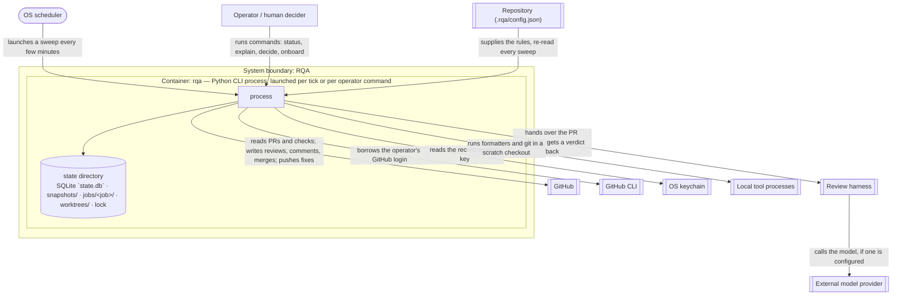

# RQA architecture — C4 view: container

> A view of the design described in [`architecture.md`](architecture.md). Read that first; this
> view carries the tables and identifiers behind its §3, §10 and §14.

One level inside the system boundary drawn in [`context.md`](context.md), one level above the parts
in [`components.md`](components.md). This document answers *what has to be running, in what
technology, with what local state, for RQA to work* — and the answer is deliberately short: one
container. Its length is not the measure of it; the record-ownership table in §5 is. Follows the
corpus `architecture-container` template's section shape without corpus node machinery. Tables are
canonical; [`validate.py`](validate.py) reads §5.

## 1. Purpose and scope

The system is **Review Queue Automation (RQA)** as specified at `9267b6308`. This view names its
runnable units and their state. It says nothing about which parts do what (`components.md`) and
nothing about who talks to the system from outside (`context.md`), and it does not describe the
operator machine as infrastructure beyond what the container needs from it.

## 2. Notation legend

| Shape | Meaning |
|---|---|
| Box inside the dashed system boundary | A container in the C4 sense — something that must be running |
| Cylinder inside the container | State the container owns; not a separate container (§4 says why) |
| Double-bordered box | An external system, defined in `context.md` |
| Arrow | A communication path, summarised in §6 |

## 3. Container diagram

## 4. Container inventory

| Container | Technology | Responsibility | Why it is a container |
|---|---|---|---|
| `rqa` | Python 3 CLI, one process per invocation; SQLite for tabular state, files for artefacts | Everything in `components.md`: the thirteen parts run in this one process | It is the only thing that must be running for RQA to work, and it runs only when the timer or the operator launches it — RQA is local-first (C5) with no listener |

**Why one container and not two.** The state directory is not a second container. C4's test is
"something that needs to be running"; a SQLite file and a directory of artefacts run nothing — they are
opened by the process that owns them and by no other. Modelling the store as a container would also
imply a communication path (a protocol between process and store) that does not exist: access is a
library call inside one process. The review harness *is* a running thing, but it is outside the
system boundary — RQA-FR-030 requires an external harness to participate with no change to RQA's
source, so it is an external system in `context.md`, not a container here; built-in adapters are
code inside `rqa` that speak the same contract.

**Technology choices are design choices (Non-goal 4).** SQLite is chosen because the container is one
process on one machine with the ACID transaction RQA-NFR-010 needs between a state change and its
record entry; a server database would add a running thing C5 does not permit. Python is inherited from
the estate whose `keep` units this design places; nothing in the specification requires it. This paragraph is
their RQA-FR-034 justification; `components.md` §4 justifies the parts, not the technology.

**Where the container runs.** The operator's own machine, under the operator's account, launched by
launchd or an equivalent timer and by the operator's shell. Deployment topology beyond that sentence
is out of this view's scope and there is none to describe.

## 5. Local state and its ownership

Every persisted record the container holds, its form, the **one part that writes it**, the parts that
read it, where it comes from at `9267b6308` per the gap analysis's transition needs (§6.3), and what
happens to it. Two records are written by the operator and never by RQA; they are listed because the
container reads them and because RQA-NFR-024/030 and C4 depend on who writes them. The credential is
the operator's `gh auth token` by maintainer constraint; RQA holds no token of its own.

| record | form | writing part | readers | origin at `9267b6308` (gap §6.3) | carry-over |
|---|---|---|---|---|---|
| `jobs` | SQLite table | P-01 | P-02, P-13, P-11 | prior jobs plus snapshot pin | carries status set and immutable predecessor job/head-SHA pair used for revision-only E-23 comparison |
| `pr_facts` | SQLite table | P-01 | P-02, P-07, P-13 | `prs` (scripts/common.py:221) | carried unchanged; sole source of the observed head (U-QUEUE-14) |
| `leases` | SQLite table | P-01 | P-02 | `leases` (scripts/common.py:246) | carried unchanged |
| `lock` | file `state/lock` | P-01 | - | runtime lock (U-DISPATCH-02) | carried as a mechanism: exclusive non-blocking `flock`, kernel-released |
| `jobs.status` | the one column of `jobs` P-01 does not write, mirrored by a `transition` entry in `record_entries` | P-02 | P-01, P-11, P-12 | `states.py` transition table (U-QUEUE-11) | carried; closed table, legacy `action` path removed (U-QUEUE-12) |
| `snapshots` | SQLite table plus `state/snapshots/<hash>.json` | P-03 | P-02, P-05, P-06, P-07, P-08 | snapshot archive, `snapshot_hash` pin (U-QUEUE-09, U-QUEUE-10) | carried unchanged; atomic activation with last-known-good retention |
| `record_entries` | SQLite append-only table, hash-chained (ADR-F / [#2159](https://github.com/launchpad-26/buzz/issues/2159)) | P-12 | P-02, P-11, P-13, P-07 | migrated ledger/decision/spend sources | thirteen closed entry kinds; legacy rows unattested; current rows chained, optionally HMAC-keyed |
| `trace` | file `state/jobs/<job>/trace.jsonl` | P-12 | - | locked JSONL trace (U-RESILIENCE-08), otel milestones (U-DISPATCH-19) | carried unchanged; observability, never authoritative |
| `human_requests` | SQLite table (pending index over `record_entries`) | P-11 | P-02 | `human_requests` (scripts/common.py:288) | carried; `decision_actor` (:311) and `rationale` (:308) become the `actor` and `basis` of the `decision` entry; notification transport columns dropped (U-AUTHORITY-12) |
| `mutations` | SQLite table | P-09 | - | `mutations` (scripts/common.py:260) | carried unchanged; `client_mutation_id` primary key; gains `review_submit` and `merge` event kinds |
| `etags` | SQLite table | P-09 | - | `etags` (scripts/common.py:204) | carried unchanged |
| `api_calls` | SQLite table | P-09 | P-05 | `api_calls` (scripts/common.py:211) | carried unchanged; rate-limit consumption from response headers |
| `spend` | SQLite table of per-axis counters (projection of `spend` entries) | P-05 | - | `cost_ledger` (scripts/common.py:334-345); `budget.reserve` axes | rows carried via `record_entries`; the counters add the `per_model_daily_tokens` axis and inclusive bounds (U-RESILIENCE-01) |
| `breakers` | SQLite tables `providers`, `circuit_breakers` | P-05 | - | `providers` (:254), `circuit_breakers` (:348) | carried unchanged; manual reset removed (U-DISPATCH-05) |
| `capabilities` | SQLite table | P-08 | P-02 | new; today probed and not persisted (U-AUTHORITY-02) | new: proven credential capability per managed repository, re-probed per job |
| `credential` | GitHub CLI authentication read by `gh auth token` (ADR-E / [#2158](https://github.com/launchpad-26/buzz/issues/2158)) | operator | P-08, P-09 | replaces environment token lookup | never persisted; per-job capability proof constrains exercised authority; broader reach is explicit residual |
| `bundle` | files `state/jobs/<job>/bundle/` | P-06 | P-07, P-12 | evidence bundle (U-VERDICT-07) | carried; the manifest hashes are recorded in `record_entries` |
| `jobs/<job>/harness/<NN>/` | files: the harness's raw output and RQA's attestation sidecar | P-06 | P-04, P-07 | attempt artefacts and attestation sidecar (U-VERDICT-11) | carried unchanged |
| `worktrees` | directories `state/worktrees/<job>/` | P-10 | - | replaces repo-local RQA worktrees | fresh exact-head checkout, exact confined remedy files, semantic oracle, always removed (ADR-G / [#2160](https://github.com/launchpad-26/buzz/issues/2160)) |
| `config` | file `<repo>/.rqa/config.json`, repo-local | operator | P-03 | repo-local config (U-POLICY-01) | carried; four key groups removed (gap §6.3): notification transports, retention window, `authority.review/fix/triage` replaced by the six activities; `per_model_daily_tokens` retained and now enforced |

**Records that do not carry over.** Each is a decision with a reason; two disagree with gap §6.3 and
say so.

| state or key | origin | why it does not carry |
|---|---|---|
| `cadence` | scripts/common.py:360 | the timer fires at a fixed interval (U-QUEUE-08); per-repository sweep independence is P-01 behaviour, not a persisted schedule — deviation from gap §6.3 "yes", reasoned in `components.md` §4 P-01 |
| `canaries` | scripts/common.py:315 | canary approval collapses into the per-activity grants P-08 reads from the pinned snapshot — deviation from gap §6.3 "yes", reasoned under P-08 |
| `route_qualifications` | scripts/common.py:282 | behind the binned shadow lock (U-POLICY-12); agrees with gap §6.3 |
| notification transport keys | config.example.json | binned with U-AUTHORITY-12 |
| retention window key | config.example.json | binned with U-DISPATCH-06 |
| `authority.review` / `.fix` / `.triage` | config.example.json | replaced by `authority.{review,comment,approve,request_changes,remediate,merge}` |

**Migration, not copy.** Three carry-overs need a migration rather than a file copy: `ledger_entries`
into the chained `record_entries` (existing rows become an unattested `legacy` segment — Non-goal 8
forbids presenting them as provenance they never had); `approval_decisions` into `decision` entries,
which is where RQA-FR-013's missing `actor` and `basis` columns are added; `cost_ledger` into `spend`
entries, which is where RQA-FR-021's missing `measured` flag is added. The migration is one-way and is
part of P-12's lane under #2072.

**A consequence to plan for.** With the retention purge binned (U-DISPATCH-06), `jobs/<job>/` artefacts
and `record_entries` grow without bound. This is deliberate — no frozen requirement obliges retention
and FR-034 forbids retaining a component no requirement needs — and it is a real operational cost the
operator carries. The record must never be purged; artefacts under `jobs/<job>/bundle/` and `harness/`
are reproducible from the record's manifest hashes only in the sense of verification, not of content.
Recorded here so that it is a known trade, not a surprise.

## 6. Communication summary

| Path | Between | Mechanism | Detail |
|---|---|---|---|
| tick | OS scheduler → `rqa` | process launch | one launch per fixed interval; E-21 in `components.md` §6 |
| CLI | operator → `rqa` | process launch with arguments | `status`, `explain`, `decide`, `onboard`; E-17 |
| GitHub API | `rqa` → GitHub | HTTPS: REST v3 and GraphQL v4 | reads and mutations, one adapter (P-09); E-18 |
| git | `rqa` → GitHub | git smart HTTP | remediation fetch and push (P-10); E-20 |
| harness | `rqa` → review harness | process execution, files in and out | the published interaction contract: review invocation (P-06); E-19, and content-free route probe (P-05); E-24 |
| provider | review harness → external model provider | the harness's own API client | RQA never calls a provider directly; it names the route before handing over the bundle (RQA-FR-032) |
| credential | `rqa` → GitHub CLI | process execution of `gh auth token` | the operator's GitHub CLI credential, the only credential path by maintainer constraint (P-08); E-22 |
| config | repository → `rqa` | file read | `.rqa/config.json` re-read every tick (P-03) |
| keychain | `rqa` → OS keychain | platform keychain tool | the record HMAC key (P-12); E-25 |
| tools | `rqa` → local processes | process execution in the worktree | formatters from the closed set and `git` (P-10); E-26 |

There is no path between two containers because there is one container; a library call inside `rqa`
is, per the corpus template's own note, the sign that two things are not separate containers.

## 7. Scope and omissions

**This document covers** the one container, its technology, its local state with one writer per
record, and its communication paths.

**It does not cover, and these are gaps rather than silence:**

| Not covered here | Owned by |
|---|---|
| The parts inside `rqa` and their contracts | `components.md` |
| External actors and what crosses the system boundary | `context.md` |
| The sequence of one review | `flow-review-lifecycle.md` |
| Backup of the state directory | the operator's filesystem practice; RQA offers no backup command (U-DISPATCH-04 replaced by P-12's crash-safe writes) |
| The decomposition-blocking ADR list | `components.md` §9 — the single place |

**Expected but not verifiable while drafting:** the disk growth rate of `jobs/<job>/` per review,
which depends on repository size and configured panel width.
