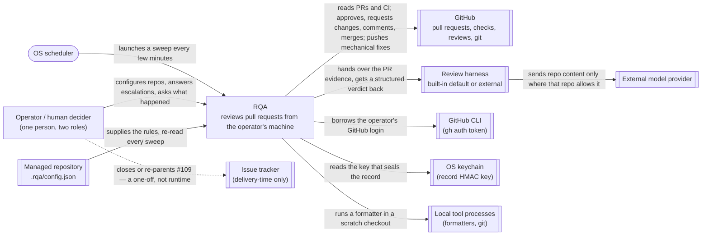

# RQA architecture — C4 view: system context

> A view of the design described in [`architecture.md`](architecture.md). Read that first; this
> view carries the tables and identifiers behind its §3.

The outermost of the four #2071 documents: **Review Queue Automation (RQA)** as one box, the people and
external systems that interact with it, and what crosses each boundary. Follows the corpus
`architecture-context` template's section shape (purpose, diagram, legend, business context,
technical context, scope) without corpus node machinery. Tables are canonical; the diagram states
nothing the tables do not; [`validate.py`](validate.py) reads §7.

## 1. Purpose and boundary

RQA reviews pull requests on GitHub-hosted repositories from one operator's machine: it detects work,
runs a review through whatever harness the repository's policy names, judges the result against that
policy, acts on GitHub within the authority the repository granted, and records everything it did so
that one command can reconstruct it. This document covers the **context only** — nothing about the
inside of the box. The inside is [`container.md`](container.md) (one container) and
[`components.md`](components.md) (thirteen parts); one review's sequence is
[`flow-review-lifecycle.md`](flow-review-lifecycle.md).

## 2. System context diagram

## 3. Notation legend

| Shape | Meaning |
|---|---|
| Plain box | The system in scope, RQA, as one box |
| Box labelled "Operator / human decider" | The one human role, in two capacities |
| Double-bordered box | An external system RQA exchanges something with |
| Rounded box | The trigger that launches RQA |
| Solid arrow, labelled in words | An interaction; §4 gives its business meaning and §5 its technical form, each row carrying a `B-n` id |
| Dotted arrow | An interaction that satisfies a requirement outside the runtime (RQA-FR-035) |

## 4. Business context

One row per communication partner: what it gives RQA and what RQA gives it, in domain terms. The
technical channel is §5.

| id | partner | gives RQA | receives from RQA | why the boundary sits here |
|---|---|---|---|---|
| B-1 | OS scheduler | a tick at a fixed interval | nothing | RQA runs only when launched (C5); it has no listener and no daemon |
| B-2 | Operator / human decider | repository policy and configuration; the GitHub CLI login RQA will read via `gh auth token`; a named decision with its basis when RQA escalates; the question "what is this PR's disposition and why" | the disposition and reason (RQA-FR-016); the full reconstruction of an outcome (RQA-FR-012); the pending escalations, each naming its cause (RQA-FR-026) | Two roles, one person: the operator who runs RQA and the human whose judgement RQA asks for both reach it through the CLI on the operator machine. A decider who is a different person acts through the operator; RQA has no second interface. Whether a human decision also counts toward the repository's required approvals is the repository's governance (Non-goal 6) |
| B-3 | GitHub | open pull requests, their head and base, files and diff, check conclusions on head and merge base, the assignee lease | review submissions (APPROVED / CHANGES_REQUESTED), comments, merges, assignee claims (under the `review` grant) — each only under a grant; remediation commits pushed to the PR head branch | GitHub is the only supported host (C8, RQA-NFR-011); every write is gated per activity and idempotent |
| B-4 | Review harness | a schema-valid verdict with mandatory injection reports plus untrusted self-identity; clean probe exit | nonce-enveloped PR bundle in provider data role, immutable protocol instruction, output path | E-19 adapters pass paired injection conformance; built-in/external harnesses use the same boundary |
| B-5 | External model provider | nothing directly | policy-permitted repository content through a pre-named route and data channel | RQA chooses whether/where content leaves; harness owns provider transport |
| B-6 | GitHub CLI | ephemeral operator credential via `gh auth token` | nothing | ADR-E / [#2158](https://github.com/launchpad-26/buzz/issues/2158); RQA confines exercised authority but not token breadth |
| B-7 | Managed repository | `.rqa/config.json` | starter config on onboarding, never overwrite | edits apply to the next review |
| B-9 | OS keychain | operator record-HMAC key | nothing | ADR-F / [#2159](https://github.com/launchpad-26/buzz/issues/2159); absent key yields explicit unverifiable segment |
| B-10 | Local tool processes | exact formatter/git effects in scratch worktree | closed argv and exact paths | ADR-G / [#2160](https://github.com/launchpad-26/buzz/issues/2160); semantic oracle/check/fixpoint required |
| B-8 | Issue tracker | nothing at runtime | nothing at runtime | RQA-FR-035 is satisfied by closing or re-parenting #109 and reconciling #535/#536 — #2068's work — and by nothing RQA does; drawn so a reader does not look for it inside the box |

## 5. Technical context

| id | channel | carries | notes |
|---|---|---|---|
| B-1 | launchd (macOS) or an equivalent timer launching the `rqa` process | the tick | fixed interval; a tick that finds a run in progress exits as a named successful no-op |
| B-2 | the `rqa` command-line interface on the operator machine | `status`, `explain`, `decide`, `onboard`; config edits are file edits | no network interface exists for humans |
| B-3 | HTTPS to GitHub REST v3 and GraphQL v4; git smart HTTP for remediation | reads with ETag caching; writes with deterministic mutation ids; fetch of the PR head and push to its branch | one adapter inside RQA owns every byte on this channel |
| B-4 | process execution with environment variables naming the bundle directory, the protocol definition and the output path; JSON files in and out; a probe marker file for liveness checks (E-24) | the interaction contract (RQA-FR-030), open and implementation-neutral (C2, RQA-NFR-003) | no network is opened by RQA toward the harness |
| B-5 | the harness's own provider client | whatever the harness sends; RQA bounds it by what it put in the bundle | RQA records the route it named, and the harness's self-reported identity, in the record it writes itself (RQA-NFR-032) |
| B-6 | process execution of `gh auth token` | the GitHub CLI's stored authentication for the operator | read per run, never persisted by RQA; ADR-E assumed |
| B-7 | local file read from the repository checkout the operator configured | JSON | validated fail-closed; an unreadable file yields no snapshot and therefore no authority (RQA-NFR-018) |
| B-9 | the platform keychain tool (`security` on macOS or equivalent) | one key, read per run | never persisted by RQA outside the keychain |
| B-10 | process execution in `state/worktrees/<job>/` | argv and exit code | tool binaries are the operator's installation; RQA pins none |
| B-8 | the GitHub issue tracker, by a human | issue state | delivery-time only |

## 6. Business context — what does *not* cross the boundary

Three absences are decisions, not omissions. No notification is pushed to a human by any transport:
escalations are durable records the human reads (RQA-FR-025, RQA-BR-013; U-AUTHORITY-12 binned). No
credential other than the operator's `gh auth token` crosses in: no deploy key, no relay or VPS
credential, nothing granting access to a contributor's machine (RQA-NFR-025). No content crosses to a provider
when no provider is configured (RQA-NFR-027), and none for a change the operator flagged even where
the repository permits it (RQA-NFR-029).

## 7. Constraints binding

The nine design constraints, the project requirement, the non-goals that bound design choices, and the
seven security implications from the frozen extract, each bound to the part that honours it. `ARCH`
means the constraint binds this description rather than a runtime part. The checker verifies every
id in this table appears and names a part or `ARCH`.

| id | constraint | honoured by | with | how |
|---|---|---|---|---|
| C1 | Tooling independence | P-06 | P-05, P-04 | the published interaction contract is the only way any harness — built-in default or external — participates; only P-06 hands a harness content, and only P-05 probes one (Non-goal 3: defaults named, none depended on) |
| C2 | Open interoperability | P-06 | P-04, P-09 | the interaction contract is files and JSON over process execution; the protocol definition is a JSON Schema plus prose; GitHub is reached over its public REST/GraphQL API |
| C3 | Multi-repository and cross-organisation operation | P-01 | P-03, P-08 | one sweep per configured repository, each with its own repo-local config and pinned snapshot, and its own per-job capability probe of the one operator credential |
| C4 | Repository-specific policy and configuration | P-03 | P-02 | config is read from the repository on every tick, validated fail-closed and pinned per job; nothing is compiled in |
| C5 | Local-first operation | P-01 | P-12, P-11 | one process, one state directory, no listener, no service; humans reach the system through the CLI on the operator machine (Non-goal 2) |
| C6 | End-to-end GitHub review responsibility | P-02 | P-07, P-08, P-09 | the state machine is the only minter of outcomes and drives every job to APPROVED, CHANGES_REQUESTED, or a recorded reason no transition is available; merge is an activity behind the gate, configured per repository |
| C7 | Configured resilience | P-05 | P-02, P-12 | fallback is a configured ladder or nothing; refusal is a value; every transition commits with its record entry or stops the job |
| C8 | GitHub scope | P-09 | - | exactly one adapter, to GitHub; no abstraction over a second host is built (Non-goal 1) |
| C9 | External model use is permitted | P-05 | P-03, P-06 | external send is a per-repository grant with a per-change deny; the route is named before the bundle is handed over |
| PR | Project requirement: open-source, freely usable path | P-06 | P-05 | the default harness adapter drives a locally runnable open-source model path; adding a non-free provider adds a route, never a dependency |
| NG-4 | Non-goal 4: no prescribed mechanisms | ARCH | - | every mechanism this description names (SQLite, `flock`, JSON Schema, hash chain) is a design choice justified under FR-034 in `components.md`, not a requirement; `gh auth token` is the one mechanism that is a maintainer constraint rather than a choice |
| NG-5 | Non-goal 5: no mandatory external provider | P-04 | P-05 | the protocol and its semantics are defined without reference to any provider (RQA-FR-033); removing a route from P-05 changes what runs, never what a verdict means |
| NG-6 | Non-goal 6: human-approval count | P-08 | - | branch protection decides whether human/RQA approval counts; ADR-D / [#2157](https://github.com/launchpad-26/buzz/issues/2157) does not |
| NG-7 | Non-goal 7: #109 phase model | ARCH | - | no phase gating is carried; the `canaries` table and phase-named test suites are not part of the design |
| NG-8 | Non-goal 8: no retrofit onto historical reviews | P-12 | - | legacy `ledger_entries` rows are carried as an unattested segment and never presented as chained provenance |
| SEC-1 | PR content is untrusted data | P-06 | P-07 | provider role separation plus nonce envelopes; mandatory semantic injection reports; paired clean/adversarial conformance for every adapter and authority mode; reported attempts/envelope breaks block before policy. No phrase-list or self-attestation shortcut |
| SEC-2 | Authority is per-activity and fail-closed | P-08 | P-03 | one gate, six activities, no grant without a validated pinned snapshot and a proven credential; unreadable policy yields no snapshot and therefore no grant |
| SEC-3 | Remediation is the largest new exposure | P-10 | P-08, P-07 | pinned fork/protection policy, exact confined changed files, closed tool, semantic before/after oracle, check and fixpoint; push only to validated PR head repo/ref, never force/merge |
| SEC-4 | Provenance must be forgeable-proof | P-12 | P-06 | one writer and operator-bound HMAC under ADR-F / #2159; harness identity is untrusted input separately attested |
| SEC-5 | External providers receive repository content | P-05 | P-03 | per-repository grant, per-change deny, route named before handoff |
| SEC-6 | Credentials stay narrow and follow configured authority | P-08 | P-09 | ADR-E / #2158: ephemeral `gh auth token`, per-job capability proof, configured repositories only; broader reach explicit residual |
| SEC-7 | A resource bound must never produce a successful review | P-05 | P-02 | reservation before spend, refusal as a value, inclusive bounds on every configured axis, and P-02 has no transition from a refused reservation to a success state |

Non-goals 1, 2 and 3 are bound inside the rows for C8, C5 and C1, where the text names them.
Non-goal 5 has its own row because its substance is RQA-FR-033's, carried by P-04. Non-goal 7 (#109's phase model) and Non-goal 8 (no retrofit) have their own rows because
they each removed something the estate carries.

## 8. Scope and omissions

**This document covers** the system boundary, every external actor and system, what crosses each
boundary in business and technical terms, what deliberately does not, and how every constraint is
bound.

**It does not cover, and these are gaps rather than silence:**

| Not covered here | Owned by |
|---|---|
| The runnable unit and its local state | `container.md` |
| The parts, their contracts, and who is accountable for each requirement | `components.md` |
| The sequence of one review, including every branch | `flow-review-lifecycle.md` |
| Which harnesses ship as built-in defaults | P-06's lane under #2072; this document fixes only that they are defaults and not dependencies |

**Expected but not verifiable while drafting:** whether the human decider is ever a person other than
the operator in practice; the design admits it (through the operator) and depends on nothing about it.
