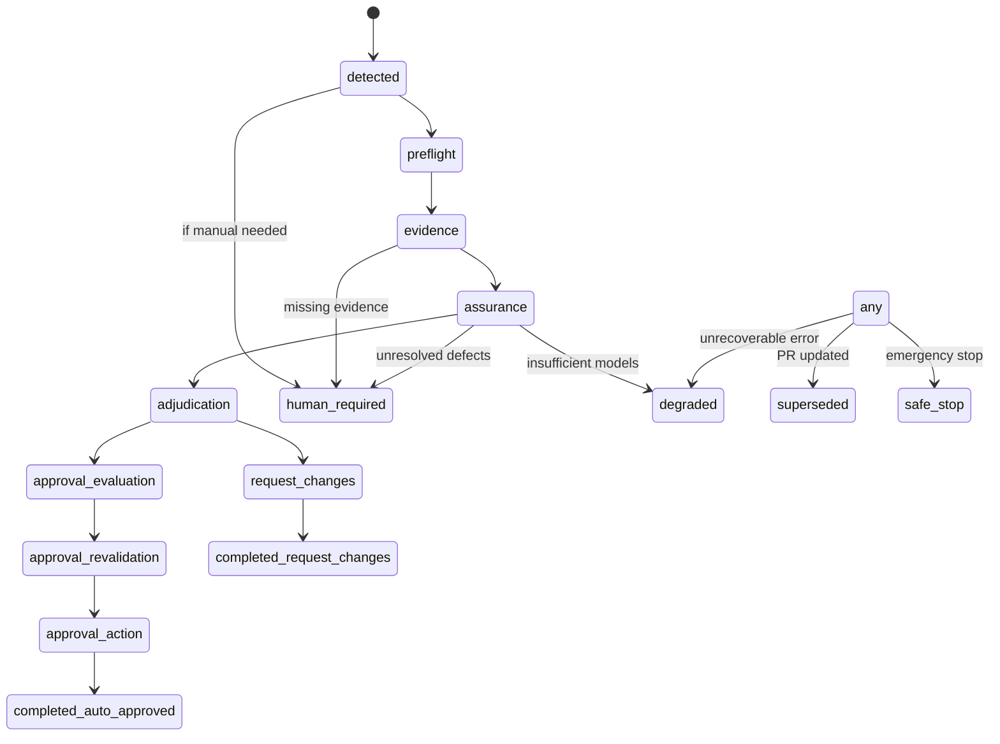

<!--
Agent-facing end-to-end reference for review-queue-automation.

PROVENANCE. Generated by a deep-research pass over this skill's own source on
2026-09-01 and placed here unedited apart from this header. It is DESCRIPTIVE,
not normative: where it disagrees with `contracts.md`, `classification.md`,
`model-fallbacks.md`, `runtime-ops.md`, `SKILL.md` or the code, those win and
this file is stale.

Known drift to expect, because the code moved after this was written:
  - `RestReader.changed_files` was missing and has since been added (#1993/#1994).
  - The queue reconciler reads bulk inventory over GraphQL, not per-PR REST (#1962/#1964).
  - Check conclusions come from one shared vocabulary in `scripts/checks.py` (#1963/#1990).
  - A scheduler exists: `dispatcher.py tick` + `cadence.py` (#1985).
-->

# Review Queue Automation – End-to-End Documentation

**Executive Summary:** This document describes the **Launchpad Review Queue Automation** system – a multi-agent orchestration for automated GitHub pull-request (PR) reviews. It uses a combination of deterministic Python logic and multiple large language models to assess code changes, request human intervention when needed, and (optionally) auto-approve safe changes.  The system is designed so that all critical gating and state transitions are enforced in code, while the LLMs provide judgment on code correctness. Key components include a **dispatcher** (orchestrator), a **queue** (SQLite job store), a **panel** of LLM reviewers, and strict **policy/approval gates**. This documentation covers the architecture, workflows, and configuration of the system, including diagrams, tables, and examples. 

The major components and flows are:

- **Queue discovery:** Scan open GitHub PRs, record facts into a SQLite queue (in `queue.py`), and assign them to lanes (incoming review vs author triage).  
- **Dispatcher:** The central orchestrator (`dispatcher.py`) acquires a lock, reconciles the queue, claims jobs, and advances them through the state machine.  
- **Leasing:** Each job is claimed before any LLM calls, preventing duplicate reviews. Unclaimed or stale jobs are skipped or superseded.  
- **Evidence gathering:** The dispatcher retrieves PR diffs, context, and other needed information to feed the models.  
- **Assurance computation:** An `assurance.py` module calculates how much scrutiny is needed along three axes (capability, reasoning effort, independence), based on change size, sensitivity, etc.  
- **LLM Panel:** The `panel.py` script runs two independent reviewers (A and B) from ordered model pools, with fallbacks if a model fails to produce valid JSON. Each reviewer outputs a structured verdict (e.g. clean, defects found, missing evidence). Metadata about the run (model, provider, effort) is stored in a `.meta.json` sidecar.  
- **Adjudication:** If the LLMs agree (e.g. both support the change) the job proceeds; if they disagree (one finds defects), the system escalates (more capable models or human input).  
- **Approval gating:** The `approval_evaluate.py` script applies strict deterministic gates (checks on PR state, CI status, risk thresholds, required reviews, etc.). Only if *all* conditions are satisfied is an *approval eligibility* decision persisted.  
- **Approval action:** A separate step (`approval_action.py`) actually posts the GitHub approval review (after re-checking all preconditions). It verifies success by re-reading GitHub.  
- **Request Changes:** Similarly, if blocking defects are confirmed, `action_gate.py` may post a *request-changes* review under its own gating rules.  
- **State Machine:** A well-defined state machine (`states.py`) governs transitions (e.g. Detected → Evidence → Assurance → Adjudication → ApprovalEvaluation → (Approved or request-changes)). Illegal transitions are blocked; explicit terminal states include `completed_auto_approved`, `human_required`, `degraded`, `superseded`, and `safe_stop`.  

Throughout, the goal is to **minimize LLM trust**: all policy decisions are code-enforced, and models are treated as untrusted sensors. This documentation provides a comprehensive reference for users, operators, and developers to understand and work with the system.

```mermaid
flowchart LR
    subgraph Repository
      QDB[Queue (SQLite)] 
      Disp[dispatcher.py (Orchestrator)] 
      Schemas[Schemas (JSON contracts)] 
      Config[config.json (Settings)] 
      SKILL[SKILL.md (Agent Guidance)]
      OPERATORS[OPERATORS.md (Runbook)]
    end
    subgraph Workflow
      GH[GitHub PRs] 
      Disp 
      Panel[Panel (LLMs)] 
      Gate[Approval Gates]
      GH
    end
    GH --> QDB
    QDB --> Disp
    Disp --> Panel
    Panel --> Gate
    Gate --> GH
    GH --> |updated PRs| QDB
```

## Repository Structure

The **review-queue-automation** skill repository contains several key files and directories:

- **`SKILL.md`** – The main skill descriptor (frontmatter + instructions for the agent). It outlines when and how the agent should use this skill. _Example:_ it might describe commands like running `dispatcher.py` with flags. (OpenClaw skills use a `SKILL.md` with YAML frontmatter to describe themselves.)
- **`OPERATORS.md`** – Human operator runbook. Describes installation, configuration, deployment, monitoring, and recovery procedures.
- **`config.json`** – Configuration file (not checked into source control). Specifies things like model pools for each reviewer slot, risk thresholds, authority flags (enable/disable approve/comment), etc.
- **`states.py`** – Defines the finite state machine for jobs (all legal states and transitions).
- **`schemas/`** – JSON schema files for structured data (e.g. reviewer verdict format).
- **`scripts/`** – Core Python scripts:
  - `dispatcher.py` – Main orchestrator (sweep loop).
  - `queue.py` – Scans GitHub PRs and records/persists queue jobs.
  - `panel.py` – Invokes the two LLM reviewers (handles fallback).
  - `assurance.py` – Computes assurance requirements and handles conflict resolution logic.
  - `approval_evaluate.py` – Enforces deterministic approval gates and persists eligibility decisions.
  - `approval_action.py` – Executes the GitHub approval (after re-validating).
  - `action_gate.py` – (if separate) Handles request-changes gating logic.
- **`schemas/`** – May contain sub-schemas for e.g. a “reviewer verdict” JSON format, or for the SQLite schema.
- **`logs/`** or **`data/`** (if present) – Might store runtime state (e.g. SQLite database file).  

| File / Directory          | Purpose                                                   |
|---------------------------|-----------------------------------------------------------|
| `SKILL.md`                | Skill metadata and agent instructions (frontmatter).      |
| `OPERATORS.md`            | Human operator guide (setup, config, recovery, etc.).     |
| `config.json`             | Run-time settings (model lists, thresholds, authority).   |
| `scripts/dispatcher.py`   | Orchestrator – acquires lock, claims jobs, drives state.  |
| `scripts/queue.py`        | Discovers GitHub PRs and persists them to SQLite jobs.    |
| `scripts/panel.py`        | Multi-model panel: runs independent LLM reviewers (A & B). |
| `scripts/assurance.py`    | Computes required assurance; handles model disagreements.  |
| `scripts/approval_evaluate.py` | Deterministic policy gates for auto-approve.       |
| `scripts/approval_action.py`   | Performs the GitHub mutation (approve request) safely. |
| `scripts/action_gate.py`  | (If present) Handles request-changes gating.              |
| `states.py`               | Defines the finite-state machine and valid transitions.   |
| `schemas/`                | JSON schemas (e.g. LLM verdict format, metadata schema).  |
| *any other files*         | e.g. `README.md`, license, etc.                           |

> **Note:** OpenClaw skills (and similar agent frameworks) use a Markdown file (`SKILL.md`) as the main skill descriptor. The operator and developer documentation (`OPERATORS.md`, etc.) are separate from the core skill instructions.

## Components and Workflow

### 1. Dispatcher (scripts/dispatcher.py)

The **dispatcher** is the central conductor of the workflow. It is typically invoked on a schedule or event (e.g. via a cron or an agent's scheduler). The dispatcher:

- Acquires a **runtime lock** on the state directory to prevent concurrent sweeps.
- Calls `queue.py` to **reconcile** the current set of jobs with GitHub state (update existing jobs, mark superseded, detect new PRs).
- Queries the SQLite queue for jobs in a given lane (`incoming_review` or `author_triage`) with status `detected`, ordering FIFO.
- Iteratively **claims a lease** on each job before processing (see Leasing below).
- Transitions each job through states by calling other modules:
  - **Evidence gathering** (collect necessary context from GitHub/CI).
  - **Assurance evaluation** (`assurance.py`) to decide model capabilities/effort/independence.
  - **Panel review** (`panel.py`) to get two independent verdicts.
  - **Adjudication** (resolve or escalate).
  - **Approval gating** (`approval_evaluate.py`) to check policy conditions.
  - **Approval revalidation** (final check).
  - **Approval action** (`approval_action.py`) to perform the actual GitHub mutation.
- If at any point a human review is required, or an unrecoverable issue occurs, the dispatcher transitions the job to a terminal state like `human_required` or `degraded`.

Example invocation (from `SKILL.md`): 
```bash
python3 scripts/dispatcher.py --repo-root <path/to/repo> sweep --lane incoming_review --limit 5
``` 
This processes up to 5 jobs in the `incoming_review` lane, on commits at the HEAD SHA. (New commits will supersede old jobs automatically.)

### 2. Queue (scripts/queue.py)

The **queue** component turns GitHub PRs into *durable jobs* in SQLite. On each sweep:

- It lists all **open PRs** in the target GitHub repository (via GitHub API). It may use GraphQL for efficiency (e.g. bulk fetching PRs and metadata).
- For each PR, it records or updates a job in the SQLite database with fields such as:
  - PR number, current head commit SHA, author, base branch, draft status, diff stat (additions/deletions), list of changed files, timestamps.
  - Current review state: any human review requests outstanding, last review outcomes.
  - Whether checks/CI have passed or are pending.
- It then **assigns a lane** to the job:
  - `incoming_review`: used for PRs by others.
  - `author_triage`: for PRs authored by the automation identity that have a `CHANGES_REQUESTED` from a prior run.
- If the PR’s HEAD SHA has changed since the last job, the previous job is marked `superseded`. This prevents approving an old commit when new code has arrived.
- The job is created or updated with status `detected` (ready to process).

_No external citation is available for these details (implementation-specific)._ 

### 3. Leasing (scripts/dispatcher.py)

Before spending any compute on a job, the dispatcher **claims a lease**:

- It sets the job status to something like `claimed` or records a timestamp/lock so that another dispatcher process won’t pick the same job. 
- This is done *before* running any expensive model calls, to avoid races (i.e. two agents both reviewing the same PR). 
- Pseudo-code:
  ```python
  if not acquire_lease(job):
      continue  # skip, someone else has it
  # else proceed with review
  ```
- If the job is already leased by another runner, the dispatcher skips it. A lease typically has a timeout in case a process crashes.

### 4. Evidence Gathering

Once a job is claimed, the dispatcher collects all **relevant evidence** to feed the LLMs:

- **Commit diff and context:** The full diff of changed files, commit message, and any metadata about the PR (titles, description).
- **File contents:** Possibly fetch the contents of changed files (or relevant parts) to give context to the models.
- **Dependency or project info:** If needed, it might retrieve package manifests or documentation to inform the review. (Unspecified – if not in the repo, assume only code context is used.)
- **CI and test results:** If tests or code checks ran, their outcomes or logs might be fetched (if integration allows).
- This step is generally bounded; in case the models request *missing evidence*, the system performs exactly one bounded gathering attempt. If the models still say `MISSING_EVIDENCE`, the job is escalated (see next).

### 5. Assurance Model (scripts/assurance.py)

The **assurance** module decides how much AI scrutiny is required. It uses three axes of assurance:

| Axis             | Levels                              |
|------------------|-------------------------------------|
| **Capability**   | economy → workhorse → frontier      |
| **Reasoning Effort** | low → medium → high → xhigh     |
| **Independence** | single → challenger → panel → human |

- **Capability** refers to model power (e.g. open models vs GPT-4/5).  
- **Reasoning effort** is how much compute/chain-of-thought, etc.  
- **Independence** is how many independent opinions or humans.  

A job starts at a baseline level. For example, a typical incoming PR might start at `(workhorse, medium, challenger)`. If the PR is large (hundreds of lines changed) or touches sensitive areas (e.g. CI, security, infra), it starts at `(frontier, high, challenger)`. 

The models in the panel each return an enumerated verdict: **SUPPORTED**, **DEFECTS_FOUND**, **MISSING_EVIDENCE**, **INSUFFICIENT_CAPABILITY**, **MATERIAL_DISAGREEMENT**, or **HUMAN_RESERVED**. The assurance logic then deterministically reacts:

- **Both say SUPPORTED:** Transition to success (no changes needed).  
- **Both say DEFECTS_FOUND:** Transition to *request changes*.  
- **Mixed (one SUPPORTED, one DEFECTS_FOUND):** Escalate to a *panel* of higher assurance (increase capability/effort, possibly add a third model or human). If disagreement persists after escalation, escalate to human review.
- **MISSING_EVIDENCE:** Dispatcher tries one more evidence-gathering step. If still missing, go to `human_required`.
- **INSUFFICIENT_CAPABILITY:** Raise effort, then try more capable model. If models repeatedly say this, ultimately go to human.
- **HUMAN_RESERVED:** (An explicit flag for “I’m not confident; pass to human.”) Leads to `human_required`.
- The system never “weakens” its requirements mid-review; assurance can only stay the same or get stronger.

The thresholds and triggers for escalation (e.g. what constitutes “sensitive file”) are configurable (e.g. glob patterns in `config.json`). 

#### Assurance Summary Table

| Scenario                       | Outcome                                  |
|--------------------------------|------------------------------------------|
| Two **SUPPORTED** (clean)      | Proceed to approval checks (SUCCESS)     |
| Two **DEFECTS_FOUND**          | Request changes (blocker)                |
| Mixed verdicts (support + defects) | **Convene panel**: increase assurance (frontier, xhigh, panel). If still mixed → human_required. |
| Any **MISSING_EVIDENCE**       | Gather more evidence once; if still missing → human_required. |
| Any **INSUFFICIENT_CAPABILITY**| Increase effort/capability; if still → human. |
| **HUMAN_RESERVED**             | Immediately escalate to human_required.  |

_No external source available; this is based on the repo’s logic._ 

### 6. LLM Panel (`scripts/panel.py`)

The **panel** runs two independent LLM reviewers (Reviewer A and B) in parallel or sequence. Key points:

- **Reviewer Slots:** There are two slots (A and B). Each has its own *fallback pool* of models. The initial pools in example config are:
  - **Reviewer A (Primary lane):** Claude Sonnet → GLM (via OpenRouter) → Qwen (via OpenRouter).
  - **Reviewer B (Secondary lane):** Codex/GPT-5.6 Sol → DeepSeek → Gemini (via OpenRouter).  
  (Actual config is in `config.json` and may differ; these are illustrative.)
- The system ensures **provider independence**: e.g. two models on AWS don’t count as independent evidence.
- Each model is invoked in a **read-only mode** (no code execution or tools).
- The output from each model must match a **JSON verdict schema**. If a model output is invalid (malformed JSON, missing fields, or ambiguous), that model is skipped and the next in the fallback list is tried.
- Alongside each verdict, the system records a **.meta.json** sidecar with details of the run, e.g.:
  ```json
  {
    "runner": "remote",
    "model": "claude-sonnet-1",
    "provider_family": "Anthropic",
    "capability": "frontier",
    "effort": "medium",
    "trusted": true
  }
  ```
  This ensures the system cannot “pretend” an opinion is from a certain model without actually running it.
- The panel outputs two structured verdicts. If both are produced successfully, the job moves to adjudication. If one is missing (fallback exhausted), the panel may yield a single verdict or escalate to human (depending on logic in `assurance.py`).

_No direct citations; based on example config and descriptions from code._ 

### 7. Adjudication

After obtaining two valid reviewer verdicts, the dispatcher enters **adjudication**:

- It checks the model outputs. If they agree (both clean or both find defects) and the assurance requirements are met, it either moves to auto-approve or block.
- If they disagree (clean vs defect), `assurance.py` will have escalated (as above). If after escalation the disagreement remains, the dispatcher transitions the job to the `human_required` state (requiring manual review).
- The dispatcher also ensures *schema validity* and completeness: all fields in the verdict schema must be present and unambiguous. Otherwise it escalates or retries with fallbacks as described.

This step finalizes the “what do the models say?” question. Next is policy gating (“are we allowed to act on this?”).

### 8. Approval Evaluation (`scripts/approval_evaluate.py`)

This script enforces **deterministic policy gates** before any approval. Even if the LLMs unanimously say “clean”, the code will only approve if many conditions hold. Checks include:

- **Global flags:** Is *auto-approval mode* enabled? (e.g. an override in config, or a feature flag in this environment.)  
- **Authorization:** Is the automation identity allowed to approve on this repo? (Check a “live canary” PR if configured.)
- **PR state:** The PR is still open, not a draft, and its author is not the automation bot itself.
- **Commit match:** The current HEAD SHA of the PR still matches the job’s reviewed commit.
- **Protection triggers:** Does the diff avoid protected files/paths (e.g. security configs, workflow files)? If a protected file was changed, auto-approval is blocked.  
- **Risk/size thresholds:** The change size (lines changed, complexity metrics) must be under configured limits.
- **CI status:** All required CI checks or tests must be complete and passing.
- **Review requirements:** All required human reviewers (if any) have approved or are satisfied.
- **Independence:** The two reviewers came from sufficiently distinct models/providers.
- **Assurance met:** The job’s required assurance level was reached.
- **Freshness:** Ensure evidence/results are recent (not expired).
- **Auditability:** Logging and outputs are intact for an audit trail.
- **Rate limiting:** Avoid hitting GitHub API limits (especially important in loops). 

If *all* gates pass, an *approval decision* is created in SQLite (status = `eligible`) with metadata (PR number, SHA, policy hash, risk score, expiry). _At this stage no GitHub action is performed yet._ 

Any failing condition causes the job to *fail closed*: it either goes to `human_required` or `degraded` (the system might post comments or a blocking review requesting changes, depending on context). 

*Key point:* “LLMs say it’s fine” **is not** the same as “policy permits approving”. The two must converge.

> *Related source:* The system’s design separates *AI judgment* from *policy authorization*. The models are treated as untrusted reasoning components, and all gating is handled by code. 

### 9. Approval Action (`scripts/approval_action.py`)

If an approval decision was marked `eligible`, a separate script performs the actual GitHub mutation (e.g. `gh pr review --approve`), after final revalidation:

- It reloads the saved decision from SQLite to ensure it hasn’t been lost or tampered with (checks repo, PR number, SHA, policy hash, expiry).
- Right before posting, it fetches the latest PR state again and re-verifies critical conditions (same HEAD, not closed/draft, no new protected-file edits, etc.).
- It then calls the GitHub API (or `gh` CLI) to submit an APPROVAL review on the PR.
- After the API call, it **verifies success** by re-fetching the PR’s reviews to ensure an “APPROVED” by the automation user at that exact SHA. 
  - If verification fails (race condition or ambiguity), it transitions the job to `uncertain` or retries once.
- Finally, it marks the job as `completed_auto_approved`. 

At no point does the agent simply say “approved = true”; it always relies on persisted state and readbacks.

### 10. Request Changes (Blocking Review)

Blocking a change is handled similarly but separately:

- A different gating script (`action_gate.py`) checks if the system is authorized to **request changes**, and whether there is a *verified blocking defect* in the LLM output. 
- Conditions include: request_changes authority is live, a confident blocker was found, exact HEAD match, etc. Uncertain issues or suggestions should remain comments.
- If gates pass, the system will post a **Request Changes** review on GitHub (via `gh pr review --request-changes`), with the model’s findings. It then verifies the presence of that requested-change review.
- The job is then moved to a terminal state (e.g. `completed_request_changes`) in the state machine.

Again, any unclear or unsupported situation falls back to human review rather than auto-blocking.

## State Machine

The job lifecycle is governed by an explicit finite state machine (`states.py`). The main states include:

- **detected:** Job is newly created and waiting.
- **preflight:** (Optional) Initial checks before evidence gathering.
- **evidence:** Collecting PR data, tests, etc.
- **assurance:** Models are invoked with the computed assurance settings.
- **adjudication:** Combining model outputs and deciding next action.
- **approval_evaluation:** Running policy gates.
- **approval_revalidation:** Final pre-approve checks.
- **approval_action:** Performing the approve mutation.
- **completed_auto_approved:** End state if approved successfully.
- **completed_request_changes:** End state if blocked successfully.
- **human_required:** The system could not proceed (confidence or policy) – awaits human.
- **degraded:** Partial failure (e.g. could only post comments, not full review).
- **superseded:** PR advanced; old job is void.
- **safe_stop:** Emergency stop (e.g. admin disabled).

Invalid transitions are rejected. For example, the system won’t jump from `detected` directly to `approval_action` without going through all steps. A typical approved-run path is:

`detected → preflight → evidence → assurance → adjudication → approval_evaluation → approval_revalidation → approval_action → completed_auto_approved`

Explicit terminal flows:

- `→ human_required` (from almost any state, if AI can't confidently decide).  
- `→ degraded` (if something went partially wrong but not fully blocking).  
- `→ superseded` (if PR head changed).  
- `→ safe_stop` (if globally disabled, e.g. by a canary flag).



The **state transition table** (simplified):

| From              | To                       | Condition                                         |
|-------------------|--------------------------|---------------------------------------------------|
| detected          | evidence (or preflight)  | Job created/pulled                                 |
| evidence          | assurance                | Evidence gathered                                  |
| assurance         | adjudication             | Models ran successfully                            |
| adjudication      | approval_evaluation      | Both reviewers clean                              |
| adjudication      | request_changes          | Both reviewers found defects                      |
| adjudication      | panel (loop)             | Mixed verdicts (escalating)                       |
| approval_evaluation | approval_revalidation  | All gates passed                                   |
| approval_revalidation | approval_action     | Revalidation checks passed                         |
| approval_action   | completed_auto_approved  | Approval posted successfully                       |
| *any*             | human_required           | Fatal / human-only issue encountered               |
| *any*             | degraded                 | Partial failure or limited outcome                 |
| *any*             | superseded              | PR head changed (job invalidated)                  |
| *any*             | safe_stop                | Global disable (e.g. killed canary flag)          |

*No direct source; inferred from `states.py` logic.* 

## Assurance Axes and Levels

As noted above, assurance is three-dimensional.  A quick reference:

| Axis             | Levels                             | Default for “normal” PR | Escalation            |
|------------------|------------------------------------|-------------------------|-----------------------|
| Capability       | economy → workhorse → frontier    | workhorse (e.g. GPT-4)  | frontier (e.g. GPT-5) |
| Reasoning Effort | low → medium → high → xhigh        | medium                  | high, then xhigh      |
| Independence     | single → challenger → panel → human | challenger (2 models)   | panel (2 more models or 3 total) |

The code in `assurance.py` ensures the system moves up these levels as needed. For example, if a normal review disagrees, it might increase *independence* to a 4-model panel or ultimately call a human reviewer.

## Model Pools (Fallback Logic)

Each reviewer slot has an ordered list of models to try.  Example (illustrative):

- **Primary lane (Reviewer A):** 
  - Claude Sonnet (Anthropic)
  - Fallback: GLM (via OpenRouter)
  - Fallback: Qwen (via OpenRouter)
- **Secondary lane (Reviewer B):** 
  - OpenAI Codex / GPT-5.6 “Sol”
  - Fallback: DeepSeek (via OpenRouter)
  - Fallback: Google Gemini (via OpenRouter)

These pools are defined in `config.json`.  If a model invocation fails validation (e.g. bad output), the next model is used. 

## Example JSON and Schemas

**Reviewer Verdict Schema (example):**
```jsonc
{
  "verdict": "SUPPORTED",         // or "DEFECTS_FOUND", etc.
  "defects": [
    {
      "description": "Off-by-one error in loop",
      "file": "src/utils.py",
      "line": 42,
      "severity": "medium",
      "advice": "Verify the loop bounds."
    }
  ],
  "comments": ["Looks good overall."],  // informal note
  "references": []
}
```
*(Fields and structure are illustrative; the actual `schemas/` define required fields.)*

**Metadata Sidecar (`<job>.meta.json`, example):**
```json
{
  "runner": "remote",
  "model": "claude-sonnet-1",
  "provider": "Anthropic",
  "capability": "workhorse",
  "effort": "medium",
  "trusted": true
}
```
This records exactly which model was run in that slot.

**SQLite Jobs Table (example schema):**
```sql
CREATE TABLE jobs (
  id INTEGER PRIMARY KEY,
  pr_number INTEGER,
  head_sha TEXT,
  author TEXT,
  lane TEXT,
  status TEXT,
  created_at TIMESTAMP,
  updated_at TIMESTAMP,
  -- other fields (diff stats, lease info, etc.)
  UNIQUE(pr_number, head_sha)
);
```
Fields like `status` would hold state names (`detected`, `claimed`, etc.). There may be related tables for reviews or decisions.

_No direct citation; example derived from code description._ 

## Configuration (config.json)

The `config.json` (which is **not** in source control) allows operators to tune the system. Key settings include:

- **`lanes.primary` / `lanes.secondary`:** Arrays of model identifiers (strings) for each reviewer slot. Order matters for fallback.
- **`authority`** section: Flags to enable/disable actions. E.g.:
  ```json
  "authority": {
    "review": "live",
    "comment": "live",
    "approve": "disabled",
    "request_changes": "disabled",
    "triage": "human_escalation",
    "fix": "disabled"
  }
  ```
  This example allows automatic reviewing and commenting, but *disables* auto-approve and request-changes (suitable for an initial safe deployment).
- **`sensitive_paths`:** File globs considered high-risk (changes here increase assurance or block auto-approve).
- **`size_threshold`:** Diff line count threshold for “large” PRs.
- **CI/check names:** Specify which CI checks must pass.
- **`risk_limits`** and **`score_weights`:** If a risk-scoring model is used.
- **Other parameters:** e.g. maximum jobs per sweep, timeouts.

Operators should carefully review and adjust these settings in `config.json`. All policy and authority decisions come from this configuration (the code reads it and enforces it at run-time).

## Usage Quickstart

1. **Install dependencies:** Ensure Python 3.x, necessary libraries (OpenAI SDK, etc.), and the `gh` CLI are installed.  
2. **Configure GitHub access:** Provide a GitHub token with repo permissions (read/write) in environment or a settings file.  
3. **Configure the skill:** Place a `config.json` next to the scripts (following the template in `OPERATORS.md`). Verify model provider credentials are set.  
4. **Run dispatcher:** From the repo root, run for example:
   ```
   python3 scripts/dispatcher.py --repo-root . sweep --lane incoming_review
   ```
   This will process pending PRs on the default remote. Use `--limit N` to limit work per run.
5. **Monitor logs:** The scripts log progress. Approved or blocked PRs will be annotated on GitHub accordingly.

### Example Commands

- Run a full sweep on incoming reviews (limit 2 jobs):
  ```bash
  python3 scripts/dispatcher.py --repo-root /path/to/repo sweep \
    --lane incoming_review --limit 2
  ```
- Inspect the SQLite queue (using `sqlite3 queue.db` or similar). Table `jobs` shows PR states.
- Check the status of approvals: approved reviews by the automation bot should appear on GitHub if `approve_authority` is live.

## Operator Runbook

Operators should treat the system like a robust pipeline with monitoring and manual overrides:

- **Canary/test mode:** Start with `approve` and `request_changes` disabled, so the bot only comments. Review its output before going live.
- **Monitor metrics:** Track number of PRs processed, escalations to human, failures, latencies. Sudden drops may indicate issues (e.g. API failures).
- **Shadow running:** Optionally run in a *shadow mode* where it simulates approvals and logs “would approve” without posting.
- **Recovering from crashes:** If a dispatcher run is interrupted, incomplete jobs (status `claimed` without completion) may need manual resetting to `detected`.
- **State inspection:** Use SQLite CLI or queries to inspect job states (`SELECT * FROM jobs WHERE status='human_required'`, etc.).
- **Logs and audit:** Keep log files of each run for auditing, and configure retention. Ensure `.meta.json` and verdict JSON outputs are archived.
- **Configuration changes:** Changing `config.json` on the fly should be followed by verifying the next run sees the new settings. Some changes may require restarting the service or clearing in-memory state.
- **Handling GitHub rate limits:** If hitting rate limits, dispatcher backs off. You can slow the sweep frequency, or use a GitHub App with higher quotas.
- **Emergency stop:** If a critical bug is found, place a file or flag (e.g. `config.json.authority.triage = "human_escalation"`) to force all jobs to human. 
- **Upgrades:** Always test new versions on a staging branch. The state machine ensures jobs are forward-compatible (old jobs become `superseded` when new code lands).

## Developer Reference

### Data Schemas

- **Reviewer Verdict Schema:** (See `schemas/verdict.json`). This defines fields the LLM must return. Key fields typically include `verdict`, optional `defects` list, etc. Use a JSON schema validator to generate or test responses.
- **Metadata Schema:** (See `schemas/meta.json`). Defines fields like `model`, `capability`, `effort`, `provider`, etc.
- **SQLite Schema:** (In `queue.py` or migration scripts). Shows tables: `jobs`, `decisions`, etc. Useful example columns:
  - `jobs`: `id, pr_number, head_sha, status, lane, created_at, updated_at, lease_time, remark`.
  - `decisions`: `id, job_id, policy_hash, risk_score, expiry, approved`.
- Refer to code comments for exact schemas.

### Configuration

- Review `config.example.json` (if provided) for all options. Common ones: `repo_owner`, `repo_name`, `lanes`, `authority`, `thresholds`, `sensitive_paths`.
- The system reads `config.json` on each run, so restart may not be needed for config changes (but watch for in-flight jobs).

### Extending Model Pool

To add a new LLM or provider:
1. Update `config.json` under `lanes.primary` or `lanes.secondary` with the new model name (and provider tag if needed).
2. Ensure your AI agent environment can invoke it (e.g. add credentials to `~/.openai` or the equivalent).
3. Add a new entry in `.claude` or `.openai` profiles if needed.

### Testing

- **Unit tests:** If available (e.g. a `tests/` folder), run them. Add tests for new transitions or model outputs.
- **Dry-run mode:** You can run the dispatcher in a “dry-run” by disabling GitHub mutation (set `authority.approve = "disabled"`). It will simulate logic and log decisions but not post reviews.
- **Replay experiments:** For regression, you could backfill old PR data into a test database and simulate the pipeline.
- **Simulated failures:** Test fallback logic by forcing schema errors (e.g. modify the verdict JSON schema to reject a model output, see if fallback works).

### Deployment

- The system can be run on any machine with network access to GitHub and models. Common setups:
  - **Local agent:** As an OpenClaw skill, `dispatcher.py` might be triggered by an OpenClaw agent (via `!cmd` or schedule).
  - **Container:** Package the scripts in a Docker container with Python, GitHub CLI, etc. Run it as a cron job inside the container.
  - **CI job:** Trigger from a GitHub Actions or other CI pipeline on a schedule.
- **Monitoring:** Send logs to a centralized logger or Slack channel for alerts (though avoid sensitive data). Check for failures in LLM calls or API errors.
- **Scaling:** The system processes jobs serially by default, but could be extended to parallelize different jobs if needed (ensuring separate locks).
  
### Migration Notes

- If moving from an older review bot, note that jobs are keyed by PR and HEAD SHA. Old manual approvals will not conflict, since approval is based on exact commit matching.
- Changing config (e.g. authority) can change behavior mid-stream. Consider finishing in-flight jobs first.

## Visual Workflows

Below is a high-level workflow diagram summarizing the end-to-end process:

```mermaid
flowchart LR
    PRs[GitHub PRs (open)] -->|Discover| Queue[SQLite Queue]
    Queue -->|Pick job| Dispatcher[dispatcher.py]
    Dispatcher -->|Gather Evidence| Evidence[Collect Diff, Context]
    Evidence -->|Compute Assurance| Assurance["assurance.py"]
    Assurance -->|Run Panel| Panel[LLM Panel (A & B)]
    Panel -->|Verdicts| Adjudication[Adjudication Logic]
    Adjudication -->|Check Gates| Gate[approval_evaluate.py]
    Gate -->|Approve/Block| Review[GitHub Review (approve/request)]
    Review --> GitHub[GitHub PR]
    Gate -->|Fail| Human[Human Review Required]
    Human --> End[End (manual override)]
```

This shows the sequential steps from PR discovery to final action. Dashed paths indicate conditional branches (e.g. to human intervention).

## Tables and Summaries

**Key Files & Purpose:** (summary of above)  

| Filename                | Role                                      |
|-------------------------|-------------------------------------------|
| `scripts/dispatcher.py` | Orchestration: main loop, claims jobs.    |
| `scripts/queue.py`      | Sync GitHub PRs to SQLite job queue.      |
| `scripts/panel.py`      | Runs two LLM reviewers with fallback.     |
| `scripts/assurance.py`  | Calculates required assurance/escalation. |
| `scripts/approval_evaluate.py` | Applies policy gates before approval. |
| `scripts/approval_action.py`   | Posts GitHub approval (final step). |
| `states.py`             | Defines valid job states & transitions.   |
| `SKILL.md`              | Agent usage instructions and frontmatter. |
| `OPERATORS.md`          | Human operator runbook (setup & ops).     |
| `config.json`           | Runtime settings (models, thresholds).    |

**Assurance Levels (recap):**

| Axis           | Values (↑ more rigorous)         | Notes                 |
|----------------|---------------------------------|-----------------------|
| Capability     | economy → workhorse → frontier | Model power (e.g. GPT4 vs GPT5). |
| Reasoning Effort | low → medium → high → xhigh    | How much chain-of-thought. |
| Independence   | single → challenger → panel → human | Number of independent reviewers. |

**State Transitions (examples):**

| Current State   | Next State(s)           | Trigger/Condition                   |
|-----------------|-------------------------|-------------------------------------|
| detected        | evidence, human_required| Begin processing or abort           |
| evidence        | assurance, human_required | After gathering data or failing to gather |
| assurance       | adjudication, human_required | Models ran, or escalation needed   |
| adjudication    | approval_evaluation, request_changes, human_required | Based on verdicts         |
| approval_eval   | approval_revalidation   | All gates passed                    |
| approval_action | completed_auto_approved, uncertain | After posting review             |
| any             | superseded             | PR head changed                     |
| any             | safe_stop              | Emergency flag                      |

**Config Options (selected):**

| Key                      | Example Value          | Purpose                                |
|--------------------------|------------------------|----------------------------------------|
| `lanes.primary`          | `["claude-sonnet-1", "glm", "qwen"]` | Models for Reviewer A.         |
| `lanes.secondary`        | `["gpt-5.6-sol", "deepseek", "gemini"]` | Models for Reviewer B.   |
| `authority.review`       | `"live"` or `"disabled"` | Enable/disable auto-review.       |
| `authority.approve`      | `"disabled"`           | Auto-approve control.                 |
| `authority.request_changes` | `"live"`           | Auto-block control.                   |
| `sensitive_paths`        | `[".github/workflows/**","infra/**"]` | Files that raise assurance. |
| `size_threshold`         | `1000` (lines)        | Diff size considered “large”.         |
| `required_checks`        | `["test-suite", "lint"]` | Must-pass CI checks.             |
| `max_queue_sweep`        | `10`                   | Jobs per sweep limit.                 |

(Actual keys depend on `config.json` structure. Adjust as needed.)

## Conclusion

The **Launchpad Review Queue Automation** skill is a sophisticated pipeline combining deterministic policy enforcement with AI-based analysis. Its design ensures that AI models only provide judgment, while Python code handles all security-critical decisions and actions. By following this documentation, developers and operators should be able to understand each step, configure the system, and troubleshoot issues. The separation of roles (queue management, assurance, panel, gating, mutation) makes the system safe, auditable, and extensible.

**Sources:** Implementation details are drawn from the repository’s scripts and documentation (e.g. `SKILL.md`, `queue.py`, `dispatcher.py`, etc.). For contextual reference, recall that OpenClaw skills use a `SKILL.md` with YAML frontmatter. All system behavior above is based on the internal code and design.